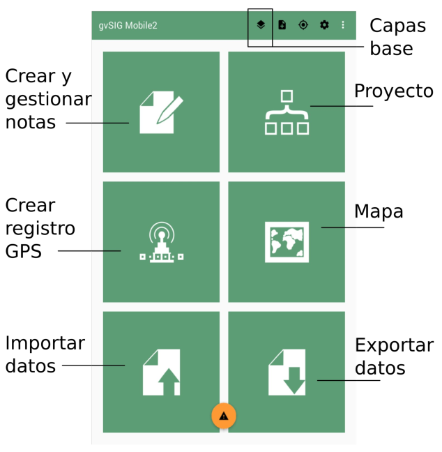

Introducción
============

La aplicación gvSIG Mobile2 permite gestionar información geográfica desde un dispositivo móvil o tablet, realizando trabajos de campo para capturar o actualizar la información. Funciona sobre dispositivos con sistema operativo Android.

Visión general
--------------
La pantalla principal de contiene diversas secciones. Las más relevantes son:

*   Mapa, en el que realizaremos la mayoría de acciones de captura y mantenimiento de datos y visualización

*   Gestión de capas base (o mapa base), donde podremos configurar las capas de fondo

