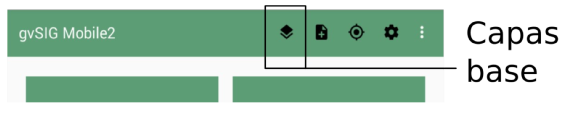
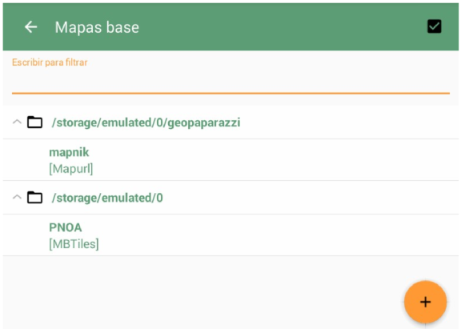

Mapa base
=========

Es posible modificar el mapa base, es decir, la capa de fondo que usamos como referencia para la captura y visualización de datos.

Esta opción está accesible desde la pantalla principal de la aplicación.

En el formulario que aparece, podemos elegir alguna de las capas base previamente cargadas en la aplicación, o añadir una nueva usando el botón naranja *"+"*.

Existen distintos formatos aceptados, como ficheros Mbtiles o servicios WMTS con caché local. 

Los ficheros Mbtiles se pueden añadir directamente desde este formulario, mientras que otros formatos requieren configuraciones más complejas que hay que preparar desde fuera de la aplicación.

