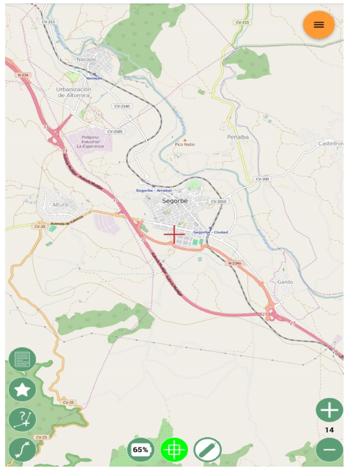

Mapa y gestión de bases de datos Spatialite
===========================================

Mapa
----
Desde la sección mapa podremos visualizar la cartografía disponible, cargar y editar capas vectoriales, obtener información sobre las entidades, etc.

   
En la parte inferior se observan diversas barras de botones flotantes. 

El bloque inferior izquierdo concentra las herramientas de información y manipulación de datos, que van cambiando según estemos o no en edición. 

El bloque central incluye un indicador de batería, un botón para centrar el mapa en la posición del GPS y un botón para activar la edición. 

Por último, el bloque inferior derecho contiene las herramientas de navegación (zoom más y zoom menos).

El botón naranja, situado en la parte superior derecha, visualiza el menú de opciones del mapa.

Carga de capas Spatialite
-------------------------
Spatialite es un formato de fichero que permite almacenar varias capas vectoriales, capas ráster y tablas alfanuméricas en un único fichero. 
Está basado en la base datos Sqlite y posee características muy interesantes tanto como formato de trabajo como de intercambiode datos: tamaño máximo de base de datos de 140 terabytes, campos de texto de longitud variable, gestión de caracteres Unicode, definición de claves primarias y relaciones entre tablas o capas, etc.

Actualmente, gvSIG Mobile2 permite la carga de capas vectoriales Spatialite desde el menú de opciones del mapa, *"Listado de datos Spatialite"*.

Inicialmente, el listado de capas estará vacío. Podremos cargar nuevas bases de datos (que contengan capas vectoriales) usando el botón añadir (+):

Una vez cargados los datos, aparecerá un listado en forma de árbol, en el que las entradas de primer nivel serán las bases de datos cargadas y en un segundo nivel aparecen las capas disponibles en cada base de datos:

Podemos eliminar una base de datos de gvSIG Mobile2 realizando una pulsación larga sobre la misma. También podemos alterar el orden de las capas pulsando sobre los números que aparecen a la izquierda de cada capa. Los capas con números más altos se mostrarán superpuestas a las capas con números menores

Simbología y etiquetado
-----------------------

   
Podemos modificar la simbología y el etiquetado de las capas desde el menú contextual de capa.
La simbología está disponible en el menú Propiedades (*"Properties"*), mientras que al etiquetado se accede desde el menú *"Labelling"*.

Dependiendo del tipo de capa tendremos unas opciones de simbolización ligeramente diferentes. En el caso de líneas y polígonos, podemos elegir el color del relleno, el grosor y el color del borde y la transparencia de ambos. Adicionalmente, para las capas de puntos podemos elegir el símbolo a utilizar (círculo, triángulo, cuadrado, etc).

   

   
