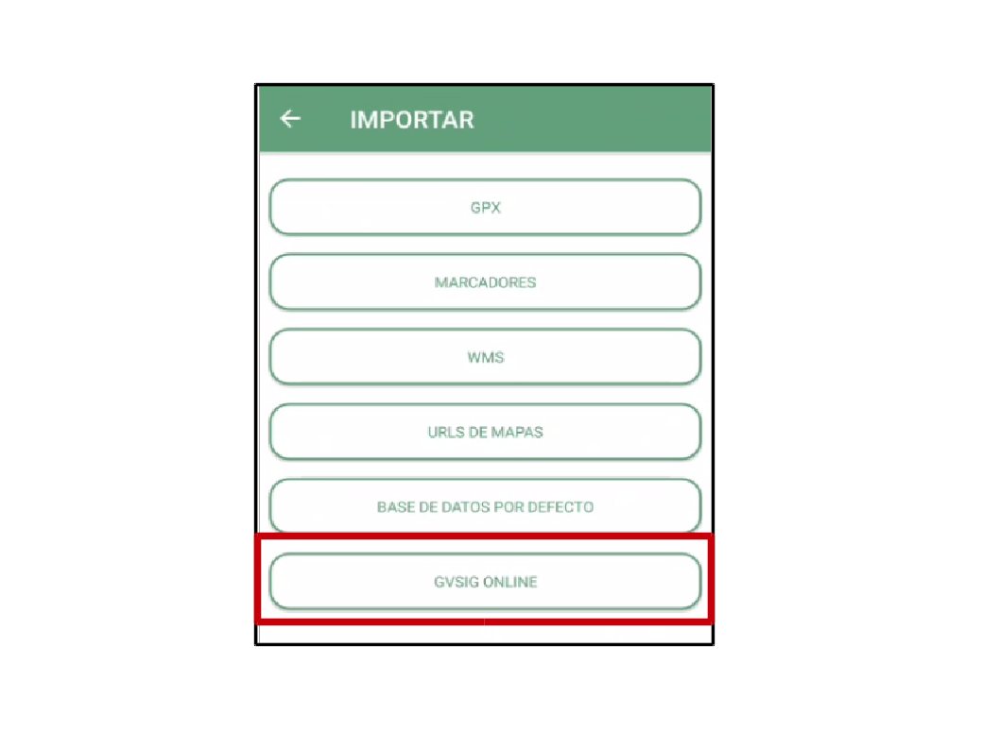

Acceso a datos provenientes de gvSIG Online
===========================================

Es posible conectarse a gvSIG Online para descargar una o varias capas de información geográfica, editarlas en modo offline (sin conexión) desde gvSIG Mobile y por último volver a subirlas a gvSIG Online. 
Las siguientes secciones describen el funcionamiento de esta edición offline.

Configuración
-------------
Para poder conectarse a gvSIG Online, deberemos configurar los parámetros de conexión. Estos incluyen la dirección del servicio (en este caso, https://sigpobla.gvsigonline.com), nuestro nombre de usuario y la contraseña.

Accederemos a la configuración desde el menú principal, pulsando sobre el botón de configuración:

.. image:: ../images/mobile11.png
   :align: center
   
A continuación seleccionaremos *"Configuración de sincronización de proyectos en la nube"*, y nos aparecerá un diálogo en el que introducir los parámetros de conexión mencionados:

Flujo de trabajo
----------------
Para editar capas provenientes de gvSIG Online, se utilizará el siguiente flujo de trabajo:

#.  Se descargarán las capas deseadas usando la herramienta de importación

#.  Se editarán las capas descargadas usando las herramientas habituales de edición de gvSIG Mobile

#.  Una vez finalizada la edición, se volverán a cargar las capas actualizadas a gvSIG Online, usando la herramienta de exportación de datos

Descarga de las capas
---------------------
Usaremos la opción de Importación de datos, seleccionando la opción *"Datos en la nube"* como fuente de la importación.

.. image:: ../images/mobile13.png
   :align: center
   

   
A continuación nos aparecerá un diálogo en el que seleccionaremos las capas a descargar de una lista de capas disponibles. Sólo aparecerán las capas sobre las que el usuario tenga permisos de escritura y que no estén bloqueadas por otro usuario. 
Las capas se descargarán en forma de base de datos Spatialite, que se almacenan en un único fichero, usando la extensión *".sqlite"*.

.. image:: ../images/mobile15.png
   :align: center
   
Deberemos dar un nombre significativo a dicha base de datos (por defecto se le asigna un nombre aleatorio), ya que a continuación vamos a trabajar con ese fichero de base de datos.

Edición de capas
----------------
Desde el menú principal, accederemos a la opción Mapa. A continuación, cargaremos en el mapa la capa Spatialite previamente descargada y seleccionaremos las capas que queremos visualizar,
así como la capa que queremos poner en edición.

Para ello, accederemos desde el menú contextual del mapa, seleccionando la opción *"Listado de datos Spatialite"*.

.. image:: ../images/mobile16.png
   :align: center

Desde aquí, usaremos el botón de añadir base de datos (+), y seleccionaremos el fichero de datos Spatialite previamente creado.

Si lo hemos hecho correctamente, nos aparecerá un listado con la base de datos seleccionada (y cualquier otra base de datos que tuviésemos previamente cargada), y la lista de capas que contiene cada base de datos. 
Desde este listado podemos decidir qué capas deben mostrarse u ocultarse, y podremos también hacer un zoom a una capa.
Cerramos el diálogo, y se mostrará el mapa con las capas que hayamos seleccionado.

Para iniciar la edición, realizaremos una pulsación larga sobre el icono del lápiz y seleccionaremos la capa que queremos editar.

.. image:: ../images/mobile17.png
   :align: center
   
Salimos del diálogo, y volvemos a pulsar sobre el lápiz para activar la edición.

En la zona de la izquierda aparecerá un serie de herramientas para añadir o borrar geometrías, seleccionar geometrías existentes, y editar la tabla de atributos de las geometrías seleccionadas.

Para finalizar la edición y guardar los cambios, pulsaremos de nuevo sobre el icono del lápiz.

Exportación de las capas a gvSIG Online
---------------------------------------
Una vez finalizada la edición de las capas, volveremos a cargarlas en gvSIG Online usando la opción de exportación de datos, seleccionando *"Datos en la nube"* como fuente de la exportación, y a continuación elegiremos el fichero Spatialite que contiene las capas editadas.

.. image:: ../images/mobile18.png
   :align: center

Se subirá toda la base de datos Spatialite a gvSIG Online, donde se comprobará que el usuario tuviese permisos de escritura sobre las capas que contiene, y que exista un bloqueo del usuario sobre las mismas (de lo contrario se mostrará un error al usuario).

Existen dos opciones diferentes a la hora de subir el fichero: *"Subir"* y *"Subir y finalizar"*:

.. image:: ../images/mobile19.png
   :align: center

La opción *"Subir"* nos permite cargar en gvSIG Online los datos que hayamos modificado en desde gvSIG Mobile, pero mantiene el bloqueo sobre la(s) capa(s) subidas, de forma que podemos continuar con la edición desde la aplicación móvil. 
Por contra, si elegimos la opción *"Subir y finalizar"*, se liberará el bloqueo sobre la(s) capa(s) y no podremos volver a subir cambios posteriores sobre la misma (salvo que volvamos a descargarla de gvSIG Online usando el diálogo de importación)

.. note::
	Sólo aparecerán en este diálogo las bases de datos que estuviesen previamente cargadas en el mapa.

.. note::
	La opción *"Subir y finalizar"* no elimina la base de datos del dispositivo móvil, y las capas de esta base de datos seguirán cargadas en el mapa. 
	Sin embargo, es recomendable eliminar el fichero del dispositivo para evitar confusiones (ya que no podremos volver a subir a gvSIG Online cualquier cambio posterior realizado sobre estas capas).

Bloqueo de capas
----------------
Cuando descargamos una capa de gvSIG Online, se establece un bloqueo de edición sobre la capa, de forma que otros usuarios no puedan descargarla, ni podamos editarla desde el geoportal.
Por esta misma razón, cuando accedamos al menú de Importación no nos aparecerá cualquier capa que esté bloqueada previamente (por otro usuario o por nosotros mismos).

Por ello, es importante desbloquear las capas cuando hayamos acabado nuestro trabajo de campo. Para ello, usaremos la opción *"Subir y finalizar"* del diálogo de Exportación de Datos en la nube.