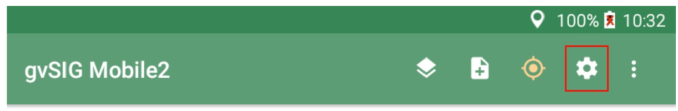
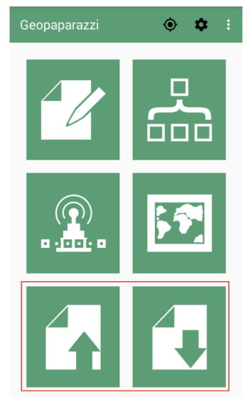
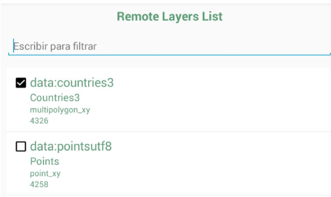
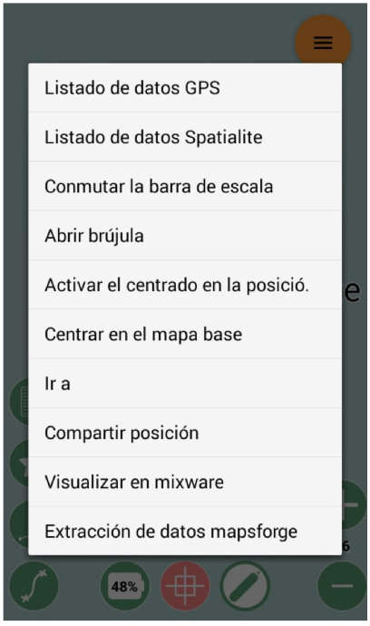
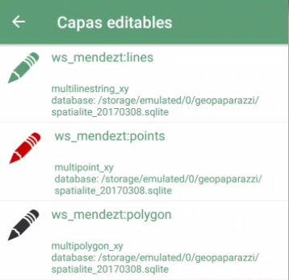
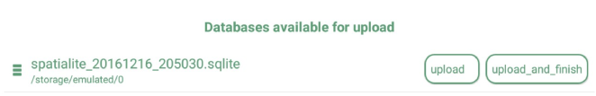

===========================================
Acceso a datos provenientes de gvSIG Online
===========================================

Es posible conectarse a gvSIG Online para descargar una o varias capas de información geográfica, editarlas en modo offline (sin conexión) desde gvSIG Mobile y por último volver a subirlas a gvSIG Online. 
Las siguientes secciones describen el funcionamiento de esta edición offline.

Configuración
-------------
Para poder conectarse a gvSIG Online, deberemos configurar los parámetros de conexión. Estos incluyen la dirección del servicio (por ejemplo, https://demo.gvsigonline.com/gvsigonline), nuestro nombre de usuario y la contraseña.

Accederemos a la configuración desde el menú principal, pulsando sobre el botón de configuración |config|:

   
A continuación seleccionaremos '**Configuración de sincronización de proyectos en la nube**', y nos aparecerá un diálogo en el que introducir los parámetros de conexión mencionados:

.. image:: ../images/mobile12.png
   :align: center

Flujo de trabajo
----------------
Para editar capas provenientes de gvSIG Online, se utilizará el siguiente flujo de trabajo:

#.  Se descargarán las capas deseadas usando la herramienta de importación

#.  Se editarán las capas descargadas usando las herramientas habituales de edición de gvSIG Mobile

#.  Una vez finalizada la edición, se volverán a cargar las capas actualizadas a gvSIG Online, usando la herramienta de exportación de datos

Descarga de las capas
---------------------
Usaremos la opción de Importación de datos, seleccionando la opción '**GVSIG ONLINE**' como fuente de la importación.

   
.. image:: ../images/mobile14.png
   :align: center
   
A continuación nos aparecerá un diálogo en el que seleccionaremos las capas a descargar de una lista de capas disponibles. Sólo aparecerán las capas sobre las que el usuario tenga permisos de escritura y que no estén bloqueadas por otro usuario. 
Las capas se descargarán en forma de base de datos Spatialite, que se almacenan en un único fichero, usando la extensión *".sqlite"*.

.. note::
   - Las capas que serán editadas a través de mobile NO DEBEN CONTENER campos de tipo: *'boolean'*
   - También está limitado para guardar archivos de formato (.svg) en los recursos multimedia de cada registro.
   En ambos casos, la app se hace sensible y no reconoce estas peticiones provenientes del online.

   
Deberemos dar un nombre significativo a dicha base de datos (por defecto se le asigna un nombre aleatorio), ya que a continuación vamos a trabajar con ese fichero de base de datos. Podemos seleccionar desde una o varias capas y se almacenaran en un mismo repositorio de base de datos *sqlite*.
Por ejemplo, si seleccionamos las capas '*countries3*' y '*pointsutf8*' e indicamos descargar nos saldrá una ventanilla emergente inidicándonos el nombre del alamacen de datos por defecto y la fecha del día de descarga, el cual es: "**spatialite_20170308.sqlite**" y lo podemos editar como queramos siempre y cuando se mantenga la extención (.sqlite)

Edición de capas
----------------
Previamente al haber importado las capas habrá salido un mensaje al usuario indicando: "*Los datos se han descargado correctamente*" y damos 'aceptar'.
Luego, desde el menú principal, accederemos a la opción Mapa y si lo hemos hecho correctamente,  se mostrarán en el mapa las capas que hayamos descargado.

Para administrar los almacenes sqlite y las capas que en ellas se contienen, accederemos desde el menú contextual del mapa, seleccionando la opción *"Listado de datos Spatialite"*.

Nos aparecerá un listado con la base de datos en primer nivel (y cualquier otra base de datos que tuviésemos previamente cargada), y en un segundo nivel la lista de capas que contiene cada base de datos. 

Desde este listado podemos decidir qué capas deben mostrarse u ocultarse, podremos también hacer un zoom a una capa e incluso eliminar el almacén de datos (**importante**: aunque se elimine del *"Listado de datos Spatialite"* este almacén está archivado en la memoria del dispositivo móvil o table).

Para agregar al listado otra bbdd '*.sqlite.*' que tengamos en la carpeta del geopaparazzi, usaremos el botón de añadir que se encuentra en la esquina inferior izquierda |plus|, y seleccionaremos el fichero de datos Spatialite que queramos. 
Van a estar identificados con este logo:|star| y extensión (.sqlite). 

Una vez administrado la visualización de capas, sus propiedades, orden, etc., cerramos diálogo o vólvemos atrás y nos ubica de nuevo en el mapa.  

Para iniciar la edición, **realizaremos una pulsación larga** sobre el icono del lápiz |lapiz|, nos saldrá el listado de capas disponibles para editar con un lápiz color verde a la izquierda. **NOTA:** cuando tienen lápiz color negro, es porque NO están activas (activar checkbox) visiblemente desde el '*listado de datos Spatialite*'.
Hacemos click sobre el lápiz verde de la capa que deseamos editar y éste se pondra color rojo.

   
Salimos del diálogo, y volvemos a pulsar sobre el |lapiz| y este cambiará a color amarillo para activar la edición.

En la zona de la izquierda aparecerá un serie de herramientas para añadir o borrar geometrías, seleccionar geometrías existentes, y editar la tabla de atributos de las geometrías seleccionadas.

Para finalizar la edición y guardar los cambios, pulsaremos de nuevo sobre el icono del lápiz amarillo del centro inferior del mapa y este volverá a su color blanco.

Exportación de las capas a gvSIG Online
---------------------------------------
Una vez finalizada la edición de las capas, volveremos a cargarlas en gvSIG Online usando la opción de exportación de datos, seleccionando '**GVSIG ONLINE**' como fuente de la exportación, y a continuación elegiremos el fichero Spatialite que contiene las capas editadas.

.. image:: ../images/mobile18.png
   :align: center

Se subirá toda la base de datos Spatialite a gvSIG Online, donde se comprobará que el usuario tuviese permisos de escritura sobre las capas que contiene, y que exista un bloqueo del usuario sobre las mismas (de lo contrario se mostrará un error al usuario).

Existen dos opciones diferentes a la hora de subir el fichero: "**Subir**" y "**Subir y terminar**":

*  **Subir**: Esta opción nos permite cargar en gvSIG Online los datos que hayamos modificado desde gvSIG Mobile, pero mantiene el bloqueo sobre la(s) capa(s) subidas, de forma que podemos continuar con la edición desde la aplicación móvil. En este caso la capa que se edita continúa existiendo en el mapa del móvil.

*  **Subir y terminar**: si elegimos esta opción la capa o capas se desbloquean en el panel de control del gvsigonline y no podremos volver a subir cambios posteriores sobre la misma (salvo que volvamos a descargarla de gvSIG Online usando el diálogo de importación). Para esta opción las capas que se editaban se desactivarán automáticamente del mapa de la app móvil, es decir, ya no estaran disponibles en el '*listado de capas spatialite*' pero siempre quedarán guardadas en la memoria del móvil dentro de la carpeta geopaparazzi, de este modo se podrá tener siempre un respaldo del (.sqlite) con el que se ha trabajado y así poder añadirla al mapa cuando sea necesario haciendo uso del |plus| desde el listado de capas.

.. note::
	Sólo aparecerán en este diálogo las bases de datos que estuviesen previamente cargadas en el mapa.

.. note::
	La opción *"Subir y terminar"* no elimina la base de datos del dispositivo móvil, incluso en el caso en donde los datos no se hayan exportado correctamente al online.

Bloqueo de capas
----------------
Cuando descargamos una capa de gvSIG Online, se establece un bloqueo de edición sobre la capa, de forma que otros usuarios no puedan descargarla, ni podamos editarla desde el geoportal.
Por esta misma razón, cuando accedamos al menú de Importación no nos aparecerá cualquier capa que esté bloqueada previamente (por otro usuario o por nosotros mismos).

Por ello, es importante desbloquear las capas cuando hayamos acabado nuestro trabajo de campo. Para ello, usaremos la opción "**Subir y terminar**" del diálogo de Exportación de Datos en la nube.