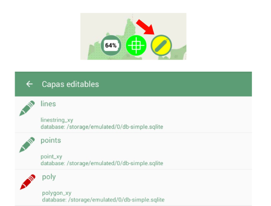
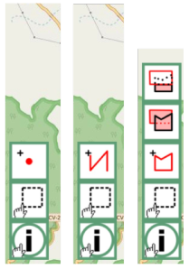
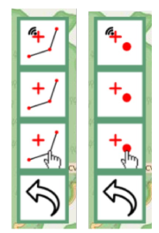
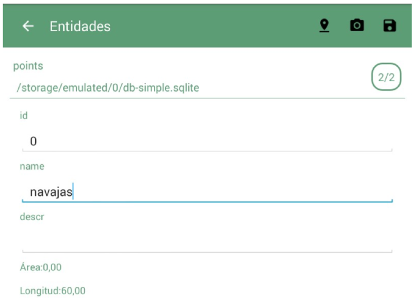
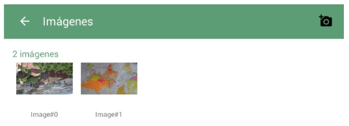

Edición
=======

Edición gráfica
---------------
Para poder activar la edición debemos tener alguna capa Spatialite cargada. 

A continuación, realizamos una pulsación larga sobre el botón de edición, elegimos la capa a editar, volvemos al mapa y finalmente volvemos a realizar una pulsación (esta vez corta) sobre el botón de edición para activarla.

   
Al entrar en edición, nos aparecerán nuevas herramientas en el lado inferior izquierdo del mapa que nos permitirán interactuar con geometrías y sus registros asociados. 

De abajo a arriba, podemos observar la herramienta de información, la herramienta de selección de geometrías y la herramienta de creación de geometría, que es ligeramente diferente dependiendo del tipo de geometría (punto, línea o polígono).

Si elegimos creación de geometría, aparecerán diversos opciones de adición de nodos:

De arriba a abajo encontramos los siguientes botones:
*   Añadir nodo a partir de la posición GPS

*   Añadir nodo a partir del punto central del mapa

*   Añadir nodo pulsando en un punto del mapa

.. image:: ../images/mobile23.png
   :align: center

Cuando acabemos de crear la geometría debemos guardarla usando el botón del disquete.

Selección, edición alfanumérica y borrado
-----------------------------------------
.. image:: ../images/mobile24.png
   :align: center
   
La herramienta de selección permite seleccionar una o varias geometrías. Una vez seleccionadas, aparecen nuevos botones para eliminarlas, duplicarlas o acceder a la edición alfanumérica de la selección.

En el formulario de edición alfanumérica (titulado como *"Entidades"*) podremos consultar o modificar el valor de los campos definidos en la capa. 

Si hemos seleccionado varias entidades, podemos saltar de una a otra usando deslizando a izquierda o derecha el formulario.

Imágenes asociadas a la geometrías
----------------------------------
Desde el diálogo de *"Entidades"* podemos acceder al formulario de gestión de imágenes, que nos permitirá tomar fotografías que quedarán asociadas a la geometría seleccionada. 

Desde esteformulario también podemos gestionar las imágenes previamente capturas, usando una pulsación corta para visualizarlas a pantalla completa, y una pulsación larga para eliminarlas.

Para tomar una nueva fotografía, pulsaremos sobre el botón de la esquina superior derecha.

.. image:: ../images/mobile27.png
   :align: center