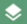
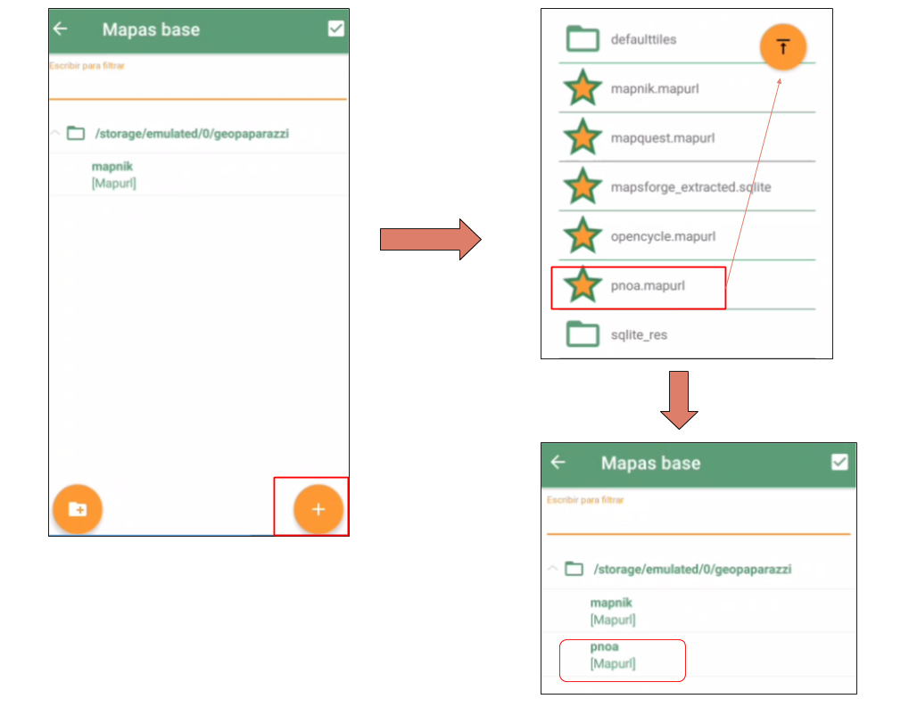

============
Introducción
============

La aplicación gvSIG Mobile2 permite gestionar información geográfica desde un dispositivo móvil o tablet, realizando trabajos de campo para capturar o actualizar la información. Funciona sobre dispositivos con sistema operativo Android.

Visión general
--------------
La pantalla principal contiene diversas secciones. Las más relevantes para trabajar con las capas de gvsig online (web)son:

   
*  **1. Administrador de capa base**: Se podrá configurar la capa de fondo que tendrá el mapa por defecto. Al pinchar en |capa_base|, se podrá buscar las capas disponibles con el |plus| (ubicado de la esquina inferior derecha). 
     Estas capas estan incluidas en el almacenamiento de la app y tienen la extención (.mapurl). Por ejemplo, seleccionar capa base del PNOA.

     
.. |plus| image:: ../images/boton_02.png  
     

*  **4. Configuraciones**: Donde debemos configurar los párametros de conexión para sincronizar con los proyectos de la nube, Ver apartado: Configuración_.   
 
 .. _Configuración: https://devel.gvsigonline.com/docs/mobile/es/acceso_a_datos.html#configuracion 
 
*  **9. Mapa**: en el que realizaremos la mayoría de acciones de captura y mantenimiento de datos y visualización

*  **10. Importar data**: Para descargar y añadir la(s) capa(s) a editar desde la nube al mapa.

*  **11. Exportar data**: Para subir cambios y exportar la(s) capa(s) editadas desde el mapa a la nube.

