3. Panel de control
===================

3.1 Interfaz principal
----------------------

La interfaz principal del panel de control se divide en varios componentes:

*   **Barra superior: **
    En la barra superior encontramos el menú de sesión del usuario y el selector del idioma.

*   **Menú principal: **
    Desde donde podemos acceder a la gestión de las entidades de la plataforma (usuarios y grupos, servicios, estilos, …).

*   **Contenido principal:**
    En el área de contenido se irán cargando las vistas con los formularios en función de la selección que hagamos en el menú principa
    l.

|100002010000077A00000288DD491B14_png|

En función del rol que implemente nuestro usuario
el panel de control mostrará unos componentes u otros.

Al acceder al panel de control por defecto se muestra la vista de
*“Inicio”*
, donde se muestra un resumen con la información de usuario, y un listado con los proyectos que este tiene disponibles.

**
Si nuestro usuario no implementa el rol de superusuario, y solo tiene asignado un proyecto, accedera directamente al proyecto sin pasar por el panel de control.

3.2 Usuarios y grupos de usuarios
---------------------------------

GvSIG Online utiliza dos entidades principales tanto para gestionar la autenticación, como para gestionar los permisos para el tratamiento de datos y acceso a los servicios de la plataforma. Estas dos entidades son los
**usuarios**
y los
**grupos de usuarios**
.

Toda la información de autenticación es centralizada desde el servicio LDAP.

|100002010000007800000034950AFC78_png|

|1000020100000080000000800F4EED91_png|

|100002010000019A0000005A51033331_png|
|10000000000000E40000004107207AE2_png|

3.2.1 Roles de usuario
~~~~~~~~~~~~~~~~~~~~~~

Por otro lado cada usuario implementa un rol, el cual le confiere una serie de permisos que definen el acceso a la plataforma y como el usuario interactua con las entidades.

Los roles que puede implementar un usuario son los siguientes:

*   **Superusuario**
    : Tiene acceso a toda la plataforma, pudiendo administrar cualquier objeto haya sido creado por el o por otros usuarios. También puede administrar usuarios y grupos.

*   **Gestión**
    : Los usuarios que implementan el rol de gestión pueden gestionar proyectos, y capas, pero están restringidos a un espacio de trabajo. Este rol no permite la gestión de otros usuarios y grupos.

*   **Básico**
    : Los usuarios que implementan el rol básico únicamente pueden consultar los proyectos que les han sido asignados por usuarios de rol superior, no pudiendo gestionar capas ni proyectos.

3.2.2 Gestión de usuarios y grupos
~~~~~~~~~~~~~~~~~~~~~~~~~~~~~~~~~~

La gestión de usuarios y grupos se lleva a cabo desde la entrada
*“*
*Usuarios y grupos*
*”*

que se encuentra disponible en el menú del panel de control:

|100002010000077800000240F3CBA87D_png|

Desde la vista de usuarios podemos ver el listado de usuarios disponibles, así como crear, actualizar o eliminar usuarios.

Los campos que aparecen en el formulario
de usuarios
son los siguientes:

*   **Nombre**
    y
    **apellidos**
    reales del usuario.

*   **Nombre de usuario: (*Obligatorio) **
    Alias con el que se accederá al sistema .

*   **Contraseña**
    .

*   **Es **
    **superusuario**
    : Indicamos si el usuario
    implementará el rol de superusuario, con lo que tendrá permisos totales sobre la plataforma.

*   **Puede gestionar proyectos**
    : Indicamos si el usuario implementa el rol de gestión.

|1000020100000688000002F9594D7B60_png|

En la parte inferior del formulario de usuarios, aparece un listado con los grupos disponibles. Si asignamos el usuario a algún grupo, este podrá acceder a las entidades definidas en el grupo (proyectos, capas, ...).

Desde la vista de
grupos
podemos ver el listado de
grupos
disponibles, así como crear
o
eliminar
grupos
.

Los campos que aparecen en el formulario
de grupos
son los siguientes:

*   **Nombre**

    del grupo
    .

*   **Descripción**
    del grupo
    .

3.2.3 Espacio de trabajo de usuario
~~~~~~~~~~~~~~~~~~~~~~~~~~~~~~~~~~~

Cuando creamos un nuevo usuario automáticamente se genera la siguiente estructura en la plataforma:

*   Usuario

*   Grupo para el usuario. El grupo se llamará como el usuario precedido del prefijo
    *“ug_”*

*   Espacio de trabajo en el servidor de mapas para el usuario

*   Esquema en BBDD y almacén de datos vectorial en el servidor de mapas asociado al esquema, donde el usuario podrá publicar sus capas.

*   Directorio en el sistema de ficheros desde donde el usuario podrá gestionar sus archivos. El directorio se llamará como el usuario precedido del prefijo
    *“ug_”*

3.3 Servicios
-------------

gvSIG Online utiliza un servidor de mapas para publicar y acceder a las capas de información geográfica. Los servicios de mapas están basados en los estándares del
`Open Geospatial Consortium <http://www.opengeospatial.org/>`_
(OGC), que permiten que las capas sean interoperables tanto con el visor integrado en gvSIG Online como con otros visores y aplicaciones SIG de escritorio como gvSIG Desktop.

El módulo de servicios permite publicar y gestionar
las
capas
de gvSIG Online.

3.3.1 Espacios de trabajo
~~~~~~~~~~~~~~~~~~~~~~~~~

Los espacios de trabajo son contenedores que se utilizan para organizar elementos diversos como capas y almacenes de datos. Los espacios de trabajo se identifican por su nombre, que debe ser único, y permiten agrupar capas y almacenes de datos similares.

Puede crear y eliminar espacios de trabajo desde el listado de
espacios
de trabajo. Si elimina un espacio de trabajo, se eliminarán
de gvSIG Online
todos los almacenes de datos y capas asociadas.

|100002010000077F0000020617E4212F_png|

|1000020100000771000002496D60121E_png|
Para crear un espacio de trabajo, proporcione un nombre y una descripción. El nombre del
espacio de trabajo
no puede contener espacios,
signos de puntuación
ni caracteres especiales
como la “ñ”
. Habitualmente no es necesario modificar la URL de los servicios
(generada automáticamente)
.

3.3.2 Almacenes de datos
~~~~~~~~~~~~~~~~~~~~~~~~

Los almacenes de datos
definen conexiones a fuentes de datos ráster o vectoriales, como bases de datos PostGIS, carpetas de ficheros SHP o ficheros ráster individuales.

Los almacenes de datos vectoriales permiten
definir los parámetros de conexión una única vez para todas las capas presentes en el almacén.

Por contra, los almacenes de datos ráster definen los parámetros de un fichero ráster individual, que contiene una única capa.

Existen diferentes tipos de almacenes de datos en gvSIG Online:

*   PostGIS vectorial:
    Almacena capas vectoriales en una base de datos
    PostGIS

*   GeoTiff:
    Capa ráster en formato GeoTiff, que almacena la geo-referenciación de la capa dentro de los metadatos Tiff

*   Carpeta de shapefiles

*   WMS en cascada

Dependiendo de la configuración de gvSIG Online, es posible disponer de almacenes de datos adicionales.

Puede
añadir, actualizar
y eliminar
almacenes de datos desde el listado de almacenes de datos.

|1000020100000780000001FE4D05E918_png|

Es importante entender que para poder añadir un almacén de datos, debemos partir de una fuente de datos que exista previamente. Por ejemplo, para poder añadir un almacén de datos de tipo PostGIS vectorial, la base de datos espacial debe existir previamente. De esta forma, los que estamos haciendo es registrar en gvSIG Online (y en Geoserver) los parámetros de conexión a dicha base de datos. De la misma forma, para
añadir
un almacén de datos de tipo ráster, el fichero ráster debe existir previamente en el servidor
(en este caso estamos registrando en gvSIG Online la ruta a dicho fichero ráster)
.

En el formulario de creación de almacén de datos deberemos seleccionar el espacio de trabajo al que pertenecerá, el tipo de almacén, el nombre (sin caracteres especiales) y los parámetros de conexión.

El formulario incluye diversos ejemplos de parámetros de conexión para cada tipo de almacén.

|100002010000077D0000033D6E41A0FF_png|

En caso de que el almacén de datos sea de tipo raster el formulario cambiará y nos permitirá seleccionar el fichero que compondrá el almacen.

|100002010000077F0000021613BD9367_png|

Al abrir el dialogo de seleccionar archivo, este nos mostrará un ventana con el gestor de ficheros, desde donde podremos seleccionar el archivo raster que habremos subido previamente.

|100002010000028700000103073793EC_png|

Podemos modificar o eliminar almacenes de datos usando los botones verde y rojo del listado de almacenes.
La eliminación de un almacén de datos elimina todas las capas asociadas al almacén. Por contra, no se eliminará la fuente de datos asociada (la base de datos espacial o el fichero ráster correspondiente).

3.3.3 Capas
~~~~~~~~~~~

Una capa es un conjunto estructurado de información geográfica y alfanumérica que describe un aspecto de la realidad (parcelas, áreas protegidas, usos del suelo, precipitación, etc).

Existen dos tipos diferenciados de capas: vectoriales y ráster. Las capas vectoriales contienen registros de base de datos, cada uno de los cuales posee una o más geometrías asociadas. Las capas ráster
definen una matriz de valores y se utilizan frecuentemente para representar fenómenos continuos en el espacio tales como temperatura, elevación, precipitación o color (ortofotos). Es habitual utilizar formatos de imagen para almacenar capas ráster.

Dentro de cada uno de estos tipos principales podemos encontrar diferentes tipos más especializados.

Desde el listado de capas podemos acceder a la gestión de las mismas. Pdemos publicar capas existentes en almacenes de datos, o crear capas vacías definiendo de forma manual los campos.

|100002010000077A000002F1686D8308_png|

Sobre cada una de las capas podemos realizar las siguientes operaciones:

*   **Actualizar capa (botón verde): **
    Desde donde se puede modificar el título grupo al que pertenece la capa, propiedades (visible, consultable, etc …), así como los permisos de lectura y escritura de la capa.

*   **Configurar capa (botón morado):**
    Podemos definir alias a los nombres de los campos, así como definir que campos serán visibles para las herramientas del visor (herramienta de información, tabla de atributos, etc …).

|10000201000006800000022E15ECFEAC_png|

*   **Limpiar caché (botón naranja):**
    Limpia la caché de la capa en el servidor de mapas. Muy útil cuando realizamos cambios en la simbología de la capa.

*   **Borrar capa (botón rojo):**
    Elimina la capa y estilos asociados.

3.3.4 Bloqueos
~~~~~~~~~~~~~~

Cuando una capa está en modo edición automáticamente se bloquea para evitar errores en la escritura de los datos.

Existen dos tipos de bloqueos:

*   Bloqueos del geoportal

*   Bloqueos de la aplicación móvil

Podemos consultar los bloqueos activos desde el listado de bloqueos, así como desbloquear capas bloqueadas.

|10000201000006870000013C159BF6EE_png|

3.4 Administrador de archivos
-----------------------------

El administrador de archivos nos permite subir archivos a la plataforma de gvSIG Online, para posteriormente realizar operaciones sobre ellos.

El administrador de archivos gestiona directorios en función de los grupos de usuarios. Por cada grupo de usuarios creado existirá un directorio en el servidor. Por tanto a la hora de explorar los directorios, únicamente podremos visualizar aquellos directorios que tengamos asignados por pertenencia al grupo.

|100002010000077E00000190E39C42E2_png|

Estos directorios asignados por grupo serán la raíz y no podrán ser eliminados de forma directa. Para eliminar un directorio de la raíz será necesario eliminar el grupo de usuarios al que está asignado.

3.4.1 Crear directorios
~~~~~~~~~~~~~~~~~~~~~~~

Podremos crear todos los subdirectorios que deseemos para organizar nuestros archivos dentro de un directorio raíz. Para ellos seleccionaremos el botón
*“crear directorio”*
**, **
e introduciremos el nombre del nuevo directorio.

|100002010000068B0000010873918762_png|

Con esto se habrá creado un nuevo subdirectorio dentro del directorio raíz.

3.4.2 Operaciones sobre archivos
~~~~~~~~~~~~~~~~~~~~~~~~~~~~~~~~

En la parte derecha de cada archivo o directorio tendremos un menú desplegable con las operaciones que podemos realizar sobre el mismo. En caso de subdirectorios, nos aparecerá la opción “
*eliminar directorio”*
**.**
Si la seleccionamos eliminaremos el subdirectorio y todo su contenido.

Actualmente los formatos soportados por el administrador de archivos son
*Shapefile y GeoTIFF*
.

Los archivos se pueden subir seleccionando uno a uno o comprimidos en formato zip.

El formato shapefile, es un formato multiarchivo y tienen un conjunto de archivos requerido para su correcto funcionamiento. Los archivos requeridos tienen las siguientes extensiones:

*   **shp:**
    Almacena las entidades geométricas de los objetos.

*   **shx: **
    Almacena el índice de las entidades geométricas.

*   **dbf: **
    base de datos en formato dBASE, donde se almacena la información de los atributos.

Además de estos tres archivos requeridos, opcionalmente se pueden utilizar otros para mejorar el funcionamiento en las operaciones de consulta a la base de datos, información sobre la proyección cartográfica o almacenamiento
de metadatos. Entre ellos destaca:

*   **prj: **
    Es el archivo que guarda la información referida al sistema de coordenadas en formato WKT

Por tanto ya sea seleccionando uno a uno o comprimidos tendremos especial atención en que todos ellos estén presentes.

|1000020100000684000001F61189782B_png|

Una vez subido los archivos nos aparecerá en el directorio donde lo hayamos subido, aunque únicamente veremos el archivo con extensión
**SHP**
.

|1000020100000695000001376BA0C7E1_png|

Para eliminar el archivo shapefile seleccionaremos en el menú de operaciones la opción
*“eliminar archivo”,*
** **
esto borrará en el servidor tanto el archivo shp como el resto de archivos asociados (.shx, .dbf, .prj, …).

Entre las operaciones que podemos realizar sobre los archivos de tipo shapefile, se encuentra la de
*“Exportar a base de datos”*
, para ello seleccionamos la operación en el menú de operaciones del archivo.

|100002010000069400000137DD1411FC_png|

A continuación se mostrará el formulario con los parámetros necesarios para realizar la exportación.

|100002010000068E000001770D7737A4_png|

En el formulario deberemos elegir el almacén de datos de destino (de tipo base de datos PostGIS), así como
especificar el sistema de referencia de coordenadas (CRS) y la codificación de caracteres de la capa a subir.

También podremos especificar si deseamos crear una nueva tabla en el almacén de datos, añadir registros o sobreescribir una tabla existente.
Las dos últimos opciones deben utilizarse con cuidado, ya que borrarán o modificarán datos existentes.

GeoTIFF es un
estandar
de
metadatos
de domino público que permite que información
georreferenciada
sea encajada en un archivo de imagen de formato
TIFF.
La información adicional incluye el tipo de
proyección, sistemas de coordenadas, elipsoide y datum
y todo lo necesario para que la imagen pueda ser automáticamente posicionada en un sistema de referencia espacial.

Los archivos GeoTIFF disponen de una extensión .tif o .tiff.
** **
Para subirlos procederemos de la misma forma que con los archivos shapefile, solo que en este caso será un único archivo.

3.5 Proyectos
-------------

Una
proyecto
es un conjunto de objetos que mediante una configuración dada, permiten una visualización gráfica.

Una
proyecto
está formada por los siguientes elementos:

*   Información general: nombre, descripción y logo del proyecto

*   Un
    a vista de mapa (centro y extensión)

*   G
    rupos de capas

*   Grupos de usuarios

Existen 2 tipos de aplicaciones:

*   **Proyectos**
    ** de acceso público**
    : Son
    proyectos
    en l
    o
    s que los datos que son visualizados no poseen ningún tipo de restricción. Pueden ser accedid
    o
    s de forma pública por usuarios que no estén registrados en la plataforma.

*   **Proyectos**
    ** de acceso restringido**
    : Son
    proyectos
    en l
    o
    s que los datos poseen restricciones de acceso y uso para determinados
    grupos de usuarios
    . Solo pueden ser accedid
    o
    s por usuarios que estén dados de alta en la plataforma.

3.5.1 Gestionar proyectos
~~~~~~~~~~~~~~~~~~~~~~~~~

Para crear un
nuevo proyecto
seleccionaremos en el menú de la izquierda la opción
*“*
*Proyectos*
*”*
, lo que nos llevará a la vista listado de
proyectos
.

|1000020100000780000001BC2554AE2C_png|

A continuación seleccionamos la opción
*“Añadir *
*proyecto*
*”*
, que se encuentra en la parte superior derecha, para abrir la vista que nos permitirá crear
un nuevo proyecto.

|10000201000007700000038A08741B24_png|

El formulario para crear un nuev
o

proyecto
está formado por los siguientes campos:

*   **Nombre**
    de
    l proyecto

*   **Descripción **
    del proyecto

*   **¿Es público?: **
    Indicamos si el proyecto será acccesible publicamente, sin necesidad de estar autenticado en la plataforma.

*   **Vista**
    :
    Centraremos el mapa y le añadiremos el zoom deseado
    .

*   **Imagen**
    :
    Logo del proyecto
    que se mostrará en el listado de
    proyectos
    . Si no se define ninguna se asignará una por defecto.

Además de estos campos en la parte inferior aparecerán dos listados:

|100002010000066C000001EB8B677957_png|

*   **Grupos de usuario**
    : Grupos de usuario(roles) para los que
    el proyecto
    estará disponible. Los usuarios administradores tendrán acceso a tod
    os los proyectos
    .

*   **Grupos de capas**
    : Grupos de capas que estarán disponibles en el visor para est
    e proyecto
    .

Para modificar un
proyecto
existente seleccionaremos el botón
*“Actualizar *
*proyecto*
*”*
, que se encuentra en la parte derecha en cada fila del listado de
proyectos
.

Para eliminar un
proyecto
existente seleccionaremos el botón
*“Eliminar *
*proyecto*
*”*
, que se encuentra en la parte derecha en cada fila del listado de
proyectos
.

Para cada uno de los proyectos es posible definir un orden particular de las capas y grupos de capas. Para ello en el listado de proyectos seleccionaremos el botón
*“Ordenar TOC”.*

A continuación en la vista aparecerán los grupos de capas y dentro de ellos si los desplegamos las capas. Las capas pueden ser ordenadas mediante las flechas que se encuentran en la parte derecha de las mismas, mientras que los grupos de capas pueden ser ordenados usando la técnica de arrastrar y soltar.

|1000020100000694000001C21AD35E12_png|

3.6 Simbología
--------------

Otra de las funcionalidades que ofrece gvSIG Online es
la posibilidad de modificar la simbología de las capas y aplicarles distintos tipos de leyenda.

La leyenda nos indicará la forma y los criterios que se emplearán para mostrar los datos en el mapa, para una mejor visualización y comprensión de los datos que se representan en el geoportal
a través de las distintas capas
.

3.6.1 Gestionar leyendas
~~~~~~~~~~~~~~~~~~~~~~~~

Para crear o modificar la leyenda de una capa seleccionaremos la entrada
*“Estilos de capa”*
en el menú de simbología.

|100002010000077B000001CA1897B3C2_png|

Aparecerá un listado con las capas disponibles. Cada capa del listado dispone de un selector donde se muestran las leyendas o estilos disponibles para la capa. Estas leyendas se podrán seleccionar para ser modificadas.

También podremos añadir una nueva leyenda a la capa seleccionando el botón añadir.

Si seleccionamos el botón el botón añadir se nos mostrará una vista para que seleccionemos el tipo de leyenda que deseamos crear.

En caso de que la capa sea de tipo vectorial el menú que se nos mostrará será el siguiente:

|100002010000032E00000188E808F975_png|

Y si es de tipo raster de esta forma:

|100002010000027A0000008F12030B63_png|

Las leyendas están formadas por uno o más símbolos. Cada símbolo puede estar formado a su vez por uno o más simbolizadores, lo que nos permitirá crear símbolos de mayor complejidad.

En función del tipo de geometría de la capa (punto, linea o polígono) los simbolizadores pueden ser de los siguientes tipos:

*   Geometría tipo punto(
    PointSymbolizer
    ): Marcadores vectoriales(Mark) o imágenes(ExternalGraphic).

*   Geometría de tipo línea(
    LineSymbolizer
    ): Simbolizador vectorial.

*   Geometría de tipo polígono(
    PolygonSymbolizer
    ): Simbolizador vectorial.

Además de los símbolos vectoriales también se podrán definir símbolos para capas raster (RasterSymbolizer) y simbolizadores que definen texto o etiquetas (TextSymbolizer).

3.6.2 Leyenda de símbolo único
~~~~~~~~~~~~~~~~~~~~~~~~~~~~~~

La leyenda de símbolo único es la más simple de todas y nos permite definir un estilo que será aplicado a todos los elementos de una capa de la misma forma, sin hacer ningún tipo de distinción.

|100002010000067E0000024F0C8625B0_png|

La vista para crear una leyenda de símbolo único está divida en tres áreas:

El área de metadatos
(
recuadro
rojo)
contiene los siguientes campos:

*   **Nombre**
    : El nombre del estilo se genera por defecto por tanto no es necesario definirlo.

*   **Título**
    : Título que aparecerá en la leyenda que se muestra en el visor.

*   **Escala mínima**
    : Escala mínima a partir de la cual será mostrada la leyenda (Si el valor es -1 no se tendrá en cuenta).

*   **Escala máxima**
    : Escala máxima hasta la cual será mostrada la leyenda (Si el valor es -1 no se tendrá en cuenta).

*   **Por defecto**
    : Si seleccionamos este campo el estilo será el que se muestre por defecto en el visor.

El área de pre-visualización
( recuadro morado)
contiene el mapa donde podremos observar el estilo de la leyenda. Para actualizar la pre-visualización lo haremos a través del botón “Actualizar previsualización” situado en la parte superior derecha.

El área de simbolizadores (recuadro verde)
Desde aquí iremos añadiendo los distintos simbolizadores que conformarán finalmente el símbolo.

Tenemos 3 opciones:

*   **Importar un símbolo desde una biblioteca:**

    Se nos mostrará un dialogo con desplegable donde seleccionaremos la biblioteca de símbolos. A continuación seleccionaremos el símbolo.

|10000201000001200000002A6A1F01B9_png|

|10000201000002730000011396096EA6_png|

*   **Añadir uno o varios simbolizadores:**

    Como hemos comentado anteriormente un símbolo puede estar formado por uno o más simbolizadores.

|10000201000001200000002A6A1F01B9_png|

Podremos editar o eliminar un simbolizador desde los botones que se encuentran en la parte derecha.

|100002010000062E0000004ED4160A40_png|

Al seleccionar el botón de edición se abrirá un dialogo donde podremos configurar los valores de las propiedades del simbolizador en función de us tipo.

|10000201000002650000014A9E6B1115_png|

En caso de tener varios simbolizadores podemos definir el orden de visualización de los mismos mediante la técnica de arrastrar y soltar. Para ello seleccionaremos el simbolizador y lo arrastraremos a la posición deseada.

|1000020100000641000000B45326936D_png|

*   **Añadir una etiqueta: **
    Las etiquetas son tipo especial de simbolizadores de tipo texto. Para añadir una nueva etiqueta seleccionaremos el botón “
    Añadir etiqueta
    ”.
    Solo podremos añadir una etiqueta por símbolo por tanto una vez añadida una etiqueta el botón desaparecerá, y solo volverá a aparecer si esta es eliminada.

|10000201000001200000002A6A1F01B9_png|

Como cualquier otro simobolizador una vez añadida podremos editar sus propiedades.

|100002010000025F000002736533B86D_png|

3.6.3 Leyenda de valores únicos
~~~~~~~~~~~~~~~~~~~~~~~~~~~~~~~

La leyenda de
valores
único
s

genera una clasificación de símbolos en función de un campo de la capa
.

|100002010000066F0000037F31B49968_png|

Seleccionaremos el campo por el que deseamos realizar la clasificación (
1
), y a continuación se crearán de forma automática las clases correspondientes.

Cada una de las clases creadas puede ser modificada de la misma forma que si se tratara de un símbolo único.

3.6.4 Leyenda de intervalos
~~~~~~~~~~~~~~~~~~~~~~~~~~~

El tipo de leyenda más habitual para representar datos numéricos quizá sea la de
i
ntervalos
, que permite clasificar los valores disponibles en los distintos elementos en una serie de rangos.

Para generar la leyenda de intervalos en primer lugar seleccionaremos el campo por el que deseamos realizar la clasificación (
1
) (solo aparecerán los campos numéricos),
y a continuación seleccionaremos el número de intervalos (
2
).

|10000201000006730000037EE47B6A4B_png|

Cada una de las clases creadas puede ser modificada de la misma forma que si se tratara de un símbolo único.

3.6.5 Leyenda de expresiones
~~~~~~~~~~~~~~~~~~~~~~~~~~~~

Mediante esta leyenda podremos asignar un tipo de símbolo a los elementos que cumplan con una determinada condición o expresión. Y, por supuesto, podemos tener en una misma leyenda tantas condiciones como deseemos.

Para crear un un símbolo seleccionaremos el botón “Añadir nueva regla” (
**1**
), lo que nos creará un nuevo símbolo con los valores por defecto.
Cada una de las clases creadas puede ser modificada de la misma forma que si se tratara de un símbolo único.

Para definir la condición de filtrado seleccionaremos en el menú de herramientas la opción “Editar filtro” (
**2**
).

|100002010000067300000116AD76FB10_png|

A continuación se nos mostrará un diálogo, desde donde podremos definir el filtro con la condición deseada.

|1000020100000261000001C7407B359A_png|

3.6.6 Mapa de color (ráster)
~~~~~~~~~~~~~~~~~~~~~~~~~~~~

Mediante esta leyenda podremos asignar un
a tabla de colores a una capa de tipo ráster
. Las rampas de color se utilizan, por ejemplo,
para aplicaciones específicas, como mostrar la elevación o precipitación.

Para añadir una nueva entrada a la tabla de colores seleccionaremos el botón “Añadir entrada de color” (
**1**
).

|100002010000067A0000029A809A286E_png|

|100002010000001500000017FA9CFD1C_png|
Podremos añadir tantas entradas de color como deseemos. Para editar los valores de cada una de las entradas seleccionaremos el botón editar

A continuación se nos mostrará un dialogo para que configuremos los valores.

|100002010000025F000001C514240607_png|

*   **Color: **
    Seleccionaremos el color deseado para la entrada.

*   **Cantidad: **
    Aquí seleccionaremos el valor del ráster por el que filtraremos.

*   **Etiqueta: **
    Etiqueta que se mostrará al representar la leyenda para este valor.

*   **Opacidad: **
    Nivel de opacidad para esta entrada de color.

3.6.7 Bibliotecas de símbolos
~~~~~~~~~~~~~~~~~~~~~~~~~~~~~

Las bibliotecas de símbolos nos permiten crear y agrupar símbolos genéricos que posteriormente podremos importar desde las leyendas de capa.

Para crear una nueva biblioteca de símbolos seleccionaremos la entrada
*“Bibliotecas de símbolos”*
en el menú de simbología.

|1000020100000774000001CFFA76A596_png|

Para crea una nueva biblioteca seleccionaremos el botón
*“*
*Añadir*
* biblioteca”*
que se encuentra en la parte superior derecha,
y
rellenaremos los campos nombre y descripción en el formulario.

Podremos también importar bibliotecas que hayan sido creadas previamente en la plataforma. Las bibliotecas de símbolos son archivos están formadas por un archivo ZIP que contiene un fichero con extensión .sld por cada uno de los símbolos y un directorio resources con loas imágenes en caso de que haya símbolos puntuales de tipo imagen.

Para añadir símbolos a una biblioteca seleccionaremos la opción actualizar biblioteca en el listado
(botón verde)
.

Podremos añadir 4 tipos de símbolos: Gráficos externos (imágenes), puntos, líneas y polígonos.

El interfaz para añadir puntos líneas y polígonos es similar al descrito en el punto 6.2.1.
En caso de que el símbolo que deseemos añadir sea de tipo imagen el interfaz nos permitirá seleccionar la imagen desde nuestro sistema de ficheros local.

|100002010000067A000001BC75651FB5_png|

**Actualmente únicamente se soportan imágenes en formato PNG.

Conform
e
vayamos añadiendo símbolos estos irán apareciendo en la vista de la biblioteca, desde donde podremos seleccionarlos para modificarlos o eliminarlos.

|100002010000067F00000166CFF00956_png|

Podremos exportar cualquier biblioteca de símbolos, para tener un resguardo de la misma y poder restaurarla posteriormente o compartirla con otros usuarios de la aplicación. Para ello seleccionaremos el botón naranja.

Al seleccionar exportar se genera un archivo ZIP que contiene la definición de cada uno de los símbolos en formato SLD, y un directorio “resources” que contendrá las imágenes de los símbolos que sean de tipo gráfico externo.

Por último para eliminar una biblioteca seleccinaremos el botón rojo.
Al eliminar la biblioteca borraremos esta y todos los símbolos que hayan asociados a ella.

.. |10000201000006730000037EE47B6A4B_png| image:: _static/images/10000201000006730000037EE47B6A4B.png
    :width: 17cm
    :height: 9.204cm

.. |10000000000000E40000004107207AE2_png| image:: _static/images/10000000000000E40000004107207AE2.png
    :width: 3.157cm
    :height: 0.766cm

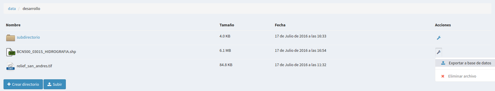

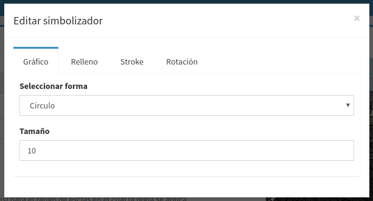

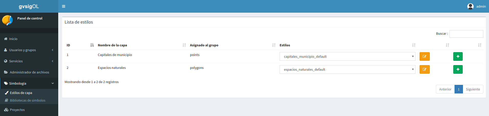

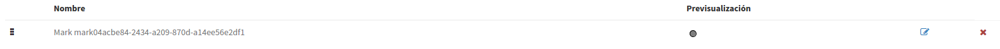

.. |100002010000028700000103073793EC_png| image:: _static/images/100002010000028700000103073793EC.png
    :width: 10.224cm
    :height: 3.54cm

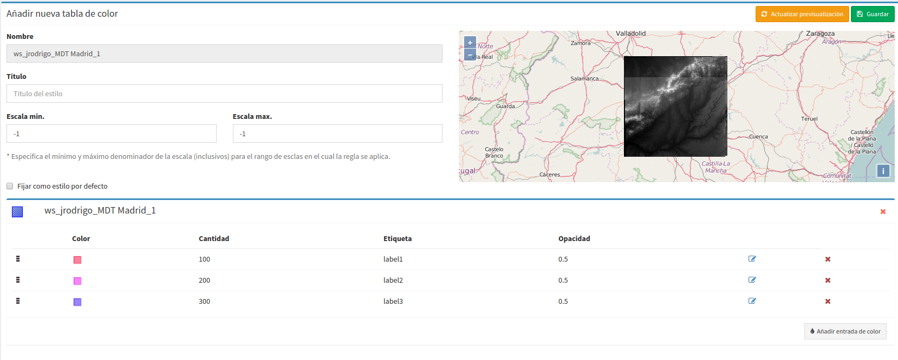

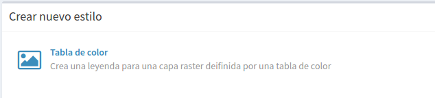

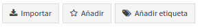

.. |1000020100000641000000B45326936D_png| image:: _static/images/1000020100000641000000B45326936D.png
    :width: 15.873cm
    :height: 1.91cm

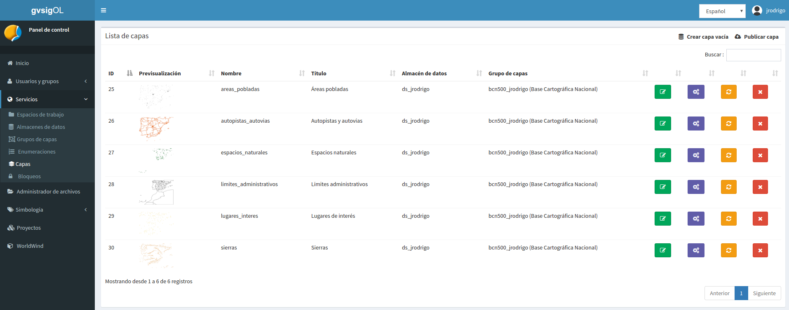

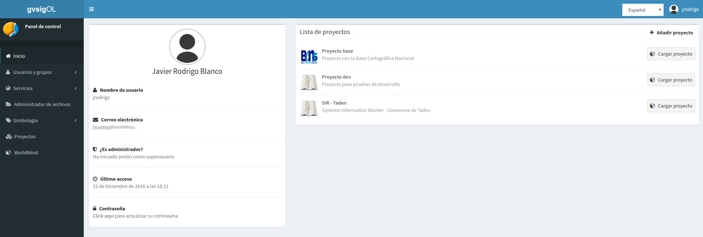

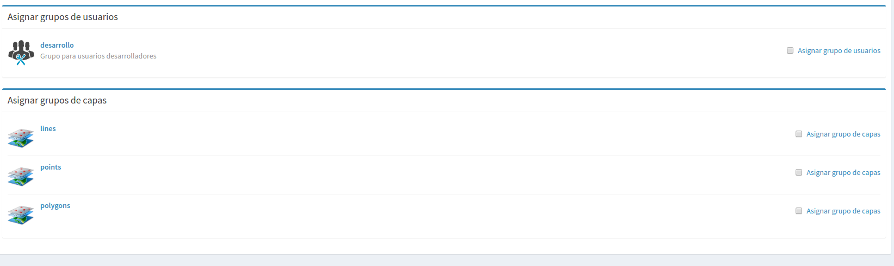

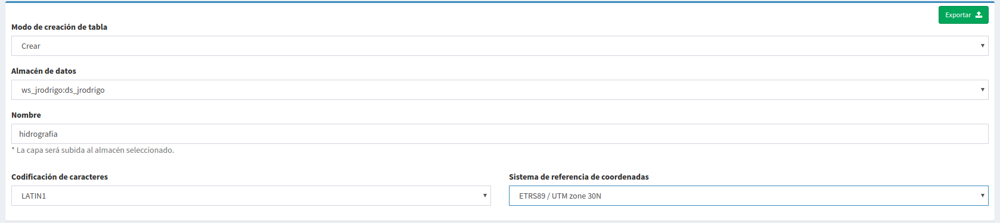

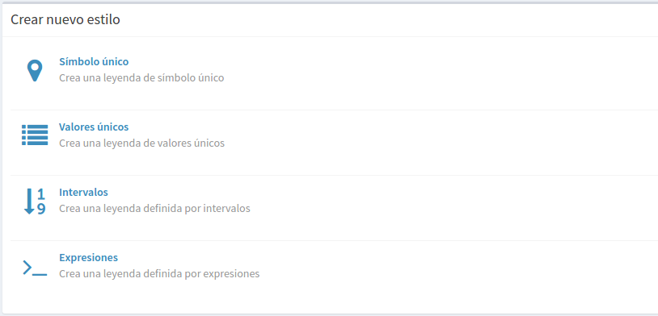

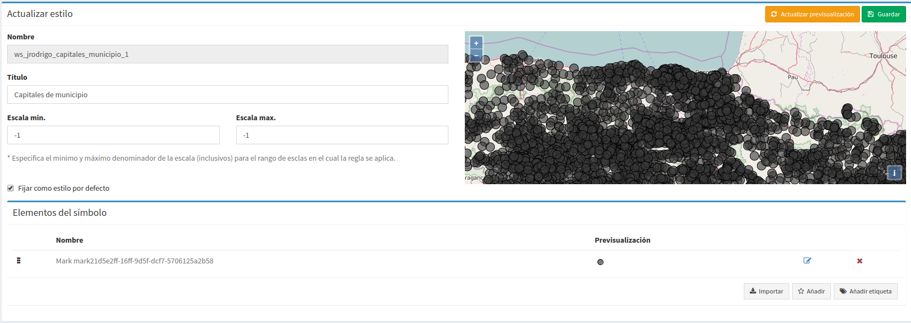

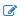

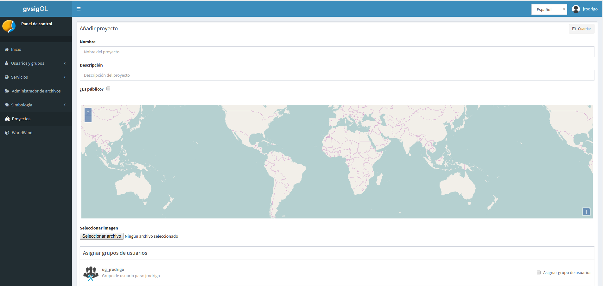

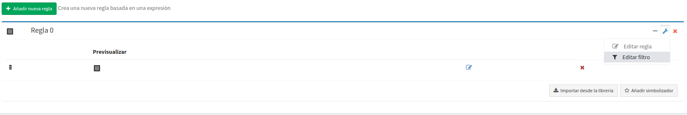

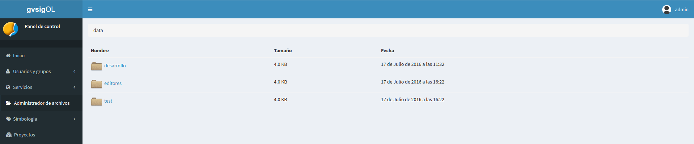

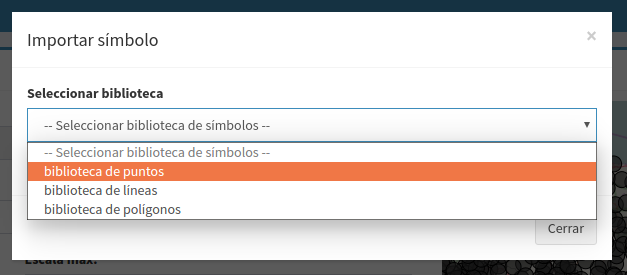

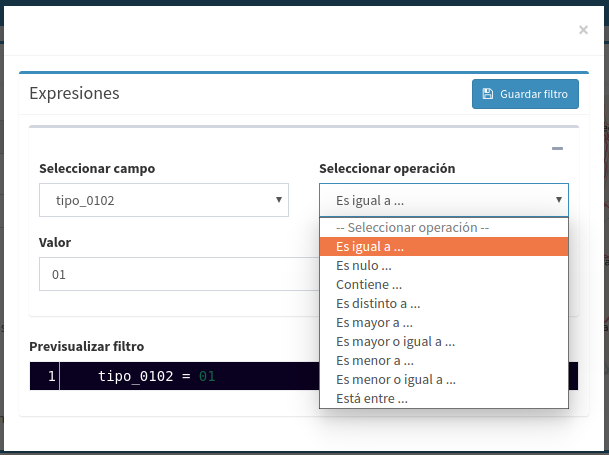

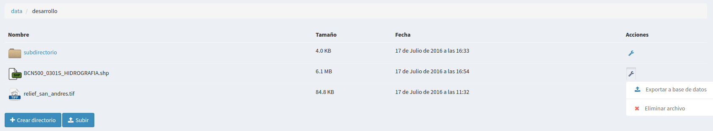

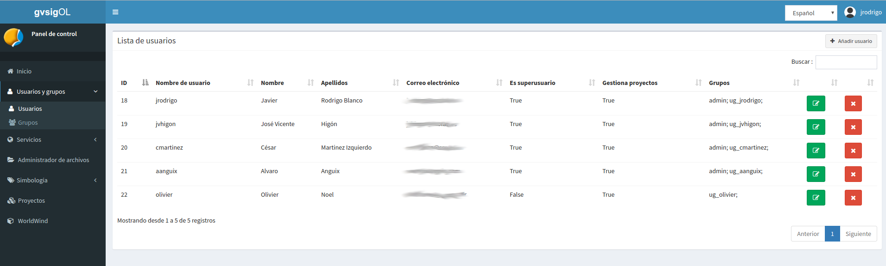

.. |100002010000007800000034950AFC78_png| image:: _static/images/100002010000007800000034950AFC78.png
    :width: 2.138cm
    :height: 0.84cm

.. |100002010000077D0000033D6E41A0FF_png| image:: _static/images/100002010000077D0000033D6E41A0FF.png
    :width: 17cm
    :height: 7.35cm

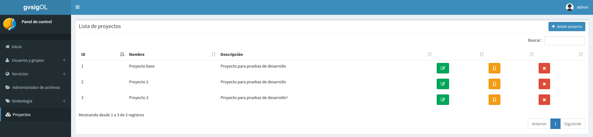

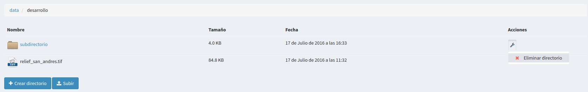

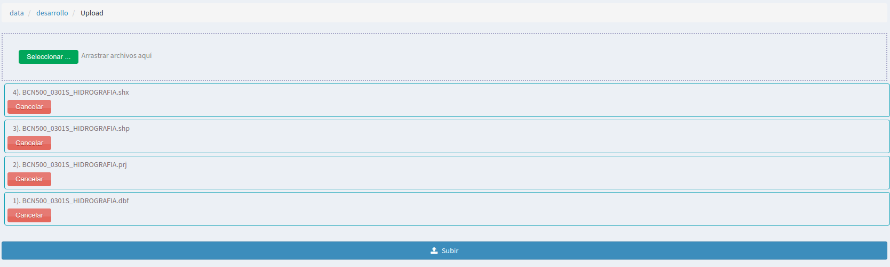

.. |1000020100000688000002F9594D7B60_png| image:: _static/images/1000020100000688000002F9594D7B60.png
    :width: 17cm
    :height: 7.736cm

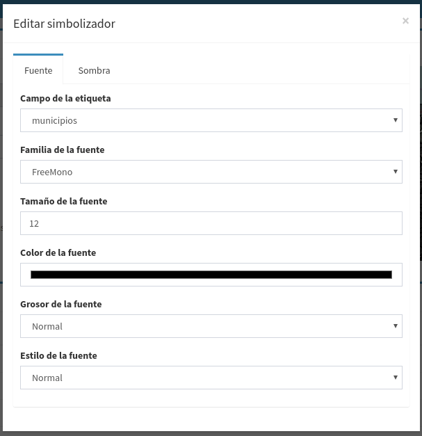

.. |100002010000077F0000021613BD9367_png| image:: _static/images/100002010000077F0000021613BD9367.png
    :width: 15.381cm
    :height: 4.094cm

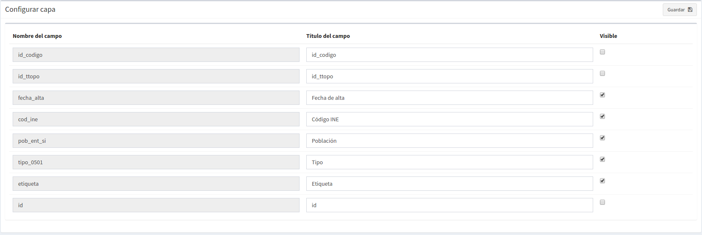

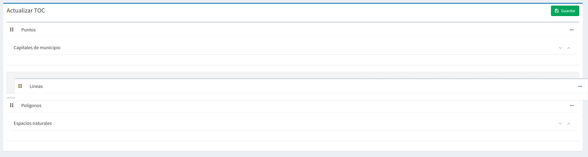

.. |1000020100000774000001CFFA76A596_png| image:: _static/images/1000020100000774000001CFFA76A596.png
    :width: 17cm
    :height: 4.124cm

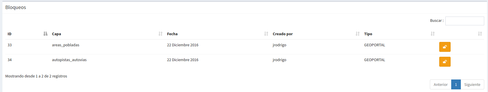

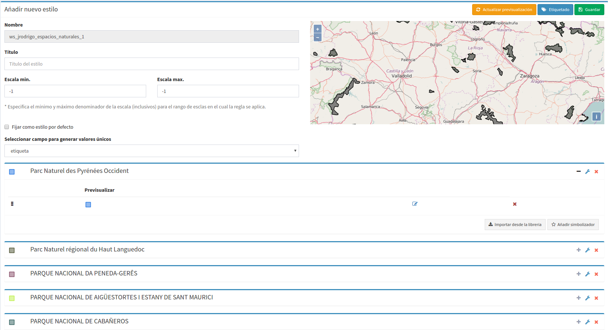

.. |1000020100000771000002496D60121E_png| image:: _static/images/1000020100000771000002496D60121E.png
    :width: 16.653cm
    :height: 4.68cm

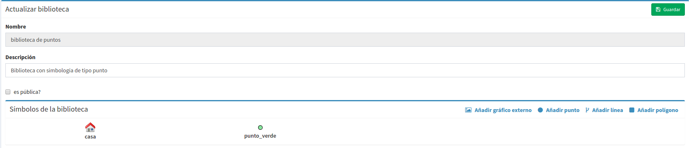

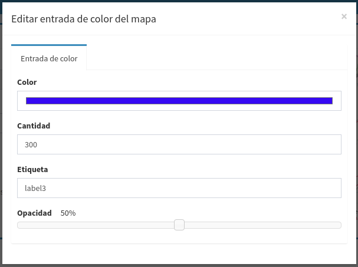

.. |100002010000077F0000020617E4212F_png| image:: _static/images/100002010000077F0000020617E4212F.png
    :width: 17.321cm
    :height: 5.232cm

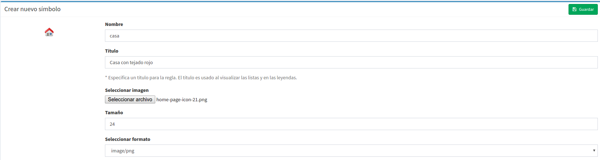

.. |1000020100000780000001FE4D05E918_png| image:: _static/images/1000020100000780000001FE4D05E918.png
    :width: 17cm
    :height: 4.516cm

