4. Visor de mapas
=================

El visor de mapas es
la interfaz principal de la aplicación,
que permite conectar con los distintos servicios OGC desplegados en la instalación.

|100002010000077B000003C647F861F9_png|

Está formado por una serie de componentes los cuales están ubicados en una zona específica de la página web (
M
apa,
menú superior
,
panel de contenidos, controles
).

4.1 Menú superior
-----------------

En el menú superior encontramos en primer lugar el botón que nos permite mostrar u ocultar el panel lateral de contenidos

|100002010000078000000036FDAEDC02_png|

A continuación está el cuadro de búsqueda rápida. Desde aquí podremos encontrar localizaciones en el mapa en función de la configuración. La búsqueda puede estar configurada a nivel nacional o mundial.

Una vez introducida la cadena de búsqueda, nos aparece un listado con los posibles candidatos. Tendremos que seleccionar uno de estos candidatos y a continuación el mapa se centrará sobre su localización.

|100002010000047D00000225AEA9AD98_png|

En la parte derecha del menú superior tenemos en primer lugar el botón de impresión, que
nos permite exportar la vista actual del mapa a formato PDF.

|100002010000078000000036FDAEDC02_png|

Una vez seleccionada nos aparecerá un dialogo para que introduzcamos un título para el mapa que deseamos exportar.

|1000020100000392000000EBF2407808_png|

|10000201000006DE000003AE56DA29DB_png|
A continuación se generará un PDF con un layout predefinido.

Por último nos encontramos con el menú de sesión, desde el cual podremos cerrar la sesión o volver al panel de control.

|100002010000019500000120CFB6946A_png|

4.2 Panel de contenidos
-----------------------

El panel de contenidos se encuentra
en la parte izquierda del visor y está formad
o
por
3 pestañas: el árbol de capas, la leyenda y el panel de resultados.

|100002010000019200000036F8CC787C_png|

4.2.1 Árbol de capas
~~~~~~~~~~~~~~~~~~~~

El árbol de capas contiene la jerarquía de capas que ha sido definida desde la interfaz de administración para la aplicación que se está ejecutando.

El árbol de capas está formado por
grupos de capas y capas
. Los grupos de capas tienen como finalidad agrupar las capas que poseen rasgos comunes.

Se puede dividir las estructura del árbol en
2
regiones:

*   **Capas base: **
    Este grupo está formado por una serie de capas base que son definidas en tiempo de desarrollo, es decir, no se pueden gestionar desde el interfaz de administración. (OpenStreetMap, Bing, Google Maps, Ortofotos locales, capas de catastro, etc)

*   **Capas propias de la aplicación:**

    Está formado por el resto de grupos de capas que han sido definidas propiamente para la aplicación que se está ejecutando (Capas temáticas).

|100002010000018F0000027B4EF08D62_png|

Todas las capas (excepto las capas base predefinidas), disponen de un menú con una serie de acciones disponibles en función de la configuración.

|100002010000018000000116F984E814_png|

*Mostrar metadato*

La entrada
*“M*
*etadatos de la capa*
*”*
** **
del menú de acciones es un enlace al metadato de la capa que se encuentra en
*“Geonetwork”*
. Al sele
c
cionarla se abrirá una nueva ventana con el metadato de la capa.

|1000020100000767000002F2BCA73BF6_png|

*Tabla de atributos*

Si la capa dispone de un origen de datos vectorial aparecerá disponible la acción
*“*
*T*
*abla de atributos”*
.

Al seleccionar la acción se
abrirá una ventana
que contendrá la tabla de atributos de la capa.

La tabla de atributos ofrece una serie de funcionalidades:

*   **Seleccionar elementos sobre el mapa:**
    Para seleccionar una elemento sobre el mapa seleccionaremos la fila de la tabla que deseemos y a continuación presionaremos el botón
    *“*
    *Zoom a la selección*
    *”*
    , que se encuentra en la parte superior izquierda de la tabla. Para limpiar la selección de un elemento presionaremos el botón
    *“Limpiar selección”*
    .

*   **Filtro de búsqueda rápida:**
    La tabla de atributos nos ofrece también la funcionalidad de búsqueda rápida. Para ello introduciremos en el cuadro de búsqueda que se encuentra en la parte superior derecha el patrón que deseamos buscar. Automáticamente la tabla se irá actualizando con los campos que cumplan con el patrón de búsqueda introducido.

|100002010000026C000002617381D7BC_png|

La tabla de atributos muestra los resultados paginados de 10 en 10. Para navegar entre los resultados en la parte inferior de la tabla se muestra un navegador de páginas.

*Editar capa*

** Esta acción requiere que el usuario pertenezca a un grupo con permisos de escritura.

Para poner una capa en modo de edición seleccionamos en el menú de acciones la entrada
*“*
*Editar capa*
*”*
**. **

Al comenzar la edición se añade al mapa una nueva barra de herramientas de edición, en función del tipo de geometría de la capa ya sea
**punto, linea o polígono**
.

|10000201000003690000017E0831F857_png|

La barra de herramientas de edición dispone de
4
herramientas:

|100002010000002900000078CBF75D2B_png|

**Añadir un nuevo elemento a la capa**

Para añadir un nuevo elemento seleccionamos la herramienta de dibujo y a continuación procedemos a dibujar el elemento sobre el mapa (punto, linea o polígono). Una vez dibujado elemento aparecerá en la barra de navegación un formulario para que introduzcamos los valores de los atributos del elemento.

Una vez hallamos rellenado el formulario seleccionaremos el botón
* “Guardar”*
**. **
En ese momento la nueva geometría y sus atributos asociados serán persistidos en la base de datos.

Si presionamos el botón
*“Cancelar”*
la geometría será eliminada del mapa y se cerrará el formulario.

|10000201000001900000024A97752C4D_png|

**Modificar un elemento existente**

Seleccionaremos la herramienta de modificar elementos en la barra de edición. A continuación seleccionaremos el elemento sobre el mapa. Una vez hayamos seleccionado el elemento podremos editar su geometría seleccionando y moviendo
los vértices en caso de ser linea o polígono, o desplazando el elemento en caso de ser un punto.

También se desplegará en la barra de navegación un formulario con el valor de los atributos del elemento.

Una vez hayamos terminado de modificar la geometría y/o datos alfanuméricos del elemento procederemos como en el apartado anterior seleccionando el botón
*“Guardar” o “Cancelar”*
.

**Eliminar un elemento existente**

Seleccionaremos la herramienta de eliminar elementos en la barra de edición. A continuación seleccionaremos el elemento que deseamos eliminar sobre el mapa. Una vez hayamos seleccionado el elemento se desplegará en la barra de navegación un formulario con el valor de los atributos del elemento.

En esta ocasión dispondremos del botón
*“Eliminar”*
,
el cual eliminará el elemento del mapa y de la base de datos.

**Modificar opacidad**

Para modificar la opacidad de la capa seleccionaremos el valor de opacidad deseado en el slider del menú de acciones de la capa.

|100002010000015F000000331DC3D460_png|

4.2.2 Leyenda
~~~~~~~~~~~~~

Para ver la leyenda del mapa actual seleccionaremos la pestaña
*“Leyenda”*
en la barra de navegación.

|100002010000018E0000017A4BB219AE_png|

El panel de leyenda muestra la leyenda de las capas que hay activas y visibles en el momento de la consulta.

4.3 Controles del mapa
----------------------

4.3.1 Controles de zoom
~~~~~~~~~~~~~~~~~~~~~~~

Los controles de zoom que se encuentran en la barra de herramientas, permiten alejar o acercar la visualización del mapa.

|10000201000000220000004205B1E582_png|

Además de con los controles de zoom también podremos acercar o alejar la visualización con la rueda del ratón.

4.3.2 Información en el punto
~~~~~~~~~~~~~~~~~~~~~~~~~~~~~

La herramienta de información en el punto, nos permite obtener la información en una coordenada determinada de las capas que hay visibles.

|1000020100000029000000AE45648EF1_png|

Para obtener la información en el punto seleccionamos la herramienta y hacemos click en el mapa en la ubicación deseada.
Se mostrará un popup en las coordenadas seleccionadas donde aparecerá un listado de elementos que intersectan
.

Si deseamos ampliar la información seleccionaremos el elemento y nos mostrará información extendida en el panel de resultados.

|100002010000037F0000029CF6E7624E_png|

En caso de que se encuentre visible la capa de “Catastro” aparecerá dentro del popup el link con la referencia catastral de la parcela.

4.3.3 Medir longitud
~~~~~~~~~~~~~~~~~~~~

Esta herramienta permite medir la longitud entre dos o más puntos.

|1000020100000029000000AE45648EF1_png|

Para comenzar a medir hacemos click en el punto de origen y a continuación nos desplazamos al punto destino (o punto intermedio). Para terminar hacemos doble click sobre el punto destino.

|100002010000041A000001D1201E6DEA_png|

4.3.4 Medir área
~~~~~~~~~~~~~~~~

Esta herramienta permite medir el área contenida en un pol
í
gono.

|1000020100000029000000AE45648EF1_png|

Para comenzar a medir hacemos click en el punto de origen y a continuación dibujaremos el resto de puntos que definen el área a medir. Para terminar realizaremos doble click sobre el punto que cierra el polígono.

|10000201000003D0000002048F3A9C90_png|

4.3.5 Buscar por coordenadas
~~~~~~~~~~~~~~~~~~~~~~~~~~~~

La modalidad de búsqueda inversa nos permite buscar una localización a partir de unas coordenadas dadas.

|1000020100000029000000AE45648EF1_png|

Para proceder a la búsqueda inversa, en primer lugar debemos seleccionar el sistema de referencia en el que introduciremos las coordenadas. Los sistemas de coordenadas vendrán predefinidos para cada aplicación.

Una vez hayamos seleccionado el sistema de coordenadas, introduciremos los valores para la longitud y latitud en caso de ser un sistema con coordenadas geográficas o X/Y
en caso de ser un sistema con coordenadas proyectadas.

|1000020100000387000001286832345E_png|

4.3.6 Posición actual
~~~~~~~~~~~~~~~~~~~~~

|1000020100000029000000AE45648EF1_png|
P
ermite ubicar nuestra posición actual y centrar el mapa sobre ella. Requiere que aceptemos los permisos que nos solicitará el navegador.

4.3.7 Escala numérica
~~~~~~~~~~~~~~~~~~~~~

S
e encuentra situada en la parte inferior izquierda del mapa.

|10000201000000870000002B34D59522_png|

4.3.8 Posición del ratón
~~~~~~~~~~~~~~~~~~~~~~~~

M
uestra la posición del ratón en el sistema de coordenadas seleccionado.

Podremos cambiar entre cualquiera de los sistemas de coordenadas configurados para la aplicación, seleccionando desde el desplegable.

|10000201000000E30000007E48C8E0BB_png|

|10000201000000CD00000028216587DE_png|

4.3.9 Mapa de referencia
~~~~~~~~~~~~~~~~~~~~~~~~

E
l mapa de referencia se encuentra situado en la parte inferior derecha del mapa, y nos permite mantener una referencia de nuestra posición cuando nos encontramos a niveles de zoom bajos.

|10000201000001B900000120CCEE3BF0_png|

4.4 Proyectos públicos
----------------------

Para que un proyecto sea público deberá haberse configurado como tal desde el panel panel de control por un usuario con permisos.
Todas las capas que no se hayan asignado a ningún grupo de lectura o escritura podrán ser visualizadas desde
un proyecto público
.

Para acceder a
un proyecto
público se puede realizar desde la página de inicio.

|10000201000004910000039CD1D29D7B_png|

,
o a través de una URL del tipo:

`https://app.gvsigonline.com/gvsigonline/core/select_public_project/ <https://app.gvsigonline.com/gvsigonline/core/select_public_project/>`_

Si solo hay configurado un proyecto como público, se accederá al mismo directamente. En caso de haya más de uno se accederá a un listado donde se mostrarán los proyectos públicos disponibles.

|100002010000073C000001E78E19238B_png|

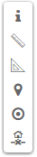

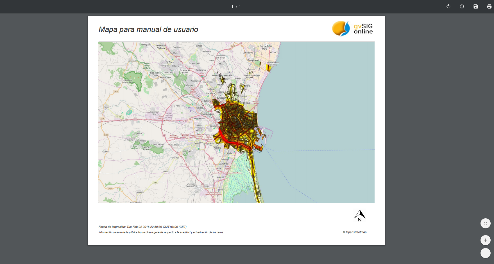

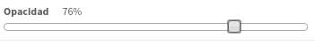

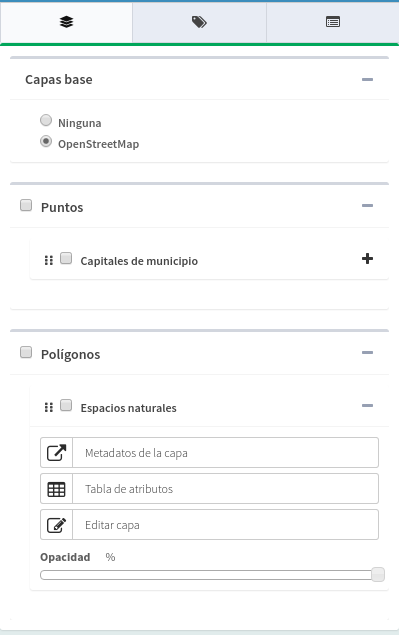

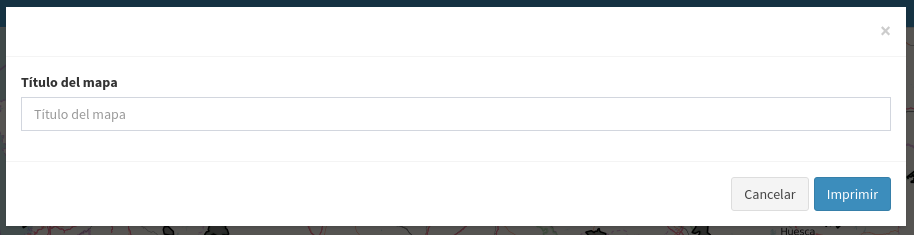

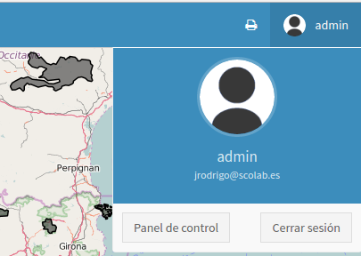

.. |100002010000018E0000017A4BB219AE_png| image:: _static/images/100002010000018E0000017A4BB219AE.png
    :width: 7.061cm
    :height: 6.754cm

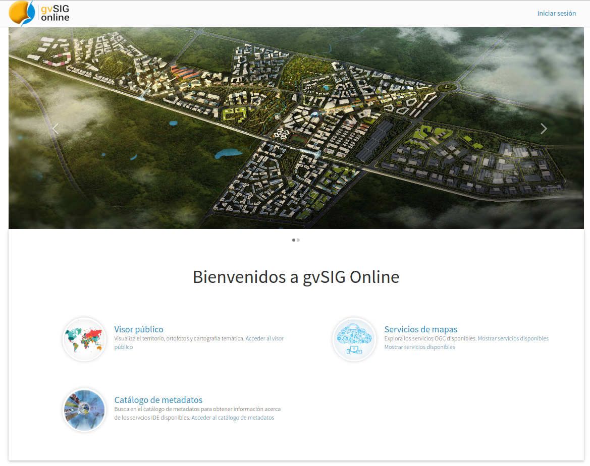

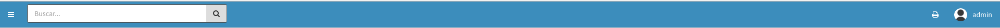

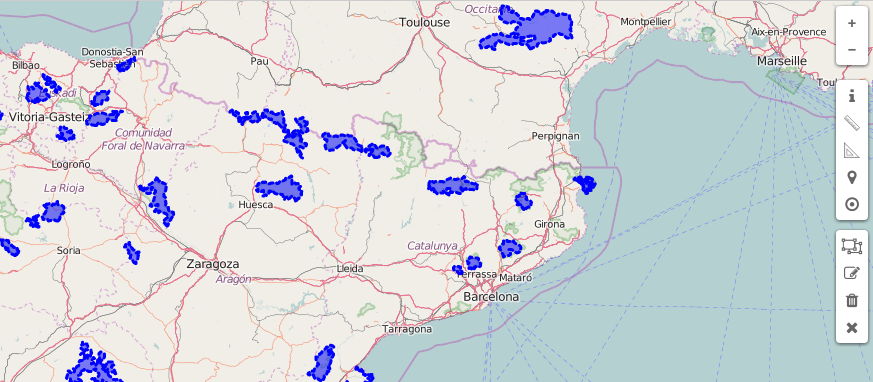

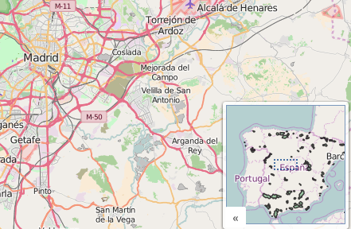

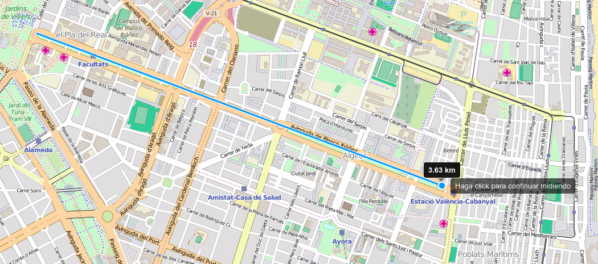

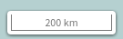

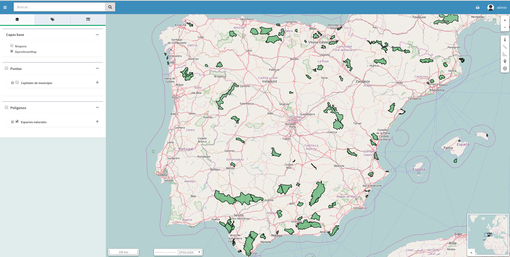

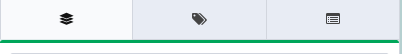

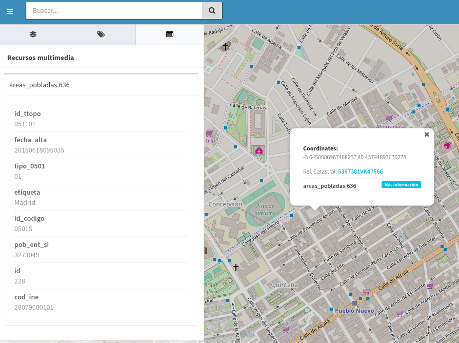

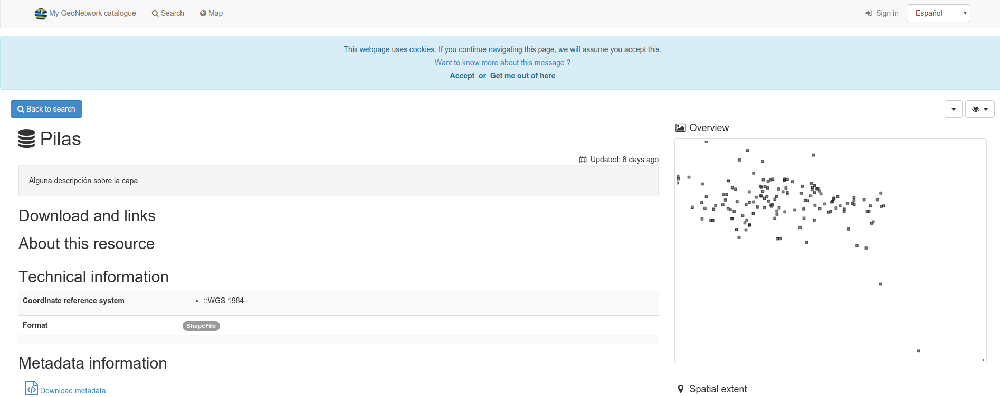

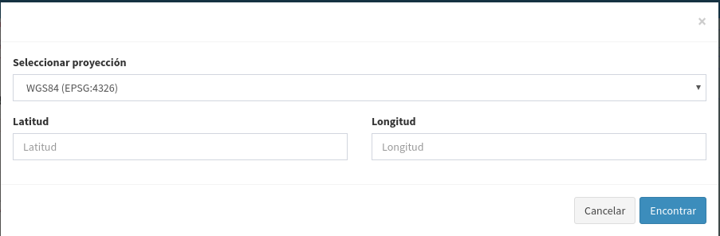

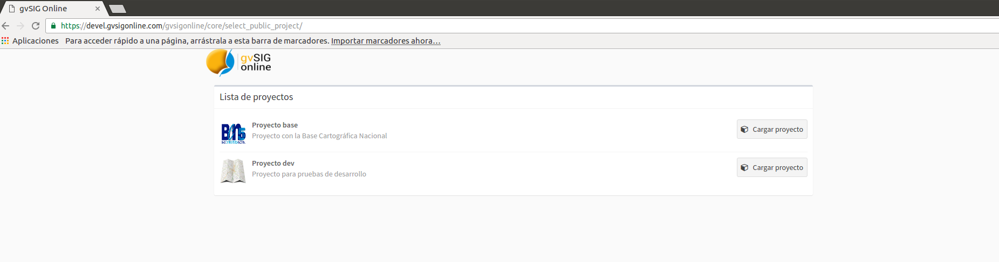

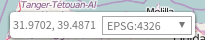

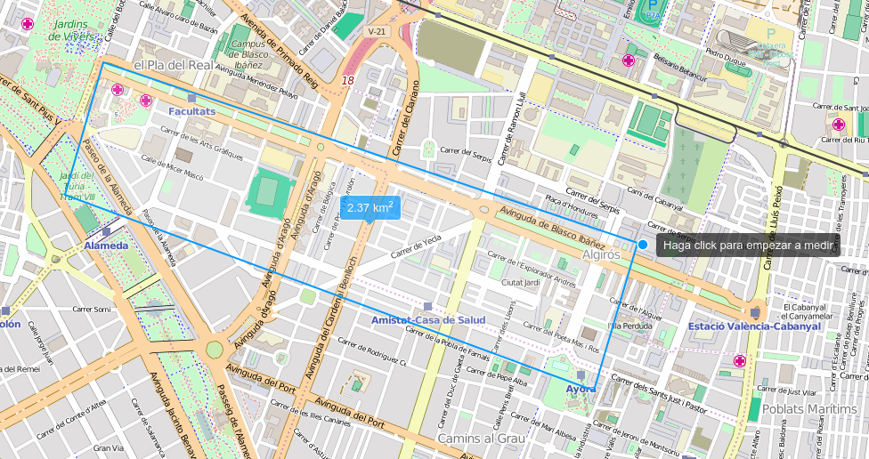

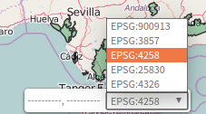

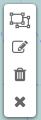

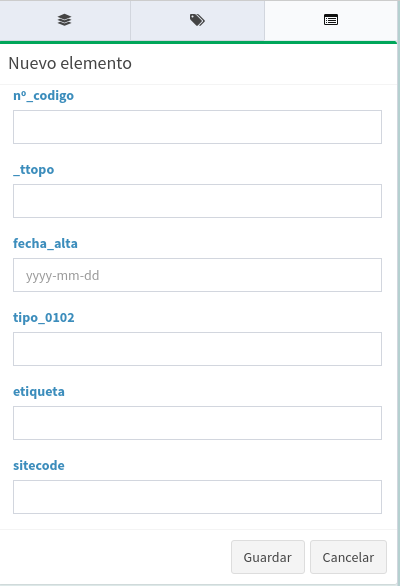

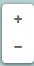

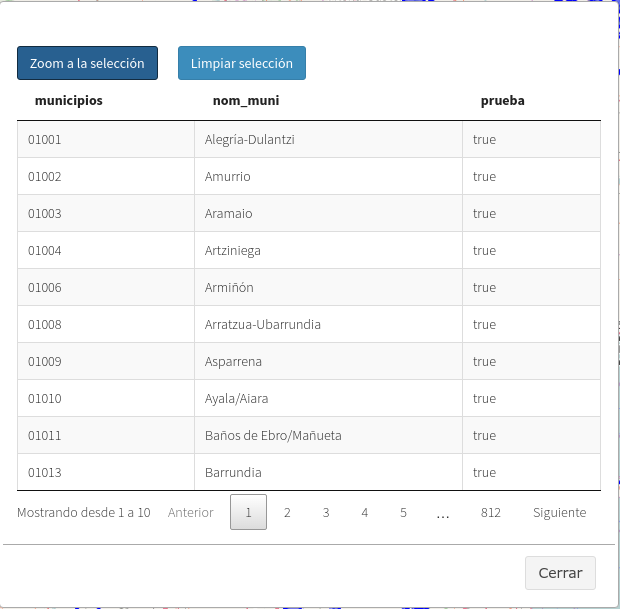

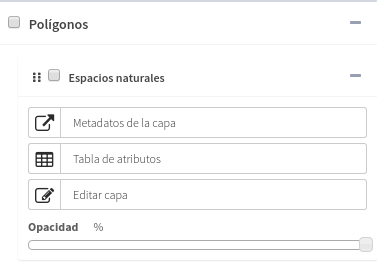

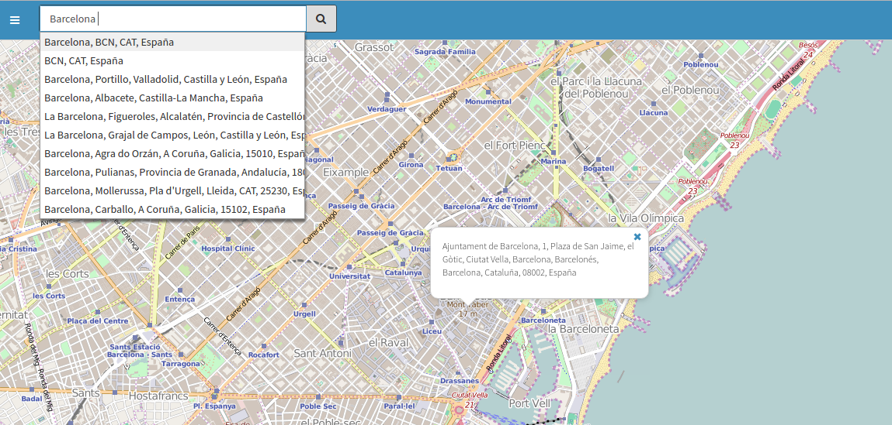

