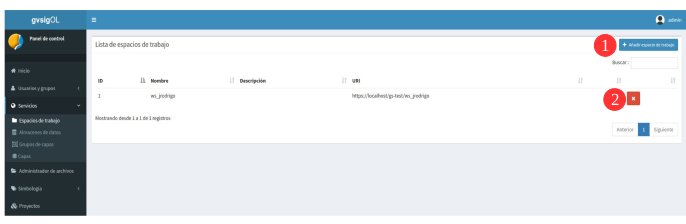
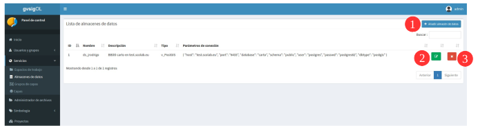
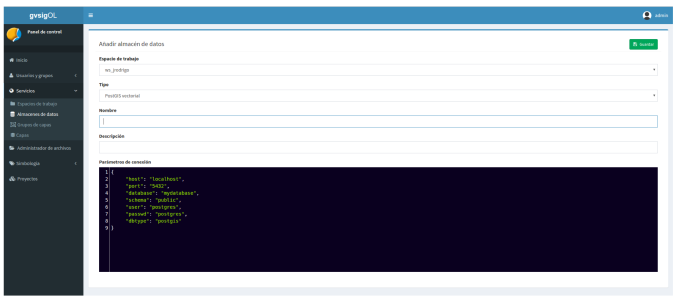
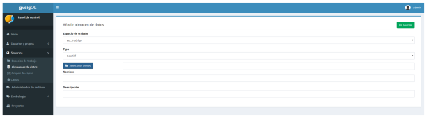
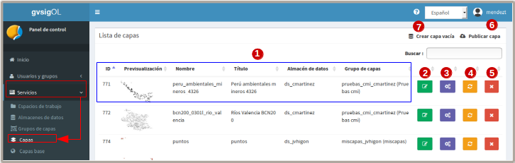
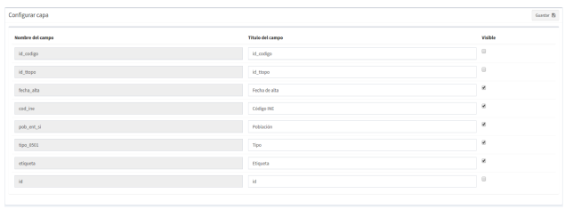
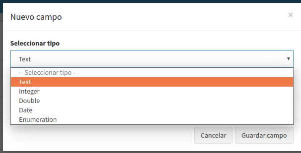
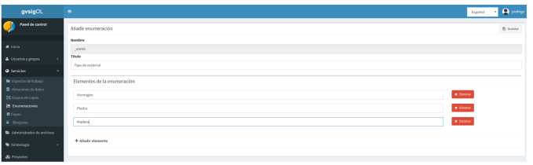

2. Servicios
======================

2.1 Crear y eliminar espacios de trabajo
------------------------------------------
Puede crear(1) y eliminar(2) espacios de trabajo desde el listado de espacios de trabajo. Si elimina un espacio de trabajo, se eliminarán de gvSIG Online todos los almacenes de datos y capas asociadas.

Para crear un espacio de trabajo, proporcione un nombre y una descripción. El nombre del espacio de trabajo no puede contener espacios, signos de puntuación ni caracteres especiales como la *"ñ"*. 
Habitualmente no es necesario modificar la URL de los servicios (generada automáticamente).

2.2 Crear, modificar y eliminar almacenes de datos
--------------------------------------------------
Puede añadir(1), actualizar(2) y eliminar(3) almacenes de datos desde el listado de almacenes de datos.

Es importante entender que para poder añadir un almacén de datos, debemos partir de una fuente de datos que exista previamente. 
Por ejemplo, para poder añadir un almacén de datos de tipo PostGIS vectorial, la base de datos espacial debe existir previamente. 
De esta forma, los que estamos haciendo es registrar en gvSIG Online (y en Geoserver) los parámetros de conexión a dicha base de datos. 
De la misma forma, para añadir un almacén de datos de tipo ráster, el fichero ráster debe existir previamente en el servidor
(en este caso estamos registrando en gvSIG Online la ruta a dicho fichero ráster).

En el formulario de creación de almacén de datos deberemos seleccionar el espacio de trabajo al que pertenecerá, el tipo de almacén, 
el nombre (sin caracteres especiales) y los parámetros de conexión.

El formulario incluye diversos ejemplos de parámetros de conexión para cada tipo de almacén.

En caso de que el almacén de datos sea de tipo raster el formulario cambiará y nos permitirá seleccionar el fichero que compondrá el almacen.

Al abrir el dialogo de seleccionar archivo, este nos mostrará un ventana con el gestor de ficheros, desde donde podremos seleccionar el archivo raster que habremos subido previamente.

.. image:: ../images/ds4.png
   :align: center

.. note::
   	La eliminación de un almacén de datos elimina todas las capas asociadas al almacén. 
   	
	Por contra, no se eliminará la fuente de datos asociada (la base de datos espacial o el fichero ráster correspondiente).

2.3 Publicar, crear, modificar y eliminar capas
-----------------------------------------------
Desde el listado de capas podemos acceder a la gestión de las mismas. Podemos publicar capas existentes en almacenes de datos(1), o crear capas vacías(2) definiendo de forma manual los campos.

Sobre cada una de las capas podemos realizar las siguientes operaciones:

*   **Actualizar capa (3):** Desde donde se puede modificar el título grupo al que pertenece la capa, propiedades (visible, consultable, etc …), así como los permisos de lectura y escritura de la capa.

*   **Configurar capa (4):** Podemos definir alias a los nombres de los campos, así como definir que campos serán visibles para las herramientas del visor (herramienta de información, tabla de atributos, etc …).

*   **Limpiar caché (5):** Limpia la caché de la capa en el servidor de mapas. Muy útil cuando realizamos cambios en la simbología de la capa.

*   **Eliminar capa (6):** Elimina la capa y estilos asociados.

2.3.1 Publicar capa
~~~~~~~~~~~~~~~~~~~
Para publicar una capa existente en un almacén de datos, seleccionaremos el botón *"Publicar capa"*, una vez accedamos a la vista de publicación aparecerá el siguiente formulario.

.. image:: ../images/publish1.png
   :align: center
   
Los pasos para publicar una capa son los siguientes:

*	Seleccionamos el almacén de datos donde se encuentra la capa que desamos publicar.

*	A continuación seleccionamos en el desplegable el recurso (Solo aparecen los recursos que aún no han sido publicados).

*	Introducimos un titulo para la capa.

*	Seleccionamos el grupo de capas al cual queremos asignar la capa (debe existir previamente).

*	Seleccionamos las propiedades de la capa en el visor (visible, cacheada, imagen simple, consultable).

*	Si lo deseamos podemos introducir una descripción de la capa.

*	A continuación seleccionamos el botón *"Sgiuiente"*, lo que nos llevará a la vista de permisos.

Por último aplicaremos los permisos de lectura y escritura a la capa.

.. image:: ../images/permissions.png
   :align: center
   
.. note::
   	Por defecto todas las capas pueden ser leídas por cualquier usuario, pero solo pueden ser escritas por los usuarios con rol de **superusuario**.
   	
2.3.2 Crear capa vacía
~~~~~~~~~~~~~~~~~~~~~~
Para crear una capa vacía, seleccionaremos el botón *"Crear capa vacía"*, una vez accedamos a la vista aparecerá el siguiente formulario.

.. image:: ../images/create_layer1.png
   :align: center
   
Los pasos para crear una capa vacía son los siguientes:

*	Seleccionamos el almacén de datos donde se creará la capa (será un almacén de datos PostGIS).

*	Introducimos un nombre para la capa.

*	Introducimos un título para la capa.

*	Seleccionamos en el desplegable el tipo de geometría (Punto, Multipunto, Linea, MultiLinea, Polígono, MultiPolígono).

*	Seleccionamos en el desplegable el sistema de referencia de coordenadas (Aparecerán los habilitados para la aplicación).

*	Añadimos uno o más campos para la capa, para ello seleccionamos el botón *"Añadir campo"* y se nos mostrará un diálogo donde podremos seleccionar el tipo de campo y un nombre para el mismo.

   
.. note::
   Los tipos de campo soportados son: Texto, Entero, Doble, Fecha, Enumeración (se han de definir previamente)

*	Seleccionamos las propiedades de la capa en el visor (visible, cacheada, imagen simple, consultable).

*	Si lo deseamos podemos introducir una descripción de la capa.

*	A continuación seleccionamos el botón *"Siguiente"*, lo que nos llevará a la vista de permisos.

Por último aplicaremos los permisos de lectura y escritura a la capa.

.. image:: ../images/permissions.png
   :align: center
   
.. note::
   	Por defecto todas las capas pueden ser leídas por cualquier usuario, pero solo pueden ser escritas por los usuarios con rol de **superusuario**.

2.4 Gestión de bloqueos
-----------------------
Podemos consultar los bloqueos activos desde el listado de bloqueos, así como desbloquear capas bloqueadas.

.. image:: ../images/block1.png
   :align: center

2.5 Crear, modificar y eliminar enumeraciones
---------------------------------------------
Puede añadir(1), actualizar(2) y eliminar(3) enumeraciones seleccionando la vista con el listado de enumeraciones desde el menú principal.

.. image:: ../images/enum1.png
   :align: center

Desde el formulario de enumeraciones podremos añadir o eliminar los items que forman parte de la enumeración.

