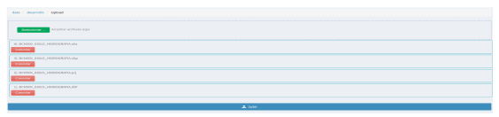
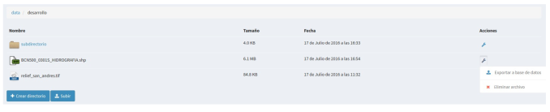
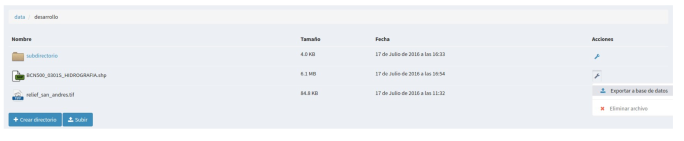
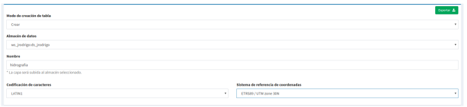

3. Archivos
=====================

3.1 Crear directorios
---------------------

Podremos crear todos los subdirectorios que deseemos para organizar nuestros archivos dentro de un directorio raíz. 
Para ellos seleccionaremos el botón *“crear directorio”*, e introduciremos el nombre del nuevo directorio.

.. image:: ../images/dirs2.png
   :align: center

Con esto se habrá creado un nuevo subdirectorio dentro del directorio raíz.

3.2 Operaciones sobre archivos
------------------------------
En la parte derecha de cada archivo o directorio tendremos un menú desplegable con las operaciones que podemos realizar sobre el mismo. En caso de subdirectorios, nos aparecerá la opción “
*eliminar directorio”*.

Si la seleccionamos eliminaremos el subdirectorio y todo su contenido.

Actualmente los formatos soportados por el administrador de archivos son *"Shapefile y GeoTIFF"*.

Los archivos se pueden subir seleccionando uno a uno o comprimidos en formato zip.

El formato shapefile, es un formato multiarchivo y tienen un conjunto de archivos requerido para su correcto funcionamiento. Los archivos requeridos tienen las siguientes extensiones:

*   **shp:** Almacena las entidades geométricas de los objetos.

*   **shx:** Almacena el índice de las entidades geométricas.

*   **dbf:** base de datos en formato dBASE, donde se almacena la información de los atributos.

Además de estos tres archivos requeridos, opcionalmente se pueden utilizar otros para mejorar el funcionamiento en las operaciones de consulta a la base de datos, información sobre la proyección cartográfica o almacenamiento
de metadatos. Entre ellos destaca:

*   **prj:** Es el archivo que guarda la información referida al sistema de coordenadas en formato WKT

Por tanto ya sea seleccionando uno a uno o comprimidos tendremos especial atención en que todos ellos estén presentes.

Una vez subido los archivos nos aparecerá en el directorio donde lo hayamos subido, aunque únicamente veremos el archivo con extensión *"SHP"*.

Para eliminar el archivo shapefile seleccionaremos en el menú de operaciones la opción *“eliminar archivo”*, esto borrará en el servidor tanto el archivo shp como el resto de archivos asociados (.shx, .dbf, .prj, …).

Entre las operaciones que podemos realizar sobre los archivos de tipo shapefile, se encuentra la de *“Exportar a base de datos”*, para ello seleccionamos la operación en el menú de operaciones del archivo.

A continuación se mostrará el formulario con los parámetros necesarios para realizar la exportación.

En el formulario deberemos elegir el almacén de datos de destino (de tipo base de datos PostGIS), así como especificar el sistema de referencia de coordenadas (CRS) y la codificación de caracteres de la capa a subir.

También podremos especificar si deseamos crear una nueva tabla en el almacén de datos, añadir registros o sobreescribir una tabla existente.

Las dos últimos opciones deben utilizarse con cuidado, ya que borrarán o modificarán datos existentes.

GeoTIFF es un estandar de metadatos de domino público que permite que información georreferenciada sea encajada en un archivo de imagen de formato TIFF.

La información adicional incluye el tipo de proyección, sistemas de coordenadas, elipsoide y datum y todo lo necesario para que la imagen pueda ser automáticamente posicionada en un sistema de referencia espacial.

Los archivos GeoTIFF disponen de una extensión .tif o .tiff.

Para subirlos procederemos de la misma forma que con los archivos shapefile, solo que en este caso será un único archivo.