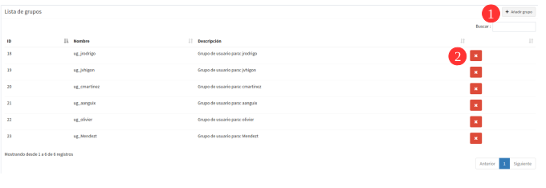

1. Usuarios y grupos de usuario
========================================

1.1 Crear, modificar y eliminar usuarios
----------------------------------------
La gestión de usuarios y grupos se lleva a cabo desde la entrada *"Usuarios y grupos"* que se encuentra disponible en el menú del panel de control:

.. image:: ../images/user_group1.png
   :align: center

Desde la vista de usuarios podemos ver el listado de usuarios disponibles, así como crear(1), actualizar(2) o eliminar usuarios(3).

Los campos que aparecen en el formulario de usuarios son los siguientes:

*   **Nombre** y **apellidos** reales del usuario

*   **Nombre de usuario: (Obligatorio)** Alias con el que se accederá al sistema

*   **Contraseña**

*   **Es superusuario**: Indicamos si el usuario implementará el rol de superusuario, con lo que tendrá permisos totales sobre la plataforma

*   **Puede gestionar proyectos**: Indicamos si el usuario implementa el rol de gestión

.. image:: ../images/user_group2.png
   :align: center

En la parte inferior del formulario de usuarios, aparece un listado con los grupos disponibles. Si asignamos el usuario a algún grupo, este podrá acceder a las entidades definidas en el grupo (proyectos, capas, ...).

1.2 Crear y modificar grupos de usuario
---------------------------------------
De la misma manera, desde la vista de grupos podemos ver el listado de grupos disponibles, así como crear(1) o eliminar grupos(2).

Los campos que aparecen en el formulario de grupos son los siguientes:

*   **Nombre** del grupo

*   **Descripción** del grupo

.. note::
   Actualmente no está soportada la edición de grupos de usuarios. Si se desea cambiar un grupo de usuarios es necesario eliminarlo y crearlo de nuevo.