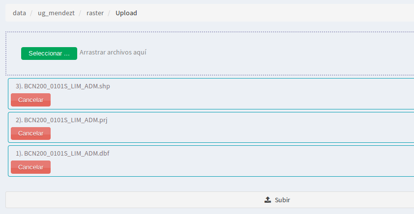
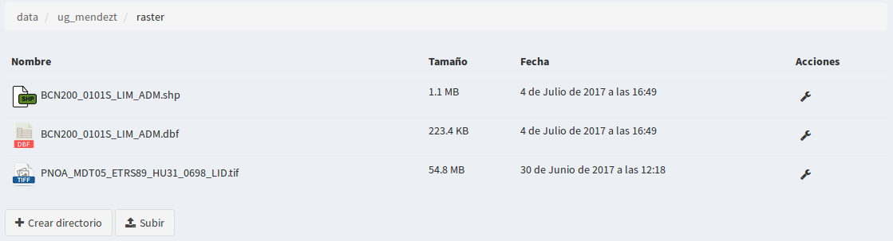
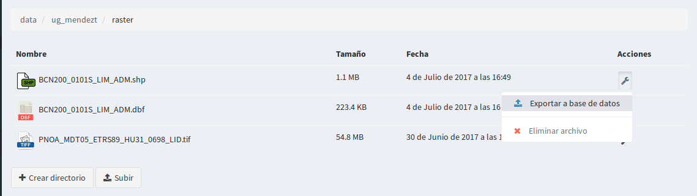
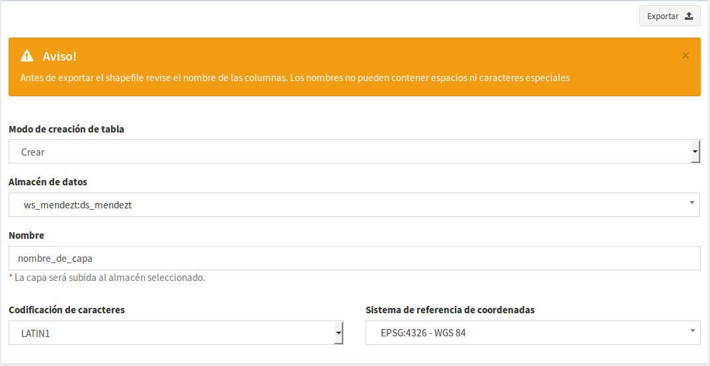

4. Administrador de archivos
============================

4.1 Crear directorios
---------------------

Podremos crear directorios para organizar nuestros archivos dentro de un directorio raíz. 
Para ellos seleccionaremos el botón *“crear directorio”*, e introduciremos el nombre del nuevo directorio.

.. image:: ../images/dirs2.png
   :align: center

Con esto se habrá creado un nuevo subdirectorio dentro del directorio raíz.

- Se pueden crear tantos directorios como subdirectorios se quiera.

- Actualmente los formatos soportados por el administrador de archivos son *"Shapefile y GeoTIFF"*.

- Los directorios solo tienen la opción para ser 'eliminados', en la parte derecha saldrá una herramienta en forma de *'llave'* al hacer click, saldrá la opción *"eliminar directorio”*, sí se selecciona se borrará el directorio y todo su contenido.

.. note::
       Estará restringido la opción de eliminar, para aquellos directorios que contengan ficheros '.tif' que estan siendo usados en algún almacén de datos.

4.2 Subir ficheros shapefile o GeoTiff
--------------------------------------
Esta opción nos permite cargar los ficheros (archivos) tiff o shape en un directorio, éste último para posteriormente ser exportado a algún almacén de la BD.

El formato shapefile, es un formato multiarchivo y tienen un conjunto de ficheros requeridos para su correcto funcionamiento.

Estos ficheros tienen las siguientes extensiones:

*   **shp:** Almacena las entidades geométricas de los objetos.

*   **shx:** Almacena el índice de las entidades geométricas.

*   **dbf:** base de datos en formato dBASE, donde se almacena la información de los atributos.

Además de estos tres archivos requeridos, opcionalmente se pueden utilizar otros para mejorar el funcionamiento en las operaciones de consulta a la base de datos, información sobre la proyección cartográfica o almacenamiento
de metadatos. Entre ellos destaca:

*   **prj:** Es el archivo que guarda la información referida al sistema de coordenadas en formato WKT.

Para que se exporte de forma correcta a la BD, basta con subir los tres primeros ficheros. Los pasos para subir son:

- Nos ubicamos desde un directorio o subdirectorio donde queramos añadirlo
- Hacer click sobre el botón *'subir'*
- En la nueva ventana pinchamos sobre el botón 'seleccionar', desde allí se podrá navegar por nuestros directorios locales del ordenador y seleccionar los tres ficheros shapefile (shp, dbf, shx) o el fichero (tif). También está la opción de arrastrar los archivos.
- Los archivos se pueden subir seleccionando uno a uno o comprimidos en formato zip.
- Pinchamos nuevamente sobre el botón 'subir' y en la ventana se muestra el progreso de la carga de archivos.

- Una vez subido los ficheros shapefile nos aparecerá en el directorio donde lo hayamos cargado, aunque únicamente veremos los archivos con extensión *"shp"* y el *"dbf"*.
- En el caso del raster, el archivo que se muestra es el  *"tif"*

4.3 Exportar shapefile al almacén de datos
------------------------------------------
Entre las operaciones que podremos realizar sobre los archivos de tipo shapefile, se encuentra la de *“Exportar a base de datos”* y *“eliminar archivo”*, éste último borrará en el servidor tanto el fichero 'shp' como el resto de archivos asociados (.shx, .dbf, .prj, …).

Para la **opción exportar** seleccionamos la operación en el menú de operaciones del archivo **"shp"**.

A continuación se mostrará el formulario con los parámetros necesarios para realizar la exportación.

En el encabezado del formulario aparece un mensaje de advertencia:

" *Antes de exportar el shapefile revise el nombre de las columnas. Los nombres no pueden contener espacios ni caracteres especiales* "

con esto, se le informa previamente al usuario que el fichero a exportar debe tener un mínimo de características para que la BD lo pueda reconocer y luego el sistema lo publique correctamnete. Es importante también que el usuario tenga claro, su SRC, codificación de caracteres y cumpla con la topología correcta de un fichero vectorial.

- **Modo de creación de tabla**: Existen tres formas de exportar la tabla a la BD
 
   * 1- **Crear:** Esta opción es la más común cuando se exporta una capa por primera vez, es decir, que no existe aún en la BD.   
   * 2- **Añadir:** Esta opción es usada cuando la capa ya existe en la BD y se quiere añadir más registros sobre la misma. En este caso la estructura de la tabla que se está exportando debe ser exactamente igual a la de la capa que está en el almacén de la BD (incluso debe indicarse en la casilla del nombre, el 'nombre_de_capa' exacto al de la BD. Es importante tambien considerar que el sistema no discrimina la duplicidad de registros entre ambas capas, es decir, el añadirá todo lo que encuentre en la tabla a exportar. Por esta razón, si se usa esta opción se recomienda usar la tabla solo con los registros nuevos que se quieran sumar a la capa existente de BD, así se evitará duplicidad en los registros. 
   * 3- **Sobreescribir:**  Como su nombre los indica es para 'sobreescribir' o 'reemplazar' una capa que ya exista en la BD por la nueva que se está exportando. En este caso hay que tener cuidado porque la capa del almacén a reemplazar automáticamente dejará de existir y en su lugar estará la tabla que se está exportando. Para está opción también debe indicarse en 'la casilla del nombre':  el nombre de la capa exactamente igual a como esta almacenada en la BD.
  

- **Almacén de datos de destino** se debe seleccionar el almacén donde se desea añadir la tabla y debe ser de tipo Postgis. El sistema muestra solo los almacenes disponibles (son esquemas que deben existir en la BD y se conectan con el sistema mediante los parámetros de conexión cuando se crea un almacén de datos tipo postgis )

- **nombre** se indica el nombre de la tabla como se almacenerá en la BD, debe estar siempre en minúsculas, sin caracteres especiales y sin espacios vacíos.

- **Sistema de referencia de coordenadas (CRS)**  el sistema contiene todos los EPSG de la tabla *'Spatial_ref_sys'* y el usuario podrá asignar el SRC que corresponda a la tabla. Mediante el buscador rápido se podrá tipiar el código EPSG o el nombre.

- **Codificación de caracteres**  Es la codificación de caracteres con que se generó el fichero shapefile. Se podrá elegir entre un combo que se despliega, los más usados son 'Latin1' para windows y 'utf-8' para linux.

.. note::
       En el caso que no se tenga claro cuál es la codificación y una vez exportado y publicado, los atributos alfanuméricos de la capa se muestren con caracteres especiales, siempre se podrá venir a esta opción y volver a exportar la capa con la opción 'Sobreescribir' y cambiar de codificación para que el sistema muestre los atributos alfanuméricos correctamente.

Completado el formulario, se pincha sobre **'exportar'** y la capa ya estará disponible para ser publicada desde la entrada de *'servicios'* - *'capa'*

4.4. Exportar GeoTIFF
---------------------
Los GeoTIFF es un estandar de metadatos de domino público que permite que información georreferenciada sea encajada en un archivo de imagen de formato TIFF.

- La información adicional incluye el tipo de proyección, sistemas de coordenadas, elipsoide y datum y todo lo necesario para que la imagen pueda ser automáticamente posicionada en un sistema de referencia espacial.

- Los archivos GeoTIFF disponen de una extensión .tif o .tiff.

- Para subirlos al directorio procederemos de la misma forma que con los archivos shapefile, solo que en este caso será un único archivo.

- Para **'Exportarlos'**, *NO procede igual que los shapefile*, en este caso **se debe ir al almacén de datos y crear un nuevo almacén de 'tipo GeoTiff'**.

- Una vez definido su almacén de datos, se podrá disponer de la capa para ser publicada igualmente que el shapefile desde la entrada de *'servicios'* - *'capa'*.

