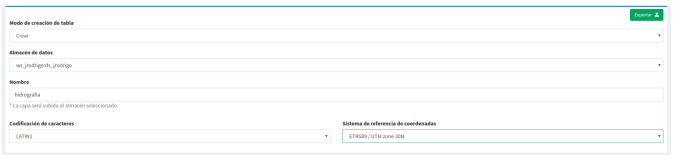

3. Administardor de archivos
============================

3.1 Crear directorios
---------------------

Podremos crear directorios para organizar nuestros archivos dentro de un directorio raíz. 
Para ellos seleccionaremos el botón *“crear directorio”*, e introduciremos el nombre del nuevo directorio.

.. image:: ../images/dirs2.png
   :align: center

Con esto se habrá creado un nuevo subdirectorio dentro del directorio raíz.

- Se pueden crear tantos directorios como subdirectorios se quiera.

- Los directorios solo tienen la opción para ser 'eliminados', en la parte derecha saldrá una herramienta en forma de *'llave'* al hacer click, saldrá la opción *"eliminar directorio”*, sí se selecciona se borrará el directorio y todo su contenido.

- Actualmente los formatos soportados por el administrador de archivos son *"Shapefile y GeoTIFF"*.

3.2 Subir ficheros shapefile o GeoTiff
--------------------------------------
Esta opción nos permite cargar los ficheros (archivos) tiff o shape en un directorio, éste último para posteriormente ser exportado a algún almacén de la BD.

El formato shapefile, es un formato multiarchivo y tienen un conjunto de ficheros requeridos para su correcto funcionamiento.

Estos ficheros tienen las siguientes extensiones:

*   **shp:** Almacena las entidades geométricas de los objetos.

*   **shx:** Almacena el índice de las entidades geométricas.

*   **dbf:** base de datos en formato dBASE, donde se almacena la información de los atributos.

Además de estos tres archivos requeridos, opcionalmente se pueden utilizar otros para mejorar el funcionamiento en las operaciones de consulta a la base de datos, información sobre la proyección cartográfica o almacenamiento
de metadatos. Entre ellos destaca:

*   **prj:** Es el archivo que guarda la información referida al sistema de coordenadas en formato WKT.

Para que se exporte de forma correcta a la BD, basta con subir los tres primeros ficheros. Los pasos para subir son:

- Nos ubicamos desde un directorio o subdirectorio donde queramos añadirlo
- Hacer click sobre el botón *'subir'*
- En la nueva ventana pinchamos sobre el botón 'seleccionar', desde allí se podrá navegar por nuestros directorios locales del ordenador y seleccionar los tres ficheros shapefile (shp, dbf, shx) o el fichero (tif). También está la opción de arrastrar los archivos.
- Los archivos se pueden subir seleccionando uno a uno o comprimidos en formato zip.

.. image:: ../images/dirs3_2.png
   :align: center

- Una vez subido los ficheros shapefile nos aparecerá en el directorio donde lo hayamos cargado, aunque únicamente veremos los archivos con extensión *"shp"* y el *"dbf"*.
- En el caso del raster, el archivo que se muestra es el  *"tif"*

.. image:: ../images/dirs4_2.png
   :align: center

3.3 Exportar shapefile al almacén de datos
------------------------------------------
Entre las operaciones que podremos realizar sobre los archivos de tipo shapefile, se encuentra la de *“Exportar a base de datos”* y *“eliminar archivo”*, éste último borrará en el servidor tanto el fichero 'shp' como el resto de archivos asociados (.shx, .dbf, .shx, …).

Para la opción exportar seleccionamos la operación en el menú de operaciones del archivo **"shp"**.

A continuación se mostrará el formulario con los parámetros necesarios para realizar la exportación.

Debemos elegir:

- **El modo de creación**, es decir, si es crear una nueva tabla (exportar nueva), añadir registros o sobreescribir una tabla existente. Las dos últimos opciones deben utilizarse con cuidado, ya que borrarán o modificarán datos existentes.
- **el almacén de datos de destino** (de tipo base de datos PostGIS) 
- **nombre** de la capa en minúsculas, ni espacios vacíos.
- **especificar el sistema de referencia de coordenadas** (CRS) y 
- **la codificación de caracteres** de la capa a subir.
- damos a **'exportar'** y la capa ya estará disponible para ser publicada desde la entrada de *'servicios'* - *'capa'*

3.4. Exportar GeoTIFF
---------------------
Los GeoTIFF es un estandar de metadatos de domino público que permite que información georreferenciada sea encajada en un archivo de imagen de formato TIFF.

- La información adicional incluye el tipo de proyección, sistemas de coordenadas, elipsoide y datum y todo lo necesario para que la imagen pueda ser automáticamente posicionada en un sistema de referencia espacial.

- Los archivos GeoTIFF disponen de una extensión .tif o .tiff.

- Para subirlos al directorio procederemos de la misma forma que con los archivos shapefile, solo que en este caso será un único archivo.

- Para **'Exportarlos'**, en este caso *NO procede igual que los shapefile*, en este caso **se debe ir al almacén de datos y crear un nuevo almacén de 'tipo GeoTiff'**

- Una vez definido su almacén de datos, se podrá disponer de la capa para ser publicada igualmente que el shapefile desde la entrada de *'servicios'* - *'capa'*

