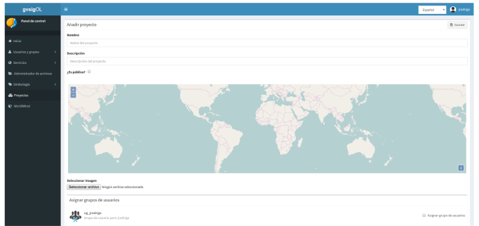
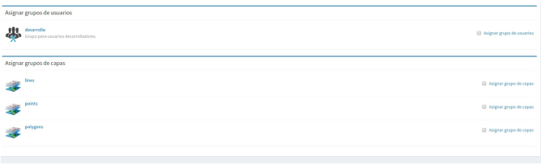

4. Proyectos
======================

4.1 Crear, modificar y eliminar proyectos
-----------------------------------------
Para crear un nuevo proyecto seleccionaremos en el menú de la izquierda la opción *"Proyectos"*, lo que nos llevará a la vista listado deproyectos.

.. image:: ../images/project1.png
   :align: center

A continuación seleccionamos la opción *"Añadir proyecto"*, que se encuentra en la parte superior derecha, para abrir la vista que nos permitirá crear un nuevo proyecto.

El formulario para crear un nuevo proyecto está formado por los siguientes campos:

*   **Nombre** del proyecto

*   **Descripción** del proyecto

*   **¿Es público?:** Indicamos si el proyecto será acccesible publicamente, sin necesidad de estar autenticado en la plataforma

*   **Vista**: Centraremos el mapa y le añadiremos el zoom deseado

*   **Imagen**: Logo del proyecto que se mostrará en el listado de proyectos. Si no se define ninguna se asignará una por defecto.

Además de estos campos en la parte inferior aparecerán dos listados:

*   **Grupos de usuario**: Grupos de usuario(roles) para los que el proyecto estará disponible. Los usuarios administradores tendrán acceso a todos los proyectos.

*   **Grupos de capas**: Grupos de capas que estarán disponibles en el visor para este proyecto.

Para modificar un proyecto existente seleccionaremos el botón *"Actualizar proyecto"*, que se encuentra en la parte derecha en cada fila del listado de proyectos.

Para eliminar un proyecto existente seleccionaremos el botón *"Eliminar proyecto"*, que se encuentra en la parte derecha en cada fila del listado de proyectos.

Para cada uno de los proyectos es posible definir un orden particular de las capas y grupos de capas. Para ello en el listado de proyectos seleccionaremos el botón *"Ordenar TOC"*.

A continuación en la vista aparecerán los grupos de capas y dentro de ellos si los desplegamos las capas. Las capas pueden ser ordenadas mediante las flechas que se encuentran en la parte derecha de las mismas, mientras que los grupos de capas pueden ser ordenados usando la técnica de arrastrar y soltar.

.. image:: ../images/project4.png
   :align: center