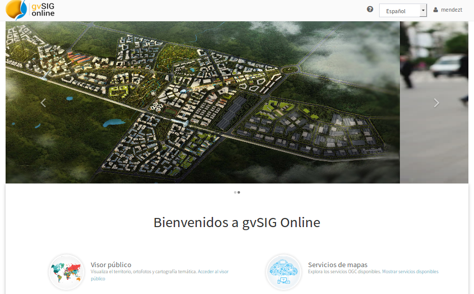
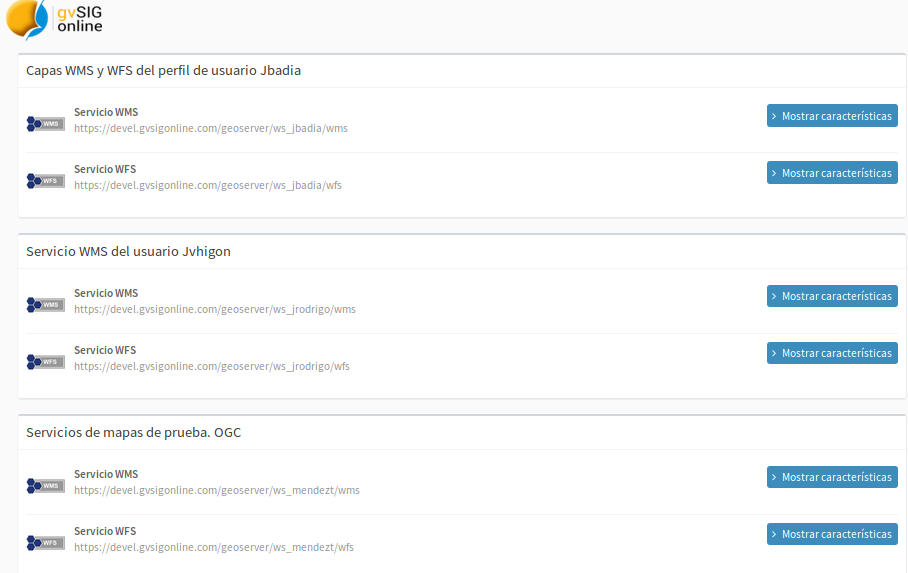
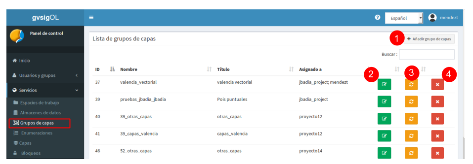
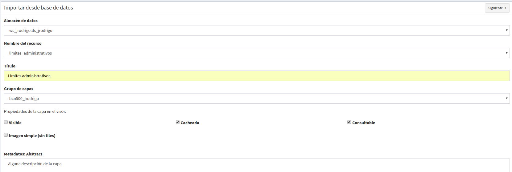
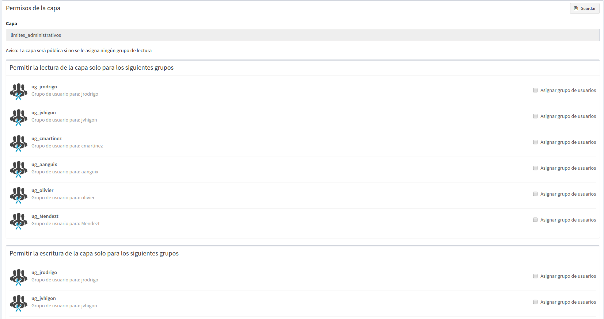
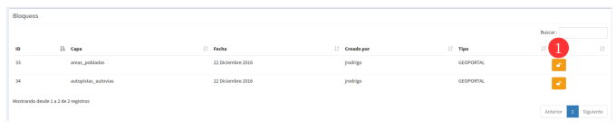
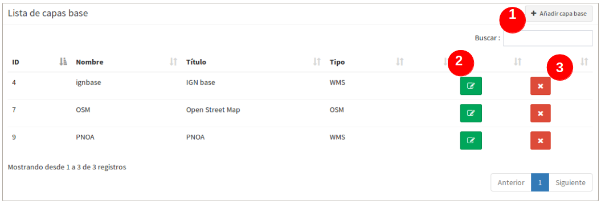
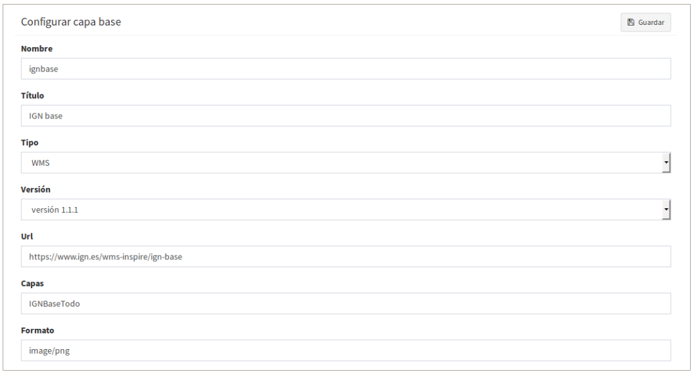

2. Servicios
============

2.1 Crear y eliminar espacios de trabajo
----------------------------------------
Puede crear(**1**), actualizar (**2**) y eliminar(**3**) espacios de trabajo desde el listado de espacios de trabajo. Si elimina un espacio de trabajo, se eliminarán de gvSIG Online todos los almacenes de datos y capas asociadas.

.. image:: ../images/ws1_2.png
   :align: center

Para crear un nuevo espacio de trabajo (**1**) se debe llenar el siguiente formulario:

- **Nombre**, no puede contener espacios, signos de puntuación ni caracteres especiales como la *"ñ"*.
- **Descripción**, este se reflejerá en la página donde se sirven los servicios.
- **Activar el check '¿es público?'**, esta opción permitirá que los servicios sean públicos en la página principal de gvsigOnlie. De lo contrario serán servicios privados que igualmente se puede compartir el link pero se debe suministrar el usuario y contraseña del dueño del servicio.

- Habitualmente no es necesario modificar las URL de los servicios (estos son generados automáticamente cuando se añade el nombre del nuevo espacio de trabajo).

.. image:: ../images/ws1_3.png
   :align: center

2.1.1 Publicar los servicios WMS y WFS
~~~~~~~~~~~~~~~~~~~~~~~~~~~~~~~~~~~~~~
Gvsigonline genera los Web Map Service (WMS) y los Web Feature Service (WFS). Los servicios se crean desde el nivel de 'espacios de trabajo', es decir, todas las capas publicadas en un espacio de trabajo serán las contenidas en sus respectivos WMS y WFS.

Desde el botón actualizar (**2**) se podrá modificar la **'descripción'** y activar o desactivar la opción de **'público'**, con esta última opción los links de los servicios estarán disponibles con acceso libre. En el caso de que no sean públicos, el link del servicio puede compartirse y usarse pero se debe indicar un usuario y password que tenga permisos sobre éste. 

Para poder obtener los links de los servicios WMS y WFS, se debe ir a la página principal (inicio) de Gvsig Online y se elige la entrada **"Servicios de Mapas"**

Se mostrará una página con todos los servicios de cada espacio de trabajo público.

.. note::
   Para poder visualizar correctamente los servicios WMS y WFS se deben usar los links y realizar las conexiones respectivas en los distintos SIG de escritorio o sistemas que los soporten.

2.2 Crear, modificar y eliminar almacenes de datos
--------------------------------------------------
Puede añadir(**1**), actualizar(**2**) y eliminar(**3**) almacenes de datos desde el listado de almacenes de datos.

.. image:: ../images/ds1.png
   :align: center

Los almacenes se crean dentro de un espacio de trabajo. Por lo tanto, al crear un nuevo almacén es obligatorio indicarle el 'espacio de trabajo' al que pertenecerá.

.. note::
      Es importante entender que para poder añadir un almacén de datos tipo PostGis, debemos partir de una fuente de datos que exista previamente, es decir, que la BD y esquema que se indica en los parámetros de conexión existan.
 
En el formulario de creación de almacén de datos debemos seleccionar el espacio de trabajo al que pertenecerá, el tipo de almacén, 
el nombre (sin caracteres especiales) y los parámetros de conexión.

El formulario incluye diversos ejemplos de parámetros de conexión para cada tipo de almacén. Se pueden crear tres tipos de almacenes, pueden ser:

2.2.1 PostGIS vectorial:
~~~~~~~~~~~~~~~~~~~~~~~~
Para poder añadir un almacén de datos de tipo PostGIS vectorial, la base de datos espacial debe existir previamente. 
De esta forma, lo que estamos haciendo es registrar en gvSIG Online (y en Geoserver) los parámetros de conexión a dicha base de datos.

Se tendrá que indicar los parámetros de conexión a la BD, esto permitirá crear el nuevo almacén en el sistema que hará referencia a un esquema existente en la Base de Datos, es decir, **es obligatorio que el esquema que se registra en los parámetros de conexión ya está creada dentro de la BD**.

.. image:: ../images/ds2.png
   :align: center

2.2.2 GeoTiff
~~~~~~~~~~~~~
Para añadir un almacén de datos tipo ráster, el fichero .tif (**georreferenciado**) debe existir previamente en el servidor, es decir, subido al **'administrador de archivos'**. En este caso estamos registrando en gvSIG Online la ruta a dicho fichero ráster.

Para el almacén de datos tipo raster el formulario cambiará y nos permitirá seleccionar el fichero que compondrá el almacén.

.. image:: ../images/ds3.png
   :align: center

Al abrir el dialogo de seleccionar archivo, este nos mostrará un ventana con el gestor de **'administrador de archivos'**, desde donde podremos seleccionar el fichero raster que habremos subido previamente.

.. image:: ../images/ds4.png
   :align: center

.. note:: 
      - Después de subir el fichero raster a un directorio del administrador de archivos, es necesario crearle su propio almacén de datos para posteriormente ser publicados en un proyecto (geoportal). 
    
      - Una vez publicado el raster en el sistema, NO se podrá borrar el fichero del 'administrador de archivos', puesto que el almacén apunta a esa ruta configurada.

2.2.3 WMS en cascada:
~~~~~~~~~~~~~~~~~~~~~
Éste permite guardar un almacén de tipo Web Map Service (WMS), donde se guarda la dirección del servicio que se quiera consultar y publicar en el proyecto.

.. image:: ../images/ds5.png
   :align: center

.. note::
   	La eliminación de un almacén de datos tipo postGIS vectorial o geotiff elimina del sistema todas las capas publicadas asociadas al almacén.
       
   	Por contra, no se eliminará la fuente de datos asociada (la base de datos espacial o el fichero ráster correspondiente).

**Es importante recordar que el crear un almacén de datos, SIEMPRE SERÁ UN PASO PREVIO a la publicación de las capas que éstas contengan. Los servicios y capas de los almacenes WMS y Geotiff se deben publicar de la misma manera que una capa vectorial pero seleccionando su respectivo repositorio.**   

2.3 Crear, modificar y eliminar Grupos de capas
-----------------------------------------------
Desde el listado de grupo de capas podemos añadir nuevo (**1**), actualizar (**2**), limpiar caché (**3**) y eliminar grupos de capas (**4**).

   
2.3.1 Añadir nuevo grupo de capas
~~~~~~~~~~~~~~~~~~~~~~~~~~~~~~~~~
Los grupos de capas serán asignados a los 'proyectos' a través de la configuración de éstos últimos. 

Para crearlo seleccionamos el botón **'añadir nuevo grupo de capas'**, se desplegará un formulario donde hay que asignarle:

.. image:: ../images/layer_group_new.png
   :align: center

- **1- Nombre**: en minúsculas, sin espacios en blanco y caracteres especiales

- **2- Título**: Se puede escribir sin ninguna restricción y será el nombre que se muestra en el visor de mapas.

- **3- Publicar capa**: primero se muestra una pregunta "Es necesario guardar el grupo de capas primero, ¿Desea continuar?", se indica **"aceptar"** y saldrá una ventana para configurar todos los parámetros de una capa que se añadirá al grupo y será publicada en el sistema.

- **4- Crear capa vacía**: Similiar al de publicar capa, saldrá el mensaje y al "aceptar", se activa la ventana para añadir una capa sin registros en el sistema, automáticamente se almacenará en la BD y se publica. 

- **5- Caché de grupo**: Esta opción permite que todas las capas del grupo se vean cacheadas como un sola capa, es decir, realiza la petición para mostrar en el mapa todas las capas del grupo como un solo servcicio y no como como capas independientes.

- **6- Guardar**: Guardar los cambios del grupo.

2.3.2  Actualizar grupo de capas
~~~~~~~~~~~~~~~~~~~~~~~~~~~~~~~~
Esta opción permitirá:

- editar el título del grupo

- activar o desactivar el caché del grupo.

- Gestionar sus capas, tal como se muestra en la entrada de **capas** desde esta opcón de **actualizar grupo de capas** también se podrá: publicar capas, crear capa vacía y por tanto actualizarlas, configurarlas y eliminarlas)

- **Establecer el orden del toc de las capas, como quiran mostrarse en el árbol de capas del geoportal**

2.3.3 Limpiar chaché
~~~~~~~~~~~~~~~~~~~~
Sirve para actualizar/limpiar el caché de todas las capas del grupo pero como si fuese una sola capa.

2.3.4 Eliminar grupo de capas
~~~~~~~~~~~~~~~~~~~~~~~~~~~~~
Cuando se da la opción de **eliminar grupo de capas** y contiene una o más capas, éstas últimas no son borradas del sistema, sino que son asignadas a un grupo de capas llamado **'por defecto'**, por lo tanto continúan publicadas en el sistema, pero no asignadas a ningun proyecto.

2.4 Publicar, crear, modificar y eliminar capas
-----------------------------------------------
Desde el listado de capas podemos acceder a la gestión de las mismas. Desde esta entrada se pueden publicar capas existentes en almacenes de datos(**6**), o crear capas vacías(**7**) donde se defime de forma manual los campos y automáticamente es guardada en un almacén de datos y publicada en el sistema.

.. image:: ../images/layer1.png
   :align: center

Sobre cada una de las capas podemos ver y realizar las siguientes operaciones:

2.4.1 Información básica de la capa
~~~~~~~~~~~~~~~~~~~~~~~~~~~~~~~~~~~
Cada capa vectorial, raster o servicio (WMS) que este publicado correctamente, estará enlistado en esta vista y se visualiza la siguiente información (**1**):

- **ID**: Es el identificador único con el que se ha resgistrado la capa en el sistema, suele ser de uso interno.

- **Previsualización**: Como su nombre lo indica, es una vista previa de las geometrías que contiene una capa, cuado se le es asignado una simbología también se puede apreciar su estilo. Cada vez que se añaden geometrías a la capa o se cambie de estilo se puede actualizar mediante la opción **limpiar caché** (**4**). En el caso de que este preview se vea como una imagen rota, es una señal que ha existido un fallo en le transcurso de la publicación o la capa es inconsistente para el sistema y debe revisarse con un GIS de escritorio. 

- **Nombre**: es el nombre de la capa como se ha creado en el almacén de base de datos. Siempre será en minúsculas, sin espacios y sin caracteres especiales.

- **Título**: Es el alías que es asigado a la capa y como se verá publicado en el proyecto. En este caso no tiene restricciones en caracteres especiales o espacios.

- **Almacén de datos**: Es el nombre del repositorio de la Base de datos donde está almacenada la capa 

- **Grupo de capas**: es el nombre del grupo de capas al cual pertenece. Una capa **siempre deberá pertenecer a un grupo de capas para ser publicada**

- **Herramientas**: cada capa contará con cuatro botones de herramientas configurables, Acualizar (**2**), configurar (**3**), limpiar caché (**4**) y Eliminar capa (**5**)

2.4.2 Actualizar capa - Opciones en visor - Parámetro temporal
~~~~~~~~~~~~~~~~~~~~~~~~~~~~~~~~~~~~~~~~~~~~~~~~~~~~~~~~~~~~~~
Desde el botón verde 'actualizar capa' (**2**) se puede modificar el título de la capa, grupo al que pertenece la capa, permisos de lectura-escritura y otras propiedades del visor como:

.. image:: ../images/layer1_2_temporal.png
   :align: center
   

**1- Visible**: Si activamos esta opción, cada que vez que se abra el proyecto la capa siempre estará visble en el mapa.

**2- Cacheada**: El cacheado de capas es recomendado para capas raster. Para las capas vectoriales (con muchos registros) será conveniente activarla una vez se haya configurado su estilo y no tenga posteriores cambios, de lo contrario se deberá ir siempre al botón (**5**) *limpiar el caché* de la capa para que reconozca los nuevos cambios.

**3- Consultable**: Perimite visualizar o consultar la información alfanumérica de la tabla de atributos, es decir, en caso de que no esté activado, solo será visible las geometrías sobre el mapa y NO sus atributos, pero si un usuario tiene permisos de escritura sobre esta capa, al ponerla en edición, SÍ que podrá ver y editar los atributos de algún elemento del mapa.

**4- Imagen simple (sin tiles)**: Con esta opción activa NO se piden varias teselas para componer la imagen, sino que se pide al servidor de mapas una única imagen. Tiene sentido para capas externas que tienen un texto incrustado en el mapa (por ejemplo catastro) o capas WMS. 

**5- Parámetro temporal**: Es una propiedad disponible en la capa para poder mostrar sobre el mapa las entidades o elementos en un instante o intervalo de tiempo definido por el usuario, para ello se debe tener como mínimo un campo con el tipo de dato: 'date' o 'timestamp'. Dicho de otra forma esta opción permite representar en el mapa las entidades en un momento dado.

Al activarse esta propiedad se despliega las opciones del parámetro temporal:

* 5.1- **Campo temporal:** En esta casilla solo se desplegarán los campos que sean de tipo fecha (date). Seleccionar uno de ellos y éste campo se usará para realizar la búsqueda de los elementos y mostrarlos en el mapa.

* 5.2- **Campo temporal (fin intervalo):** Igual que el campo anterior, cumple la misma función, pero este campo puede ser opcional. Es útil cuando se quiere establecer un rango de 'Inicio - Fin entre' los campos 'date' seleccionados en la casilla anterior y éste. Considerando este último campo como la fecha final del intervalo.

* 5.3- **Presentación temporal:** Por ahora solo esta implementado la opción 'intervalo continuo'. Es decir, que se muestren valores de forma líneal según el rango escogido.

* 5.4- **Modo para asignar valores por defecto:** Esta opción sirve para fijar un elemento (feature) que siempre se mostrará en el mapa cuando se active la capa, es decir, en las capas con parámetro temporal activado, no se mostrarán todos sus features como una capa común, sino que se pintará por defecto uno solo elemento que sea indicado en esta opción.

* 5.5- **Valor por defecto:** Depende de lo que se elija en la opción anterior (*5.4*), el sistema buscará en función del primer campo 'date' seleccionado (*5.1*), el elemento que tenga la fecha más baja, más alta, alguna concreta o la mas próxima a la indicada.

2.4.3 Usando Opción- 'Parámetro temporal'
~~~~~~~~~~~~~~~~~~~~~~~~~~~~~~~~~~~~~~~~~
Una vez configurada la capa con las opciones de parámetro temporal,  vamos al proyecto y refrescamos, deberá aparecer en el panel de contenidos la nueva pestaña de 'visualizar datos históricos' .

Nos ubicamos en la nueva pestaña 'visualizar datos históricos' y se activa el checkbox de la función, se despliegan las opciones emplear.

.. note::
       Para activar la función de parámetro temporal es obligado tener activa (visible) la capa en el árbol de capas.  En caso de que no lo esté, al activar el check de la función de 'parámetro temporal' saldrá el siguiente mensaje al usuario: *“Se necesita tener visible, al menos, una capa temporal”*
      
.. image:: ../images/parametro_temporal.png
   :align: center
   
**1- Pestaña de párametro temporal**: Ingresar a la pestaña de 'datos históricos'

**2- Habilitar características temporales**: activar el checkbox, sino se activan las capas en el árbol de capas, saldrá un mensaje advirtiendo que no se activará la herramienta hasta que se active la capa configurada. Cuando se activa la función en el mapa se pintará el(los)  elemento(s) con fecha mayor, es decir, los datos más recientes.

**3- Desde**: Casilla para añadir la fecha de búsqueda concreta o inicial (rango). A la derecha los botones (+) y (-) que harán los saltos de uno en uno de acuerdo a la resolución seleccionada (5)

**4- Hasta**: Igual que la casilla anterior pero solo se activa cuando se especifica 'rango temporal' (8), considerando esta fecha como fin del rango de búsqueda.

**5- Divisiones**: Resolución en días, horas, minutos, segundos, mes y año

**6- Barra de ubicación**: Los botones de esta barra se sitúa en función de las fechas y resolución indicadas. Cuando se activa por primera vez la función de temporal, los botones estarán al final de la barra, puesto que mostrará las features con la fecha más alta o más reciente.

**7- Instante**: Ubicar una feature en un instante dado o preciso, basta con indicar una única fecha en la casilla (3)

**8- Rango temporal**:Ubicar features en todo un rango de tiempo, se debe indicar una fecha de inicio (casilla 3) y fecha  fin (casilla 4).

**9- Capas con parámetro temporal**: información de las capas activas y los campos tipo 'date' que usa según la configuración dada.

Por ejemplo, en el mapa, activando el temporal con un rango de inicio y fin y resolución por minuto, se mostrará en el mapa lo siguiente:

.. image:: ../images/temporal_mapa.png
   :align: center

Siempre se podrá ir usando los botones de la 'barra de ubicación' o el (+) y (-) de cada fecha para ir mostrando en el mapa los elementos del rango.

2.4.3 Configuración de capa
~~~~~~~~~~~~~~~~~~~~~~~~~~~
En la opción de 'configurar capa' - botón morado (**3**), se puede configurar los títulos de los nombres de campos y dar permisos de visualización y edición para cada uno de ellos.

      - Podemos definir alias a los nombres de los campos para cada idioma del sistema seleccionado, por ejemplo, los alias definidos en 'título del campo Español' seran visibles cuando el idioma del sistema esté en 'Español'.
      - Definir qué campos serán visibles para las herramientas del visor (herramienta de información, tabla de atributos, etc …). 
      - Activar cuales son los campos que pueden ser editados por el usuario con privilegio de escritura.
      - Finalmente seleccionar los campos que serán visibles en la herramienta info (i) rápida del visor.

.. image:: ../images/layer2_2.png
   :align: center

2.4.4 Limpiar caché
~~~~~~~~~~~~~~~~~~~
 Esta opción, como su nombre lo indica, limpia la caché de la capa en el servidor de mapas. Muy útil cuando realizamos cambios en la simbología de la capa. 
 
 Este botón amarillo de 'limpiar caché' (**4**), también actualiza los cambios para registrar los nuevos registros y atributos que se han añadido/editado desde un sig de escritorio a través de la conexión de la Base de Datos.

2.4.5 Eliminar capa
~~~~~~~~~~~~~~~~~~~
Por último, también está el botón rojo de 'Eliminar capa' (**5**), ésta opción borra la capa publicada en el sistema y sus estilos asociados, pero continúa existiendo (almacenada) en la BD, por tanto podría publicarse nuevamente aunque debe asignarse nuevamente el estilo.

2.4.6 Publicar capa vectorial, raster o wms
~~~~~~~~~~~~~~~~~~~~~~~~~~~~~~~~~~~~~~~~~~~
Desde esta opción se podrá publicar las capas tipo vectorial, raster o wms que se hayan asignado previamente en un almacén de datos.

Para publicar seleccionaremos el botón *"Publicar capa"*, una vez accedamos a la vista de publicación aparecerá el siguiente formulario.

   
Los pasos para publicar una capa son los siguientes:

*	**Seleccionamos el almacén de datos donde se encuentra la capa que deseamos publicar, es decir, el almacén postgis de la capa vectorial, el almacén geotiff de la capa raster o el almacén del WMS**.

*	A continuación seleccionamos en el desplegable el recurso, se puede teclear y se autocompleta (Solo aparecen los recursos que aún no han sido publicados).

*	Introducimos un titulo para la capa (será el nombre visible en el visor de mapas).

*	Seleccionamos el grupo de capas al cual queremos asignar la capa.

*	Seleccionamos las propiedades de la capa: visible, cacheada (recomendado para raster), imagen simple (recomendado para wms), consultable.

*	Se puede introducir una descripción de la capa, si se tiene activado la opción de metadatos (Geonetwork), será el abstract del mismo.

*	A continuación seleccionamos el botón *"Siguiente"*, lo que nos llevará a la vista de permisos. Aplicaremos los permisos de lectura y escritura a la capa. Si en la sección de lectura NO se le asigna ningún grupo de usuarios, la capa será vista o leida por cualquier usuario, es decir, será un capa pública. Para la escritura de la capa es imprescindible establecer los permisos.

   
.. note::
      Para las capas tipo ráster o wms, se mostrará solo permisos de letura.
   	
2.4.7 Crear capa vacía
~~~~~~~~~~~~~~~~~~~~~~
Para crear una capa vacía, seleccionaremos el botón *"Crear capa vacía"*, una vez accedamos a la vista aparecerá el siguiente formulario.

.. image:: ../images/create_layer1.png
   :align: center
   
Los pasos para crear una capa vacía son los siguientes:

*	Seleccionamos el almacén de datos donde se creará la capa (será un almacén de datos PostGIS).

*	Introducimos un nombre para la capa (evitando caracteres especiales y mayúsculas).

*	Introducimos un título para la capa (será el nombre visible en el visor de mapas).

*	Seleccionamos en el desplegable el tipo de geometría (Punto, Multipunto, Linea, MultiLinea, Polígono, MultiPolígono).

*	Seleccionamos en el desplegable el sistema de referencia de coordenadas (podemos escribir el nombre del SRC o código EPSG, se autocompleta y si hay varios se despliega un listado).

*	Añadimos uno o más campos para la capa, para ello seleccionamos el botón *"Añadir campo"* y se nos mostrará un diálogo donde podremos seleccionar el tipo de campo y un nombre para el mismo.

.. image:: ../images/select_field2_2.png
   :align: center
   
.. note::
   Los tipos de datos soportados son: Boolean, Texto, Entero, Doble, Fecha, Hora, Fecha_hora, Form (usado para el plugin de encuestas online), Enumeración y Multiple enumeración (para añadir alguno de estos dos últimos, se debe tener algún listado de enumeraciones)

*	Seleccionamos las propiedades de la capa: visible, cacheada (recomendado para raster), imagen simple (recomendado para wms), consultable.

*	Si lo deseamos podemos introducir una descripción de la capa.

*	A continuación seleccionamos el botón *"Siguiente"*, lo que nos llevará a la vista de permisos.

*  Por último aplicaremos los permisos de lectura y escritura a la capa.

   
.. note::
   	Para las capas creadas desde el sistema, automáticamente tendrán los campos de control intero en la tabla de atributos.

2.5 Gestión de bloqueos
-----------------------
desde ésta entrada podemos consultar los bloqueos activos que tengan algunas capas, así como desbloquearlas pero NO bloquearlas. Estas capas solo se bloquean mediante la edición de las mismas o si han sido descargadas a través de la aplicación móvil. En ese último caso hay que tener especial atención, porque si la capa es desbloqueada desde el sistema, posteriormente no se podrá subir (exportar) la capa desde la app móvil al sistema. 

2.6 Gestión de capas base
-------------------------
Los usuarios administradores podrán configurar el juego de capas base que estarán disponibles para añadir a cualquiera de los proyectos.

Para acceder a esta funcionalidad, aparecerá la entrada correspondiente dentro del menú de 'servicios' del panel de control.

En la entrada de '*capas base*' se pueden realizar operaciones básicas: añadir nueva capa base(**1**), actualizar (**2**) o eliminar (**3**).

para añadir una nueva capa base (**1**) se podran definir diferentes tipos de proveedores y para cada uno de ellos sus respectivos parámetros de conexión.

2.6.1 Capas base WMS/WMTS:
~~~~~~~~~~~~~~~~~~~~~~~~~~
Se indica un nombre y el título (como se verá en el proyecto).  La url del servicio es imprescindible, asi como conocer la versión del mismo. Una vez indicadas, se marca la capa y el formato.

Cuando se abra el proyecto se mostrará en el mapa la capa base que se fijó por defeto, pero siempre se dispondrán en el panel de contenidos el listado de las añadidas al proyecto, pudiendo cambiarlas y fijar de base la que se quiera.

.. image:: ../images/base_layers_wms_1.png
   :align: center

2.6.2 Capas base OSM/tile XYZ:
~~~~~~~~~~~~~~~~~~~~~~~~~~~~~~
Para los tipos OpenStreetMap y tiles XYZ basta con indicar el nombre, título y la URL del servicio.

En el caso de OSM genérico, es opcional el añadir la URL, ya que el sistema internamente reconoce este servicio con seleccionar el tipo '*OSM*', entonces, si no se añade la url, se conectará al servicio básico de OSM. 

.. image:: ../images/base_layers_osm.png
   :align: center

Si son capas tiles XYZ, se debe especificar su URL y asegurarse que contenga el formato al final: "**/{z}/{x}/{y}.png**", por ejemplo, un servicio openlayers disponible de este tipo es "http://{a-c}.basemaps.cartocdn.com/dark_all/{z}/{x}/{y}.png"

.. image:: ../images/base_layers_xyz.png
   :align: center

Para obtener más ejemplos de otras openlayers tiles de OSM, se puede revisar las siguientes páginas: 

*  BlogOpenlayeres_.
 
*  OpenLayers.org_.
 
 .. _BlogOpenlayeres: http://blog.programster.org/openlayers-3-using-different-osm-tiles/

 .. _Openlayers.org: https://openlayers.org/en/latest/examples/localized-openstreetmap.html

Las capas base de OSM por defecto y otra de tipo tile XYZ, en el proyecto se visualizan:

.. image:: ../images/base_layers_osm_xyz_mapa.png
   :align: center

2.6.3 Capas base Bing:
~~~~~~~~~~~~~~~~~~~~~~
Al seleccionar el tipo '*bing*', necesitará un API-KEY para poder utilizar los servicios de Microsoft y añadir el nombre de las capa disponible, por ejemplo: '*Road*', '*Aerial*', '*collinsBart*', entre otros. 

.. image:: ../images/base_layers_bing.png
   :align: center
   
Las capas base de Bing, en el proyecto se visualizan:

.. image:: ../images/base_layers_bing1.png
   :align: center

Para mayor información con respecto al uso de las capas base tipo '*bing*', sus capas disponibles y obtención de las API-key, consultar en su página oficial: 

* BingMaps_.

 .. _BingMaps: http://openlayers.org/en/latest/examples/bing-maps.html

Finalmente gestionadas las capas base en el panel de control - 'servicios', se podrá ir a la definición de los proyectos, declarar cuáles se quieren incorporar, así como indicar cuál estará anclada por defecto al cargar el proyecto.

.. image:: ../images/base_layers_proyecto.png
   :align: center
