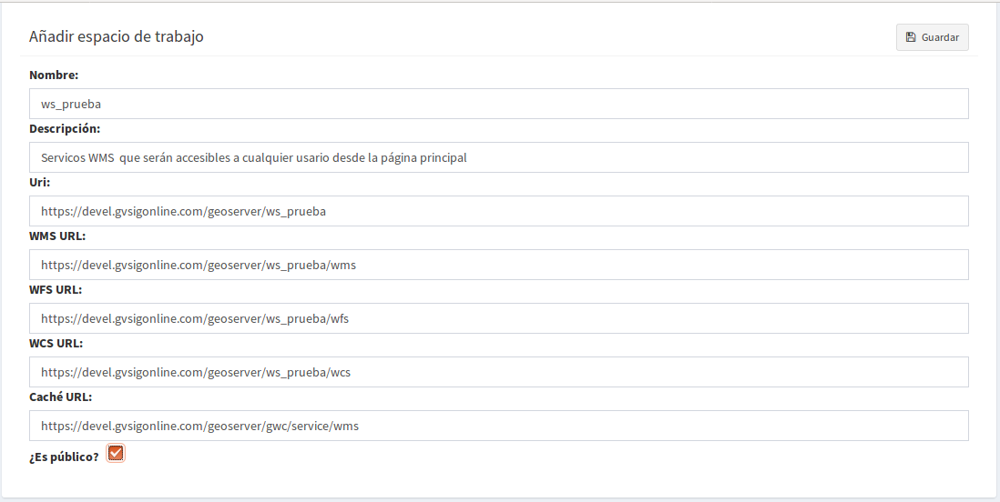

2. Servicios
============

2.1 Crear y eliminar espacios de trabajo
----------------------------------------
Puede crear(**1**), actualizar (**2**) y eliminar(**3**) espacios de trabajo desde el listado de espacios de trabajo. Si elimina un espacio de trabajo, se eliminarán de gvSIG Online todos los almacenes de datos y capas asociadas.

.. image:: ../images/ws1_2.png
   :align: center

Para crear un nuevo espacio de trabajo (**1**) se debe llenar el siguiente formulario:

- **Nombre**, no puede contener espacios, signos de puntuación ni caracteres especiales como la *"ñ"*.
- **Descripción**, este se reflejerá en la página donde se sirven los servicios.
- **Activar el check '¿es público?'**, esta opción permitirá que los servicios sean públicos en la página principal de gvsigOnlie.

- Habitualmente no es necesario modificar las URL de los servicios (estos son generados automáticamente cuando se añade el nombre del nuevo espacio de trabajo).

2.1.1 Publicar los servicios WMS y WFS
~~~~~~~~~~~~~~~~~~~~~~~~~~~~~~~~~~~~~~
Gvsigonline genera los Web Map Service (WMS) y los Web Feature Service (WFS). Los servicios se crean desde el nivel de 'espacios de trabajo', es decir, todas las capas publicadas en un espacio de trabajo serán las contenidas en sus respectivos WMS y WFS.

Desde el botón actualizar (**2**) se podrá modificar la *'descripción'* y activar o desactivar la opción de *'público'*, con esta última opción los links de los servicios estarán disponibles con acceso libre.

Para poder obtener los links de los servicios WMS y WFS, se debe ir a la página principal (inicio) de Gvsig Online y se elige la entrada *"Servicios de Mapas"*

.. image:: ../images/ws1_4.png
   :align: center

Se mostrará una página con todos los servicios de cada espacio de trabajo público.

.. image:: ../images/ws1_5.png
   :align: center

.. note::
   Para poder visualizar correctamente los servicios WMS y WFS se deben usar los links y realizar las conexiones respectivas en los distintos SIG de escritorio o sistemas que los soporten.

2.2 Crear, modificar y eliminar almacenes de datos
--------------------------------------------------
Puede añadir(**1**), actualizar(**2**) y eliminar(**3**) almacenes de datos desde el listado de almacenes de datos.

.. image:: ../images/ds1.png
   :align: center

Los almacenes se crean dentro de un espacio de trabajo. Por lo tanto, al crear un nuevo almacén es obligatorio indicarle el 'espacio de trabajo' al que pertenecerá.

.. note::
      Es importante entender que para poder añadir un almacén de datos tipo PostGis, debemos partir de una fuente de datos que exista previamente, es decir, que la BD y esquema que se indica en los parámetros de conexión existan.

Por ejemplo, para poder añadir un almacén de datos de tipo PostGIS vectorial, la base de datos espacial debe existir previamente. 
De esta forma, lo que estamos haciendo es registrar en gvSIG Online (y en Geoserver) los parámetros de conexión a dicha base de datos. 

Para añadir un almacén de datos tipo ráster, el fichero ráster debe existir previamente en el servidor, es decir, subido al 'administrador de archivos'. En este caso estamos registrando en gvSIG Online la ruta a dicho fichero ráster.

En el formulario de creación de almacén de datos deberemos seleccionar el espacio de trabajo al que pertenecerá, el tipo de almacén, 
el nombre (sin caracteres especiales) y los parámetros de conexión.

El formulario incluye diversos ejemplos de parámetros de conexión para cada tipo de almacén. Se pueden crear tres tipos de almacenes, pueden ser:

**1- PostGIS vectorial**: Se tendrá que indicar los parámetros de conexión a la BD, esto permitirá crear el nuevo almacén que hará referencia a un esquema existente en la Base de Datos.

.. image:: ../images/ds2.png
   :align: center

**2- GeoTiff**:  En caso de que el almacén de datos sea de tipo raster el formulario cambiará y nos permitirá seleccionar el fichero que compondrá el almacén.

.. image:: ../images/ds3.png
   :align: center

Al abrir el dialogo de seleccionar archivo, este nos mostrará un ventana con el gestor de ficheros, desde donde podremos seleccionar el archivo raster que habremos subido previamente.

.. image:: ../images/ds4.png
   :align: center

**3- WMS en cascada**: este permite guardar un almacén de tipo Web Map Service (WMS), donde se guarda la dirección del servicio que se quiera consultar y publicar en el proyecto.

.. image:: ../images/ds5.png
   :align: center

.. note::
   	La eliminación de un almacén de datos elimina todas las capas asociadas al almacén.
       
   	Por contra, no se eliminará la fuente de datos asociada (la base de datos espacial o el fichero ráster correspondiente).

**Es importante recordar que el crear un almacén de datos, SIEMPRE SERÁ UN PASO PREVIO a la publicación de las capas que éstas contengan. Los servicios y capas de los almacenes WMS y Geotiff se deben publicar de la misma manera que una capa vectorial pero seleccionando su respectivo repositorio.**   

2.3 Crear, modificar y eliminar Grupos de capas
-----------------------------------------------
Desde el listado de grupo de capas podemos añadir nuevo (**1**), actualizar (**2**), limpiar caché (**3**) y eliminar grupos de capas (**4**).

.. image:: ../images/layer_group.png
   :align: center
   
2.3.1 Añadir nuevo grupo de capas
~~~~~~~~~~~~~~~~~~~~~~~~~~~~~~~~~
Los grupos de capas serán asignados a los 'proyectos' a través de la configuración de éstos últimos. 

Para crearlo seleccionamos el botón *'añadir nuevo grupo de capas'*, se desplegará un formulario donde hay que asignarle:

- **Nombre**: en minúsculas, sin espacios en blanco y caracteres especiales
- **Título**: Se puede escribir sin ninguna restricción y será el nombre que se muestra en el visor de mapas.
- **Caché de grupo**: Esto activará automaticamente el caché de todas las capas que pertenezcan a ese grupo.
 
.. image:: ../images/layer_group_new.png
   :align: center

2.3.2  Actualizar grupo de capas
~~~~~~~~~~~~~~~~~~~~~~~~~~~~~~~~
Esta opción solo permitirá editar el título del grupo y activar o desactivar el caché del grupo.

2.3.2 Eliminar grupo de capas
~~~~~~~~~~~~~~~~~~~~~~~~~~~~~
Cuando se da la opción de eliminar grupo de capas y tenía asociadas una o mas capas, estás últimas se designan a un grupo de capas 'por defecto' que tiene el sistema. 

2.4 Publicar, crear, modificar y eliminar capas
-----------------------------------------------
Desde el listado de capas podemos acceder a la gestión de las mismas. Podemos publicar capas existentes en almacenes de datos(**1**), o crear capas vacías(**2**) definiendo de forma manual los campos.

.. image:: ../images/layer1.png
   :align: center

Sobre cada una de las capas podemos realizar las siguientes operaciones:

*   **Actualizar capa (3):** Desde donde se puede modificar el título, grupo al que pertenece la capa, permisos de lectura-escritura y otras propiedades del visor como:
 
      - *Visible*: Si activamos esta opción cada que vez que se abra el proyecto la capa siempre estará visble en el mapa.
      - *Cacheada*: El cacheado de capas es recomendado para capas raster. Para las capas vectoriales será conveniente activarlo una vez se haya configurado su estilo y no tenga posteriores cambios, de lo contrario se deberá ir siempre a 'limpiar el caché' de la capa para que reconozca los nuevos cambios.
      - *Consultable*: Perimite visualizar o consultar la información alfanumérica de la tabla de atributos, es decir, en caso de que no esté activado, solo será visible las geometrías sobre el mapa. Pero si un usuario tiene permisos de escritura sobre esta capa, al ponerla en edición, SÍ que podrá ver y editar los atributos de algún elemento del mapa.
      - *Imagen simple (sin tiles)*: Con esta opción activa NO se piden varias teselas para componer la imagen, sino que se pide una única imagen. Tiene sentido para capas externas que tienen un texto incrustado en el mapa (por ejemplo catastro) o capas WMS. 

.. image:: ../images/layer2_1.png
   :align: center

*   **Configurar capa (4):** Aqui se puede configurar los títulos de los nombres de campos y dar permisos de visualización y edición para cada uno de ellos.

      - Podemos definir alias a los nombres de los campos para cada idioma del sistema seleccionado, por ejemplo, los alias definidos en 'título del campo Español' seran visibles cuando el idioma del sistema esté en 'Español'.
      - definir que campos serán visibles para las herramientas del visor (herramienta de información, tabla de atributos, etc …). 
      - Activar cuales son los campos que pueden ser editados por el usuario con privilegio de escritura.
      - Finalmente seleccionar los campos que serán visibles en la herramienta info (i) rápida del visor.

.. image:: ../images/layer2_2.png
   :align: center

*   **Limpiar caché (5):** Limpia la caché de la capa en el servidor de mapas. Muy útil cuando realizamos cambios en la simbología de la capa.

*   **Eliminar capa (6):** Elimina la capa y estilos asociados.

2.4.1 Publicar capa
~~~~~~~~~~~~~~~~~~~
Para publicar una *'capa existente en un almacén de datos'*, seleccionaremos el botón *"Publicar capa"*, una vez accedamos a la vista de publicación aparecerá el siguiente formulario.

.. image:: ../images/publish1.png
   :align: center
   
Los pasos para publicar una capa son los siguientes:

*	Seleccionamos el almacén de datos donde se encuentra la capa que deseamos publicar, es decir, el almacén postgis de la capa vectorial, el almacén geotiff de la capa raster o el almacén del WMS.

*	A continuación seleccionamos en el desplegable el recurso, se puede teclear y se autocompleta (Solo aparecen los recursos que aún no han sido publicados).

*	Introducimos un titulo para la capa (será el nombre visible en el visor de mapas).

*	Seleccionamos el grupo de capas al cual queremos asignar la capa.

*	Seleccionamos las propiedades de la capa en el visor (visible, cacheada, imagen simple, consultable).

*	Si lo deseamos podemos introducir una descripción de la capa.

*	A continuación seleccionamos el botón *"Siguiente"*, lo que nos llevará a la vista de permisos. Aplicaremos los permisos de lectura y escritura a la capa. Si en la sección de lectura NO se le asigna ningún grupo de usuarios, la capa será vista o leida por cualquier usuario, es decir, será un capa pública. Para la escritura de la capa es imprescindible establecer los permisos.

.. image:: ../images/permissions.png
   :align: center
   
.. note::
      Para las capas tipo ráster o wms, se mostrará solo permisos de letura.
   	
2.4.2 Crear capa vacía
~~~~~~~~~~~~~~~~~~~~~~
Para crear una capa vacía, seleccionaremos el botón *"Crear capa vacía"*, una vez accedamos a la vista aparecerá el siguiente formulario.

.. image:: ../images/create_layer1.png
   :align: center
   
Los pasos para crear una capa vacía son los siguientes:

*	Seleccionamos el almacén de datos donde se creará la capa (será un almacén de datos PostGIS).

*	Introducimos un nombre para la capa (evitando caracteres especiales y mayúsculas).

*	Introducimos un título para la capa (será el nombre visible en el visor de mapas).

*	Seleccionamos en el desplegable el tipo de geometría (Punto, Multipunto, Linea, MultiLinea, Polígono, MultiPolígono).

*	Seleccionamos en el desplegable el sistema de referencia de coordenadas (podemos escribir el nombre del SRC o código EPSG, se autocompleta y si hay varios se despliega un listado).

*	Añadimos uno o más campos para la capa, para ello seleccionamos el botón *"Añadir campo"* y se nos mostrará un diálogo donde podremos seleccionar el tipo de campo y un nombre para el mismo.

   
.. note::
   Los tipos de campo soportados son: Boolean, Texto, Entero, Doble, Fecha, Enumeración y Multiple enumeración (para añadir alguno de estos dos últimos, se debe tener algún listado de enumeraciones)

*	Seleccionamos las propiedades de la capa en el visor (visible, cacheada, imagen simple, consultable).

*	Si lo deseamos podemos introducir una descripción de la capa.

*	A continuación seleccionamos el botón *"Siguiente"*, lo que nos llevará a la vista de permisos.

*  Por último aplicaremos los permisos de lectura y escritura a la capa.

.. image:: ../images/permissions.png
   :align: center
   
.. note::
   	Para las capas creadas desde el sistema, automáticamente tendrán los campos de control intero en la tabla de atributos.

2.5 Gestión de bloqueos
-----------------------
desde ésta entrada podemos consultar los bloqueos activos que tengan algunas capas, así como desbloquearlas pero NO bloquearlas. Estas capas solo se bloquean mediante la edición de las mismas o si han sido descargadas a través de la aplicación móvil. En ese último caso hay que tener especial atención, porque si la capa es desbloqueada desde el sistema, posteriormente no se podrá subir (exportar) la capa desde la app móvil al sistema. 

.. image:: ../images/block1.png
   :align: center

2.6 Gestión de capas base
-------------------------
Los usuarios administradores podrán configurar el juego de capas base que estarán disponibles para añadir a cualquiera de los proyectos.

Para acceder a esta funcionalidad, aparecerá la entrada correspondiente dentro del menú de 'servicios' del panel de control.

En la entrda de '*capas base*' se pueden realizar operaciones básicas: añadir nueva capa base(**1**), actualizar (**2**) o eliminar (**3**).

.. image:: ../images/base_layers.png
   :align: center

para añadir una nueva capa base (**1**) se podran definir diferentes tipos de proveedores y para cada uno de ellos sus respectivos parámetros de conexión.

* **WMS/WMTS**: Se indica un nombre y el título (como se verá en el proyecto). La url del servicio es imprescindible, asi como conocer la versión del mismo. Una vez indicadas, se marca la capa y el formato.

.. image:: ../images/base_layers_wms_wmts.png
   :align: center

Cuando se abrá el proyecto se mostrará en el mapa la capa base que se fijó por defeto, pero siempre se dispondrán en el panel de contenidos el listado de las añadidas al proyecto, pudiendo cambiarlas y fijar de base la que se quiera.

.. image:: ../images/base_layers_wms_1.png
   :align: center

* **OSM y XYZ**: En el caso de las OSM y tiles XYZ basta con indicar el nombre, título y la URL del servicio.

En el caso de OSM, es opcional el añadir la URL, ya que el sistema internamemte reconoce este servicio solo con seleccionar el tipo '*OSM*', entonces, si no se añade la url, se pondrá el servicio por defecto. 

.. image:: ../images/base_layers_osm.png
   :align: center

Si son capas tiles XYZ, se debe especificar su URL y asegurarse que contenga el formato al final: "**/{z}/{x}/{y}.png**", por ejemplo, http://{a-c}.basemaps.cartocdn.com/dark_all/{z}/{x}/{y}.png. 

.. image:: ../images/base_layers_xyz.png
   :align: center

Más ejemplos en OpenlayersTiles_.

 .. _OpenlayersTiles: http://blog.programster.org/openlayers-3-using-different-osm-tiles/

En el proyecto se visualizan:

.. image:: ../images/base_layers_osm_xyz_mapa.png
   :align: center

* **Bing**: al seleccionar el tipo '*bing*', necesitará el nombre de la capa a visualizar y un API-KEY para poder utilizar los servicios de Microsoft. 

.. image:: ../images/base_layers_bing.png
   :align: center
   
En el proyecto se visualizan:

.. image:: ../images/base_layers_bing1.png
   :align: center

Para mayor información con respecto al uso de las tipo '*bing*', sus capas disponibles y obteción de las API-key, consultar en la página BingMaps_.

 .. _BingMaps: http://openlayers.org/en/latest/examples/bing-maps.html

Finalmente gestionadas las capas base, se podrá ir a la definición de los proyectos, declarar cuáles se quieren incorporar, así como indicar cuál estará anclada por defecto al cargar el proyecto.

.. image:: ../images/base_layers_proyecto.png
   :align: center
