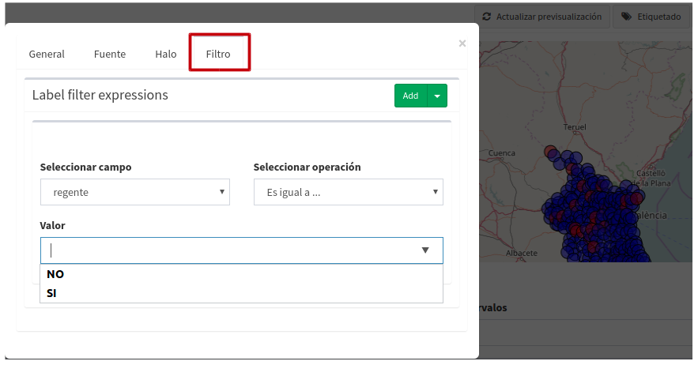
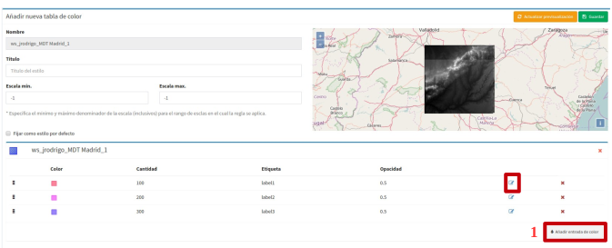

5. Simbología
=============
Para crear o modificar la leyenda de una capa seleccionaremos la entrada *"Estilos de capa"* en el menú de simbología.

.. image:: ../images/sym1_2.png
   :align: center

- Aparecerá un listado con las capas disponibles. 
- Cada capa del listado dispone de un selector donde se muestran las leyendas o estilos disponibles para la capa. 
- Para cada estilo de capa se le podrá añadir un *'nuevo estilo'* (**1**) y tantos como se deseen teer en el recuadro de selector de estilos que dispone cada capa. 
- Los estilos definidos se podrán seleccionar para ser modificadas(2).
- El estilo que no se esté usando como leyenda de la capa, es decir, que no esté fijada por defecto, se puede eliminar seleccionando el estilo en el selector y luego botón (**3**) *'Eliminar estilo'*.

Si seleccionamos el botón el botón añadir se nos mostrará una vista para que seleccionemos el tipo de leyenda que deseamos crear.
En caso de que la capa sea de tipo vectorial el menú que se nos mostrará será el siguiente:

   
Y si es de tipo raster de esta forma:

.. image:: ../images/sym3.png
   :align: center

5.1 Leyenda de símbolo único
----------------------------
La leyenda de símbolo único es la más simple de todas y nos permite definir un estilo que será aplicado a todos los elementos de una capa de la misma forma, sin hacer ningún tipo de distinción.

La vista para crear una leyenda de símbolo único está divida en tres áreas:

**1** - El área de metadatos(recuadro rojo) contiene los siguientes campos:

*   **Nombre**: El nombre del estilo se genera por defecto por tanto no es necesario definirlo.

*   **Título**: Título que aparecerá en la leyenda que se muestra en el visor.

*   **Escala mínima**: Escala mínima a partir de la cual será mostrada la leyenda (por defecto está 'sin límites').

*   **Escala máxima**: Escala máxima hasta la cual será mostrada la leyenda (por defecto está 'sin límites').

*   **Por defecto**: Si seleccionamos este check, el estilo será el que se muestre por defecto en el visor.

**2** - El área de pre-visualización (recuadro morado) contiene el mapa donde podremos observar el estilo de la leyenda y la entrada para añadir 'etiqueta'
Para actualizar la pre-visualización lo haremos a través del botón *"Actualizar previsualización"* situado en la parte superior derecha.

**3** - El área de simbolizadores (recuadro verde) Desde aquí iremos añadiendo los distintos simbolizadores que conformarán finalmente el símbolo.

Tenemos dos opciones para agregar simbolizadores:

*   **Importar un símbolo desde una libreria:** Se nos mostrará un dialogo con desplegable donde seleccionaremos la biblioteca de símbolos. A continuación seleccionaremos el símbolo.

*   **Añadir uno o varios simbolizadores:** Como hemos comentado anteriormente un símbolo puede estar formado por uno o más simbolizadores.

Podremos editar o eliminar un simbolizador desde los botones que se encuentran en la parte derecha.

.. image:: ../images/sym7.png
   :align: center

Al seleccionar el botón de edición se abrirá un dialogo donde podremos configurar los valores de las propiedades del simbolizador en función de su tipo.

.. image:: ../images/sym8.png
   :align: center

En caso de tener varios simbolizadores podemos definir el orden de visualización de los mismos mediante la técnica de arrastrar y soltar. Para ello seleccionaremos el simbolizador y lo arrastraremos a la posición deseada.

.. image:: ../images/sym9.png
   :align: center

5.2 Añadir etiquetado
---------------------
Las etiquetas son un tipo especial de simbolizadores de tipo texto. Para añadir una nueva etiqueta seleccionaremos el botón *"Añadir etiqueta"* que se ubica en la esquina superior derecha de cada ventana de configuración de estilo.

.. image:: ../images/sym10_2.png
   :align: center

- La ventana de configuración de etiquetado consta de cuatro (4) pestañas, general, fuente, halo y filtro.

- Cuando se activa la ventana de etiquetado se muestra por defecto la primera pestaña '*General'*, desde esta opción se puede:

            - activar el 'check' para poder habilitar las demás pestañas de configuración de etiquetado,
            - Se añade un título, este se verá reflejado en la leyenda del mapa. Por defecto estará el nombre del campo que el sistema detecta para etiquetar. 
            - se puede definir una escala mínima y máxima en la que se mostrará el etiquetado sobre el mapa del proyecto.

- En la pestaña *'fuente'* como cualquier otro simbolizador una vez activado el check anterior, podremos editar sus propiedades.

.. image:: ../images/sym11_3.png
   :align: center

- La pestaña *'halo'* sirve para definir el color de sombreado sobre la fuente. Esto es opcional para el usuario.

- La pestaña *'filtro'*, como su nombre lo indica se puede realizar una expresión básica para que ejecute un filtro sobre las etiquetas que se quieran mostrar.

   
También se puede construir filtros con **'OR expression'** o **'AND expression'**, para esta opción se configura la expresión del primer filtro *(recuadro azul)* y luego se debe pinchar sobre el botón *'add'* y seleccionar la expresión, a continuación se añade un 'AND u OR' y otra ventana de filtro para configurar la siguiente expresión *(recuadro amarillo)*.

.. image:: ../images/sym11_5.png
   :align: center
   

5.3 Leyenda de valores únicos
-----------------------------
La leyenda de valores únicos genera una clasificación de símbolos en función de un campo de la capa.

- Seleccionaremos el campo por el que deseamos realizar la clasificación (**1**), y a continuación se crearán de forma automática las clases correspondientes (**2**).

- Cada una de las clases creadas puede ser modificada de la misma forma que si se tratara de un símbolo único.

- Se puede asignar una escala mínima y máxima de visualización (**3**) que se aplicará por defecto para todas las clases.

- Para cada clase por separado también se puede asignar escala mínima y máxima, esto se hace desde la herramienta que se ubica a la derecha de la clase *'editar regla'* (**4**), se debe activar el check de 'visible por escala'

.. image:: ../images/sym12_3.png
   :align: center

- En la ventana de 'editar regla' también se puede añadir o cambiar el título de la clase y este será el que se muestre en la leyenda del visor de mapa.

.. note::
   Si no se quiere editar la escala a cada una de las clases, éstas tedrán por defecto la escala aplicada en la capa general.

5.4 Leyenda de intervalos
-------------------------
El tipo de leyenda más habitual para representar datos numéricos quizá sea la de intervalos, que permite clasificar los valores disponibles en los distintos elementos en una serie de rangos.
Para generar la leyenda de intervalos en primer lugar seleccionaremos el campo por el que deseamos realizar la clasificación (1) (solo aparecerán los campos numéricos),
y a continuación seleccionaremos el número de intervalos (2).

- Cada una de las clases creadas puede ser modificada de la misma forma que si se tratara de un símbolo único.

- También se puede personalizar la escala a cada clase como en el caso de Valores únicos.

5.5 Leyenda de expresiones
--------------------------
Mediante esta leyenda podremos asignar un tipo de símbolo a los elementos que cumplan con una determinada condición o expresión. Y, por supuesto, podemos tener en una misma leyenda tantas condiciones como deseemos.

- Para crear un un símbolo seleccionaremos el botón *"Añadir nueva regla"* (1), lo que nos creará un nuevo símbolo con los valores por defecto.

- Cada una de las clases creadas puede ser modificada de la misma forma que si se tratara de un símbolo único

- Asignarle escala y cambiar el título a cada una de las reglas por medio de la herramienta *'editar regla'* (**2**)

- Para definir la condición de filtrado seleccionaremos en el menú de herramientas la opción *"Editar filtro"* (**2**).

.. image:: ../images/sym14_2.png
   :align: center

A continuación se nos mostrará un diálogo, desde donde podremos definir el primer filtro simple.

.. image:: ../images/sym15.png
   :align: center

De igual manera que los filtros del etiquetado, se podrá realizar un estilo componiendo un filtro con las expresiones **'AND'** y **'OR'**.

.. image:: ../images/sym15_2.png
   :align: center

5.6 Mapa de color (ráster)
--------------------------
Mediante esta leyenda podremos asignar una tabla de colores a una capa de tipo ráster. Las rampas de color se utilizan, por ejemplo, para aplicaciones específicas, como mostrar la elevación o precipitación.

Para añadir una nueva entrada a la tabla de colores seleccionaremos el botón *"Añadir entrada de color"* (1).

Podremos añadir tantas entradas de color como deseemos. Para editar los valores de cada una de las entradas seleccionaremos el botón editar.

A continuación se nos mostrará un dialogo para que configuremos los valores.

*   **Color:** Seleccionaremos el color deseado para la entrada.

*   **Cantidad:** Aquí seleccionaremos el valor del ráster por el que filtraremos.

*   **Etiqueta:** Etiqueta que se mostrará al representar la leyenda para este valor.

*   **Opacidad:** Nivel de opacidad para esta entrada de color.

5.7 Bibliotecas de símbolos
---------------------------
Las bibliotecas de símbolos nos permiten crear y agrupar símbolos genéricos que posteriormente podremos importar desde las leyendas de capa.

Para crear una nueva biblioteca de símbolos seleccionaremos la entrada *"Bibliotecas de símbolos"* en el menú de simbología.

.. image:: ../images/sym18.png
   :align: center

Para crea una nueva biblioteca seleccionaremos el botón *"Añadir biblioteca"* que se encuentra en la parte superior derecha, y rellenaremos los campos nombre y descripción en el formulario.

Podremos también importar bibliotecas que hayan sido creadas previamente en la plataforma. Las bibliotecas de símbolos son archivos están formadas por un archivo ZIP que contiene un fichero con extensión .sld por cada uno de los símbolos y un directorio resources con loas imágenes en caso de que haya símbolos puntuales de tipo imagen.

Para añadir símbolos a una biblioteca seleccionaremos la opción actualizar biblioteca en el listado (botón verde).

Podremos añadir 4 tipos de símbolos: Gráficos externos (imágenes), puntos, líneas y polígonos.
 
En caso de que el símbolo que deseemos añadir sea de tipo imagen el interfaz nos permitirá seleccionar la imagen desde nuestro sistema de ficheros local.

.. image:: ../images/sym19.png
   :align: center

.. note::
   Actualmente únicamente se soportan imágenes en formato PNG.

Conforme vayamos añadiendo símbolos estos irán apareciendo en la vista de la biblioteca, desde donde podremos seleccionarlos para modificarlos o eliminarlos.

.. image:: ../images/sym20.png
   :align: center

Podremos exportar cualquier biblioteca de símbolos, para tener un resguardo de la misma y poder restaurarla posteriormente o compartirla con otros usuarios de la aplicación. Para ello seleccionaremos el botón naranja.

Al seleccionar exportar se genera un archivo ZIP que contiene la definición de cada uno de los símbolos en formato SLD, y un directorio “resources” que contendrá las imágenes de los símbolos que sean de tipo gráfico externo.

Por último para eliminar una biblioteca seleccinaremos el botón rojo.

Al eliminar la biblioteca borraremos esta y todos los símbolos que hayan asociados a ella.
