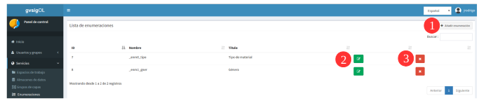
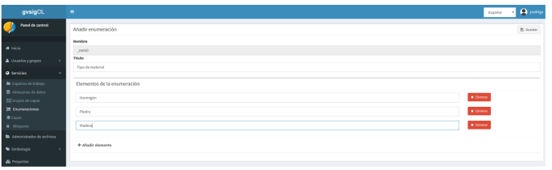
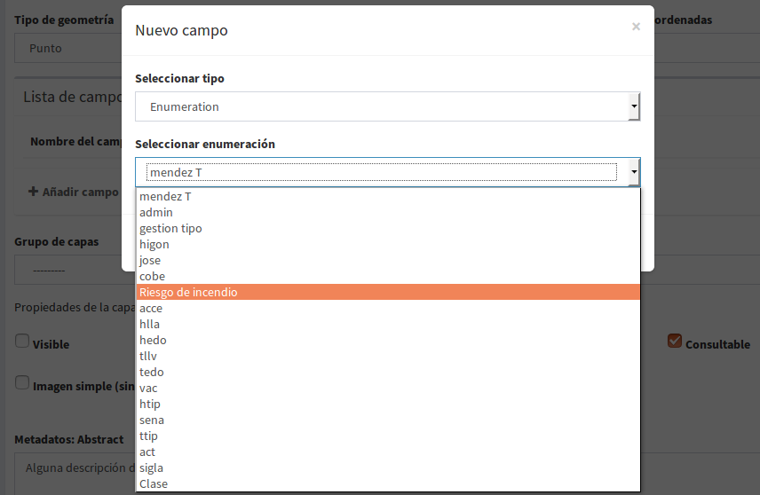
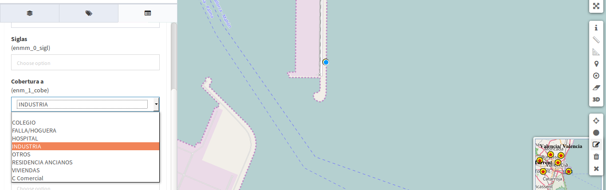
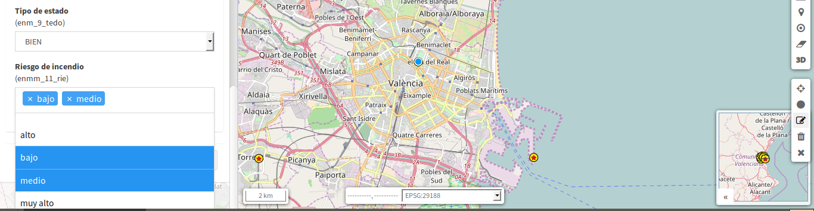

3. Tipos de datos
=================

3.1 Crear, modificar y eliminar listas de enumeraciones
-------------------------------------------------------
Puede añadir(**1**), actualizar(**2**) y eliminar(**3**) ingresando al menú principal, en la entrada de *Tipos de datos* - *'enumeraciones'*.

Desde el formulario de enumeraciones podremos añadir o eliminar los items que forman parte del listado de enumeración.

   
Por ejemplo, un listado de enumeración que represente los distintos riesgos que pueden existir en un incendio:
 
- título: 'Riesgos de incendios' 
- nombre: asignado por defecto en el sistema, ejemplo: *enm_1*
- Items: 

    * muy bajo, 
    * bajo 
    * medio
    * alto 
    * muy alto
    
- Al dar guardar, el nombre final del listado sera: *enm_1_ries*

.. NOTE::
   Este listado puede ser usado tanto para el tipo de dato 'enumeración' como 'múltiple enumeración'. 
   En caso de que se elija el tipo de dato 'múltiple enumeración' la base de datos convierte automáticamente la nomenclatura del campo por: *enmm_1_ries*
   
   
3.2 Asignar tipo de dato 'enumeración' o 'múltiple enumeración' a una tabla
---------------------------------------------------------------------------
Existen dos opciones: desde una capa vacía creada en el sistema o añadiendo el campo a la tabla de atributos desde la Base de Datos.

3.2.1 Desde 'crear capa vacía' en el sistema
~~~~~~~~~~~~~~~~~~~~~~~~~~~~~~~~~~~~~~~~~~~~
en la sección de 'añadir campos',  seleccionamos:

* Seleccionar tipo: 'enumeracion' o 'múltiple_enumercaión'
* Seleccionar enumeración: escoger el listado que se quiera, esta opción es válida para ambos tipo de datos.

.. NOTE::
   Cuando se elije un listado como tipo de dato 'múltiple enumeración', la base de datos guardará de forma automática la nomenclatura correspondiente, es decir, añade una "m" al nombre de la lista, ejemplo: '**enmm_1_ries'**

Cuando la capa se haya publicado en un proyecto y se inicie su edición, en estos campos se desplegarán el listado con los items y se podrá seleccionar uno de ellos para asignarlo como atributo de un elemneto del mapa,si es 'enumeración' o varios itenms si es de tipo 'múltiple'.

* Ejemplo de listado para tipo 'enumeración': 
 

   
* Ejemplo para el listado de tipo 'múltiple enumeración':   
 

  
 
Los campos de control interno ("modified_by" y "last_modification") se generan de forma automática por el sistema, es decir, no hay necesidad de crearlos.
   
   
3.2.2 Añadir tipos de datos desde la Base de datos.
---------------------------------------------------

Se debe tener acceso y permisos sobre la base de datos para realizar este tipo de operaciones.
    
Para ello se deben crear los nuevos campos en la tabla con el nombre exactamente igual al nombre de su nomenclatura y fijarle tipo de dato 'chararter_varyin' o algun otro de tipo texto.

Esta opción es válida para los diferentes tipos de datos, enumeraciones y de control interno. Ejemplo:

* Enumeración - añadir nuevo campo con el *nombre de la lista enumercaión*: "enm_#_name" y tipo de dato: texto, varchar, chararter
* múltiple Enumeración - añadir nuevo campo con el *nombre de la lista enumercaión mas un "m" adicional: "enmm_#_name" y tipo de dato: texto, varchar, chararter
* Datos de contro interno:

   - añadir nuevo campo con el nombre exacto: "modified_by" y de tipo texto
   - Añadir nuevo campo con el nombre exacto: "last_modification" y tipo texto

Realizado cualquiera de estos pasos, ya se podrá publicar la capa en el sistema y estos campos funcionarán de la mimsa manera que cuando se crean desde capas vacías.
