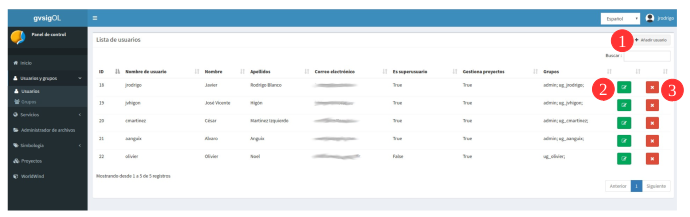

1. Usuarios y grupos de usuario
===============================

1.1 Crear, modificar y eliminar usuarios
----------------------------------------
La gestión de usuarios y grupos de usuarios podrán ser gestionados por un administrador del sistema o un usuario con rol de 'superusuario'. La entrada *"Usuarios y grupos"* se encuentra disponible en el menú del panel de control:

Desde la vista de usuarios podemos ver el listado de usuarios disponibles, así como:

   - Crear(**1**), 
   - Actualizar(**2**) ó
   - Eliminar usuarios(**3**).

Cuando se crean nuevos usuarios asignándole un privilegio de 'superusuario' o 'gestion', en el sistema se les genera automáticamente los siguientes espacios:

* 1. su propio grupo de usuarios y pertenecerán a éste por defecto.
* 2. Su espacio de trabajo 
* 3. Su almacén de base de datos
* 4. y su directorio en administrador de archivos.

.. note::
   Un usuario puede pertenecer a varios grupos y un grupo puede contener varios usuarios.

Los campos que aparecen en el formulario de 'crear usuarios' (**1**) son los siguientes:

*   **Nombre** y **apellidos** reales del usuario

*   **Nombre de usuario: (Obligatorio)** Alias con el que se accederá al sistema

*   **Contraseña**: debe ser diferente al nombre y alias.

*   **Es superusuario**: Indicamos si el usuario implementará el rol de superusuario, con lo que tendrá permisos totales sobre la plataforma

*   **Puede gestionar proyectos**: Indicamos si el usuario implementa el rol de gestión

.. image:: ../images/user_group2.png
   :align: center

* En la parte inferior del formulario de usuarios, aparece un listado con los grupos disponibles. Si asignamos el usuario a algún grupo, este podrá acceder a las entidades definidas en el grupo (proyectos, capas, ...).

.. note::
   Si no se activa ninguno de los roles: 'superusuario' o de 'gestión', el rol que tendrá el usuario será: 'básico', y solo tendrá acceso a los proyectos que otro usuario con mayor privilegio le haya asignado dentro de un grupo de usuarios. Con este privilegio 'básico', tampoco se genera ninguno de los cuatro espacios en el sistema antes mencionados.

En la opción de 'actualizar' (**2**) se podrá editar los privilegios y asignar o cambiar de grupos de usuarios a los que pertenece un usuario.

1.2 Crear y modificar grupos de usuario
---------------------------------------
Los permisos para gestionar el sistema, las capas o proyectos, siempre serán dados a nivel de grupos de usuarios y *NO por usuario individual*. Por lo tanto, **los usuarios siempre deberán pertenecer a un grupo de usuarios**. 

Un grupo puede contener varios usuarios y éstos últimos heredarán todos los privilegios que el grupo tenga asignado a nivel de administración y gestión. 

Un nuevo usuario con algún privilegio, por defecto tendrá su propio grupo y estará asignado en el mismo, pero los usuarios 'básicos' se les debe indicar a cual grupo pertenecerá.

Desde la vista de grupos podemos ver el listado de grupos disponibles, así como crear(**1**) o eliminar grupos(**2**).

.. image:: ../images/user_group3.png
   :align: center

Los campos que aparecen en el formulario de grupos son los siguientes:

*   **Nombre** del grupo

*   **Descripción** del grupo

.. note::
   Actualmente no está soportada la edición de grupos de usuarios. Si se desea cambiar un grupo de usuarios es necesario eliminarlo y crearlo de nuevo.