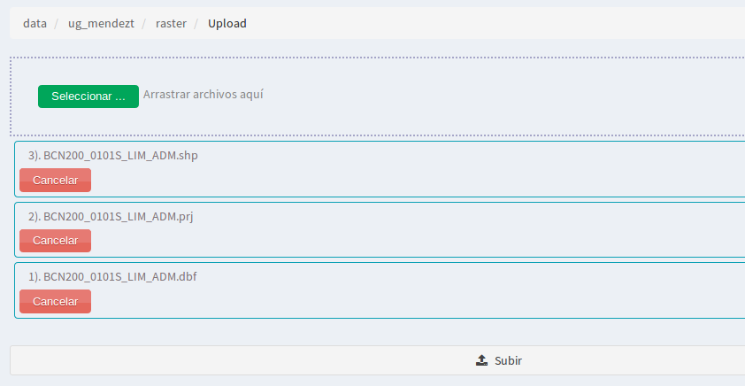
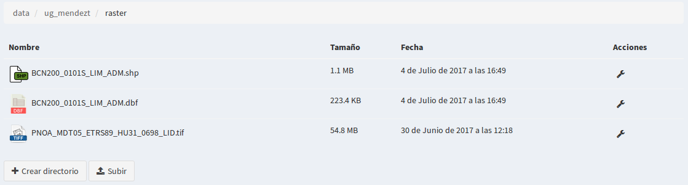

4. Gerenciador de arquivos
============================

4.1 Criando diretórios
---------------------

Nós poderemos criar diretórios para organizar nossos arquivos dentro de um diretório raiz. 
 Para eles selecionaremos o botão *“criar diretório”*, e introduziremos o nome do novo diretório.

.. image:: ../images/dirs2.png
   :align: center

Isso criará um novo subdiretório dentro do diretório raiz.

- Você pode criar quantos diretórios quiser.

- Atualmente os formatos suportados pelo gerenciador de arquivos são *"Shapefile y GeoTIFF"*.

- Os diretórios só têm a opção de ser 'excluídos', no lado direito haverá uma ferramenta na forma de uma *'chave'* quando você clicar, você terá a opção *"excluir diretório”*, se selecionado o dirétorio e todo o seu conteúdo será excluído.

.. nota::
       Será restringida a opção de excluir, para aqueles diretórios que contenham arquivos '.tif' que estão sendo utilizados em algum armazém de dados.

4.2 Carregar ficheiros shapefile ou GeoTiff
--------------------------------------
Esta opção permite-nos carregar os ficheiros (ficheiros) tiff ou shape num directório, este último a ser exportado mais tarde para alguma armazém da BD.

O formato shapefile é um formato multi-arquivo e tem um conjunto de ficheiros necessários para o seu bom funcionamento.

Estes ficheiros têm as seguintes extensões:

*   **shp:** Armazena as entidades geométricas dos objectos.

*   **shx:** Armazena o índice de entidades geométricas.

*   **dbf:** base de dados em formato dBASE, onde são armazenadas as informações sobre os atributos.

Além desses três arquivos requeridos, opcionalmente outros podem ser utilizados para melhorar o funcionamento das operações de consulta ao banco de dados, informações sobre a projeção cartográfica ou armazenamento 
de metadatos. Entre eles, destaca-se:

*   **prj:** É o arquivo que guarda a informação referente ao sistema de coordenadas no formato WKT.

Para exportar corretamente para o DB, basta carregar os três primeiros arquivos. Os passos para fazer o upload são:

- Nós somos localizados de um diretório ou subdiretório onde nós queremos adicioná-lo
- Clique no botão *'carregar'*
- Na nova janela clique no botão 'selecionar', a partir daí poderá navegar pelos nossos diretórios locais do computador e selecionar os três ficheiros shapefile (shp, dbf, shx) ou o ficheiro (tif). Há também a opção de arrastar os arquivos.
- Os arquivos podem ser carregados selecionando um por um ou compactados em formato zip.
- Clique novamente no botão 'carregar' e a janela mostra o progresso do carregamento do ficheiro.

- Uma vez carregados os ficheiros shapefile aparecerão no diretório onde o carregámos, embora só veremos os ficheiros com a extensão *"shp"* e *"dbf"*.
- No caso do raster, o ficheiro mostrado é o *"tif"*

4.3 Exportar shapefile para o banco de dados
------------------------------------------
Entre as operações que poderemos realizar nos ficheiros shapefile, existe a de *“Exportar a base de dados”* e *“excluir ficheiro”*, esta última apagará no servidor tanto o ficheiro 'shp' como o resto dos ficheiros associados (.shx, .dbf, .prj, …).

Para a **opção exportar** selecione a operação no menu de operações do ficheiro **"shp"**.

.. image:: ../images/dirs5_2.png
   :align: center

A seguir, será mostrado o formulário com os parâmetros necessários para realizar a exportação.

.. image:: ../images/dirs6_exportar_shp_a_bd.png
   :align: center

Aparece uma mensagem de aviso no cabeçalho do formulário:

" *Antes de exportar o shapefile, verifique o nome das colunas. Os nomes não podem conter espaços ou caracteres especiais.* "

com isso, o usuário é previamente informado de que o arquivo a ser exportado deve ter um mínimo de características para que o BD possa reconhecê-lo e então o sistema o publique corretamente. Também é importante que o usuário tenha claro, seu SRC, codificação de caracteres e esteja em conformidade com a topologia correta de um arquivo vetorial.

- **Modo de criação de tabelas**: Existem três maneiras de exportar a tabela para o BD
 
   * 1- **Criar:** Esta opção é a mais comum ao exportar uma camada pela primeira vez, ou seja, ela ainda não existe no DB.
   * 2- **Adicionar:** Esta opção é usada quando a camada já existe no DB e você quer adicionar mais registros a ela. Neste caso a estrutura da tabela que está sendo exportada deve ser exatamente a mesma que a da camada que está no repisotório do DB (deve até ser indicada na caixa de nome, o exato 'nombre_de_capa' ao do BD. Também é importante considerar que o sistema não discrimina a duplicidade de registros entre as duas camadas, ou seja, adicionará tudo o que encontrar na tabela para exportar. Por esta razão, se esta opção for utilizada, recomenda-se a utilização da tabela apenas com os novos registros que se pretende adicionar à camada DB existente, evitando assim a duplicação nos registros.  
   * 3- **Superescrever:**  Como seu nome indica é 'sobrescrever' ou 'substituir' uma camada que já existe no DB com o novo que está sendo exportado. Neste caso você tem que ter cuidado porque a camada do repositório a ser substituída deixará automaticamente de existir e em seu lugar estará a tabela que está sendo exportada. Para esta opção, deve também ser indicada na " caixa do nome ": o nome da camada exactamente o mesmo que o armazenado na base de dados.

- **Armazém de dados de destino** você deve selecionar o depósito onde pretende adicionar a tabela e este deve ser do tipo Postgis. O sistema só mostra os depósitos disponíveis (esses são esquemas que devem existir no DB e são conectados ao sistema por meio dos parâmetros de conexão quando um data warehouse do tipo postgis é criado).

- **nome** indica o nome da tabela como será armazenada no DB, deve ser sempre em minúsculas, sem caracteres especiais e sem espaços vazios.

- **Sistema de referência de coordenadas (CRS)**  O sistema contém todos os EPSG da tabela *'Spatial_ref_sys'* e o utilizador pode atribuir o SRC correspondente à tabela.

- **Codificação de caracteres**  Esta é a codificação de caracteres usada para gerar o shapefile. Você pode escolher entre um combo que exibe, os mais usados são 'Latin1' para windows e 'utf-8' para linux.

.. nota::
       Se não estiver claro qual é a codificação e uma vez exportados e publicados, os atributos alfanuméricos da camada são mostrados com caracteres especiais, você pode sempre vir a esta opção e reexportar a camada com a opção 'Superescrever' e alterar a codificação para que o sistema mostre os atributos alfanuméricos corretamente.

Preenchido o formulário, clique em **'exportar'** e a camada já estará disponível para ser publicada a partir da entrada de *'serviços'* - *'camada'*

4.4. Exportar GeoTIFF
---------------------
GeoTIFF é um padrão de metadados de domínio público que permite que informações georreferenciadas sejam incorporadas em um arquivo de imagem no formato TIFF.

- Informações adicionais incluem o tipo de projecção, sistemas de coordenadas, elipsóide e datum e tudo o que é necessário para que a imagem seja posicionada automaticamente num sistema de referência espacial.

- Os arquivos GeoTIFF têm uma extensão .tif ou .tiff.

- Para carregá-los no directório procederemos da mesma forma que com os ficheiros shapefile, só que neste caso será um único ficheiro.

- Para **'Exportar'** ele, *NÃO procede da mesma forma que o shapefile*, neste caso **é preciso ir ao armazém de dados e criar um novo armazém do 'tipo GeoTiff'**.

- Depois de ter definido o seu armazém de dados, você pode ter a camada a ser publicada, bem como o shapefile da entrada de *'serviços'* - *'camada'*.

