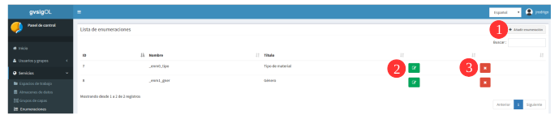
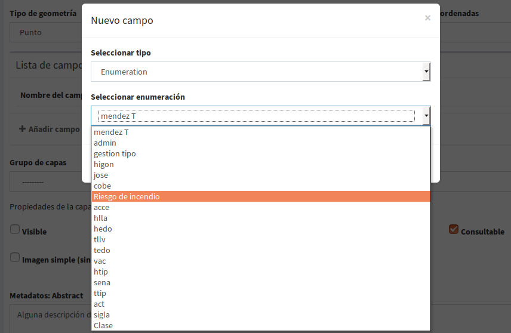
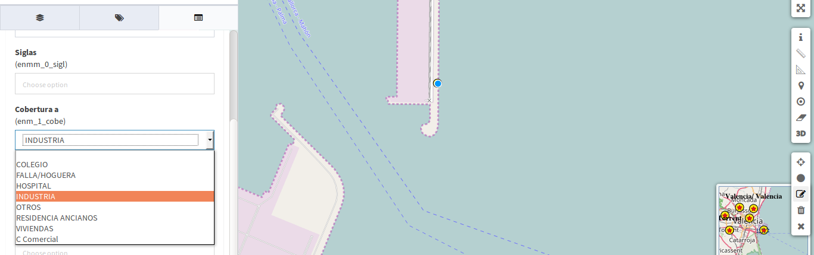

3. Tipos de dados
=================

3.1 Criar, modificar e excluir listas de enumeração
-------------------------------------------------------
Você pode adicionar (**1**), atualizar(**2**) e excluir(**3**) entrando no menu principal, na entrada de *Tipos de dados* - *'enumerações'*.

Do formulário de enumeração podemos adicionar ou remover os itens que fazem parte da lista de enumeração.

.. image:: ../images/enum2.png
   :align: center
   
Por exemplo, uma lista de enumeração que representa os diferentes riscos que podem existir num incêndio:
 
- título: 'Riscos de incêndio' 
- nome: atribuído por padrão no sistema, exemplo: *enm_1*
- Itens: 

    * muito baixo, 
    * baixo 
    * médio
    * alto 
    * muito alto
    
- Ao salvar, o nome final da lista será: *enm_1_ries*

.. NOTA::
   Esta listagem pode ser utilizada para tipos de dados de 'enumeração' e 'enumeração múltipla'. 
   No caso de ser escolhido o tipo de dados 'enumeração múltipla', a base de dados converte automaticamente a nomenclatura do campo para: *enmm_1_ries*
   
   
3.2 Atrubuir o tipo de dados 'enumeração' ou 'enumeração múltipla' a uma tabela
---------------------------------------------------------------------------
Existem duass opções: a partir de uma camada vazia criada no sistema ou adicionando o campo à tabela de atributos da Base de Dados.

3.2.1 De 'criar camada vazia' no sistema
~~~~~~~~~~~~~~~~~~~~~~~~~~~~~~~~~~~~~~~~~~~~
na seção de 'adicionar campos',  selecione:

* Selecionar o tipo: 'enumeração' ou 'enumeração_múltiple'
* Selecionar enumeração: selecionar a lista desejada, esta opção é válida para os dois tipos de dados. 

.. NOTE::
   Quando uma lista é escolhida como tipo de dados "enumeração múltipla", a base de dados guarda automaticamente a nomenclatura correspondente, ou seja, acrescenta um "m" ao nome da lista, por exemplo: '**enmm_1_ries'**

Quando a camada tiver sido publicada num projecto e a sua edição começar, a lista com os itens será apresentada nestes campos e pode seleccionar um deles para o atribuir como atributo de um elemento do mapa, se for 'enumeração' ou vários itenms se for do tipo 'múltiplo'. 

* Exemplo de listagem do tipo 'enumeração': 
 

   
* Exemplo de listagem do tipo 'enumeração_múltiple':   
 
.. image:: ../images/enum5.png
   :align: center 
  
 
Os campos de controle interno ("modified_by" e "last_modification") são gerados automaticamente pelo sistema, ou seja, não há necessidade de criá-los.
   
   
3.2.2 Adicionar tipos de dados do banco de dados.
---------------------------------------------------

Você deve ter acesso e permissões no banco de dados para realizar este tipo de operações.
    
Para isso, é necessário criar os novos campos na tabela com o nome exatamente igual ao nome da nomenclatura e definir o tipo de dados  'chararter_varyin' ou outro tipo de texto.

Esta opção é válida para os diferentes tipos de dados, enumerações e controles internos. Exemplos:

* Enumeração - adicionar novo campo com o *nome da lista enumeração*: "enm_#_name" e tipo de dados: texto, varchar, chararter
* Enumeração múltiple - adicionar um novo campo com o * nome da lista enumeração mais um adicional "m": "enmm_#_name" e tipo de dados: texto, varchar, chararter
* Dados de controle interno:

   - adicionar um novo campo com o nome exato: "modified_by" e de tipo de texto
   - Adicionar novo campo com nome exato: "last_modification" e tipo texto

Após qualquer uma dessas etapas, a camada pode ser publicada no sistema e esses campos funcionam da mesma forma que quando criados a partir de camadas vazias.
