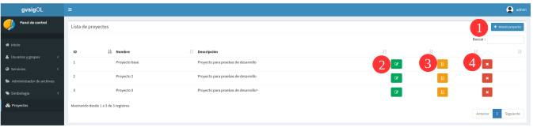
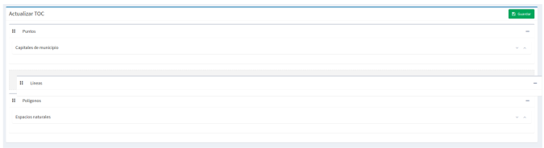

6. Projetos
============

6.1 Criação, modificação e exclusão projetos
-----------------------------------------
Para criar um novo projecto seleccione a partir do painel de controlo a opção *"Projetos"*, do menu esquerdo, que nos levará à vista de lista de projectos.

Depois seleccionamos a opção *"Adicionar projeto"* (**1**), que está na parte superior direita, para abrir a vista que nos permitirá criar um novo projecto. 

.. image:: ../images/project2.png
   :align: center

O formulário para criar um novo projeto consiste nos seguintes campos:

*   **Nome** do projeto

*   **Descrição** do projeto

*   **¿É público?:** Indicamos se o projeto será acessível publicamente, sem a necessidade de ser autenticado na plataforma.

*   **Visualizar**: Centralizar o mapa e adicionar o zoom desejado

*   **Imagem**: Logotipo do projeto que será mostrado na lista de projetos. Se nenhum estiver definido, um será atribuído por padrão.

Além destes campos na parte inferior aparecerão duas listas:

.. image:: ../images/project3.png
   :align: center
   
*   **Camadas base**: Permite atribuir as camadas base do projeto,  bem como as que serão carregadas por padrão. 

*   **Grupos de usuario**: Grupos de usuários (funções) para os quais o projeto estará disponível. Usuários administradores terão acesso a todos os projetos.

*   **Grupos de camadas**: Grupos de camadas que estarão disponíveis no visualizador para este projeto.

Para modificar um projeto existente selecione o botão(**2**) *"Atualizar projeto"*, que se está no lado direito de cada linha da lista de projetos. 

Para excluir um projeto existente, selecione o botão (**4**) *"Excluir projeto"*, que está no lado direito de cada linha da lista de projetos.

6.2 Definir ordem TOC
-------------------------------
Para cada projeto é possível definir uma determinada ordem de camadas e grupos de camadas. Para isso, selecione o botão (**3**) *"Classificar TOC"* na lista de projetos. 

Então na vista aparecerão os grupos de camadas e dentro deles se nós os desdobrarmos as camadas. As camadas podem ser ordenadas usando as setas no lado direito das camadas, enquanto os grupos de camadas podem ser ordenados usando arrastar e soltar.

