2. Serviços
============

2.1 Criar e excluir espaços de trabalho
----------------------------------------
Puede criar(**1**), atualizar (**2**) e excluir(**3**) espaços de trabalho da lista de espaços de trabalho. Se você excluir um espaço de trabalho, todas as armazenagens de dados e camadas associadas serão removidas do gvSIG Online. 

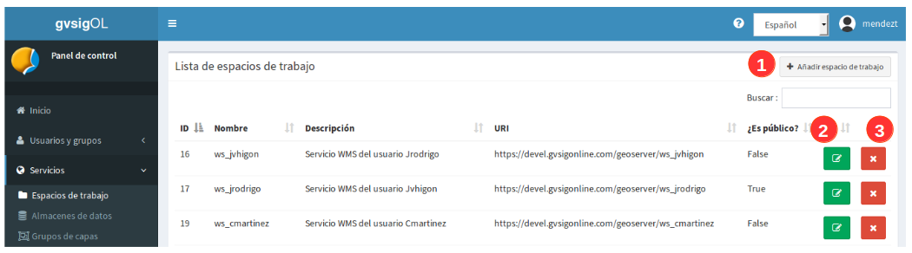

Para criar um novo espaço de trabalho (**1**) você deve preencher o seguinte formulário:

- **Nome**, não pode conter espaços, sinais de pontuação ou caracteres especiais como *"ç"*.
- **Descrição**, isso será refletido na página onde os serviços são servidos.
- **Ative e opção '¿é público?'**, esta opção permitirá que os serviços sejam públicos na página principal de gvsigOnline. Caso contrário, serão serviços privados que também podem compartilhar o link, mas você deve fornecer o nome de usuário e a senha do proprietário do serviço.

- Normalmente não é necessário modificar as URLs dos serviços (estas são geradas automaticamente quando o nome do novo espaço de trabalho é adicionado).

.. image:: ../images/ws1_3.png
   :align: center

2.1.1 Publicação de serviços WMS e WFS
~~~~~~~~~~~~~~~~~~~~~~~~~~~~~~~~~~~~~~
Gvsigonline gera o Web Map Service (WMS) e o Web Feature Service (WFS). Os serviços são criados a partir do nível de 'espaços de trabalho', ou seja, todas as camadas publicadas em um espaço de trabalho serão aquelas contidas em seus respectivos WMS e WFS.

A partir do botão de actualização (**2**) pode modificar a **'descrição'** e activar ou desactivar a opção **'público'**, com esta última opção os links dos serviços estarão disponíveis com acesso gratuito. Caso eles não sejam públicos, o link de serviço pode ser compartilhado e usado, mas você deve indicar um usuário e senha com permissões.

Para obter os links para os serviços WMS e WFS, vá até a página principal (home) do Gvsig Online e escolha a entrada **"Serviço de Mapas"**

.. image:: ../images/ws1_4.png
   :align: center

Uma página com todos os serviços de cada espaço de trabalho público será exibida.

.. image:: ../images/ws1_5.png
   :align: center

.. nota::
   Para ser capaz de visualizar corretamente os serviços WMS e WFS, você deve usar os links e fazer as respectivas conexões no desktop GIS diferente ou sistemas que os suportam.

2.2 Criar, modificar e excluir armazéns de dados
--------------------------------------------------
Você pode adicionar (**1**), atualizar(**2**) e excluir(**3**) armazéns de dados da lista de bancos de dados.

.. image:: ../images/ds1.png
   :align: center

Os armazéns são criados dentro de um espaço de trabalho. Por conseguinte, ao criar um novo armazém é obrigatório indicar o 'espaço de trabalho' a que este pertencerá.

.. nota::
      É importante entender que para adicionar um armazenamento de dados do tipo PostGis, é preciso partir de uma fonte de dados previamente existente, ou seja, que o banco de dados e o esquema indicados nos parâmetros de conexão existem.
 
No formulário de criação do armazém de dados devemos seleccionar o espaço de trabalho a que pertencerá, o tipo de armazém, 
o nome (sem caracteres especiais) e os parâmetros de ligação.

O formulário inclui vários exemplos de parâmetros de conexão para cada tipo de depósito. Você pode criar três tipos de armazéns:

2.2.1 PostGIS vectorial:
~~~~~~~~~~~~~~~~~~~~~~~~
A fim de adicionar um vetor PostGIS tipo armazenamento de dados, o banco de dados espacial já deve existir. 
Desta forma, o que fazemos é registar no gvSIG Online (e no Geoserver) os parâmetros de ligação a esta base de dados.

Será necessário indicar os parâmetros de ligação à Base de Dados, isto permitirá criar a nova unidade de armazenamento no sistema que fará referência a um esquema existente na Base de Dados, ou seja, **é obrigatório que o esquema que está registrado nos parâmetros de ligação já esteja criado dentro da DB**.

.. image:: ../images/ds2.png
   :align: center

2.2.2 GeoTiff
~~~~~~~~~~~~~
Para adicionar um armazenamento de dados do tipo raster, o arquivo .tif (**georreferenciado**) deve existir previamente no servidor, ou seja, carregado ao **'gerenciador de arquivos'**. Neste caso estamos registrando no gvSIG Online o caminho para este arquivo raster.

Para a armazenagem de dados de tipo raster o formulário mudará e nos permitirá selecionar o arquivo que formará o armazém.

.. image:: ../images/ds3.png
   :align: center

Quando você abre o diálogo de seleção de arquivos, ele mostrará uma janela com o **'gerenciador de arquivos'**, de onde você pode selecionar o arquivo raster que você enviou anteriormente.

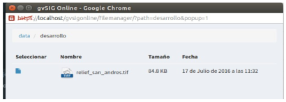

.. nota:: 
      - Após fazer o upload do arquivo raster para um diretório do gerenciador de arquivos, é necessário criar seu próprio banco de dados para ser publicado posteriormente em um projeto (geoportal).
    
      - Depois que o raster é publicado no sistema, NÃO se pode excluir o arquivo 'gerenciador de arquivos', pois a loja aponta para esse caminho configurado.

2.2.3 WMS em cascata:
~~~~~~~~~~~~~~~~~~~~~
Isto permite armazenar um armazém do tipo Web Map Service (WMS), onde se armazena o endereço do serviço que se pretende consultar e publicar no projecto.
.. image:: ../images/ds5.png
   :align: center

.. nota::
   	A exclusão de um armazenamento de dados do tipo vetorial ou geotípico postGIS remove do sistema todas as camadas publicadas associadas ao armazenamento.

     
   Por outro lado, a fonte de dados associada (a base de dados espacial ou o ficheiro raster correspondente) não será eliminada.

**É importante lembrar que a criação de um DB, SEMPRE SERÁ UN PASSO ANTERIOR para a publicação das camadas que elas possuem. Os serviços e camadas das armazéns WMS e Geotiff devem ser publicados da mesma forma que uma camada vectorial mas seleccionando o respectivo repositório.**   

2.3 Criar, modificar e excluir Grupos de camadas
-----------------------------------------------
Da lista de grupos de camadas podemos adicionar novos (**1**), atualizar (**2**), limpar caché (**3**) e excluir grupos de camadas (**4**).

.. image:: ../images/layer_group.png
   :align: center
   
2.3.1 Adicionar novo grupo de camadas
~~~~~~~~~~~~~~~~~~~~~~~~~~~~~~~~~
Os grupos de camadas serão atribuídos aos 'projetos' através da configuração destes últimos.

Para criá-lo selecione o botão **'adicionar novo grupo de camadas'**, será exibido um formulário onde você terá que atribuí-lo:

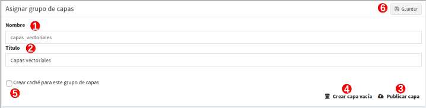

- **1- Nome**: en minúsculas, sem espaços e caracteres especiais

- **2- Título**: Pode ser escrito sem qualquer restrição e será o nome mostrado no visualizador de mapas.

- **3- Publicar camada**: primeiro mostra uma pergunta "É necessário salvar primeiro o grupo de camadas, ¿Você quer continuar?", indica **"aceitar"** e aparecerá uma janela para configurar todos os paramêtros de uma camada que será adicionada ao grupo e será publicada no sistema.

- **4- Criar camada vazia**: Assim como a camada de publicação, a mensagem aparecerá e quando "aceitar", será ativada a janela para adicionar uma camada sem registros no sistema, ela será automaticamente armazenada no DB e publicada. 

- **5- Cache de grupo**: Esta opção permite que todas as camadas do grupo sejam armazenados em cache como uma única camada, ou seja, faz a solicitação para mostrar todas as camadas do grupo no mapa como um único serviço e não como camadas independentes. 

- **6- Salvar**: Salvar as alterações do grupo.

2.3.2  Atualizar grupo de camadas
~~~~~~~~~~~~~~~~~~~~~~~~~~~~~~~~
Esta opção permitirá:

- editar el título do grupo

- ativar ou desativar o cache do grupo.

- Gerencie suas camadas, como mostrado na entrada de **camadas** desta opção para **atualizar grupo de capas** você também será capaz de: publicar camadas, criar camada vazia e, portanto, atualizá-las, configurá-las ou excluí-las)

- **Estabelecer a ordem do toque das camadas, como elas querem ser mostradas na árvore de camadas do geoportal**

2.3.3 Limpar chache
~~~~~~~~~~~~~~~~~~~~
Utilize para atualizar/limpar o cache de todas as camadas do grupo, mas como se fosse uma única camada.

2.3.4 Remover grupo de camadas
~~~~~~~~~~~~~~~~~~~~~~~~~~~~~
Quando se dá a opção de **remover grupos de camadas** e elas contêm uma ou mais camadas, as mesmas não são eliminidas do sistema, mas atribuídas a um grupo de camadas chamado **'padrão'**, portanto elas continuam a serem publicadas no sistema, mas não atribuídas a nenhum projeto.

2.4 Publicar, criar, modificar e excluir camadas
-----------------------------------------------
A partir da lista de camadas podemos aceder à sua gestão. A partir desta entrada é possível publicar camadas existentes em armazém de dados (**6**), ou criar camadas vazias(**7**) onde os campos são definidos manualmente e armazenados automaticamente em um armazenamento de dados e publicados no sistema.

.. image:: ../images/layer1.png
   :align: center

Em cada uma das camadas podemos ver e realizar as seguintes operações:

2.4.1 Informação básica da camada
~~~~~~~~~~~~~~~~~~~~~~~~~~~~~~~~~~~
Cada camada vetorial, raster ou serviço (WMS) que for publicado corretamente, será listado nesta visualização e as seguintes informações serão exibidas (**1**):

- **ID** É o identificador único com o qual a camada foi registrada no sistema, geralmente para uso interno.

- **Preview**: Como seu nome indica, é uma pré-visualização das geometrias que contém uma camada, quando lhe é atribuída uma simbologia também pode apreciar o seu estilo. Cada vez que as geometrias são adicionadas à camada ou o estilo é alterado, esta pode ser actualizada utilizando a opção **limpar cache** (**4**). No caso desta visualização se assemelhar a uma imagem quebrada, é um sinal de que houve um erro no curso da publicação ou a camada é inconsistente com o sistema e deve ser revista com um GIS desktop. 

- **Nome**:  é o nome da camada como criado no armazém de banco de dados. Será sempre minúscula, sem espaços e sem caracteres especiais.

- **Título**: É o apelido que é atribuído à camada e como ele será publicado no projeto. Neste caso não tem restrições em caracteres especiais ou espaços.

- **Armazém de dados**: É o nome do repositório de banco de dados onde a camada é armazenada. 

- **Grupo de camadas**: é o nome do grupo de camadas ao qual pertence. Uma camada **deve sempre pertencer a um grupo de camadas a serem publicadas**

- **Ferramentas**: cada camada terá quatro botões de ferramentas configuráveis, Atualizar (**2**), configurar (**3**), limpar cache (**4**) e Excluir camada (**5**)

2.4.2 Atualizar camada - Opções no visualizador - Parâmetro temporário
~~~~~~~~~~~~~~~~~~~~~~~~~~~~~~~~~~~~~~~~~~~~~~~~~~~~~~~~~~~~~~
Desde el botón verde 'actualizar capa' (**2**) se puede modificar el título de la capa, grupo al que pertenece la capa, permisos de lectura-escritura y otras propiedades del visor como:

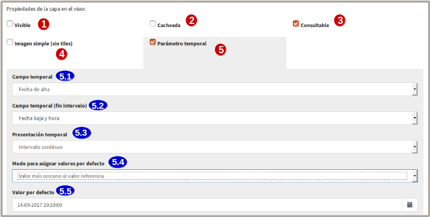
   

**1- Visível**: Se activarmos esta opção, cada vez que o projecto for aberto a camada estará sempre visível no mapa. 

**2- Cache**: O cache de camadas é recomendado para camadas rasterizadas. Para camadas vetoriais (com muitos registros) será conveniente ativá-lo uma vez que seu estilo tenha sido configurado e não haja mais mudanças, caso contrário, você deve sempre ir para o botão (**5**) *limpar o cache* de camada para reonhecer as novas mudanças.

**3- Consultável**: Permite visualizar ou consultar a informação alfanumérica da tabela de atributos, isto é, caso não esteja ativada, somente as geometrias serão visíveis no mapa e NÃO seus atributos, mas se um usuário tiver permissões de escrita sobre esta camada, ao colocá-la em edição, SIM que poderá ver e editar os atributos de algum elemento do mapa. 

**4- Imagem simples (sem tiles)**: Com esta opção ativa, vários tesserae NÃO são solicitados a compor a imagem, mas o servidor de mapas é solicitado para uma única imagem. Faz sentido para camadas externas que têm um texto incorporado no mapa (por exemplo, cadastro) ou camadas WMS. 

**5- Parâmetro temporário**: É uma propriedade disponível na camada para poder mostrar no mapa as entidades ou elementos em um instante ou intervalo de tempo definido pelo usuário, pois deve ter pelo menos um campo com o tipo de dados: 'date' ou 'timestamp'. Em outras palavras, esta opção permite representar no mapa as entidades em um determinado momento.

A ativação desta propriedade exibe as opções para o parâmetro de tempo:

* 5.1- **Campo temporário:** Somente os campos de data (date) serão exibidos nesta caixa. Selecione um deles e este campo será usado para procurar os elementos e mostrá-los no mapa.

* 5.2- **Campo de tempo (fim do intervalo):** Igual ao campo anterior, preenche a mesma função, mas esee campo pode ser opcional. É  útil quando você quer definir um intervalo 'Início - Fim entre' os campos 'date' selecionados na caixa anterior e este. Considerando este último campo como a data final do intervalo.

* 5.3- **Apresentação temporária:** Por enquanto, apenas a opção 'intervalo contínuo' é implementada. Ou seja, que os valores são de forma linear de acordo com a faixa escolhida.

* 5.4- **Modo para atribuir valores por defeito:** Esta opção é utilizada para definir um elemento (característica) que será sempre mostrado no mapa quando o layer for activado, ou seja, em layers com um parâmetro temporário activado, nem todas as suas características serão mostradas como uma camada comum, mas um único elemento que é indicado nesta opção será pintado por defeito. 

* 5.5- **Valor por defeito:** Dependendo do que for escolhido na opção anterior (*5.4*), o sistema irá procurar de acordo com a primeiro campo 'date' selecionado (*5.1*), o elemento que tiver a data mais baixa, mais alta, alguma data específica ou a mais próxima da indicada.  

2.4.3 Usando a Opção- 'Parâmetro temporal'
~~~~~~~~~~~~~~~~~~~~~~~~~~~~~~~~~~~~~~~~~
Uma vez configurada a camada com as opções de parâmetro temporário,  vamos ao projeto e atualizar, deve aparecer no painel de conteúdos o novo tabulador de 'visualizar dados históricos' .

Estamos localizados na nova aba 'visualizar dados históricos' e a caixa de seleção da função está ativada, as opções de uso são exibidas.

.. nota::
       Para ativar a função de parâmetro temporário, a layer na árvore de camada deve estar ativa (visível). Caso contrário, ao ativar a verificação da função 'parâmetro temporário', aparecerá ao usuário a seguinte mensagem:*“É preciso ter pelo menos uma camada temporária vísivel”*. 
      
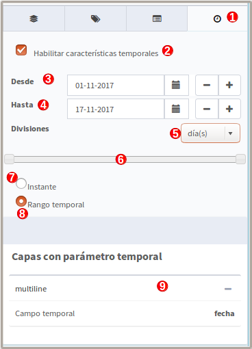
   
**1- Aba Parâmetro temporários**: Entrar na aba 'dados históricos'.

**2- Ativar características temporais**: ativar a caixa de seleção, se as camadas na árvore de camadas não estiverem ativadas, aparecerá uma mensagem avisando que a ferramenta não será ativada até que a camada configurada seja ativada. Quando a função é ativada no mapa, o(s) elemento(s) com a data mais alta será(ão) pintado(s), ou seja, os dados mais recentes.

**3- Desde**: Caixa para adicionar a data de pesquisa específica ou inicial (intervalo). À direita os botões (+) e (-) que farão os saltos um a um de acordo com a resolução seleccionada (5).

**4- Até**: Igual à caixa anterior mas activada apenas quando se especifica "intervalo temporal" (8), considerando esta data como o fim do intervalo de pesquisa.

**5- Divisões**: Resolução em días, horas, minutos, segundos, mês e ano

**6- Barra de localização**: Os botões desta barra são colocados de acordo com as datas e a resolução indicadas. Quando a função temporal é ativada pela primeira vez, os botões estarão no final da barra, uma vez que mostrará as características com a data mais alta ou mais recente.

**7- Instantâneo**: Para localizar uma característica num instante dado ou preciso, basta indicar uma única data na caixa (3).

**8- Intervalo de tempo**: localizar características num intervalo de tempo completo, deve indicar uma data de início (casa 3) e uma data de fim (casa 4).

**9- Camadas com parâmetro temporal**: informação das camadas ativas e os campos de data que utiliza de acordo com a configuração dada.

Por exemplo, no mapa, ativando o temporal com um intervalo de início e fim e resolução por minuto, o seguinte será mostrado no mapa:

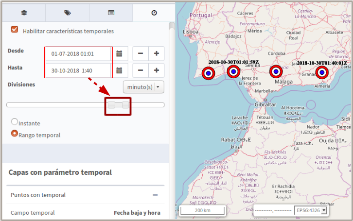

Pode utilizar sempre os botões da opção " barra de localização" ou os (+) e (-) de cada data para apresentar os elementos do intervalo no mapa.

2.4.3 Configuração de camadas
~~~~~~~~~~~~~~~~~~~~~~~~~~~
Na opção 'configure layer' - botão roxo (**3**), você pode configurar os títulos dos nomes dos campos e dar permissões de exibição e edição para cada um deles.

      - Podemos definir aliases para os nomes de campo de cada idioma do sistema selecionado, por exemplo, os aliases definidos em 'Título do campo espanhol' serão visíveis quando o idioma do sistema estiver em 'Espanhol'.
      - Definir quais campos serão visíveis para as ferramentas do visualizador (ferramenta de informação, tabela de atributos, etc...).
      - Ativar quais campos podem ser editados pelo usuário com privilégio de escrita.
      - Finalmente selecione os campos que serão visíveis na ferramenta de informação rápida (i) do visualizador.

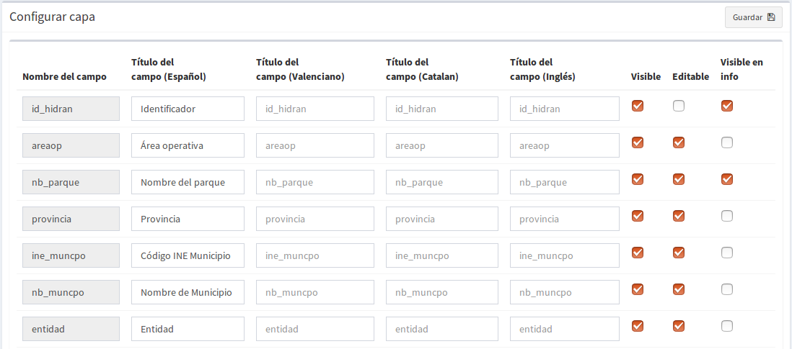

2.4.4 Limpar cache
~~~~~~~~~~~~~~~~~~~
 Esta opção, como o seu nome indica, limpa a cache do layer no servidor de mapas. Muito útil quando fazemos alterações na simbologia da camada.
 
 Este botão amarelo 'limpar cache' (**4**), também atualiza as alterações para gravar novos registros e atributos que foram adicionados/editados a partir de um sig do desktop através da conexão com o banco de dados.

2.4.5 Remover camada
~~~~~~~~~~~~~~~~~~~
Para finalizar, existe também o botão vermelho 'Remover camada' (**5**), esta opção apaga a camada publicada no sistema e seus estilos associados, mas continua a existir (armazenada) no DB, podendo ser publicada novamente embora o estilo deva ser reatribuído.

2.4.6 Publicar camada vetorial, raster o wms
~~~~~~~~~~~~~~~~~~~~~~~~~~~~~~~~~~~~~~~~~~~
A partir desta opção você pode publicar camadas vetoriais, rasterizadas ou wms que tenham sido previamente atribuídas em um armazém de dados.

Para publicar seleccionaremos o botão *"Publicar camada"*, uma vez que acedemos à vista de publicação aparecerá o seguinte formulário.

.. image:: ../images/publish1.png
   :align: center
   
Os passos para publicar uma camada são os seguintes:

*	**Nós selecionamos o armazenamento de dados onde a camada que queremos publicar está localizada, ou seja, a camada vetorial postgis armazenada, a camada rasterizada geotiff ou a WMS armazenada.

*	Em seguida, selecionamos no menu expansível o recurso, ele pode ser digitado e é preenchido automaticamente (Somente os recursos que ainda não foram publicados aparecem).

*	Introduza um título para a camada (será o nome visível no visualizador de mapas).

*	Selecione o grupo de camadas ao qual queremos atribuir a camada.

*	Nós selecionamos as propriedades da camada: visível, cache (recomendado para raster), imagem única (recomendado para wms), consultável.

*	Você pode inserir uma descrição da camada, se você ativou a opção de metadados (Geonetwork), ela será o resumo da mesma.

*	Então nós selecionamos o botão *"Seguinte"*, que nos levará à vista de permissões. Vamos aplicar as permissões de leitura e escrita à camada. Se nenhum grupo de usuários for atribuído na seção de leitura, a camada será vista ou lida por qualquer usuário, ou seja, será uma camada pública.

.. image:: ../images/permissions.png
   :align: center
   
.. nota::
      Para camadas rasterizadas ou wms, apenas as permissões de leitura serão mostradas.
   	
2.4.7 Criar camada vazia
~~~~~~~~~~~~~~~~~~~~~~
Para criar uma camada vazia, seleccione o botão *"Criar camada vazia"*, uma vez que acedemos à vista aparecerá o seguinte formulário.

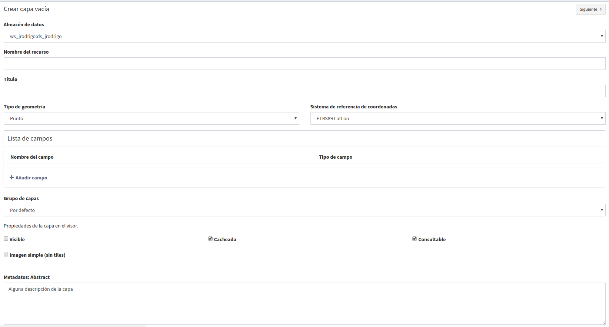
   
As etapas para criar uma camada vazia são as seguintes:

*	Selecione o armazenamento de dados onde a camada será criada (será um armazenamento de dados PostGIS).

*	Entrar um nome para a camada (evitando caracteres especiais e letras maiúsculas).

*	Introduza um título para a camada (será o nome visível no visualizador de mapas).

*	Selecione o tipo de geometria (Ponto, Multiponto, Linha, Multi-Linha, Polígono, MultiPolígono) na lista suspensa.

*	Selecione na lista suspensa o sistema de referência de coordenadas (podemos escrever o nome do código SRC ou EPSG, ele é autocompleto e se houver vários ele exibe uma lista). 

*	Adicionamos um ou mais campos para a camada, para isso seleccionamos o botão *"Adicionar campo"* e aparecerá uma caixa de diálogo onde poderemos seleccionar o tipo de campo e um nome para o mesmo.

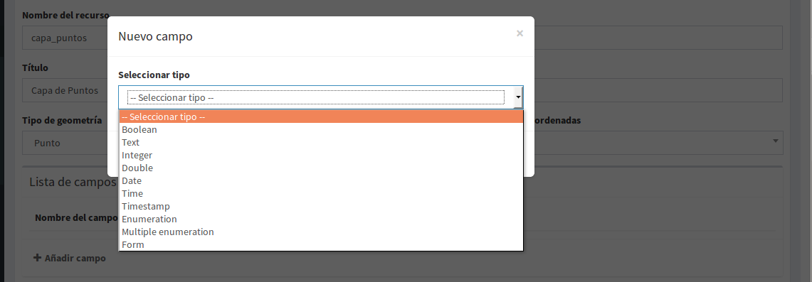
   
.. nota::
   Os tipos de dados suportados são: Booleano, Texto, Inteiro, Duplo, Data, Hora, Date_hour, Formulário (usado para o plugin de questionário online), Enumeração e Enumeração múltipla (para adicionar qualquer um desses dois últimos, você deve ter alguma listagem de enumeração).

*	Nós selecionamos as propriedades da camada: visível, cache (recomendado para raster), imagem única (recomendado para wms), consultável.

*	Se quisermos, podemos introduzir uma descrição da camada.

*	Então nós selecionamos o botão *"Seguinte"*", que nos levará à vista de permissões.A continuación seleccionamos el botón *"Siguiente"*, lo que nos llevará a la vista de permisos.

*   Finalmente vamos aplicar as permissões de leitura e escrita à camada.

.. image:: ../images/permissions.png
   :align: center
   
.. nota::
   	Para camadas criadas a partir do sistema, eles terão automaticamente os campos de controle interno na tabela de atributos.

2.5 Gestão de blocos
-----------------------
a partir desta entrada podemos consultar os blocos activos que têm algumas camadas, bem como desbloqueá-los mas NÃO bloqueá-los. Essas camadas só são bloqueadas ao serem editadas ou se tiverem sido descarregadas através da aplicação móvel. Neste último caso, atenção especial deve ser dada, porque se a camada for desbloqueada do sistema, então a camada não pode ser carregada (exportada) do aplicativo móvel para o sistema.

.. image:: ../images/block1.png
   :align: center

2.6 Gestão da camada base
-------------------------
Os administradores poderão configurar o conjunto de camadas base que estarão disponíveis para adicionar a qualquer um dos projetos.

Para acessar esta funcionalidade, o item correspondente aparecerá no menu 'serviços' do painel de controle.

Na entrada de '*camadas base*' é possível executar operações básicas: adicionar uma nova camada base (**1**), atualizar (**2**) ou remover (**3**).

.. image:: ../images/base_layers.png
   :align: center

A fim de adicionar uma nova camada base (**1**) diferentes tipos de provedores podem ser definidos e para cada um deles seus respectivos parâmetros de conexão.

2.6.1 Capas base WMS/WMTS:
~~~~~~~~~~~~~~~~~~~~~~~~~~
Um nome e um título são indicados (como será visto no projeto). A url do serviço é essencial, assim como conhecer a versão do mesmo. Uma vez indicado, a camada e o formato são marcados. 

.. image:: ../images/base_layers_wms_wmts.png
   :align: center

Quando o projecto é aberto, o mapa mostrará a camada base que foi definida por defeito, mas o painel de conteúdos terá sempre a lista das adições ao projecto, podendo alterá-las e definir a base que pretende.

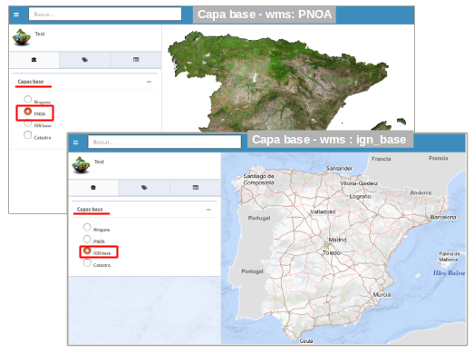

2.6.2 Capas base OSM/tile XYZ:
~~~~~~~~~~~~~~~~~~~~~~~~~~~~~~
Para os tipos OpenStreetMap e tiles XYZ é suficiente indicar o nome, título e URL do serviço.
No caso do OSM genérico, é opcional adicionar a URL, uma vez que o sistema reconhece internamente este serviço selecionando o tipo '*OSM*', então, se a url não for adicionada, ela se conectará ao serviço OSM básico. 

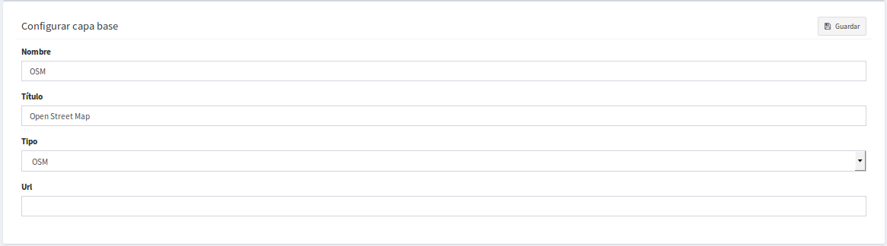

Se forem camadas tiles XYZ, especifique o seu URL e certifique-se de que contém o formato no final: "**/{z}/{x}/{y}.png**", por exemplo, un serviço openlayers disponível deste tipo é "http://{a-c}.basemaps.cartocdn.com/dark_all/{z}/{x}/{y}.png"

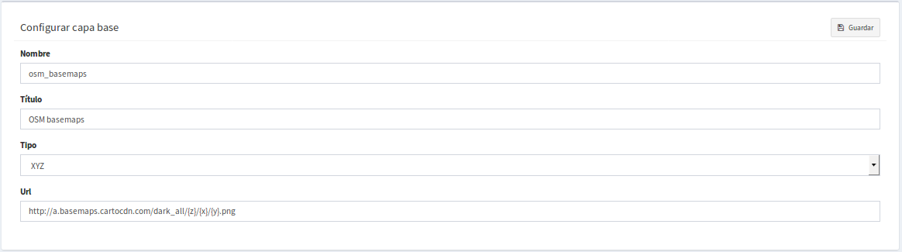

Para obter mais exemplos de outros openlayers de tiles OSM, você pode revisar as seguintes páginas:

*  BlogOpenlayeres_.
 
*  OpenLayers.org_.
 
 .. _BlogOpenlayeres: http://blog.programster.org/openlayers-3-using-different-osm-tiles/

 .. _Openlayers.org: https://openlayers.org/en/latest/examples/localized-openstreetmap.html

As camadas base padrão do OSM e do ladrilho XYZ são exibidas no projeto:

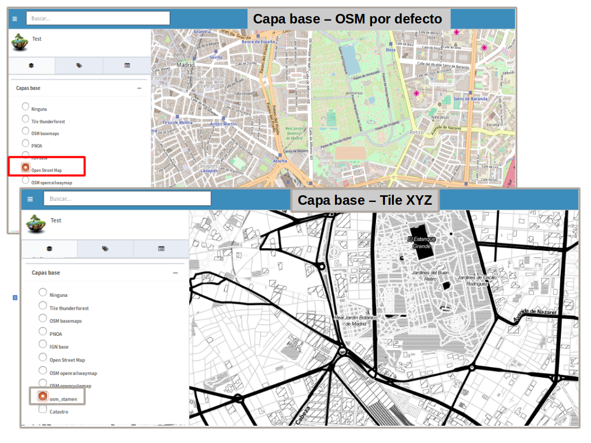

2.6.3 Camadas base Bing:
~~~~~~~~~~~~~~~~~~~~~~
Ao selecionar o tipo '*bing*', você precisará de uma API-KEY para poder usar os serviços da Microsoft e adicionar o nome das camadas disponíveis, por exemplo: '*Road*', '*Aerial*', '*collinsBart*', entre outros. 

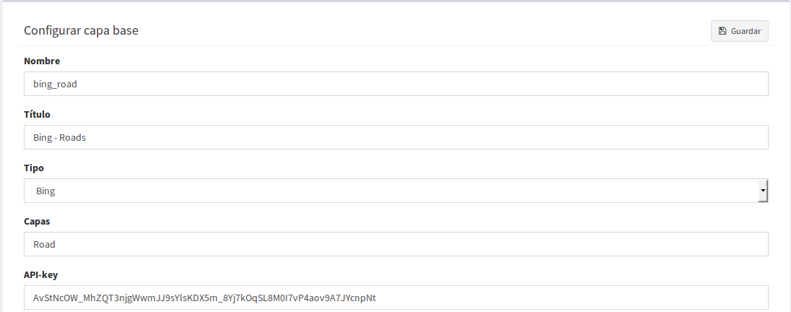
   
As camadas base do Bing são exibidas no projeto:

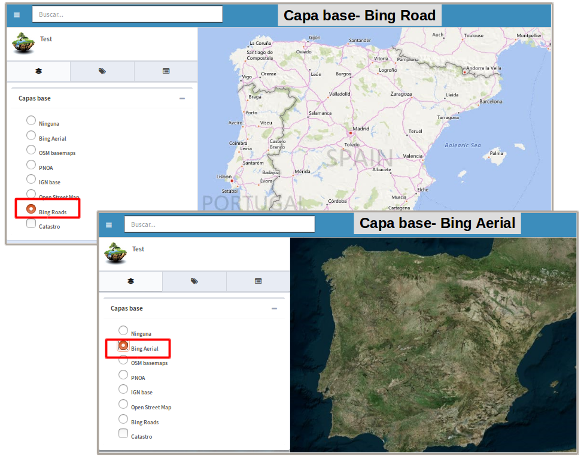

Para mais informações sobre o uso das camadas de base do '*bing*', suas camadas disponíveis e a obtenção de chaves API, consulte seu site oficial: 

* BingMaps_.

 .. _BingMaps: http://openlayers.org/en/latest/examples/bing-maps.html

Finalmente gerenciadas as camadas base no painel de controle - 'serviços', você poderá ir à definição dos projetos, declarar quais deseja incorporar, bem como indicar quais serão ancorados por padrão ao carregar o projeto.

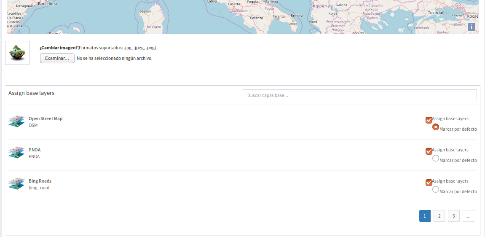
