5. Simbología
=============
Para criar ou modificar a legenda de uma camada selecione a entrada *"Estilos de camada"* no menu de simbologia.

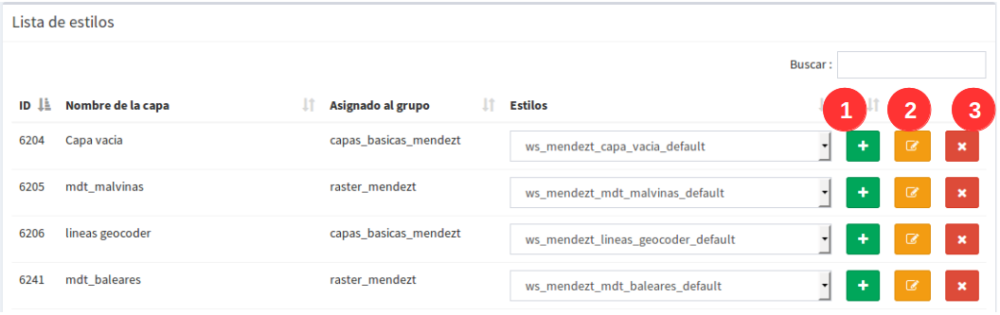

- Aparecerá uma lista de camadas disponíveis.
- Cada camada na lista tem um seletor onde as legendas ou estilos disponíveis para a camada são mostrados. 
- Para cada estilo de camada você pode adicionar um *'novo estilo'* (**1**) e tantos quantos quiser na caixa de seleção de estilo fornecida por cada camada. 
- Os estilos definidos podem ser selecionados para serem modificados(2).
- O estilo que não está sendo usado como uma legenda de camada, ou seja, que não está definido por padrão, pode ser removido selecionando o estilo no seletor e, em seguida, o botão (**3**) *'Excluir estilo'*.

Se seleccionarmos o botão Adicionar, o botão Adicionar mostrará uma vista para seleccionar o tipo de legenda que queremos criar.
Se a camada é de tipo vetorial, o menu que será mostrado será o seguinte:

.. image:: ../images/sym2.png
   :align: center
   
E se for do tipo raster desta maneira:

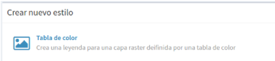

5.1 Legenda de Símbolo Único
----------------------------
A legenda do símbolo único é a mais simples de todas e permite-nos definir um estilo que será aplicado a todos os elementos de uma camada da mesma forma, sem fazer qualquer distinção.

.. image:: ../images/sym4_2.png
   :align: center

A vista para criar uma legenda de símbolo única é dividida em três áreas:

**1** - A área de metadados (caixa vermelha) contém os seguintes campos:

*   **Nome**: O nome do estilo é gerado por padrão, portanto não é necessário defini-lo.

*   **Título**: Título que aparecerá na legenda mostrada no visualizador.

*   **Escala mínima**: Escala mínima a partir da qual a legenda será mostrada (por defeito é 'sem limites').

*   **Escala máxima**: Escala máxima até a qual a legenda será mostrada (por padrão é 'sem limites').

*   **Padrão**: Se seleccionarmos esta opção, o estilo será o que aparece por defeito no visualizador.

**2** - A área de visualização (caixa roxa) contém o mapa onde podemos ver o estilo da legenda e a entrada para adicionar o ''rótulo''
Para atualizar a visualização, vamos fazê-lo através do botão *"Atualizar visualização"* localizado no canto superior dereito.

**3** -  A área dos simbolizadores (caixa verde) A partir daqui estaremos adicionando os diferentes simbolizadores que finalmente formarão o símbolo.

Temos duas opções para adicionar simbolizadores:

*   **Importar um símbolo de uma biblioteca:** Será mostrado um diálogo onde seleccionaremos a biblioteca de símbolos. Em seguida, seleccione o símbolo.

.. image:: ../images/sym5_2.png
   :align: center

*   **Adicionar um ou mais simbolizadores:** Como mencionado acima, um símbolo pode consistir em um ou mais simbolizadores.

.. image:: ../images/sym6_2.png
   :align: center

Você pode editar ou excluir um simbolizador dos botões à direita.

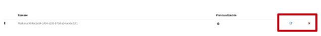

Selecionando o botão editar abrirá um diálogo onde poderemos configurar os valores das propriedades do simbolizador em função do seu tipo.

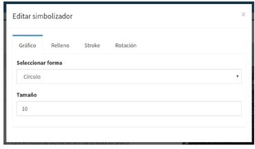

No caso de termos vários simbolizadores podemos definir a ordem de visualização dos mesmos através da técnica de arrastar e largar. Para isso, selecione o simbolizador e arraste-o para a posição desejada.

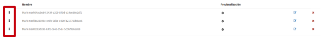

5.2 Adicionar etiquetagem
---------------------
As etiquetas são um tipo especial de simbolizadores de texto. Para adicionar uma nova etiqueta selecione o botão *"Añadir etiqueta"* localizado no canto superior direito de cada janela de definição de estilo.

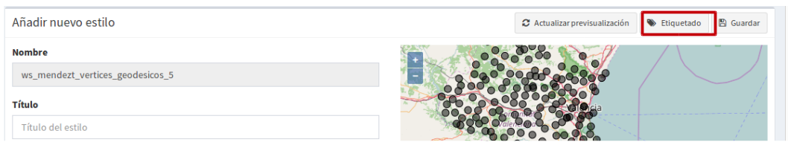

-  A janela de configuração de etiquetagem consiste em quatro (4) separadores, geral, fonte, halo e filtro.

-   Quando a janela de etiquetagem é ativada, a primeira aba '*General'* é exibida por padrão, a partir desta opção você pode:

            - activar o 'check' para activar os outros separadores da configuração de etiquetagem,
            - Um título é adicionado, isto será refletido na legenda do mapa. Por padrão, haverá o nome do campo que o sistema detecta para etiquetar.
            - Você pode definir uma escala mínima e máxima na qual a etiqueta será mostrada no mapa do projeto.

.. image:: ../images/sym11_2.png
   :align: center

- No separador *'fonte'* como qualquer outro simbolizador uma vez activada a verificação anterior, poderemos editar as suas propriedades.

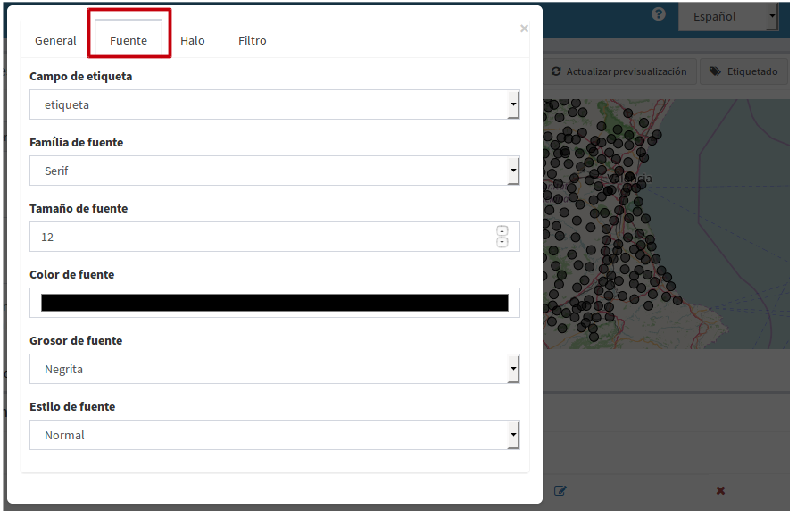

-  A aba *'halo'* é usada para definir a cor do sombreamento na fonte. Isto é opcional para o usuário.

-  O tabulador *'filtro'*, como seu nome indica, pode ser utilizado como expressão básica para executar um filtro nas etiquetas a serem exibidas.

.. image:: ../images/sym11_4.png
   :align: center
   
Você também pode construir filtros com **'OR expression'** ou **'AND expression'**, para esta opção você configura a expressão do primeiro filtro *(caixa azul)* e então clique no botão *'add'* e selecione a expressão, então adicione um 'AND ou OR' e outra janela de filtro para configurar a próxima expressão *(caixa amarela)*.

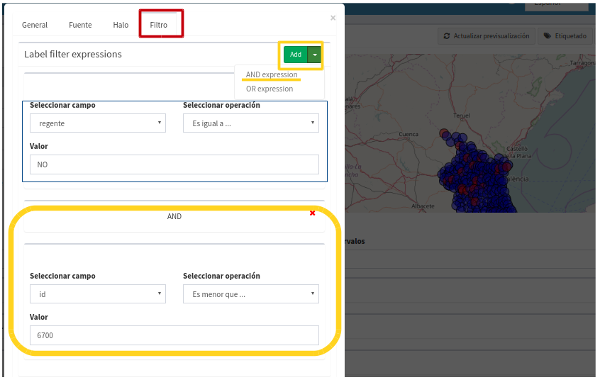
   

5.3 Legenda de valores únicos
-----------------------------
A legenda de valores exclusivos gera uma classificação de símbolos de acordo com um campo no layer.

.. image:: ../images/sym12_2.png
   :align: center

- Selecionar o campo pelo qual deseja classificar(**1**), e, em seguida, criar automaticamente as classes correspondentes (**2**).

- Cada uma das classes criadas pode ser modificada da mesma forma como se fosse um símbolo único.

- Você pode atribuir uma escala de exibição mínima e máxima (**3**) que será aplicada por padrão para todas as classes.

- Para cada classe separadamente você também pode atribuir escala mínima e máxima, isto é feito a partir da ferramenta localizada à direita da classe *'editar regra'* (**4**), você deve ativar a verificação de 'visível por escala'.

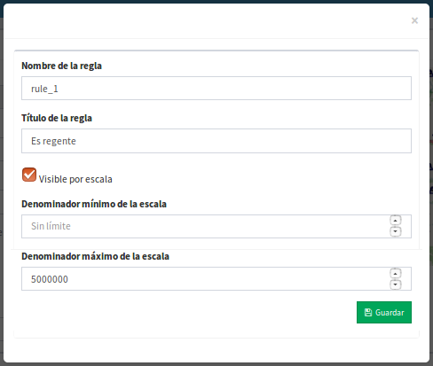

- Na janela 'editar regra' você também pode adicionar ou alterar o título da classe e este será o mostrado na legenda do visualizador de mapas.

.. nota::
   Se você não quiser editar a escala para cada classe, elas serão o padrão para a escala aplicada na camada geral.

5.4 Legenda dos intervalos
-------------------------
O tipo mais comum de legenda para representar dados numéricos pode ser a de intervalos, o que permite classificar os valores disponíveis nos diferentes elementos de uma série de intervalos.
Para gerar a legenda de intervalos, primeiro selecione o campo pelo qual deseja classificar (1) (somente os campos numéricos aparecerão)
e, em seguida, selecione o número de intervalos (2).

.. image:: ../images/sym13.png
   :align: center

- Cada uma das classes criadas pode ser modificada da mesma forma como se fosse um símbolo único.

-  Você também pode personalizar a escala para cada classe como no caso de Valores únicos.

5.5 Legenda de expressões
--------------------------
Com esta legenda podemos atribuir um tipo de símbolo aos elementos que cumprem uma determinada condição ou expressão. E, claro, podemos ter na mesma lenda tantas condições quantas quisermos.

- Para criar um símbolo selecione o botão *"Adicionar nova regra"* (1), que irá criar um novo símbolo com os valores padrão.

- Cada uma das classes criadas pode ser modificada da mesma forma como se fosse um símbolo único.

- Calcular e alterar o título de cada regra usando a ferramenta *'editar regra'* (**2**)

- Para definir a condição de filtragem, selecionar no menu de ferramentas a opção *"Editar filtro"* (**2**).

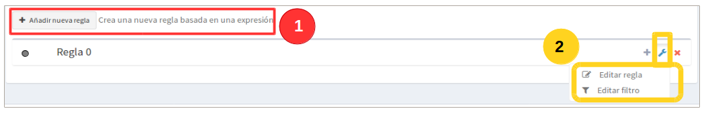

A seguir será mostrada uma caixa de diálogo, a partir da qual poderemos definir o primeiro filtro simples.

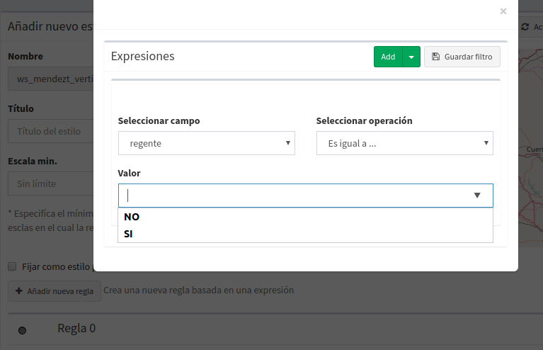

Da mesma forma que os filtros de etiquetagem, você pode criar um estilo compondo um filtro com as expressões ' **'AND'** e **'OR'**.

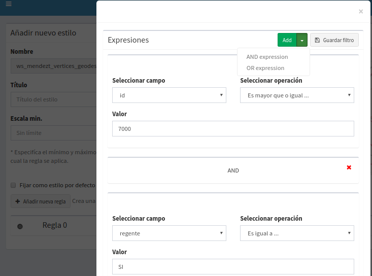

5.6 Mapa de cores (raster)
--------------------------
Com esta legenda podemos atribuir uma tabela de cores a uma camada rasterizada. Rampas coloridas são usadas, por exemplo, para aplicações específicas, como exibição de elevação ou precipitação.

Para adicionar uma nova entrada à tabela de cores seleccione o botão *"Adicionar entrada de cor"* (1).

.. image:: ../images/sym16.png
   :align: center

Podemos adicionar quantas entradas coloridas quisermos. Para editar os valores de cada uma das entradas, selecione o botão editar.

Em seguida, será mostrada uma caixa de diálogo para configurar os valores. 

.. image:: ../images/sym17.png
   :align: center

*   **Color:** Selecione a cor desejada para a entrada.

*   **Quantidade:** Aqui vamos selecionar o valor do raster pelo qual vamos filtrar.

*   **Rótulo:**  Rótulo que será mostrado ao representar a legenda para este valor.

*   **Opacidade:** Nível de opacidade para esta entrada de cor.

5.7 Bibliotecas de símbolos
---------------------------
As bibliotecas de símbolos permitem criar e agrupar símbolos genéricos que posteriormente podemos importar de legendas de camadas.

Para criar uma nova biblioteca de símbolos seleccione a entrada  *"Bibliotecas de símbolos"* no menu de simbologia.

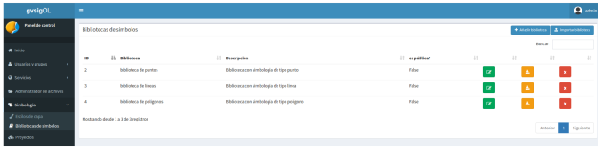

Para criar uma nova biblioteca, selecione o botão *"Adicionar biblioteca"* no canto superior direito e preencha os campos de nome e descrição no formulário.

Também poderemos importar bibliotecas que tenham sido previamente criadas na plataforma. As bibliotecas de símbolos são ficheiros compostos por um arquivo ZIP contendo um ficheiro com uma extensão .sld para cada um dos símbolos e um diretório de recursos com as imagens no caso de existirem símbolos pontuais do tipo de imagem.

Para adicionar símbolos a uma biblioteca seleccione a opção actualizar biblioteca na lista (botão verde).

Podemos adicionar 4 tipos de símbolos: gráficos externos (imagens), pontos, linhas e polígonos.
 
Se o símbolo que queremos adicionar é um tipo de imagem, a interface permitir-nos-á seleccionar a imagem do nosso sistema de ficheiros local. 

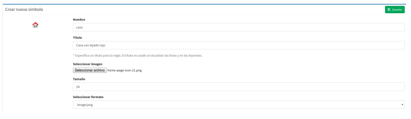

.. nota::
   Atualmente apenas imagens em formato PNG são suportadas.

Na medida em que vamos adicionando símbolos, estes aparecerão na vista da biblioteca, desde onde podemos os selecionar para modificar ou apagar.

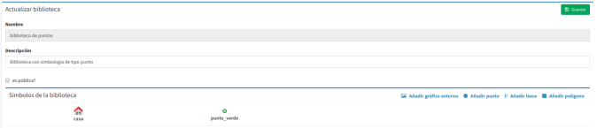

Poderemos exportar qualquer biblioteca de símbolos, ter um comprovante do mesmo e poder restaurar mais tarde ou compartilhar com outros usuários da aplicação. Para isso, selecione o botão laranja.

A seleção da exportação gera um arquivo ZIP que contém a definição de cada um dos símbolos no formato SLD, e um diretório de "recursos" que conterá as imagens dos símbolos que são de tipo gráfico externo.

Finalmente, para apagar uma biblioteca, seleccione o botão vermelho.

Ao apagar a biblioteca nós apagaremos este e todos os símbolos que têm associado a ele.
