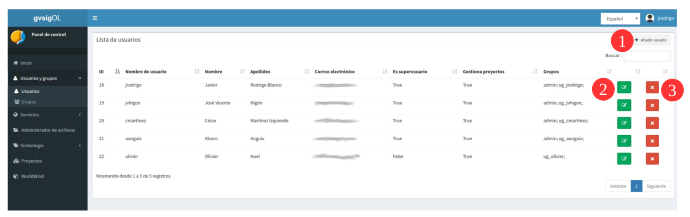
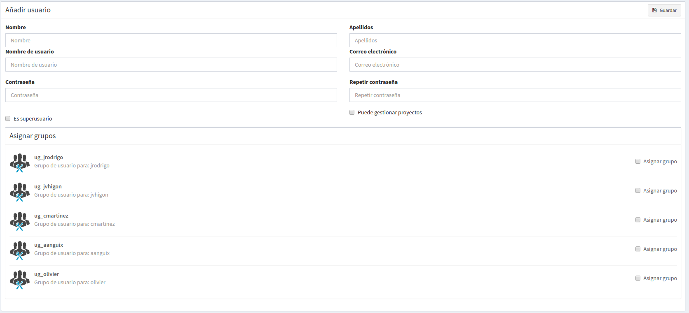
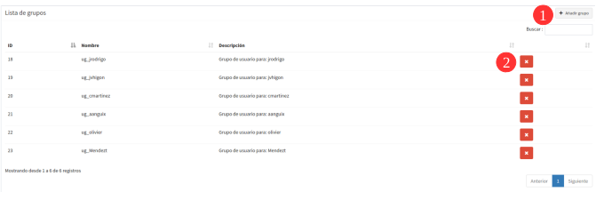

1. Usuários e grupos de usuário
===============================

1.1 Funções do Usuário
---------------------
Três funções são tratadas a partir do sistema:

1.1.1 Função 'Superusuário':
~~~~~~~~~~~~~~~~~~~~~~~~~~~~
Esta função terá por pradão todos os privilégios do sistema, ou seja, poderá registrar novos usuários, novos espaços de trabalho, ter visíveis todos os projetos e camadas de qualquer usuário (assim como poder gerenciá-los,permissões de leitura e escrita). Esta função é também a única que pode gerenciar camadas base, bibliotecas de símbolos e rampas de cores.

1.1.2 Função 'Pode gerir projetos':
~~~~~~~~~~~~~~~~~~~~~~~~~~~~~~~~~~~~~~
Esta função tem privilégios para gerir as suas camadas e projetos no seu própio espaço de trabalho, apenas o seu armazém de dados e o seu gestor de ficheiros estão visíveis para si. Embora lhe sejam dadas permissões para visualizar projetos e ler e escrever permissões nas camadas de outros usúarios, elas são apenas privilégios para visualizar e editar dados, mas não para gerenciá-los (propriedades de camada/projeto, simbologia, toc, etc).

1.1.3 Função 'Usuário básico':
~~~~~~~~~~~~~~~~~~~~~~~~~~~
Esta função só terá privilégios de leitura e escrita sobre dados específicos que tenham sido atribuídos a esta função por outros usuários de uma função maior. Portanto, a função do usuário não terá qualquer espaço de trabalho para administrar camadas ou projetos, só é possível acessar a projetos de visualização e processar dados nas camadas que foram designadas.

1.2 Criar, modificar e excluir usuários
----------------------------------------
A gestão de usuários e grupos de usuários pode ser gerenciada por um administrador de sistema ou um usuário na função de 'superusuário'. A entrada *"Usuários e grupos"* está disponível no menu do painel de controle:

Do ponto de vista do usuário podemos ver a lista de usuários disponíveis, bem como:

   - Criar(**1**), 
   - Atualização(**2**) ou
   - Excluir usuários(**3**).

**Quando novos usuários são criados atribuindo-lhes um privilégio de 'superusuario' ou 'Pode administrar projetos', as seguintes entradas são geradas automaticamente no sistema:**

* 1. su própio grupo de usuários e pertenecerão a ele por padrão.
* 2. Seu espaço de trabalho 
* 3. Sua armazenamento de base de dados
* 4. E seu diretório no gerenciador de arquivos.

.. nota::
   Um usuário pode pertencer a vários grupos e um grupo pode conter vários usuários.

Os campos que aparecem no formulário de 'criar usuários' (**1**) são os seguintes:

*   **Nome** e **sobrenome** verdadeiro do usuário

*   **Nome de usuário: (Obrigatorio)** Apelido com o qual o sistema será acedido. 

*   **Senha**: deve ser diferente do nome e apelido.

*   **É superusuário**:Nós indicamos se o usuário implementar o papel de superusuário, ntão ele terá permissões totais na plataforma.

*   **É possível administrar projetos**: Indicamos se o usuário implementa a função de gerenciamento. 

* Na parte inferior do formulário do usuário, aparece uma lista de grupos disponíveis. Se atribuirmos o usuário a um grupo, ele poderá acessar as entidades definidas no grupo (projetos, camadas, ...).

.. nota::
   Se nenhuma das funções: 'superusuário' ou 'gerenciamento' estiver ativada, a função que o usuário terá será: 'básico', e somente terá acesso aos projetos que outro usuário com maior privilégio lhe tenha atribuído dentro de um grupo de usuários. Com este privilégio 'básico', nenhum dos quatro espaços do sistema acima mencionados é gerado.

Na opção 'atualizar' (**2**) você pode editar os privilégios e atribuir ou alterar grupos de usuários aos quais um usuário pertence.

1.3 Criando e alterando grupos de usuário
---------------------------------------
As permissões para gerenciar o sistema, camadas ou projetos serão sempre dadas em nível de grupo de usuários e *NÃO por usuário individual*. Portanto, **os usuários devem sempre pertencer a um grupo de usuários**. 

Um grupo pode conter vários usuários e este último herdará todos os privilégios que o grupo atribuiu no nível de administração, gerenciamento ou permissões.

Um novo usuário com algum privilégio, por padrão terá seu própio grupo e será atribuído no mesmo, mas **usuários com função básica** devem indicar a qual grupo ele pertencerá.

Da vista de grupos podemos ver a lista de grupos disponíveis, bem como criar(**1**) ou excluir grupos(**2**).

Os campos que aparecem no formulário de grupo são os seguintes:

*   **Nome** do grupo

*   **Descrição** do grupo

.. nota::
   A edição de grupos de usuários não é suportada atualmente. Para modificar um grupo de usuários, é necessário eliminá-lo e criá-lo novamente.