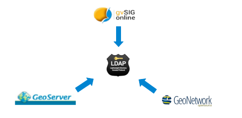

2. Conceptos
===================

2.1 Panel de control
--------------------
El panel de control es la interfaz principal de administración de gvSIG Online. 

El panel de control se divide en varios componentes:

*   **Barra superior:** En la barra superior encontramos el menú de sesión del usuario y el selector del idioma.

*   **Menú principal:** Desde donde podemos acceder a la gestión de las entidades de la plataforma (usuarios y grupos, servicios, estilos, …).

*   **Contenido principal:** En el área de contenido se irán cargando las vistas con los formularios en función de la selección que hagamos en el menú principal.
    
.. image:: ../images/dashboard_main.png
   :align: center
    
En función del rol que implemente nuestro usuario el panel de control mostrará unos componentes u otros.

Al acceder al panel de control por defecto se muestra la vista de *“Inicio”*, donde se muestra un resumen con la información de usuario, y un listado con los proyectos que este tiene disponibles.

.. note::
   Si nuestro usuario no implementa el rol de superusuario, y solo tiene asignado un proyecto, accedera directamente al proyecto sin pasar por el panel de control.
   
   
2.2 Visor de mapas
------------------
El visor de mapas es la interfaz de visualización de la plataforma que permite la visualización de los proyectos configurados desde el panel de control.  

.. image:: ../images/viewer1.png
   :align: center

La plataforma ofrece dos tipos de visores de mapas:

*   **Visor público:** Accesible para cualquier usuario sin necesidad de estar registrado en la plataforma. Ofrece una serie de funcionalidades básicas: Zoom, búsqueda, herramientas de medida e información, etc

*   **Visor restringido:** Accesible solo para usuarios registrados en la plataforma. Además en función del nivel de acceso del usuario, este tipo de visor ofrecerá unas funcionalidades específicas, además de las básicas.
	
	
2.3 Usuarios y grupos de usuarios
---------------------------------
GvSIG Online utiliza dos entidades principales tanto para gestionar la autenticación, como para gestionar los permisos para el tratamiento de datos y acceso a los servicios de la plataforma. 
Estas dos entidades son los *"usuarios"* y los *"grupos de usuarios"*.

Toda la información de autenticación es centralizada desde el servicio LDAP.

2.3.1 Roles de usuario
~~~~~~~~~~~~~~~~~~~~~~
Cada usuario implementa un rol, el cual le confiere una serie de permisos que definen el acceso a la plataforma y como el usuario interactua con las entidades.

Los roles que puede implementar un usuario son los siguientes:

*   **Superusuario**: Tiene acceso a toda la plataforma, pudiendo administrar cualquier objeto haya sido creado por el o por otros usuarios. También puede administrar usuarios y grupos.

*   **Gestión**: Los usuarios que implementan el rol de gestión pueden gestionar proyectos, y capas, pero están restringidos a un espacio de trabajo. Este rol no permite la gestión de otros usuarios y grupos.

*   **Básico**: Los usuarios que implementan el rol básico únicamente pueden consultar los proyectos que les han sido asignados por usuarios de rol superior, no pudiendo gestionar capas ni proyectos.

2.3.2 Espacio de trabajo de usuario
~~~~~~~~~~~~~~~~~~~~~~~~~~~~~~~~~~~
Cuando creamos un nuevo usuario automáticamente se genera la siguiente estructura en la plataforma:

*   Usuario

*   Grupo para el usuario. El grupo se llamará como el usuario precedido del prefijo *ug_*

*   Espacio de trabajo en el servidor de mapas para el usuario

*   Esquema en BBDD y almacén de datos vectorial en el servidor de mapas asociado al esquema, donde el usuario podrá publicar sus capas.

*   Directorio en el sistema de ficheros desde donde el usuario podrá gestionar sus archivos. El directorio se llamará como el usuario precedido del prefijo *ug_*

2.4 Servicios
-------------
gvSIG Online utiliza un servidor de mapas para publicar y acceder a las capas de información geográfica. 
Los servicios de mapas están basados en los estándares del `Open Geospatial Consortium <http://www.opengeospatial.org/>`_ (OGC), 
que permiten que las capas sean interoperables tanto con el visor integrado en gvSIG Online como con otros visores y aplicaciones SIG de escritorio como gvSIG Desktop.

El módulo de servicios permite publicar y gestionar las capas de gvSIG Online.

2.4.1 Espacios de trabajo
~~~~~~~~~~~~~~~~~~~~~~~~~
Los espacios de trabajo son contenedores que se utilizan para organizar elementos diversos como capas y almacenes de datos. 

Los espacios de trabajo se identifican por su nombre, que debe ser único, y permiten agrupar capas y almacenes de datos similares.

2.4.2 Almacenes de datos
~~~~~~~~~~~~~~~~~~~~~~~~
Los almacenes de datos definen conexiones a fuentes de datos ráster o vectoriales, como bases de datos PostGIS, 
carpetas de ficheros SHP o ficheros ráster individuales.

Los almacenes de datos vectoriales permiten definir los parámetros de conexión una única vez para todas las capas presentes en el almacén.

Por contra, los almacenes de datos ráster definen los parámetros de un fichero ráster individual, que contiene una única capa.

Existen diferentes tipos de almacenes de datos en gvSIG Online:

*   **PostGIS vectorial**: Almacena capas vectoriales en una base de datos PostGIS

*   **GeoTiff**: Capa ráster en formato GeoTiff, que almacena la geo-referenciación de la capa dentro de los metadatos Tiff

*   **Carpeta de shapefiles**

*   **WMS en cascada**

Es importante entender que para poder añadir un almacén de datos, debemos partir de una fuente de datos que exista previamente. 
Por ejemplo, para poder añadir un almacén de datos de tipo PostGIS vectorial, la base de datos espacial debe existir previamente. 
De esta forma, los que estamos haciendo es registrar en gvSIG Online (y en Geoserver) los parámetros de conexión a dicha base de datos. 
De la misma forma, para añadir un almacén de datos de tipo ráster, el fichero ráster debe existir previamente en el servidor
(en este caso estamos registrando en gvSIG Online la ruta a dicho fichero ráster).

2.4.3 Capas
~~~~~~~~~~~
Una capa es un conjunto estructurado de información geográfica y alfanumérica que describe un aspecto de la realidad (parcelas, áreas protegidas, usos del suelo, precipitación, etc).

Existen dos tipos diferenciados de capas: vectoriales y ráster. Las capas vectoriales contienen registros de base de datos, cada uno de los cuales posee una o más geometrías asociadas. Las capas ráster
definen una matriz de valores y se utilizan frecuentemente para representar fenómenos continuos en el espacio tales como temperatura, elevación, precipitación o color (ortofotos). Es habitual utilizar formatos de imagen para almacenar capas ráster.

Dentro de cada uno de estos tipos principales podemos encontrar diferentes tipos más especializados.

2.4.4 Grupos de capas
~~~~~~~~~~~
Los grupos de capas como su nombre indica se utilizan para agrupar capas por una temática específica. Los grupos de capas nos permiten agilizar la asginación de capas a un proyectos.
Además desde el visor de mapas podremos visualizar el grupo de capas como una única capa, mejorando los tiempos de respuesta en la visualización.

2.4.5 Bloqueos
~~~~~~~~~~~~~~
Cuando una capa está en modo edición automáticamente se bloquea para evitar errores en la escritura de los datos.

Existen dos tipos de bloqueos:

*   Bloqueos del geoportal

*   Bloqueos de la aplicación móvil

2.4.6 Enumeraciones
~~~~~~~~~~~~~~~~~~~
Las enumeraciones son un tipo especial de entidades que definen domios de valores. Es posible utilizarlas en la creación de nuevas capas cuando deseemos crear un tipo de campo que contenga un listado de elementos.

2.5 Administrador de archivos
-----------------------------
El administrador de archivos nos permite subir archivos a la plataforma de gvSIG Online, para posteriormente realizar operaciones sobre ellos.

El administrador de archivos gestiona directorios en función de los grupos de usuarios. Por cada grupo de usuarios creado existirá un directorio en el servidor. 
Por tanto a la hora de explorar los directorios, únicamente podremos visualizar aquellos directorios que tengamos asignados por pertenencia al grupo.

2.6 Proyectos
-------------
Podemos definir un proyecto como una unidad de agregación de objetos que mediante una configuración dada, permiten una visualización gráfica.

Un proyecto está formado por los siguientes elementos:

*   Información general: nombre, descripción y logo del proyecto

*   Una vista de mapa (centro y extensión)

*   Grupos de capas

*   Grupos de usuarios

Existen 2 tipos de proyectos:

*   **Proyectos de acceso público**: Los datos que son visualizados no poseen ningún tipo de restricción. Pueden ser accedidos de forma anónima por usuarios que no estén registrados en la plataforma.

*   **Proyectos de acceso restringido**: Los datos poseen restricciones de acceso y uso para determinados grupos de usuarios. Solo pueden ser accedidos por usuarios que estén dados de alta en la plataforma.

2.7 Simbología
--------------

2.7.1 Leyendas
~~~~~~~~~~~~~~
Otra de las funcionalidades que ofrece gvSIG Online es la posibilidad de modificar la simbología de las capas y aplicarles distintos tipos de leyenda.

La leyenda nos indicará la forma y los criterios que se emplearán para mostrar los datos en el mapa, para una mejor visualización y comprensión de los datos que se representan en el geoportal a través de las distintas capas.

Las leyendas están formadas por uno o más símbolos. Cada símbolo puede estar formado a su vez por uno o más simbolizadores, lo que nos permitirá crear símbolos de mayor complejidad.

En función del tipo de geometría de la capa (punto, linea o polígono) los simbolizadores pueden ser de los siguientes tipos:

*   Geometría tipo punto(PointSymbolizer): Marcadores vectoriales(Mark) o imágenes(ExternalGraphic).

*   Geometría de tipo línea(LineSymbolizer): Simbolizador vectorial.

*   Geometría de tipo polígono(PolygonSymbolizer): Simbolizador vectorial.

Además de los símbolos vectoriales también se podrán definir símbolos para capas raster (RasterSymbolizer) y simbolizadores que definen texto o etiquetas (TextSymbolizer).

Existen diversos tipos de leyenda en función de si el tipo de capa es vectorial o ráster.

Los tipos de leyenda para las capas vectoriales son:

*	*"Leyenda de símbolo único"*

*	*"Leyenda de valores únicos"*

*	*"Leyenda de intervalos"*

*	*"Leyenda de expresiones"*

Para las capas de tipo ráster existe un tipo de leyenda que es el *"Mapa de color"*.

2.7.2 Bibliotecas de símbolos
~~~~~~~~~~~~~~~~~~~~~~~~~~~~~
Las bibliotecas de símbolos nos permiten crear y agrupar símbolos genéricos que posteriormente podremos *"importar"* desde las leyendas de capa.
Además podremos *"exportar"* las librerías de símbolos para poder compartir o hacer copias de las mismas. 