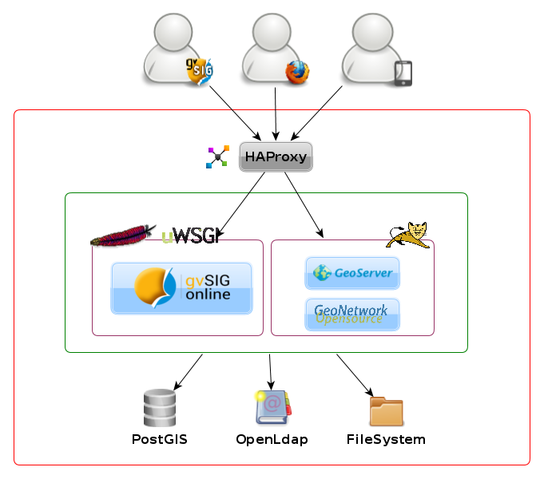

1. Introducción
===============

**gvSIG Online** es una plataforma integral para la implantación de Infraestructuras de Datos Espaciales (IDE), 100% con software libre.

Una solución rápida y potente para poner en marcha la infraestructura necesaria para gestionar de la forma más eficiente los datos espaciales de una organización.

gvSIG Online permite compartir información geográfica en la nube, generar mapas y aplicaciones gracias a las sencillas y potentes herramientas de administración del sistema. 
Bases de datos, geoportales, app móvil, SIG Desktop…todos los componentes en una solución integral, libre e interoperable.

1.2 Características
-------------------

*   **Solución integral**: BD, geoportal, SIG desktop, app móvil...

*   Enfoque **orientado al servicio**, adaptado a las necesidades de los clientes.

*   **Software Libre** y tecnologías maduras.

*   **Basado en estándares**: WMS, WFS, …

*   Rápido, sencillo y con un **diseño atractivo**.

*   Escalable y adaptable a las necesidades del cliente.

*   Sin restricciones de ningún tipo: usuarios, descargas, capas, …

*   Cumple con legislación INSPIRE, LISIGE...

1.3 Basado en arquitectura IDE
------------------------------

Una Infraestructura de Datos Espaciales (IDE) es un sistema informático integrado por un conjunto de recursos (catálogos, servidores, programas, aplicaciones, páginas web,…), 
que permite el acceso y la gestión de conjuntos de datos y servicios geográficos (descritos a través de sus metadatos), disponibles en Internet, 
que cumple una serie normas, estándares y especificaciones que regulan y garantizan la interoperabilidad de la información geográfica.

La arquitectura IDE se basa en el modelo clásico de tres capas: presentación, aplicación y datos.

*	En la **capa de presentación** tendremos las aplicaciones que permitirán al usuario interactuar con la información geográfica. Se trata de la cara visible de la IDE como por ejemplo la aplicación del geoportal o la aplicación móvil.

*	En la **capa de aplicación** tendremos el servidor de mapas Geoserver que nos permitirá ofrecer los datos a través de los protocolos estándar para acceso a mapas (WMS), mapas teselados (WMTS), objetos geográficos (WFS) o coberturas (WCS).

*	Finalmente, en la **capa de datos** centralizaremos los datos en la base de datos geoespacial PostGIS y la información sobre los usuarios del sistema en la base de datos OpenLDAP.

1.4 Licencia
------------

gvSIG Online se distribuye bajo licencia AGPL:

*   **Affero** (Trasposición de GPL para aplicaciones web)

    `https://es.wikipedia.org/wiki/GNU_Affero_General_Public_License <https://es.wikipedia.org/wiki/GNU_Affero_General_Public_License>`_
