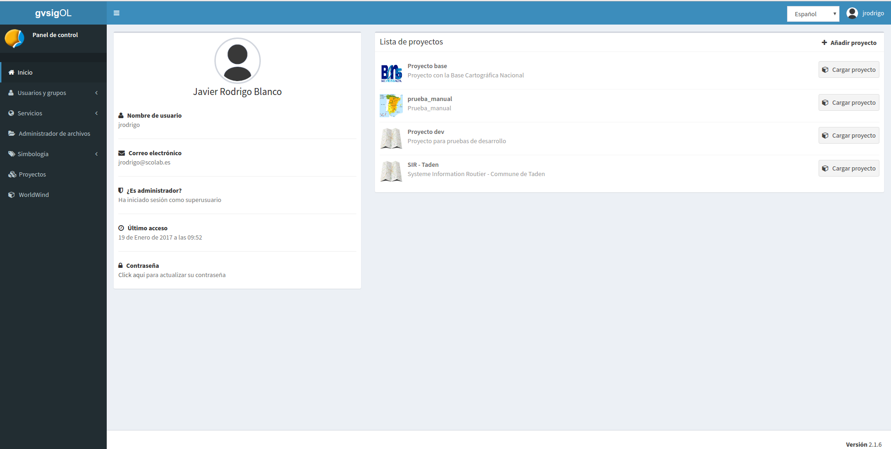
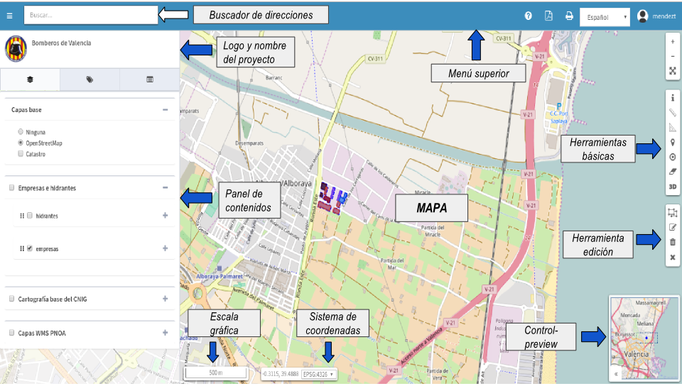

2. Conceitos
============

2.1 Painel de controle
--------------------
O painel de controle é a principal interface de administração de gvSIG Online. 

O painel de controle é dividido em vários componentes:

*   **Barra superior:** Na barra superior encontramos o menu de sessão de usuário e o seletor de idioma.

*   **Menu principal:** Onde podemos ter acesso à gestão das entidades da plataforma (usuários e grupos, serviços, estilos, …).

*   **Conteúdo principal:** Na área de conteúdo as vistas serão carregadas com os formulários dependendo da seleção que fizermos no menu principal. 
    

    
Dependendo da função que o nosso usuário implementar, o painel de controle irá mostrar alguns componentes ou outros.  

Ao acessar o painel de controle padrão, a exibição *“Início”* é mostrada, onde um resumo é mostrado com as informações do usuário e uma lista com os projetos que o usuário tem disponíveis.

.. Anotação::
   Se o nosso usuário não implementar o papel de superusuário, e tiver apenas um projeto atribuído a ele, ele irá acessar o projeto diretamente sem passar pelo painel de controle.
   
   
2.2 Visor de mapas
------------------
O visualizador de mapas é a interface de visualização da plataforma que permite a visualização dos projetos configurados a partir do painel de controle. 

A plataforma oferece dois tipos de visualizadores de mapas:

*   **Visor público:**  Acessível a qualquer usuário sem ter que se registrar na plataforma. Oferece uma série de funcionalidades básicas: Zoom, ferramentas de busca, medição e informação, etc. 

*   **Visor restrito:** Acessível apenas para usuários registrados da plataforma. Também dependendo do nível de acesso do usuário, este tipo de visualizador oferecerá funcionalidades específicas, além das básicas.
	
	
2.3 Usuários e grupos de usuários
---------------------------------
O GvSIG Online utiliza duas entidades principais tanto para gerenciar a autenticação quanto para gerenciar permissões para processamento de dados e acesso a serviços da plataforma.
Estas duas entidades são os *"usuários"* e os *"grupos de usuários"*.

Todas as informações de autenticação são centralizadas a partir do serviço LDAP.

.. image:: ../images/ldap.png
   :align: center

2.3.1 Funções do usuário
~~~~~~~~~~~~~~~~~~~~~~
Cada usuário implementa uma função, que confere uma série de permissões que definem o acesso à plataforma e como o usuário interage com as entidades.

As funções que um usuário pode implementar são as seguintes:

*   **Superusuário**: Tem acesso a toda a plataforma, podendo gerenciar qualquer objeto criado por ele ou por outros usuários. Ele também pode gerenciar usuários e grupos.

*   **Gestão**: Os usuários que implementam o papel de gestão podem gerenciar projetos e camadas, mas eles estão restritos a um único espaço de trabalho. Esta função não permite a gestão de outros utilizadores e grupos. 

*   **Básico**: Os usuários que implementam a função básica só podem consultar os projetos que lhes foram atribuídos por usuários de uma função superior, não sendo capazes de gerenciar camadas ou projetos. 

2.3.2 Espaço de trabalho do usuário
~~~~~~~~~~~~~~~~~~~~~~~~~~~~~~~~~~~
Quando criamos um novo usuário automaticamente gera a seguinte estrutura na plataforma:

*   Usuário

*   Grupo para o usuário. O grupo será nomeado como o usuário predecido pelo prefixo *ug_*

*   Espaço de trabalho no servidor de mapas para o usuário 

*   Armazenamento do esquema DB e dos dados vetoriais no servidor de mapas associado ao esquema, onde o usuário poderá publicar seus layers.

*   Diretório no sistema de arquivos de onde o usuário pode gerenciar seus arquivos. O diretório será chamado como o usuário precedido pelo prefixo *ug_*

2.4 Serviços
-------------
O gvSIG Online usa um servidor de mapas para publicar e acessar as camadas de informação geográfica. 
Os serviços de mapas são baseados nos padrões  do `Open Geospatial Consortium <http://www.opengeospatial.org/>`_ (OGC), 
que permitem que as camadas sejam interoperáveis tanto com o visualizador integrado no gvSIG Online quanto com outros visualizadores e aplicativos GIS de desktop, como o gvSIG Desktop. 

O módulo de serviços permite publicar e gerenciar as camadas do gvSIG Online. 

2.4.1 Espaços de trabalho
~~~~~~~~~~~~~~~~~~~~~~~~~
Os espaços de trabalho são containers usados para organizar vários itens, como camadas e armazéns de dados. 

Os espaços de trabalho são identificados pelo seu nome, que deve ser único, e permitem agrupar e armazenar dados semelhantes. 

2.4.2 Armazenamento de Dados
~~~~~~~~~~~~~~~~~~~~~~~~
Os armazenamentos de dados definem conexões com fontes de dados raster e vetoriais, como bancos de dados PostGIS, 
pastas de arquivos SHP ou arquivos raster individuais. 

O armazenamento de dados vetoriais permitem definir parâmetros de conexão apenas uma vez para todas as camadas de armazenamento. 

Em contraste, as armazenagens de dados raster definem os parâmetros de um arquivo raster individual, que contém uma única camada.

Existem diferentes tipos de armazenamento de dados no gvSIG Online:

*   **PostGIS vetor**: Armazena camadas de vetoriais numa base de dados PostGIS

*   **GeoTiff**: Camada rasterizada em formato GeoTiff, que armazena a georreferenciação da camada dentro dos metadatos Tiff

*   **Cascata WMS**: Armazena o endereço de um serviço WMS para posteriormente publicar as camadas disponíveis.

É importante entender que, para adicionar um armazenamento de dados, devemos começar a partir de uma fonte de dados previamente existente. 
Por exemplo, para adicionar um armazenamento de dados do tipo PostGIS vetorial, o banco de dados espacial deve existir anteriormente. 
Desta forma, o que estamos a fazer é registrar no gvSIG Online (e no Geoserver) os parâmetros de ligação a esta base de dados. 
Da mesma forma, para adicionar um aramzenamento de dados do tipo raster, o arquivo raster deve existir previamente no servidor
(neste caso estamos registrando no gvSIG Online o caminho para este arquivo raster).

2.4.3 Camadas
~~~~~~~~~~~
Uma camada é um conjunto estructurado de informações geográficas e alfanuméricas que descreve um aspecto da realidade (parcelas, áreas protegidas, uso do solo, precipitação, etc).

Existem dois tipos diferentes de camadas: vector e raster. As camadas vectoriais contêm registros de base de dados, cada um dos quais tem uma ou mais geometrias associadas. As camadas rasterizadas
definem uma matriz de valores e são frequentemente utilizadas para representar fenómenos contínuos no espaço, tais como temperatura, elevação, precipitação ou cor (ortofotos). É comum usar formatos de imagem para armazenar camadas rasterizadas.

Dentro de cada um destes tipos principais podemos encontrar diferentes tipos mais especializados.

2.4.4 Grupos de camadas
~~~~~~~~~~~~~~~~~~~~~
Os grupos de camadas como o nome indica são usados para agrupar camadas por um tema específico. Os grupos de camadas nos permitem acelerar a atribuição de camadas a um projetos.
Também a partir do visor de mapas podemos visualizar o grupo de camadas como uma única camada, melhorando os tempos de resposta na exibição.

2.4.5 Bloqueios
~~~~~~~~~~~~~~
Quando uma camada está em modo de edição, ela é bloqueada automaticamente para evitar erros na escrita dos dados.

Existem dois tipos de bloqueios:

*   **Bloqueios do geoportal**: Quando 

*   **Bloqueios a aplicação móvel**:

2.4.6 Camadas Bases
~~~~~~~~~~~~~~~~~
São aquelas camadas que são usadas como referência cartográfica para ancorar ou usar (como seu nome indica) de base nos projetos. É possível utilizar diferentes tipos de proveedores como OSM, BING (com sua chave API), XYZ tesserae, serviços WMS e WMTS.

Estas camadas podem ser previamente geridas por um usuário administrador, uma vez definidas podem ser atribuídas e definidas por defeito a cada um dos projetos de forma independente.
 

2.5 Tipos de dados
------------------
A partir do gvsig online,ele oferece a opção de gerar dados de tipo de domínio (lista de enumeração e enumeração múltipla) e também permite ter campos de controle interno na edição de camadas.

2.5.1 Enumerações
~~~~~~~~~~~~~~~~~~~
As enumerações são um tipo especial de entidades que definem domínios de valor. É possível utilizá-los na criação de novas camadas quando se deseja criar um tipo de campo que contenha uma lista de elementos e poder seleccionar um único item desta lista. 

A nomenclatura usada en la DB para ser reconhecida como um campo de dominio é: **enm_#_acti**

Onde: 

* *enm* = enumeração do tipo de dados.

* *#* = número atribuído pelo sistema por default quando novas listas de enumerações são criadas.

* *acti* = As quatro primeiras letras do título da lista de enumeração. Para este exemplo, o título é: 'Atividade'

2.5.2  Enumeração múltipla
~~~~~~~~~~~~~~~~~~~~~~~~~~~
Ao contrário do tipo de enumeração,este campo permite selecionar vários elementos de um conjunto de domínios disponíveis numa 'lista de enumeração', esta opção fica disponível quando se cria uma camada vazia no sistema, selecionando este tipo de dados e depois escolhendo algumas das listas disponíveis nas enumerações.

Nomenclatura: **enmm_#_acti**

Onde: 

* *enmm* = enumeração múltipla de tipos de dados.

* *#* = número atribuído pelo sistema por default quando novas listas de enumerações são criadas.

* *acti* = As quatro primeiras  letras do título da lista de enumeração. Para este exemplo, o titulo é: 'Atividade'

2.5.3 Campos de controle interno
~~~~~~~~~~~~~~~~~~~~~~~~~~~~~~~
Esses campos são gerados automaticamente quando se cria uma camada vazia do sistema, os campos são:

 *  **modified_by**: É um campo que não permite sua edição dentro da tabela. Ao editar e guardar um elemento da camada (atributos o geometría), este campo '*Modified by*' é automaticamente preenchido com o nome do usuário que foi autenticado no sistema. 

 *  **last_modification:** Este é outro campo que não permite editar na tabela. Ao editar e guardar um elemento da camada (atributos ou geometria), este campo '*last_modification*' é automaticamente preenchido com a data registrada pelo computador ou móvel. 

.. Nota::
   Esses tipos de dados também podem ser adicionados manualmente à tabela de atributos de qualquer camada por meio do DB antes que a camada seja publicada no sistema.

2.6 Gerenciador de arquivos
-----------------------------
O gerenciador de arquivos nos permite fazer upload de arquivos para a plataforma gvSIG Online, para operações posteriores sobre eles. 

O gerenciador de arquivos gerencia diretórios de acordo com grupos de usuários. Para cada grupo de usuários criado haverá um diretório no servidor.  
Portanto, no momento de explorar os diretórios, só poderemos visualizar os diretórios que temos atribuídos por pertencer ao grupo.

2.7 Projetos
-------------
Podemos definir um projeto como uma unidade de agregação de objetos que, por meio de uma determinada configuração, permite uma visualização gráfica. 

Um projeto é formado pelos seguintes elementos:

*   Informações gerais: nome, descrição e logotipo do projeto

*   Uma vista de mapa (centro e extensão)

*   Camadas base

*   Grupos de usuários

*   Grupos de camadas

Existem 2 tipos de projetos:

*   **Projetos de acceso público**: Os dados exibidos não têm restrições. Eles podem ser acessados anonimamente por usuários que não estão registrados na plataforma.

*   **Projetos de acesso restrito**: Os dados têm restrições de acesso e uso para determinados grupos de usuários. Eles só podem ser acessados por usuários registrados na plataforma.

2.8 Simbologia
--------------

2.8.1 Legendas
~~~~~~~~~~~~~~
Outra das funcionalidades oferecidas pelo gvSIG Online é a possibilidade de modificar a simbologia das camadas e aplicar diferentes tipos de legendas a elas.

A legenda nos indicará a forma e os critérios que serão usados para mostrar os dados no mapa, para uma melhor visualização e compreensação dos dados que são representados no geoportal através das diferentes camadas.

As legendas consistem em um ou mais símbolos. Cada símbolo pode ser formado por um ou mais simbolizadores, o que nos permitirá criar símbolos mais complexos.

Dependendo do tipo de geometria da camada (ponto, linha ou polígono) os simbolizadores podem ser de los seguintes tipos:

*   Geometria de tipo ponto(PointSymbolizer): Marcadores vetoriais(Mark) ou imagens(ExternalGraphic).

*   Geometria de tipo linha(LineSymbolizer): Simbolizador vetorial.

*   Geometría de tipo polígono(PolygonSymbolizer): Simbolizador vetorial.

Além dos símbolos vetoriais também é possível definir símbolos para camadas rasterizadas (RasterSymbolizer) e símbolos que definem texto ou etiquetas (TextSymbolizer).

Existem vários tipos de legendas, dependendo se o tipo de camada é vetorial ou raster.

Os tipos de legendas para camadas vetoriais são:

*	*Legenda de símbolo único*

*	*Legenda de valores únicos*

*	*Legenda de intervalos*

*	*Legenda de expressões*

Para as camadas do tipo raster há um tipo de legenda que é a *Tabela de cores*.

2.8.2 Bibliotecas de símbolos
~~~~~~~~~~~~~~~~~~~~~~~~~~~~~
As bibliotecas de símbolos permitem criar e agrupar símbolos genéricos que podemos mais tarde *"importar"* de legendas de camadas.
Também poderemos *"exportar"* as bibliotecas de símbolos para que possamos compartilhar ou fazer cópias delas. 

2.9 Plugins
-----------
Os plugins são considerados componentes ou aplicações desenvolvidas independentemente dos sistemas básicos. Eles são, por tanto, plugins extras que podem ser adicionados ao sistema. Cada plugin é desenvolvido para cobrir funcionalidades específicas de acordo com as necessidades de cada cliente.

Esta entrada será visível no painel de controle se as aplocações estiverem disponíveis, por exemplo: Geocodificação (aplicação para pesquisa de endereços), Worldwind (configurador de MDT para 3D), transformações, entre outras.

