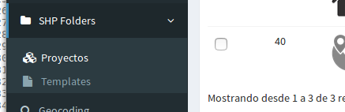
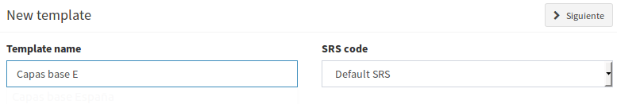
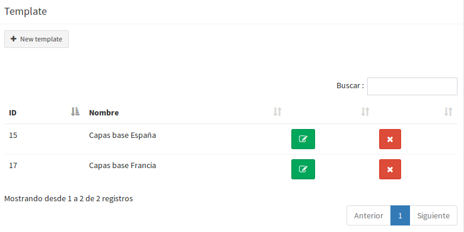
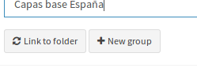
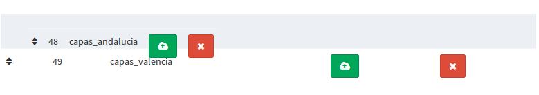
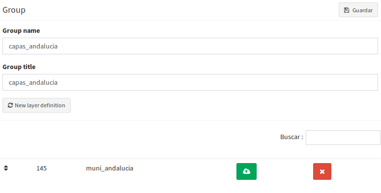
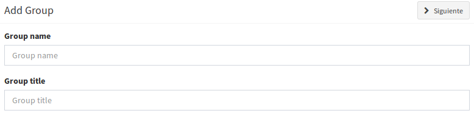
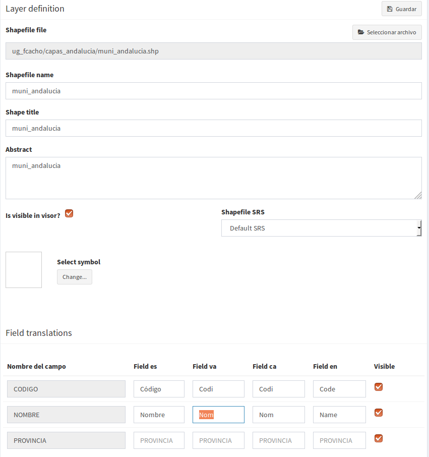
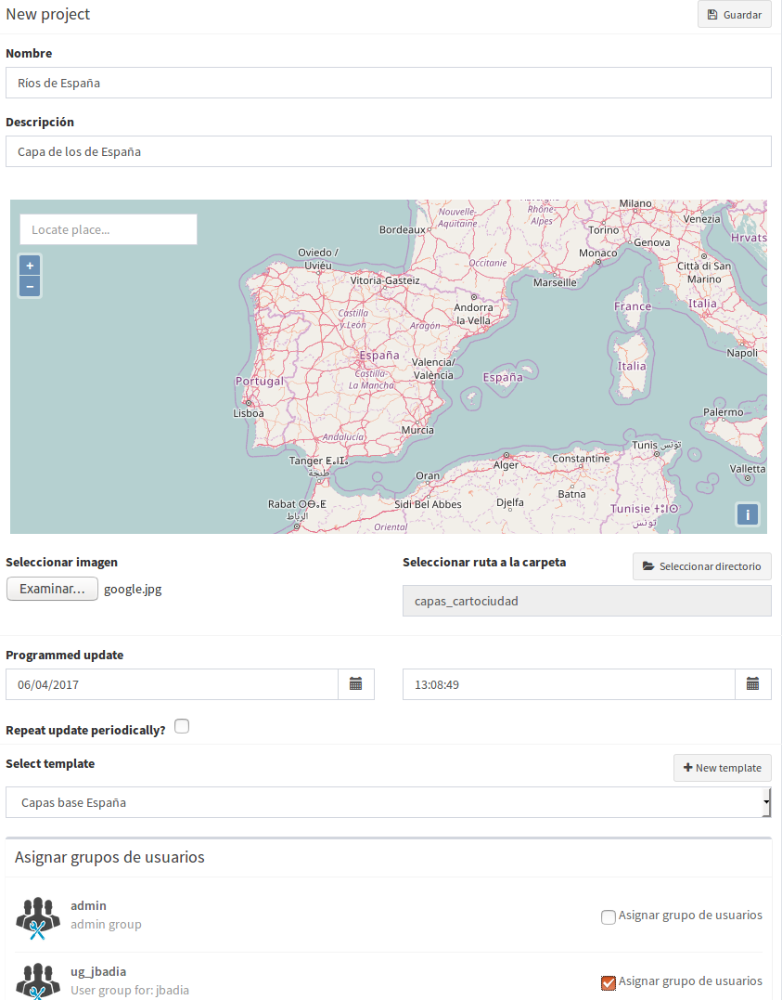
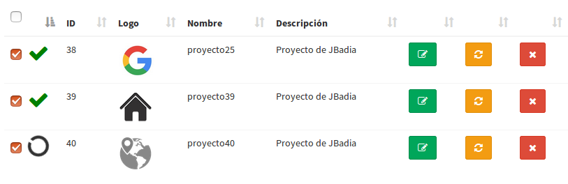

Cargador de carpetas Shape
==========================

Introducción
------------

En ocasiones, puede existir la necesidad de generar numerosos proyectos que tengan una cartografía base en común con unas características determinadas de simbología, orden de capas y grupos idéntica en todos los casos. 

El objetivo de este plugin es dar soporte para poder definir unas plantillas que establezcan esa configuración de las capas que compondrán los futuros proyectos, permitiendo ahorrar esos pasos repetitivos en cada uno de ellos.
A través de esta funcionalidad, se pueden definir los grupos de capas que existirán, así como los shapes que contendrán. También se podrá indicar el nombre, el título, la simbología o la traducción de los nombres de sus campos, entre otras opciones.

Para acceder a esta funcionalidad, se dispone de una entrada en el menú lateral *Carpetas SHPS*. Desde ella, se divide la sección de *Proyectos* o *Plantillas*

   

Las plantillas de configuración
-------------------------------

Se pueden encontrar un listado de las plantillas creadas en la sección *Plantillas* del menú lateral.

Si no se ha definido nada en ellas, la información que contiene es muy básica, ya que únicamente requiere un nombre para identificarla y el sistema de coordenadas por defecto que se le asignará a los shapes (si no se indica lo contrario)

Las operaciones a realizar sobre plantillas son las básicas: crear una nueva, modificar o borrar.

   
Una vez generada, se procederá a definir la estructura que tendrán las futuras capas de los proyectos que se creen. Para ello, se tienen dos métodos: creación manual o vincular a un directorio.

* *Vincular a un directorio*: este caso generará la definición de los grupos de capas y capas basándose en una estructura de directorios, donde las carpetas definirán los grupos, y los ficheros SHP que contienen se asignarán como plantillas de capas.

* *Creación a mano*: también se pueden establecer definiciones de grupos y capas de forma manual, a través de los botones de crear en cada caso.

Se pueden crear, editar y borrar tanto la definición de grupos de capas como las capas que contienen. Además, se puede establecer el orden en el que aparecerán en el TOC del mapa del proyecto ordenándolos.

A continuación se describen las operaciones más frecuentes:

* *Crear un grupo*

  Se trata de un formulario sencillo, requiere el nombre interno que tendrá el grupo y el título que se mostrará en el TOC del mapa.

* *Editar un grupo* 

  Además de los valores indicados en la creación, se pueden añadir, modificar, ordenar o borrar las definiciones de capas que contiene dicho grupo

* *Borrar un grupo*

  Elimina un grupo y las definiciones de capa que contiene

  

* *Crear una definición de capa*

  Se requiere:
  
  * Fichero del shape: de él se extraerá el nombre del fichero y los nombres de los campos para las traducciones
  * Nombre de la capa: nombre interno
  * Título de la capa: nombre que se mostrará en el TOC del mapa del proyecto
  * Descripción: información sobre el contenido de la capa
  * ¿Es visible?: indica si se cargará de primeras en el proyecto o aparecerá desactivado en el TOC
  * Sistema de coordenadas: si no se indica, cogerá el del grupo.
  * Símbolo: se permite asignarle una simbología de alguna biblioteca cargada en el sistema
  * Traducción de los campos: Permite establecer etiquetas de los campos para los distintos idiomas soportados por la aplicación
    
    
* *Edita una capa*

  Permite modificar cualquiera de los valores anteriormente definidos

* *Borra una capa* 

  Elimina la definición de la capa

  

Los proyectos basados en plantillas
-----------------------------------

Una vez definidas las plantillas, se pueden crear tantos proyectos como se requiera, que usen esa definición como base y carguen ya ese contenido de la forma que se ha especificado.

Para ello, en la sección *Proyectos* se dará de alta uno nuevo, indicando los parámetros necesarios. 

A diferencia del formulario original de creación de proyectos, se definirá el proyecto original (con su nombre, descripción, icono, encuadre original del mapa, ...) además de indicar la plantilla que se utilizará, y si se desea programar cuándo se realizará una actualización de esa definición base e incluso indicarle que se repita cada cierto tiempo (esta funcionalidad es útil, por si se modificará la definición de las plantillas y se quisiera que se reflejase en los proyectos que hacen uso de ellas sin tener que editarlos uno a uno a mano o tener que rehacerlos).

Una vez creado el nuevo proyecto, se puede realizar una actualización de la información a través del botón indicado, o esperar a que se haga de forma automática (si se ha especificado) en el momento indicado.

También se pueden actualizar varios proyectos a la vez y eliminar la selección a través de los botones *Actualizar selección* o *Borrar selección*

Una vez actualizada la información, se habrán generado, de forma automática, las capas y grupos de capas de la forma que se estableció en la plantilla, y se habrán creado las vinculaciones necearias para que aparezcan en el proyecto.

*NOTA:* Los proyectos aquí generados, así como las capas, grupos, simbología, etc. también son visibles desde los accesos convencionales de la aplicación y se comportan como tales si se accede  desde sus entradas correspondientes

