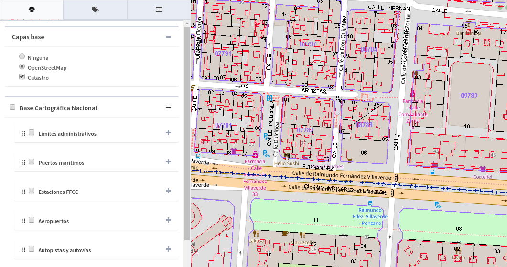
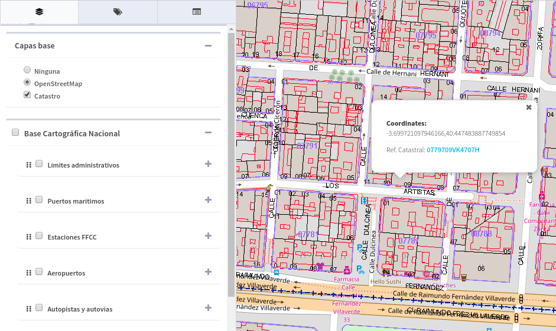
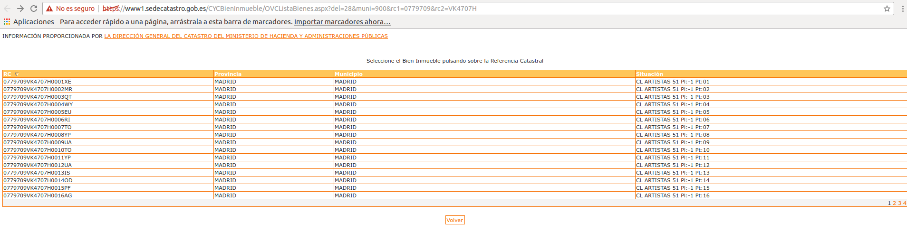

Catastro
========

El *"Plugin de Catastro"*, añade la capa de Catastro al grupo de capas base, aunque permite superponerla sobre el resto.

   
Si la capa de catastro está activa, al realizar una consulta con la herramienta de *"Información en el punto"*, si seleccionamos una parcela catastral, nos aparecerá un link con el número de *referencia catastral*.

   
Si seleccionamos el link nos lleva la página oficial de catastro desde dond epodremos ver la información catastral de la parcela.

