ETL - Plugin de transformación de datos
=======================================

1. Introducción
---------------

*ETL* (acrónimo de los términos en inglés *Extract, Transform and Load*) es una herramienta que permite exportar la información contenida en un fichero plano de datos (Excel o CSV) a una tabla en la Base de Datos (BD) para luego poder operar con ella.

La ventaja de esta herramienta es que permite georrefenciar los registros de cada tabla, siempre y cuando exista un campo con el valor de las coordenadas o bien la dirección para poder posicionarlo mediante el geocodificador inverso, es decir, por medio del buscador de direcciones, que en este caso se usará la fuente de datos del servidor de OpenStreetMap (OSM).

Otra ventaja que ofrece este plugin, es que puede aplicarse la misma transformación a diferentes ficheros planos para que sus datos vayan a una única capa en la BD.

2. Requisitos básicos en la estructura de los ficheros planos
-------------------------------------------------------------

Algunos requisitos mínimos se deben cumplir para que el proceso de transformación se realice de forma correcta. Los formatos deben ser (Excel o CSV) y por otro lado asegurarse que las coordenadas contenidas en los ficheros sean estándar y uniforme, de esta manera se garantiza que la transformación sea exitosa al momento de posicionar cada elemento.

* **Transformación con dirección**: El campo que contenga la dirección del elemento, preferiblemente que sea lo mas similiar posible a la dirección que ofrece la cartografía base del OSM.

* **Transformación con coordenadas para formato (.xlxs)**: las coordenadas comunmente están en celdas separadas, pueden ser coordenadas cartesinas (X,Y) o geográficas que deberán estar expresadas en grados decimales, donde la parte entera se separa de los minutos y segundos por (,), por ejemplo: (-31,4459068688) (-64,233981896). 

.. note::
   - El sistema no soporta comillas simples, ni dobles al final de las coordenadas, ejemplo: (-31,4354382939') (-64,2393822877').
   
   - Tampoco será válido coordenadas no bien definidas como los siguientes ejemplos: (-313.937.747)  (-6.417.356.619.999.990).
   
* **Transformación con coordenadas para formato (.csv)**: las coordenadas normalmente estarán en una misma celda, por lo tanto, igual estarán expresadas en grados decimales, pero esta vez la parte entera se separa de los minutos y segundos por un (.) ya que la (,) es usada para separar entre latitud y longitud o viceversa. También se acepta que estén o no dentro de paréntesis. Ejemplo: (-31.4315574, -64.18822169999998) 

3. Requisitos para realizar las transformaciones
------------------------------------------------

* 3.1 Crear una **capa vacía** en el sistema con los campos a donde se volcará la información de los ficheros planos, esto es necesario para aplicar la transformación por primera vez. EL crear capa vacía se descartaría sí solo quiere añadirse nuevos datos sobre una capa que ya ha sido definida anteriormente, es decir, basta definir la capa una sola vez para aplicarle varias transformaciones en diferentes ficheros planos que serán volcados a esa misma capa.

* 3.2 Crear plantilla de transformación.

* 3.3 Disponer en el 'administrador de archivos' el fichero plano, en formatos de hoja de cálculo (**.xlsx**) o texto (**.csv**).

* 3.4  Aplicar la transformación sobre el fichero plano.

3.1. Crear capa vacía
_____________________
Se crea o se dispone de la capa vacía en la BD (también deberá estar publicada en el sistema) teniendo los campos en donde se volcarán los datos correspondientes a las columnas del fichero plano.

.. note::
   - Cuando se crea una capa vacía en el sistema se añaden por defecto los campos: 'gid' y 'wkb_geometry', el primero es interno para hacer un identificador único en la tabla de Base de Datos (BD), éste no será usado en la transformación, el segundo es el campo donde se registrará la geometría de cada elemento y será el que se use para volcar las coordenadas.
   
   - También se añaden los campos 'last_modification' y 'by_modified', tampoco se usarán en la transformación. Son campos usados como control en la edición de la capa online desde el geoportal.

Una vez se haya publicado la capa vacía sin registros, se procede a crear la plantilla de transformación para fijar la configuración entre la capa vacía y el fichero plano.

3.2. Crear plantilla de transformación
______________________________________
La plantilla de transformación sirve para ajustar y relacionar los campos de la capa en BD con las columnas del fichero plano, es decir, hacer las correspondencias entre cada una de ellas.

Para acceder a esta funcionalidad se debe ingresar en el panel de control:

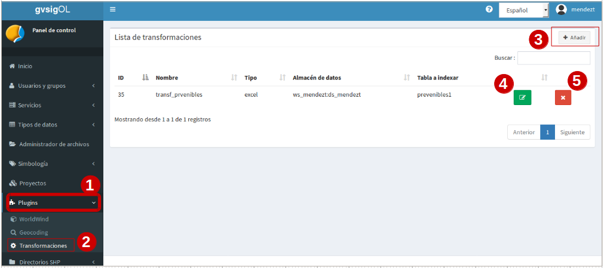

.. list-table:: Crear plantilla de transformación
   :widths: 2 20 50
   :header-rows: 1

   * - Pasos
     - Selección
     - Acción
   * - 1
     - En Panel de control, entrada: Geocoding 
     - Muestra todos los plugins disponibles
   * - 2
     - Seleccionar el plugin 'transformaciones'
     - Mostrará la ventana del listado de transformaciones
   * - 3
     - Clic sobre 'añadir'
     - Saldrá una nueva vista para configurar la plantilla de transformación
   * - 4
     - Botón color verde 'actualizar transformación'
     - Permite editar y actualizar nuevos cambios en la configuración de las plantillas definidas previamente.
   * - 5
     - Botón color rojo 'borrar transformación'
     - Elimina la plantilla de transformación de la lista, así como todas sus reglas.
     

3.2.1 Configuración de plantilla de transformación:
~~~~~~~~~~~~~~~~~~~~~~~~~~~~~~~~~~~~~~~~~~~~~~~~~~~
EL primer paso es añadir un nombre a la plantilla y seleccionar cuál será la capa en el BD donde se volcarań los datos. El indicar la capa, permite al sistema detectar por defecto los campos que tiene ésta disponibles al momento de definir las reglas.

.. image:: ../_static/images/etl2.png
   :align: center

.. list-table:: Nombre de transformación y seleccionar capa 
   :widths: 2 20 50
   :header-rows: 1

   * - Pasos
     - Selección
     - Acción
   * - 1
     - Añadir un nombre a la plantilla de transformación (sin caracteres especiales, ni espacios en blanco)
     - Será el nombre que identifique a la plantilla 
   * - 2
     - Seleccionar el Espacio de trabajo
     - Es el espacio donde se encuentra el almacén de datos a usar.
   * - 3
     - Seleccionar el almacén de datos
     - Es el almacén de la Base de Datos donde se ubica la capa.
   * - 4
     - Buscar la capa y seleccionarla
     - Es la capa vacía que se ha creado previemente (ú otra capa que se fije) en donde se volcarán los datos del fichero plano.
   * - 5
     - Clic en continuar
     - Me lleva a una siguiente vista para configurar y corresponder cada una de las hojas, campos y celdas de la transformación a un registro de la capa en la bd.  

3.2.2 Configuración de ficheros planos de formato .xlxs:
~~~~~~~~~~~~~~~~~~~~~~~~~~~~~~~~~~~~~~~~~~~~~~~~~~~~~~~~
Continuando con la configuración, se decriben los detalles para el **formato xlxs** 

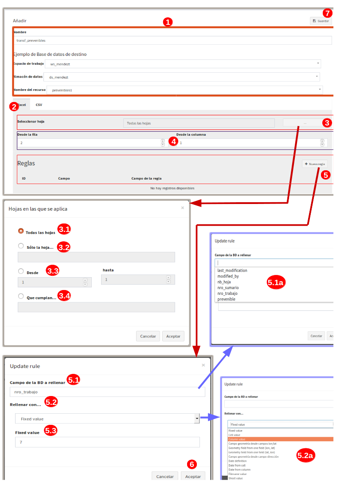

.. list-table:: Configuración para ficheros planos (formato xlxs) 
   :widths: 2 5 10
   :header-rows: 1
   :align: left

   * - Pasos
     - Selección
     - Acción
   * - 1
     - Pasos previos
     - Ya debe estar seleccionada la capa y el nombre de la plantilla de transformación
   * - 2
     - Escoger la opción 'excel'
     - Se muestra sus propias opciones de hojas 
   * - 3
     - Recuadro de 'seleccionar hoja' 
     - Al pinchar sobre los tres puntos se abrirá una nueva ventana de configuración de hojas
   * - 3.1
     - todas las hojas
     - Volcará en la capa de BD todos los datos que existan en todas las hojas del fichero excel
   * - 3.2
     - Solo la hoja
     - Escribir el nombre de la hoja que se desea usar, permite solo una hoja.
   * - 3.3
     - Opción desde y hasta
     - Si existen muchas hojas en el fichero plano, se puede indicar un rango de hojas, considera la primera hoja como la número (1) y así sucesivamente. Ejemplo, si hay diez hojas y se quiere usar desde la segunda a la quinta, se indicaría: 'desde: 2', 'hasta: 5'.
   * - 3.4
     - opción 'que cumpla'
     - Añade expresiones regulares que cumplan ciertas condiciones. Ejemplo, si existen varias hojas llamadas desde hoja_1 a hoja_8,y otras con nombres diferentes pero se quiere solo las llamadas hojas, la expresión será: hoja_*
   * - 4
     - Seleccionar desde la fila y desde la columna
     - Se define el número de la fila y columna a partir de la cual empezar a tomar los datos (por si hay cabeceras o filas a ignorar)
   * - 5
     - Área para definir las reglas
     - Desde el botón 'añadir nueva regla', saldrá un nuevo recuadro para ir configurando los campos de la capa con respecto a las columnas del fichero plano. 
   * - 5.1
     - Campo de la BD a rellenar
     - apareceran todos los campos disponibles de la capa a los cuales se van a volcar los datos del fichero plano.
   * - 5.1.a
     - Campos de la capa en la BD
     - Al hacer clic sobre la casilla se debe mostrar todos los campos incluyendo el 'gid' y el 'wkb_geometry'. Se selecciona al que se la vaya aplicar la regla.
   * - 5.2 
     - Rellenar con
     - Ésta opción muestra las distintas formas en que se puede volcar los datos de una columna del el fichero plano a un campo de la capa seleccionada en BD.
   * - 5.2.a
     - opciones para rellenar
     - entre las distintas formas que hay, las más usadas son 'valor de columna' y 'campos de geometrías desde campo lat/lon'. Se explicará a detalle en el siguiente item.
   * - 5.3
     - distintas opciones a elegir
     - Dependiendo de la opción seleccionada en el 5.2.a, se muestra diferetes opciones. Por ejemplo, si se elije 'valor por defecto', saldrá otra casilla 'valor por defecto' y se añade un valor escrito por el usuario. Ésta opción rellenará el campo seleccionado con este valor para todos sus registros, como su nombre lo indica es un 'Valor que está fijado'
   * - 6
     - aceptar
     - Se guarda la regla y se pueden definir tantas reglas como campos disponibles hayan en la capa de BD. Para continuar añadiendo reglas se repite todo el proceso del paso (5). Tambien se pueden editar y eliminar (botones verde y rojo a la derecha de cada regla).
   * - 7
     - Guardar
     - Se guarda los cambios cuando se finalice de añadir todas las reglas. 
     
3.2.3 configurar 'opciones para rellenar' en ambos formatos :
~~~~~~~~~~~~~~~~~~~~~~~~~~~~~~~~~~~~~~~~~~~~~~~~~~~~~~~~~~~~~
Estas son las distintas formas que pueden elegirse para aplicar el volcado de los datos. A continuación se detalla cada una de las opciones disponibles para generar las reglas.

* **Opción 1: valor por defecto:**

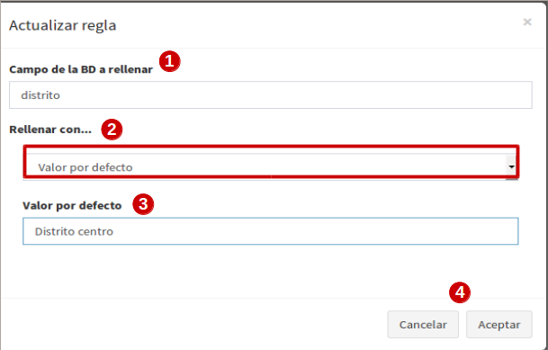

.. list-table:: Opción 1: Valor por defecto 
   :widths: 2 10 
   :header-rows: 1
   :align: left

   * - selección
     - Acción
   * - 1
     - Es el campo seleccionado de la capa que se rellenará
   * - 2
     - Opción: 'valor por defecto'
   * - 3
     - Escribir manualmente el valor que será fijado en todos los registros del campo seleccionado (1)
   * - 4
     - 'cancelar' para volver atrás ó 'aceptar' para guardar la regla        
  
    
* **Opción 2: Valor de celda:**

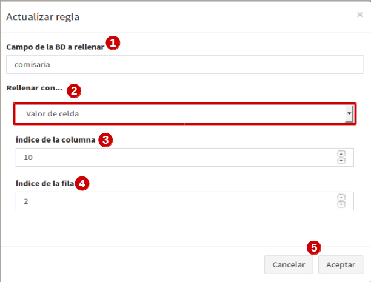

.. list-table:: Opción 2: Valor de celda 
   :widths: 2 10 
   :header-rows: 1
   :align: left

   * - Selección
     - Acción
   * - 1
     - Es el campo de la capa que se rellenará
   * - 2
     - Opción: 'Valor de celda', rellena todos los registros del campo con el valor de una celda del fichero plano (la celda se identifica por el nro de fila y columna). 
   * - 3
     - Indicar el número de la columna del fichero plano donde se ubica el valor.
   * - 4
     - Indcar el número de la fila del fichero plano donde se ubica el valor. 
   * - 5 
     - 'cancelar' para volver atrás ó 'aceptar' para guardar la regla.

* **Opción 3: Valor de columna**

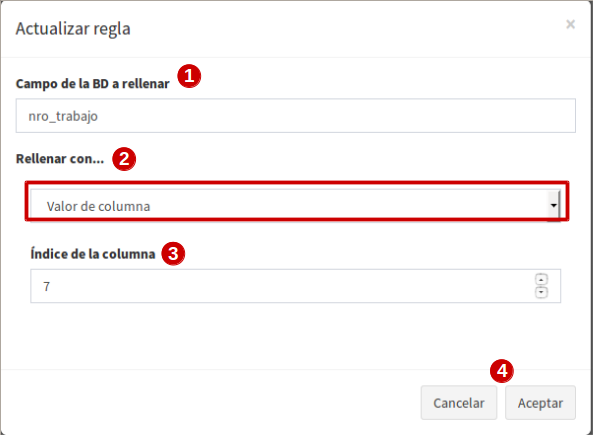

.. list-table:: Opción 3: Valor de columna 
   :widths: 2 10 
   :header-rows: 1
   :align: left

   * - Selección
     - Acción
   * - 1
     - Es el campo de la capa que se rellenará.
   * - 2
     - Opción: 'Valor de columna', todos los valores que existan en la columna indicada del fichero plano se volcarán en el campo seleccionado (es la opción mas usual)
   * - 3
     - Indicar el número de la columna del fichero plano
   * - 4 
     - 'cancelar' para volver atrás ó 'aceptar' para guardar la regla.     
  
        
* **Opción 4: Campo geometría desde columnas (lon/lat)**

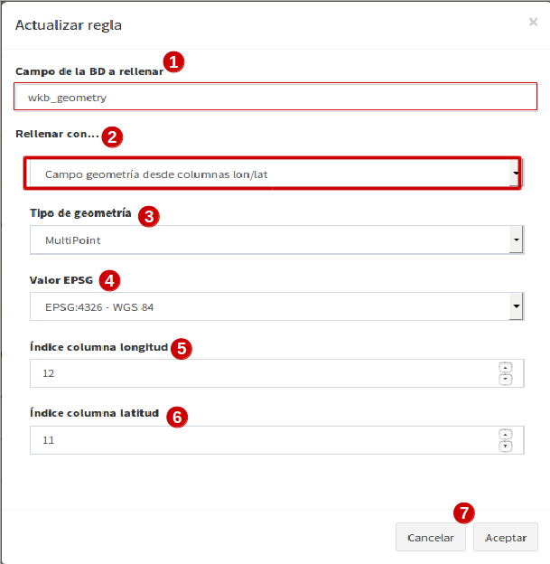

.. list-table:: Opción 4: Geometría desde dos columnas
   :widths: 2 10 
   :header-rows: 1
   :align: left

   * - Selección
     - Acción
   * - 1
     - El campo 'wkb_geometry' siempre se usará para las opciones de 'geometrías', es donde se crea y almacena la geometría del elemento en la base de datos geoespacial.
   * - 2
     - Opción: 'Campo geometría desde columnas (lon/lat)', esta opción generá la geometría de puntos a partir de las coordenadas latitud y longitud ó Este y Norte que se ubican en distintas columnas del fichero plano.
   * - 3
     - Seleccionar el tipo de geometría que se creará. La más usada es MultiPoint.
   * - 4
     - Seleccionar el sistema de referencia, están ordenados por el número EPSG. La mas usada es la 4326 que corresponde a las coordenadas geográficas WGS 84.
   * - 5
     - Indicar el número de la columna donde se ubica la coordenada que corresponde a la Longitud.
   * - 6
     - Indicar el número de la columna donde se ubica la coordenada que corresponde a la Latitud.
   * - 7 
     - 'cancelar' para volver atrás ó 'aceptar' para guardar la regla.

* **Opción 5: Campo geometría desde una única columna (lon/lat)**

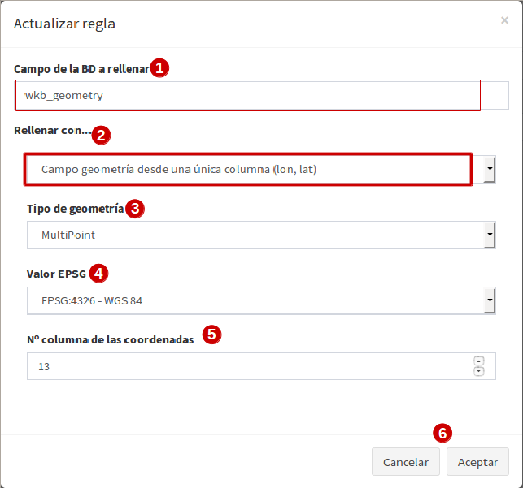

.. list-table:: Opción 5: Campo geometría desde una única columna (lon/lat) 
   :widths: 2 10 
   :header-rows: 1
   :align: left

   * - Selección
     - Acción
   * - 1
     - El campo 'wkb_geometry' siempre se usará para las opciones de 'geometrías', es donde se crea y almacena la geometría del elemento en la base de datos geoespacial.
   * - 2
     - Opción: 'Campo geometría desde una única columna (lon/lat)', permite generar la geometría desde *un solo campo* donde existan las coordenadas separadas por coma (,) y en el orden (lon,lat) ó (x,y).
   * - 3
     - Seleccionar el tipo de geometría que se creará. La más usada es MultiPoint.
   * - 4
     - Seleccionar el sistema de referencia, están ordenados por el número EPSG.
   * - 5
     - Indicar el número de la columna del fichero plano donde se ubican las coordenadas.
   * - 6
     - 'cancelar' para volver atrás ó 'aceptar' para guardar la regla.

* **Opción 6: Campo geometría desde una única columna (lat/lon)**

.. image:: ../_static/images/etl_opcion6.png
   :align: center

.. list-table:: Opción 6: Campo geometría desde una única columna (lat/lon) 
   :widths: 2 10 
   :header-rows: 1
   :align: left

   * - Selección
     - Acción
   * - 1
     - El campo 'wkb_geometry' siempre se usará para las opciones de 'geometrías', es donde se crea y almacena la geometría del elemento en la base de datos geoespacial.
   * - 2
     - Opción: 'Campo geometría desde una única columna (lat/lon)', permite generar la geometría desde *un solo campo* donde existan las coordenadas separadas por coma (,) y en el orden (lat,lon) ó (y,x).
   * - 3
     - Seleccionar el tipo de geometría que se creará. La más usada es MultiPoint.
   * - 4
     - Seleccionar el sistema de referencia, están ordenados por el número EPSG.
   * - 5
     - Indicar el número de la columna del fichero plano donde se ubican las coordenadas.
   * - 6
     - 'cancelar' para volver atrás ó 'aceptar' para guardar la regla.

* **Opción 7: Campo geometría desde columna dirección**

.. image:: ../_static/images/etl_opcion7.png
   :align: center

.. list-table:: Opción 7: Campo geometría desde columna dirección 
   :widths: 2 10 
   :header-rows: 1
   :align: left

   * - Selección
     - Acción
   * - 1
     - El campo 'wkb_geometry' siempre se usará para las opciones de 'geometrías', es donde se crea y almacena la geometría del elemento en la base de datos geoespacial.
   * - 2
     - Opción: 'Campo geometría desde columna dirección', permite generar geometrías puntuales desde un columna de texto que contiene la dirección. La generación y ubicación de la geometría dependerá de la descripción con que se detalle la dirección, puesto que debe ser detectada en la BD de OpenStreetMap (OSM), por tanto es necesario tener activo el geocodificador con el proveedor OSM. Para una mayor discriminación de datos por área, se podrá filtrar por *'código de país o dominio de nivel superior geográfico'*, ejemplo: 'es' para España, 'ar' para Argentina. (Esto se debe configurar en el plugin de geocoding, añadir el proveedor 'nominatim' y parámetros avanzados).
   * - 3
     - En 'valor dirección': Indicar el número de la columna del fichero plano donde se ubica la dirección.
   * - 4
     - 'cancelar' para volver atrás ó 'aceptar' para guardar la regla.

* **Opción 8: Definición de fecha**

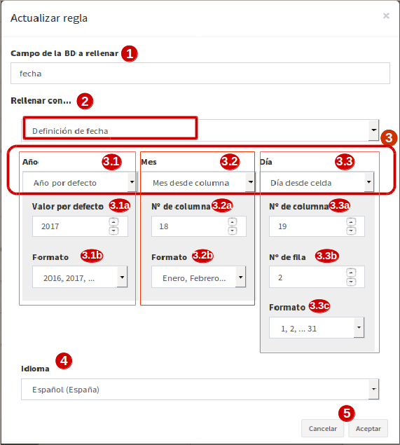
   
.. list-table:: Opción 8: Definición de fecha 
   :widths: 2 10 
   :header-rows: 1
   :align: left

   * - Selección
     - Acción
   * - 1
     - Es el campo de la capa que se rellenará. Este campo deberá ser de tipo dato: 'date', 'timestamp' o cualquier otro de formato fecha en la BD.
   * - 2  
     - Opción: 'Definición de fecha', esta opción es usada cuando en el fichero plano los valores del día, mes y año de una fecha están en distintas columnas y/o celdas fijas.    
   * - 3
     - Se disponen de tres casillas 'año, 'mes' y 'día'. En cada casilla hay tres formas para introducir el valor según sea el caso, estas son: valor por defecto, valor desde columna o valor desde celda. 
   * - 3.1
     - Casilla 'año' con la opción 'Año por defecto'
   * - 3.1.a
     - Escribir manualmente el número del año, introducir los cuatro dígitos.
   * - 3.1.b
     - para el 'año' solo se podrá seleccionar el formato de cuatro dígitos. Ejemplo, el año 2017 siempre será: '2017' y no '17'. 
   * - 3.2
     - Casilla 'mes' con la opción 'Mes desde columna'
   * - 3.2.a
     - indicar el número de la columna del fichero plano donde se ubican los meses
   * - 3.2.b
     - Para el 'mes' se podrá elegir entre el formato de número (1 al 12) o por nombre (Enero,..Diciembre)     
   * - 3.3 
     - Casilla 'día' con la opción 'día desde celda'
   * - 3.3.a
     - indicar el número de la columna del fichero plano donde se ubica la celda con el valor del día. 
   * - 3.3.b
     - indicar el número de la fila del fichero plano donde se ubica la celda con el valor del día.
   * - 3.3.c
     - Para el 'día' solo tendrá el formato númerico de uno a dos dígitos (1 al 31).
   * - 4
     - Seleccionar el tipo de idioma usado en la trasformación. Ejemplo: 'Español'
   * - 5
     - aceptar para guardar regla o cancelar y volver atrás.
     
.. note::
   En 'Definición de fecha' pueden usarse distintas combinaciones entre las opciones de cada casilla, según lo amerite el caso.

* **Opción 9: Fecha desde celda**

.. image:: ../_static/images/etl_opcion9.png
   :align: center

.. list-table:: Opción 9: Fecha desde celda 
   :widths: 2 10 
   :header-rows: 1
   :align: left

   * - Selección
     - Acción
   * - 1
     - Es el campo de la capa que se rellenará. Este campo deberá ser de tipo de dato: 'date' en la BD.
   * - 2  
     - Opción: 'fecha desde celda', será usada cuando en el fichero plano haya una única fecha común para todos los registros y esté fijada en una celda.
   * - 3
     - indicar el número de la columna del fichero plano donde se ubica la celda con el valor de la fecha.
   * - 4
     - indicar el número de la fila del fichero plano donde se ubica la celda con el valor de la fecha.
   * - 5
     - Formato como se representará la fecha. Puede seleccionarse uno del combo desplegable.
   * - 6
     - Seleccionar el tipo de idioma usado en la trasformación. Ejemplo: 'Español'  
   * - 7
     - 'cancelar' para volver atrás ó 'aceptar' para guardar la regla. 

* **Opción 10: Fecha desde columna**

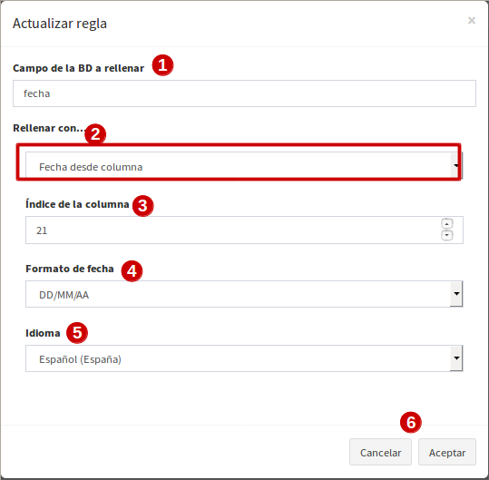

.. list-table:: Opción 10: Fecha desde columna
   :widths: 2 10 
   :header-rows: 1
   :align: left

   * - Selección
     - Acción
   * - 1
     - Es el campo de la capa que se rellenará. Este campo deberá ser de tipo de dato: 'date' en la BD.
   * - 2  
     - Opción: 'Fecha desde columna', usada para volcar las fechas que hay en una columna del fichero plano a un campo de la capa, haciendo la correspondencia de uno a uno e indicando el formato.
   * - 3 
     - indicar el número de la columna del fichero plano donde están las fechas.
   * - 4
     - Formato como se representará la fecha. Puede seleccionarse uno del combo desplegable.
   * - 5
     - Seleccionar el tipo de idioma usado en la trasformación. Ejemplo: 'Español'
   * - 6
     - 'cancelar' para volver atrás ó 'aceptar' para guardar la regla.
 
  
* **Opción 11: Nombre de fichero**

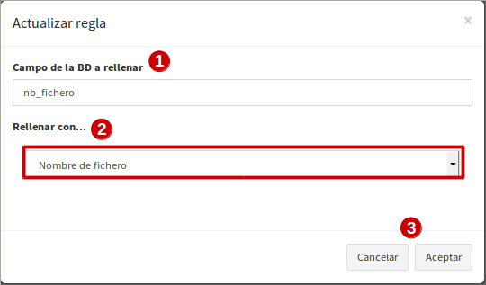
 
.. list-table:: Opción 11: Nombre de fichero
   :widths: 2 10 
   :header-rows: 1
   :align: left
  
   * - Selección
     - Acción
   * - 1
     - Es el campo de la capa que se rellenará.
   * - 2  
     - Opción: 'nombre de fichero', se usa para rellenar los registros del campo seleccionado con el nombre del fichero plano. No hace falta indicar ningun parámetro, el sistema detectará el directorio donde se ubica y el nombre del fichero.
   * - 3
     - 'cancelar' para volver atrás ó 'aceptar' para guardar la regla.

.. note::
   Esta opción es ventajosa para cuando se quiere volcar los datos de varios ficheros a una misma capa, así se identificaría a cuál fichero corresponde cada registro que se ha llevado a la capa.

 
* **Opción 12: Nombre de hoja**

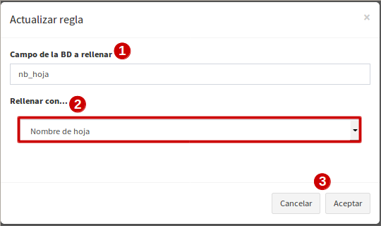

.. list-table:: Opción 12: Nombre de hoja
   :widths: 2 10 
   :header-rows: 1
   :align: left
  
   * - Selección
     - Acción
   * - 1
     - Es el campo de la capa que se rellenará.
   * - 2  
     - Opción: 'nombre de hoja', se usa para rellenar los registros del campo seleccionado con el nombre de cada hoja del fichero plano. Es útil cuando existen muchos registros en distintas hojas y se quiere identificar a cuál pertenece cada uno. No hace falta indicar ningun parámetro.
   * - 3
     - 'cancelar' para volver atrás ó 'aceptar' para guardar la regla.

     
3.2.4 Configuración con ficheros planos de formato .csv:
~~~~~~~~~~~~~~~~~~~~~~~~~~~~~~~~~~~~~~~~~~~~~~~~~~~~~~~~
Similar al otro formato xlxs, pero desde otra pestaña y no se podrá elegir entre hojas, puesto que este fichero es único.

.. image:: ../_static/images/etl4_csv.png
   :align: center

.. list-table:: Configuración para ficheros planos (formato csv) 
   :widths: 2 5 10
   :header-rows: 1
   :align: left

   * - Pasos
     - Selección
     - Acción
   * - 1
     - Pasos previos
     - Ya debe estar seleccionada la capa y el nombre de la plantilla
   * - 2
     - Escoger la opción 'csv'
     - Se activan las casillas de separador y codificación de caracteres
   * - 3
     - Casilla 'separador'
     - al hacer clic en la casilla se despliega un combo para elegir el carcater que actúa de separador en fichero plano csv, ejemplo: (,), (;), (:).
   * - 4
     - Codificación de caracteres
     - Se podrá especificar el tipo de codificación del fichero plano entre un combo desplegable donde se encuentran los más comunes.
   * - 5 y 6
     - Desde fila y columna
     - Se define el número de la fila y columna a partir de la cual empezar a tomar los datos (por si hay cabeceras o filas a ignorar)    
   * - 7
     - área para definir nuevas reglas
     - Desde el botón 'añadir nueva regla', saldrá un nuevo recuadro para ir configurando los campos de la tabla con respecto a las columnas del fichero plano. Se procede igual que el formato xlxs.
   * - 8
     - Botón verde: 'actualizar regla'
     - Permite cambiar la definición de regla, por ejemplo, cambiar el campo de la tabla de BD, cambiar la opción de rellenar. etc. 
   * - 9
     - Botón rojo 'borrar regla'
     - Elimina la regla.
   * - 10
     - Botón: 'Guardar'
     - Guarda todos los cambios hechos en la configuración de la plantilla.

3.3 Subir el fichero plano al sistema
_____________________________________

El fichero plano (xlsx y/o csv) debe estar guardado dentro de un directorio del adminitrador de archivos.

Se debe ir al panel de control - administrador de archivos- seleccionar o crear directorio - y subir los ficheros planos.

3.4 Aplicar transformación
__________________________

Cuando se haya creado una capa vacía o disponer de cualquier otra capa, se haya definido la plantilla de transformación y subido el fichero al administrador de archivos, se procede finalmente a aplicar la transformación respectiva.

Las transformaciones se ejecutan directamnete sobre el fichero plano que contiene los datos que se desean añadir a una capa vacía (si es primera vez) u otra capa existente donde quieran agregarse los nuevos registros.

Puede existir el caso, en que hayan muchos ficheros planos con la misma estructura de columnas, cuyos datos quieren ser añadidos a una única capa(A), en este caso, se crea una única plantilla(x) donde se selecciona la capa(A). Ésta plantilla(x) puede usarse en la transformación de cada uno de esos ficheros. Por tanto, una plantilla definida puede aplicarse en la transformación de varios ficheros planos, siempre y cuando la estructura de los datos del fichero estén ordenados como se ha configurado en las reglas de la plantilla.

Para mejor comprensión del paso final se detalla a continuación:

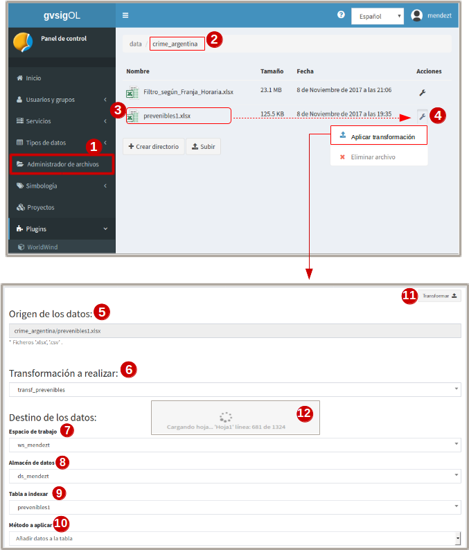

.. list-table:: Aplicar transformación 
   :widths: 1 2 5
   :header-rows: 1
   :align: center

   * - Pasos
     - Selección
     - Acción
   * - 1
     - ingresar a la entrada 'administrador de archivos' en panel de control  
     - se muestran todos los directorios disponibles
   * - 2
     - Ubicarse en el directorio donde se ha subido el fichero plano
     - Se muestra enlistados todos los fichero subidos
   * - 3
     - Identifiacar el fichero plano
     - Es el fichero que contiene los datos que serán volcados a una tabla en la BD
   * - 4
     - Hacer clic sobre el botón 'herramienta' del fichero plano seleccionado
     - seleccionar la opción 'aplicar transformación' y se abrirá ua nueva ventana para configurar otras opciones.
   * - 5
     - Origen de los datos
     - Valor por defecto que muestra el directorio y fichero sobre el cual se aplica la transformación      
   * - 6 
     - Casilla 'transformación a realizar'
     - Se despliegan las distintas plantillas que se han creado previamente y se escoge la que aplique a la capa a seleccionar.
   * - 7 
     - Espacio de trabajo
     - Indicar el espacio de trabajo donde se ubica el almacén de BD
   * - 8
     - Almacén de datos
     - Seleccionar el almacén de BD donde se encuentra la capa a rellenar
   * - 9
     - tabla a indexar
     - seleccionar la capa donde se volcarán los datos del fichero plano
   * - 10
     - Método a aplicar
     - existen dos opciones, 'añadir' o 'reemplazar'. Si se quiere sustituir los datos de la capa seleccionada se elije 
     
       'reemplazar', y si se quiere agregar o sumar nuevos datos a la tabla, se selecciona 'añadir'
   * - 11
     - Hacer clic para ejecutar la tranasformación
     - Saldrá un mensaje en el centro de la patalla donde muestra al usuario el progreso del volcado de los datos.
   * - 12
     - Mensaje de información al usuario
     - cuando se están subiedo los datos muestra el progreso de la cantidad de registros añadidos y sus respectivas hojas.     

.. note::
   EL poder seleccionar las opciones 7, 8 y 9 nos permitir poder añadir o reemplazar los datos del fichero a distintas capas, siempre y cuando la plantilla cumpla con la correspondencia de sus reglas entre los campos de la capa seleccionada y las columnas de éste fichero.

4. Comprobación de la transformación
------------------------------------

Se deberá abrir el proyecto donde se ha publicado la capa, se despliega su tabla de atributos y se controla que se hayan subido los registros existentes en el fichero y que correspondan a sus campos según la configuración de plantilla.

    
   