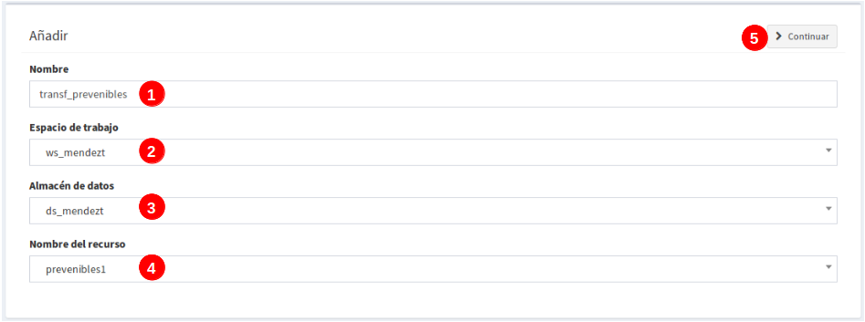

ETL - Plugin de transformación de datos
=======================================

1. Introducción
---------------

*ETL* (acrónimo de los términos en inglés *Extract, Transform and Load*) es una herramienta que permite exportar la información contenida en un fichero plano de  datos (Excel o CSV) a una tabla en la base de datos para luego poder operar con ella.

La ventaja de esta herramienta es que permite georrefenciar los registros de cada tabla, siempre y cuando exista un campo con el valor de las coordenadas o bien la dirección para poder posicionarlo mediante el geocodificador inverso, es decir, por medio del buscador de direcciones, que en este caso se usará la fuente de datos del servidor de OpenStreetMap (OSM).

2. Requisitos para realizar las transformaciones
~~~~~~~~~~~~~~~~~~~~~~~~~~~~~~~~~~~~~~~~~~~~~~~~
2.1. Tener disponible los datos en un fichero plano, en formatos de hoja de cálculo (**.xlsx**) o texto (**.csv**).

2.2. Crear una **capa vacía** en el sistema con los campos a donde se volcará la información de los ficheros planos.

2.3. Crear la plantilla de transformación.

2.4. Aplicar la transformación sobre el fichero plano.

3. Requisitos básicos en la estructura de los ficheros planos
~~~~~~~~~~~~~~~~~~~~~~~~~~~~~~~~~~~~~~~~~~~~~~~~~~~~~~~~~~~~~
Algunos requisitos mínimos se deben cumplir para que el proceso de transformación se realice de forma correcta. Los formatos deben ser los citados anteriormente y por otro lado asegurarse que las coordenadas contenidas en los ficheros sean estándar y uniforme, de esta manera se garantiza que la transformación sea exitosa al momento de posicionar cada elemento.

3.1. **Transformación con dirección**: El campo que contenga la dirección del elemento, preferiblemente que sea lo mas similiar posible a la dirección que ofrece la cartografía base del OSM.

3.2. **Transformación con coordenadas para formato (.xlxs)**: las coordenadas comunmente están en celdas separadas, deberán estar expresadas en grados decimales, donde la parte entera se separa de los minutos y segundos por (,), por ejemplo: (-31,4459068688) (-64,233981896). 

.. note::
   - El sistema no soporta comillas simples, ni dobles al final de la coordenadas, ejemplo: (-31,4354382939') (-64,2393822877').
   
   - Tampoco será válido coordenadas no bien definidas como los siguientes ejemplos: (-313.937.747)  (-6.417.356.619.999.990).
   
3.3. **Transformación con coordenadas para formato (.csv)**: las coordenadas normalmente estarán en una misma celda, por lo tanto, igual estarán expresadas en grados decimales, pero esta vez la parte entera se separa de los minutos y segundos por un (.) ya que la (,) es usada para separar entre latitud y longitud o viceversa. También se acepta que estén o no dentro de paréntesis. Ejemplo: (-31.4315574, -64.18822169999998) 

4.Pasos para transformar
~~~~~~~~~~~~~~~~~~~~~~~~
**4.1. Crear capa vacía**: Se crea la capa vacía en el sistema y se añaden tantos campos como tenga el fichero plano o los que se quiera volcar información.

.. note::
   - Cuando se crea una capa vacía en el sistema se añaden por defecto los campos: 'gid' y 'wkb_geometry', el primero es interno para hacer un identificador único en la tabla de Base de Datos (BD), éste no será usado en la transformación, el segundo es el campo donde se registrará la geometría de cada elemento y será el que se use para volcar las coordenadas.
   
   - También se añaden los campos 'last_modification' y 'by_modified', tampoco se usarán en la transformación. Son campos usados como control en la edición de la capa online desde el geoportal.

Una vez se haya publicado la capa vacía sin registros, se procede a crear la plantilla de transformación para fijar la configuración entre la capa vacía y el fichero plano.

**4.2. Crear plantilla de transformación (formato .xlsx)** Para acceder a esta funcionalidad se debe ingresar en el panel de control:

.. image:: ../_static/images/etl1.png
   :align: center

.. list-table:: Crear plantilla de transformación
   :widths: 2 20 50
   :header-rows: 1

   * - Pasos
     - Selección
     - Acción
   * - 1
     - En Panel de control, entrada: Geocoding 
     - Muestra todos los plugins disponibles
   * - 2
     - Seleccionar el plugin 'transformaciones'
     - Mostrará la ventana del listado de transformaciones
   * - 3
     - Clic sobre 'añadir'
     - Saldrá una nueva vista para configurar la plantilla de transformación
   * - 4
     - Botón color verde 'actualizar transformación'
     - Permite editar y actualizar nuevos cambios en la transformación definida previamente.
   * - 5
     - Botón color rojo 'borrar transformación'
     - Elimina la transformación de la lista
     

**4.3 Configuración de plantilla de transformación (formato xlsx)**: EL primer paso es añadir un nombre a la transformación y seleccionar cuál será la capa en el BD donde se volcarań los datos. 

.. list-table:: Nombre de transformación y seleccionar capa 
   :widths: 2 20 50
   :header-rows: 1

   * - Pasos
     - Selección
     - Acción
   * - 1
     - Añadir un nombre a la plantilla de transformación (sin caracteres especiales, ni espacios en blanco)
     - Será el nombre que identifique a la plantilla 
   * - 2
     - Seleccionar el Espacio de trabajo
     - Es el espacio donde se encuentra el almacén de datos a usar.
   * - 3
     - Seleccionar el almacén de datos
     - En éste almacén de datos se ubica la capa vacía
   * - 4
     - Buscar la capa y seleccionarla
     - Es la capa vacía que se ha creado previemente y donde se volcarán los datos del fichero plano.
   * - 5
     - Clic en continuar
     - Me lleva a una siguiente vista para configurar y corresponder cada una de las hojas, campos y celdas de la transformación a un registro de la tabla en la bd.  

.. image:: ../_static/images/etl3.png
   :align: center

.. list-table:: Configuración para ficheros planos (formato xlxs) 
   :widths: 2 5 10
   :header-rows: 1
   :align: left

   * - Pasos
     - Selección
     - Acción
   * - 1
     - Pasos previos
     - Ya debe estar seleccionada la capa y el nombre de la transformación
   * - 2
     - Escoger la opción 'excel'
     - Se muestra sus propias opciones de hojas 
   * - 3
     - Recuadro de 'seleccionar hoja' 
     - Al pinchar sobre los tres puntos se abrirá una nueva ventana de configuración de hojas
   * - 3.1
     - todas las hojas
     - Volcará en la tabla vacia todos los datos que existan en todas las hojas del fichero excel
   * - 3.2
     - Solo la hoja
     - Escribir el nombre de la hoja que se desea usar, permite solo una hoja.
   * - 3.3
     - Opción desde y hasta
     - Si existen muchas hojas en el fichero plano, se puede indicar un rango de hojas, considera la primera hoja como la número (1) y así sucesivamente. Ejemplo, si hay diez hojas y se quiere usar desde la segunda a la quinta, se indicaría: desde 2 hasta 5.
   * - 3.4
     - opción 'que cumpla'
     - Añade expresiones regulares que cumplan ciertas condiciones. Ejemplo, si existen varias hojas llamadas desde hoja_1 a hoja_8,y otras con nombres diferentes pero se quiere solo las llamadas hojas, la expresión será: hoja_*
   * - 4
     - Seleccionar desde la fila y desde la columna
     - El sistema tomará los datos desde el número de fila y columna indicado del fichero plano. No siempre los datos comienzan en la fila y columna 1, ya que siempre hay encanezados y entre otros.
   * - 5
     - Área para defiir las reglas
     - Desde el botón 'añadir nueva regla', saldrá un nuevo recuadro para ir configurando los campos de la tabla con respecto a las columnas del fichero plano. 
   * - 5.1
     - Campo de la BD a rellenar
     - apareceran todos los campos disponibles de la capa a los cuales se van a volcar los datos del fichero plano.
   * - 5.1.a
     - Campos de la capa en la BD
     - Al hacer clic sobre la casilla se debe mostrar todos los campos incluyendo el 'gid' y el 'wkb_geometry', se selecciona uno de ellos.
   * - 5.2 
     - Rellenar con
     - Ésta opción muestra las distintas formas en que se puede volcar los datos desde el fichero plano al campo de la BD seleccionado.
   * - 5.2.a
     - opciones para rellenar
     - entre las distintas formas que hay, las más usadas son 'valor de columna' y 'campos de geometrías desde campo lat/lon'. Se explicará a detalle en el siguiente item.
   * - 5.3
     - distintas opciones a elegir
     - Dependiendo de la opción seleccionada en el 5.2.a, se muestra diferetes opciones. Por ejemplo, si se elije 'valor fijo', saldrá otra casilla 'Valor fijo' y se añade un valor escrito por el usuario. Ésta opción rellenará el campo seleccionado con este valor para todos sus registros, como su nombre lo indica es un 'Valor que está fijado'
   * - 6
     - aceptar
     - Se guarda la regla y se pueden definir tantas reglas como campos disponibles hayan en la capa de BD. Para continuar añadiendo reglas se repite todo el proceso del paso (5).
   * - 7
     - Guardar
     - Se guarda los cambios cuando se finalice de añadir todas las reglas. 

     
**4.3.1 Opciones para rellenar (sección 5.2.a)**: Estas son las distintas formas que pueden elegirse para aplicar el volcado de los datos. A continuación se detalla cada una de las opciones disponibles para generar las reglas.

* **Opción 1: valor fijo:**

.. image:: ../_static/images/etl3_1.png
   :align: center

.. list-table:: Opción 1: Valor fijo 
   :widths: 2 10 
   :header-rows: 1
   :align: left

   * - selección
     - Acción
   * - 1
     - Es el campo de la tabla vacía que se rellenará
   * - 2
     - Opción: 'Valor fijo'
   * - 3
     - Escribir manualmente el valor que será fijado en todos los registros del campo seleccionado (1)
   * - 4
     - 'cancelar' para volver atrás ó 'aceptar' para guardar la regla        
  
    
* **Opción 2: Valor de celda:**

.. image:: ../_static/images/etl3_2.png
   :align: center

.. list-table:: Opción 2: Valor de celda 
   :widths: 2 10 
   :header-rows: 1
   :align: left

   * - Selección
     - Acción
   * - 1
     - Es el campo de la tabla vacía que se rellenará
   * - 2
     - Opción: 'Valor de celda', Rellena todos los registros del campo con el valor de una celda del fichero plano. 
   * - 3
     - Indicar el número de la columna del fichero plano donde se ubica el valor.
   * - 4
     - Indcar el número de la fila del fichero plano donde se ubica el valor. 
   * - 5 
     - 'cancelar' para volver atrás ó 'aceptar' para guardar la regla.

* **Opción 3: Valores de columna**

.. image:: ../_static/images/etl3_3.png
   :align: center

.. list-table:: Opción 3: Valores de columna 
   :widths: 2 10 
   :header-rows: 1
   :align: left

   * - Selección
     - Acción
   * - 1
     - Es el campo de la tabla vacía que se rellenará.
   * - 2
     - Opción: 'Valores de columna', todos los valores que existan en la columna indicada del fichero plano se volcarán en el campo seleccionado (es la opción mas usual)
   * - 3
     - Indicar el número de la columna del fichero plano
   * - 4 
     - 'cancelar' para volver atrás ó 'aceptar' para guardar la regla.     
  
        
* **Opción 4: Geometría desde dos campos (lon/lat)**

.. image:: ../_static/images/etl3_4.png
   :align: center

.. list-table:: Opción 4: Geometría desde dos campos
   :widths: 2 10 
   :header-rows: 1
   :align: left

   * - Selección
     - Acción
   * - 1
     - El campo 'wkb_geometry' siempre se usará para las opciones de 'geometrías', es donde se crea y almacena la geometría del elemento en la base de datos geoespacial.
   * - 2
     - Opción: 'Geometría desde dos campos (lon/lat)', esta opción generá la geometría de puntos a partir de las coordenadas latitud y longitud ó Este y Norte que se ubican en distintas columnas del fichero plano.
   * - 3
     - Seleccionar el tipo de geometría que se creará. La más usada es MultiPoint.
   * - 4
     - Seleccionar el sistema de referencia, están ordenados por el número EPSG.
   * - 5
     - Indicar el número de la columna donde se ubica la coordenada que corresponde a la Longitud.
   * - 6
     - Indicar el número de la columna donde se ubica la coordenada que corresponde a la Latitud.
   * - 7 
     - 'cancelar' para volver atrás ó 'aceptar' para guardar la regla.

* **Opción 5: Geometría desde un campo (lon/lat)**

.. image:: ../_static/images/etl3_5.png
   :align: center

.. list-table:: Opción 5: Geometría desde un campo (lon/lat) 
   :widths: 2 10 
   :header-rows: 1
   :align: left

   * - Selección
     - Acción
   * - 1
     - El campo 'wkb_geometry' siempre se usará para las opciones de 'geometrías', es donde se crea y almacena la geometría del elemento en la base de datos geoespacial.
   * - 2
     - Opción: 'Geometría desde un campo (lon/lat)', permite generar la geometría desde *un solo campo* donde existan las coordenadas separadas por coma (,) y en el orden (lon,lat) ó (x,y).
   * - 3
     - Seleccionar el tipo de geometría que se creará. La más usada es MultiPoint.
   * - 4
     - Seleccionar el sistema de referencia, están ordenados por el número EPSG.
   * - 5
     - Indicar el número de la columna del fichero plano donde se ubican las coordenadas.
   * - 6
     - 'cancelar' para volver atrás ó 'aceptar' para guardar la regla.

* **Opción 6: Geometría desde un campo (lat/lon)**

.. image:: ../_static/images/etl3_6.png
   :align: center

.. list-table:: Opción 6: Geometría desde un campo (lat/lon) 
   :widths: 2 10 
   :header-rows: 1
   :align: left

   * - Selección
     - Acción
   * - 1
     - El campo 'wkb_geometry' siempre se usará para las opciones de 'geometrías', es donde se crea y almacena la geometría del elemento en la base de datos geoespacial.
   * - 2
     - Opción: 'Geometría desde un campo (lat/lon)', permite generar la geometría desde *un solo campo* donde existan las coordenadas separadas por coma (,) y en el orden (lat,lon) ó (y,x).
   * - 3
     - Seleccionar el tipo de geometría que se creará. La más usada es MultiPoint.
   * - 4
     - Seleccionar el sistema de referencia, están ordenados por el número EPSG.
   * - 5
     - Indicar el número de la columna del fichero plano donde se ubican las coordenadas.
   * - 6
     - 'cancelar' para volver atrás ó 'aceptar' para guardar la regla.

* **Opción 7: Geometría desde campo dirección**

.. image:: ../_static/images/etl3_7.png
   :align: center

.. list-table:: Opción 7: Geometría desde campo dirección 
   :widths: 2 10 
   :header-rows: 1
   :align: left

   * - Selección
     - Acción
   * - 1
     - El campo 'wkb_geometry' siempre se usará para las opciones de 'geometrías', es donde se crea y almacena la geometría del elemento en la base de datos geoespacial.
   * - 2
     - Opción: 'Geometría desde campo dirección', permite generar geometrías puntuales desde un campo texto con la dirección. La generación y ubicación de la geometría dependerá de la descripción con que que se detalle la dirección, puesto que debe ser detectada en la BD de OpenStreetMap (OSM), en este caso es necesario tener disponible el geocodificador de OSM. Para una mayor discriminación de datos por área, se podrá filtrar por *'código de país o dominio de nivel superior geográfico'*, ejemplo: 'es' para España, 'ar' para Argentina. (Esto se debe configurar en el plugin de geocoding, añadir el proveedor 'nominatim' y parámetros avanzados).
   * - 3
     - Indicar el número de la columna del fichero plano donde se ubica la dirección.
   * - 4
     - 'cancelar' para volver atrás ó 'aceptar' para guardar la regla.

* **Opción 8: Definición de fecha**

.. image:: ../_static/images/etl3_8.png
   :align: center
   
.. list-table:: Opción 8: Definición de fecha 
   :widths: 2 10 
   :header-rows: 1
   :align: left

   * - Selección
     - Acción
   * - 1
     - Es el campo de la tabla vacía que se rellenará. Este campo deberá ser de tipo de dato: 'date' en la BD.
   * - 2  
     - Opción: 'Definición de fecha', esta opción es usada cuando en el fichero plano los valores del día, mes y año de una fecha están en distintas columnas y/o celdas fijas.    
   * - 3
     - Se disponen de tres casillas 'año, 'mes' y 'día'. En cada casilla hay tres formas para introducir el valor según sea el caso, estas son: valor fijo, valor desde columna o valor desde celda. 
   * - 3.1
     - Casilla 'año' con la opción 'Fijar valor de año'
   * - 3.1.a
     - Escribir manualmente el número del año, introducir los cuatro dígitos.
   * - 3.1.b
     - para el 'año' solo se podrá seleccionar el formato de cuatro dígitos. Ejemplo, el año 2017 siempre será: '2017' y no '17'. 
   * - 3.2
     - Casilla 'mes' con la opción 'fijar la columna del mes'
   * - 3.2.a
     - indicar el número de la columna del fichero plano donde se ubican los meses
   * - 3.2.b
     - Para el 'mes' se podrá elegir entre el formato de número (1 al 12) o por nombre (Enero,..Diciembre)     
   * - 3.3 
     - Casilla 'día' con la opción 'Fijar la celda del día'
   * - 3.3.a
     - indicar el número de la columna del fichero plano donde se ubica la celda con el valor del día. 
   * - 3.3.b
     - indicar el número de la fila del fichero plano donde se ubica la celda con el valor del día.
   * - 3.3.c
     - Para el 'día' solo tedrá el formato númerico de uno a dos dígitos (1 al 31).
   * - 4
     - Seleccionar el tipo de lenguaje usado en la trasformación.  

.. note::
   En 'Definición de fecha' pueden usarse distintas combinaciones entre las opciones de cada casilla, según lo amerite el caso.

* **Opción 9: Fecha desde celda**

.. image:: ../_static/images/etl3_9.png
   :align: center

.. list-table:: Opción 9: Fecha desde celda 
   :widths: 2 10 
   :header-rows: 1
   :align: left

   * - Selección
     - Acción
   * - 1
     - Es el campo de la tabla vacía que se rellenará. Este campo deberá ser de tipo de dato: 'date' en la BD.
   * - 2  
     - Opción: 'fecha desde celda', será usada cuando en el fichero plano haya una única fecha común para todos los registros y esté fijada en una celda.
   * - 3
     - indicar el número de la columna del fichero plano donde se ubica la celda con el valor de la fecha.
   * - 4
     - indicar el número de la fila del fichero plano donde se ubica la celda con el valor de la fecha.
   * - 5
     - Formato como se representará la fecha. Pude definirse por el usuario.
   * - 6
     - seleccionar el tipo de lenguaje usado en la trasformación.  
   * - 7
     - 'cancelar' para volver atrás ó 'aceptar' para guardar la regla. 

* **Opción 10: Fecha desde columna**

.. image:: ../_static/images/etl3_10.png
   :align: center

.. list-table:: Opción 10: Fecha desde columna
   :widths: 2 10 
   :header-rows: 1
   :align: left

   * - Selección
     - Acción
   * - 1
     - Es el campo de la tabla vacía que se rellenará. Este campo deberá ser de tipo de dato: 'date' en la BD.
   * - 2  
     - Opción: 'Fecha desde columna', usada para volcar las fechas que hay en una columna del fichero plano a un campo de la capa vacía, haciendo la correspondencia de uno a uno e indicando el formato.
   * - 3 
     - indicar el número de la columna del fichero plano donde están las fechas.
   * - 4
     - Formato como se representará la fecha. Pude definirse por el usuario.
   * - 5
     - seleccionar el tipo de lenguaje usado en la trasformación. 
   * - 6
     - 'cancelar' para volver atrás ó 'aceptar' para guardar la regla.
 
  
* **Opción 11: Nombre de fichero**

.. image:: ../_static/images/etl3_11.png
   :align: center
 
.. list-table:: Opción 11: Nombre de fichero
   :widths: 2 10 
   :header-rows: 1
   :align: left
  
   * - Selección
     - Acción
   * - 1
     - Es el campo de la tabla vacía que se rellenará.
   * - 2  
     - Opción: 'nombre de fichero', se usa para rellenar los registros del campo seleccionado con el nombre del fichero plano. No hace falta indicar ningun parámetro.
   * - 3
     - 'cancelar' para volver atrás ó 'aceptar' para guardar la regla.
  
* **Opción 12: Nombre de hoja**

.. image:: ../_static/images/etl3_12.png
   :align: center  

.. list-table:: Opción 12: Nombre de hoja
   :widths: 2 10 
   :header-rows: 1
   :align: left
  
   * - Selección
     - Acción
   * - 1
     - Es el campo de la tabla vacía que se rellenará.
   * - 2  
     - Opción: 'nombre de hoja', se usa para rellenar los registros del campo seleccionado con el nombre de cada hoja del fichero plano. Es útil cuando existen muchos registros en distintas hojas y se quiere identificar a cuál pertenecen. No hace falta indicar ningun parámetro.
   * - 3
     - 'cancelar' para volver atrás ó 'aceptar' para guardar la regla.
     
       

5.Las plantillas de transformaciones
------------------------------------

A través de las transformaciones se definirán cómo rellenar cada uno de los campos de la base de datos destino utilizando la información extraída de cada una de las filas del fichero origen (xlsx o csv)

Las transformaciones aparecen listadas, pudiéndose añadir más, editar las existentes o borrarlas.

**Crear una transformación**: Sólo requiere del nombre de la transformación para su genereación. Luego se pueden definir todos los pasos a seguir para exportar los datos desde la pantalla de edición.

*Borrar transformación*: Elimina la transformación, así como todas sus reglas (pasos a seguir) para rellenar los campos de la base de datos.

*Actualizar transformación*: Permite definir la secuencia de pasos a seguir. En él se definen las reglas (pasos), de la siguiente manera:

- Primero da la opción de indicar un ejemplo de base de datos de destino. Aunque es opcional, si se pone rellenará parte del formulario facilitando la faena posterior (por ejemplo, aparecerá el listado de campos dispoibles, evitando los errores ocasionados al tecleaarlos a mano)

- Luego se define el origen de datos, escogiendo la pestaña correspondiente (Excel o CSV)

- Según la opción especificada, se elegirán los parámetros necesarios para configurarla:

  - Excel:
    
    - Se eligen las hojas del excel sobre las que se hará la transformación. Puede escogerse la opción de 'todas', 'desde...hasta...', 'con el nombre...' o 'que cumplan esta condición...' (expresión regular)
    
    - Luego se define la fila a partir de la cual empezar a tomar los datos (por si hay cabeceras o filas a ignorar)
   
  - CSV:
    
    - Se define el caracter que actúa de separador de campos (aparecen algunos, pero se puede definir uno propio)
    
    - Se especifica la codificación del fichero
    
    - Luego se define la fila a partir de la cual empezar a tomar los datos (por si hay cabeceras o filas a ignorar)
     
- Por último, se establecerán las reglas de transformación. Estas reglas requieren del campo de la tabla de la base de datos donde se va almacenar la información (campo destino), y de cómo se va a rellenar, pudiéndose elegir entre estas opciones:
  
  - Con un *texto fijo* (valores constantes)
  
  - Con el *valor de una columna*. a partir de la fila indicada anteriormente, rellenara con el valor de esa columna. Se ha de indicar el número de columna (empezando por 0 para la primera)
  
  - *Valor calculado*, permite meter código python directamente para definir el valor del campo de forma compleja. Ejemplos existen todos los que se puedan ocurrir, pero por ejemplo marcamos dos:
  
    - self.createGeometry('Multipoint',4326,6,7) -> Función propia que rellena el campo con una geometría (en este caso multipunto), con un SRID (4326), y la longitud/latitud que están en las columnas 6 y 7 respectivamente (en este caso).
    
    - self.getValueOfColumn(0)+'-'+self.getValueOfColumn(1) -> Introduce en el campo destino los valores de la primera y segunda columna separados por un guión. self.getValueOfColumn(X) es una función propia que devuelve el valor para la columna X de la fila actual
    
    - now() -> Función general ed python que devuelve la fecha y hora actual
    
    - Y todas las que se puedan ocurrir....
      

6. Realizar transformaciones
----------------------------

Una vez definida la transformación, se va al directorio de ficheros a buscar el origen de los datos (Ficheros excel o CSV). Y sobre el botón de herramientas se elige la opción *Transformas*

Luego bastará con elegir la transformación a aplicar, la tabla de la BD destino y si se quiere que el resultado se añada al contenido que ya hay en la tabla, o que se borre y se rellene sólo con los datos del fichero.

    
   