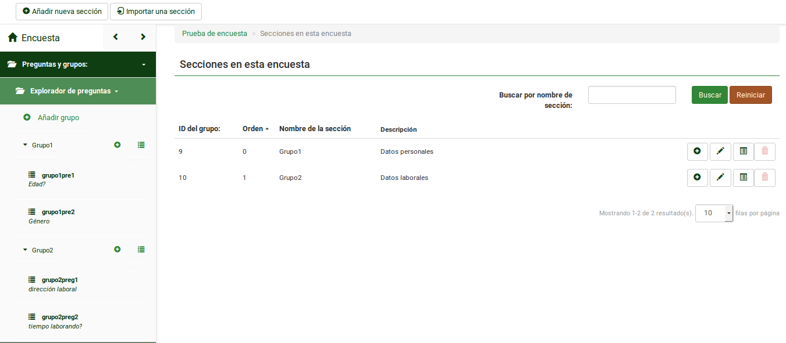
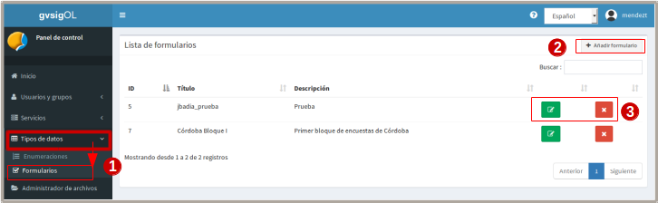

Plugin de encuestas
===================

1. Introducción
---------------

Este plugin tiene como objetivo vincular Features (alguna geometría) de nuestras capas vectoriales con encuestas realizadas a través de la plataforma LimeSurvey. 
De esta forma, se puede ligar la encuesta a una feature del mapa para posteriores estudios que puedan ser necesarios.

La plataforma LimeSurvey es independiente del gvsigonline y la conexión entre ambas plataformas es realizado por el administrador del sistema.

Según wikipedia:"LimeSurvey (anteriormente PHPSurveyor) es una aplicación open source para la aplicación de encuestas en línea, escrita en PHP y que utiliza bases de datos MySQL, PostgreSQL o MSSQL. Esta utilidad brinda la posibilidad a usuarios sin conocimientos de programación el desarrollo, publicación y recolección de respuestas de sus encuestas.

Las encuestas incluyen ramificación a partir de condiciones, plantillas y diseño personalizado usando un sistema de plantillas web, y provee utilidades básicas de análisis estadístico para el tratamiento de los resultados obtenidos. Las encuestas pueden tener tanto un acceso público como un acceso controlado estrictamente por las claves que pueden ser utilizadas una sola vez (tokens) asignadas a cada persona que participa en la encuesta. Además los resultados pueden ser anónimos, separando los datos de los participantes de los datos que proporcionan, inclusive en encuestas controladas"

2. Requisitos para vincular encuestas a las features de una capa
----------------------------------------------------------------
* 2.1 Crear mínimo una encuesta en la plataforma Limesurvey

* 2.2 Registrar encuesta en gvsigonline

* 2.3 vincular la encuesta a una capa de gvsigonline

2.1 Crear una encuesta en la plataforma Limesurvey
__________________________________________________

Para crear una encuesta se necesita:

* 2.1.1 Acceder con usuario y clave a la paltaforma de Limesurvey
* 2.1.2 Dar de alta una encuesta (configuraciones básicas)
* 2.1.3 Activar encuesta

2.1.1 Acceder con usuario y clave a la paltaforma de Limesurvey
~~~~~~~~~~~~~~~~~~~~~~~~~~~~~~~~~~~~~~~~~~~~~~~~~~~~~~~~~~~~~~~

Se ingresa a la plataforma limesurvey a través de la url del gvsigonline con la extensión a ésta plataforma. Las url dependen de la configuración de cada cliente.

.. image:: ../_static/images/form1.png
   :align: center

.. list-table:: Autenticarse en Limesurvey 
   :widths: 2 10 
   :header-rows: 1
   :align: left

   * - selección
     - Acción
   * - 1
     - Usuario que tendrá privilegios para crear/editar encuestas
   * - 2
     - Ingresar clave
   * - 3 
     - La plataforma permitir seleccionar distintos idiomas
   * - 4
     - Nos lleva al entorno principal de la plataforma. Se describen los apartados relevantes
   * - 5 
     - Si es primera vez, se configuran las opciones generales que se aplican a todo el entorno y sobre todas las encuestas.
   * - 6
     - Entrada para dar de alta una encuesta nueva. También se puede desde la barra de menú superior
   * - 7 
     - Entrada que muestra enlistada las ecuestas que estan activas o no para poder usarse.       

.. note::
   En este manual no se hará detalles del manejo específico de la plataforma (limesurvey). Se indicará los items más relevantes y necesarios para que interactue con el gvsigonline. 

En esta interfaz se pueden añadir las encuestas(por bloques, preguntas, condiciones entre ellas, etc), exportarlas, guardar, editarlas, manejar la seguridad, entre otros. Se recomienda al usuario revisar el Manual_ propio de la interfaz Limesurvey.

 .. _Manual: http://manual.limesurvey.org/

2.1.2 Dar de alta una encuesta (configuraciones básicas)
~~~~~~~~~~~~~~~~~~~~~~~~~~~~~~~~~~~~~~~~~~~~~~~~~~~~~~~~

Es Importante tener presente que ciertas configuraciones se personalizan según los requerimientos o necesidades de cada cliente.  La configuración de algunos parámetros principales se describen a continuación.

 
.. image:: ../_static/images/form2.png
   :align: center  

.. list-table:: Configuración básica para dar de alta encuesta 
   :widths: 2 15 
   :header-rows: 1
   :align: left

   * - Vista
     - Opciones activadas
   * - 1
     - Entrada principal donde se describe la información relacionada a la encuesta:
     
       * Seleccionar el idioma
       * El Título (nombre de la encuesta)
       * La descripción 
       * Algún mensaje de bievenida (opcional)
       * Algún mensaje de despedida (opcional) 
   * - 2
     - Entradas secundarias desplegables donde se ajustan las configuraciones por sección.
   * - 2.1
     - Sección: 'Opciones Generales', ACTIVAR:
     
       * pregunta por pregunta
       * Las demás opciones están por defecto según la configuración del administrador.
   * - 2.2
     - Sección: 'Presentación y navegación', ACTIVAR:
     
       * Mostrar pantalla de bienvenida
       * Mostrar pantalla de bienvenida
       * Mostrar barra de progreso (opcional)
       * Cargar URL automáticamente cuando finalice la encuesta (opcional)
       * Cargar URL automáticamente cuando finalice la encuesta (opcional)
       * Mostrar el nombre de la sección y/o la descripción: 'Mostrar solo el nombre de la sección (opcional)'
       * Mostrar el número y/o el código de la pregunta: 'Ocultar ambos'
       * Demás opciones desactivados o se activan según se requiera.
   * - 2.3
     - Sección: 'Control de publicación y acceso', ACTIVAR: 
     
       * Mostrar al público la encuesta
       * Fecha y hora de inici y expiración (cuando la fecha expire la encuesta estará desativada para usar)
       * Demás opciones desactivadas (se pueden activar según lo requiera el administrador)
   * - 2.4
     - Sección: 'Administración de la notificación y de los datos', ACTIVAR:
     
       * Sello de tiempo
       * Guardar la dirección IP
       * Guardar la URL de origen (referrer URL)
       * Guardar mediciones de tiempo
       * Habilitar modo evaluación
       * Los participantes pueden guardar y continuar más tarde
       * Demás opciones desactivadas (se pueden activar según lo requiera el administrador)    
   * - 2.5
     - Sección: 'Encuestados/as', ACTIVAR:
     
       * Activar persistencia de la respuesta para la misma contraseña
       * Permitir múltiples respuestas o actualizar la existente para la misma contraseña
       * Utilizar formato HTML para los correos a los usuarios restringidos
       * Enviar correos electrónicos de confirmación
       * Respuestas anonimizadas (DESACTIVADO)
       * Permitir registro público (DESACTIVADO)

Finalizado las configuraciones generales se van añadiendo las secciones de grupos de preguntas y dentro de ellos cada una de las preguntas.

Para cada grupo se puede definir el orden de las preguntas y éstas últimas se pueden presentar de distintos formatos, añadir condiciones entre las distintas preguntas, configuraciones generales y avanzadas de forma independiente.

.. image:: ../_static/images/survey_conf_gr_preguntas.png
   :align: center

2.1.3 Activar encuesta
~~~~~~~~~~~~~~~~~~~~~~

Una vez configuradas las preguntas de la encuesta, se debe activar la encuesta para poder ser usada. 

Dependiendo de las necesidades del cliente, se podrá activar la encuesta de forma anónima o no. En este caso se describe la opción de generar una lista de participantes, es decir, que no sea anónima. 

Es importante prestar atención a las especificaciones de cómo funcionará las distintas opciones a escoger, Limesurvey lo irá mostrando de forma sencilla y bastatnte clara. Por ejemplo, cuando se procede a activar la encuesta, muestra los siguientes mensajes:

.. note::
   Debe activar una encuesta sólo cuando esté absolutamente seguro(a) de que la configuración de la misma es correcta y que no habrá más cambios. 
 
   Una vez activada la encuesta no se le permitirá:

    * Agregar o eliminar secciones de la encuesta
    
    * Agregar o eliminar pregunta
    
    * Agregar o eliminar subpregunta, o cambiar sus códigos

   Por favor, tenga en cuenta que, una vez que las respuestas de esta encuesta se han recogido, si quiere añadir o eliminar grupos/preguntas o cambiar uno de los ajustes anteriores, necesitará desactivar esta encuesta; esto provocará que todos los datos que fueron ya introducidos sean movidos a una tabla de diferente para su archivo.
 

.. image:: ../_static/images/encuesta_activar_1_.png
   :align: center

.. image:: ../_static/images/encuesta_activar_2_.png
   :align: center

.. list-table:: Activar encuesta 
   :widths: 2 10 
   :header-rows: 1
   :align: left

   * - Opción
     - Acción
   * - 1
     - Entrada 'Encuestas': muestra todo el listado de las encuestas que existen.
   * - 2
     - Estado de las encuestas, indican cuales son los activas o no. Se hace clic 
       
       sobre la que no está activa y nos lleva a otra ventana
   * - 3
     - Al hacer clic sobre 'activar encuesta' nos lleva a otras opciones a seleccionar    
   * - 4
     - Son las distitas opciones de la encuesta en general:
     
       * Previsualizar la encuesta, ver como la visualizan los usuarios
       * Propiedades de la encuesta (configuaraciones)
       * Herramienstas
       * Mostrar/exportar 
       * Participantes de la encuesta
   * - 5
     - Seleccionar, **Respuestas Anónimas : NO** las demás opciones pueden ser 'SI' u opcionales.     
   * - 6
     - Salvar y activar encuestas. Como no Son anónimas las respuestas, se continúa configurando
   * - 7
     - Cambiar a encuesta de acceso restringido (leer las condiciones que se activan)
   * - 8
     - Inicializar tabla de participantes
   * - 9
     - Al dar a 'continuar', la encuesta estará activa para poder realizarla             
      

2.2 Registrar encuesta en gvSIG Online
______________________________________

Una vez se tiene completa la definición de la encuesta en el sistema LimeSurvey, se procederá a registrarla en gvSIGOnline. 

.. list-table:: Entrada de Encuestas en menú de gvSIG Online
   :widths: 2 10 
   :header-rows: 1
   :align: left

   * - Opción
     - Acción
   * - 1
     - Desde el panel de control, en la entrada de menú **Tipo de datos**, encontramos la opción de **"formularios"** 
     
       donde se muestran las encuestas dadas de alta en la plataforma.
   * - 2
     - desde esta opción se abre una vista para rellenar los parámetros de registro y así añadir la encuesta.
   * - 3
     - Como siempre, podemos añadir, editar y borrar.

Para insertar o registrar una nueva encuesta se necesitan los siguientes parámetros:

.. image:: ../_static/images/form4.png
   :align: center
   

.. list-table:: Registrar encuesta en gvSIG Online
   :widths: 2 10 
   :header-rows: 1
   :align: left

   * - Opción
     - Acción
   * - 1
     - **Nombre**, generado automáticamente por el sistema y así evitar duplicidad
   * - 2
     - **Título**, Nombre con el cual se registra la encuesta y luego se hace referencia.
   * - 3
     - **Descripción**, Comentarios o breve resumen sobre la encuesta
   * - 4
     - **Url**, Dirección web al API-rest del servicio LimeSurvey (suele ser la 
     
       dirección al servicio al que se añade '/admin/remotecontrol'). 
       
       P.ej: https://<url_limesurvey>/limesurvey/index.php/admin/remotecontrol 
   * - 5
     - **Nombre de usuario**, usuario administrador que se accede al LimeSurvey
   * - 6
     - **Contraseña**, password asociada a la cuenta de usuario
   * - 7
     - **Identificador**, Casilla donde se despliega el listado de encuestas disponibles
   * - 8
     - **Recargar**, para poder visualizar las encuestas del *identificador* se debe pinchar
     
       sobre este botón de *recargar* y automáticamente mostrará las encuestas existentes 
       
       relacionadas a la URL indicada. Si la recarga no es correcta, favor rectificar los
       
       pasos **4**, **5** y **6**.
   * - 9
     - seleccionar la encuesta
   * - 10
     - Guardar cambios.  muy
       

2.3 vincular la encuesta a una capa de gvsigonline
__________________________________________________

2.3.1 Vincular encuesta a una capa creada desde el sistema
~~~~~~~~~~~~~~~~~~~~~~~~~~~~~~~~~~~~~~~~~~~~~~~~~~~~~~~~~~

Al crear una capa vacía, aparecerá un nuevo tipo de campo (junto con el de enteros, texto, booleanos, enumeraciones, ...) que será el de formularios/encuestas (Form)

Al seleccionarlo, habrá que indicar la encuesta registrada en el paso anterior al que hacemos referencia.

.. image:: ../_static/images/form5.png
   :align: center

.. list-table:: Añadir campo de encuesta/formulario a una capa vacía
   :widths: 2 10 
   :header-rows: 1
   :align: left

   * - Opción
     - Acción
   * - 1
     - Cuando se está creando una capa vacía, al 'añadir campo', se debe seleccionar el tipo de dato 'form'
   * - 2
     - Al seleccionar tipo de dato 'form', se activa otra casilla desplegable para que el usuario seleccione
     
       una de las encuestas que haya disponibles, en este caso, se muestra el 'título' de la encuesta 
       
       registrada en el gvSIG Online, por último, se guardan cambios.
   * - 3
     - Guardado el nuevo campo 'form', en el listado de todos los campos, éste se muestra con el nombre:
     
       **form_5**, que es el nombre que creó el sistema por defecto y no el título. Por último se termina
       
       de publicar la capa, y de esta forma la encuesta estará vinculada a una capa del Online.

2.3.2 Vincular encuesta a un shapefile (previo a subirlo) o una capa que ya está almacenada en la BD
~~~~~~~~~~~~~~~~~~~~~~~~~~~~~~~~~~~~~~~~~~~~~~~~~~~~~~~~~~~~~~~~~~~~~~~~~~~~~~~~~~~~~~~~~~~~~~~~~~~~

   Si se quiere vincular una encuesta a una capa que no se crea vacía en el sistema de gvsig Online, entonces se procede de manera distinta antes de que la capa sea publicada en el sistema, es decir, se puede configurar el shapefile antes de exportarlo a la BD o directamente editar la tabla una vez exportada al almacén de BD.
   
     * una vez registrada la encuesta en el sistema, desde el Shapefile se puede añadir un campo con tipo de dato: 'chararter varying', y, el nombre sería exactamente igual al nombre por defecto que se genera a la encuesta, Ejemplo: 'form_6'. **Por último, se sube el shapefile al 'administrador de archivos', se exporta a la BD y se publica en el sistema.**
   
     * una vez registrada la encuesta en el sistema y exportado el shp a la BD, desde ahí se edita la tabla (directamente en el almacén de BD), se añade el campo: 'chararter varying' y el nombre por defecto de la encuesta. **Por último se publica la capa en el sistema.**
   
   En ambos casos, cuando se publica la capa, el sistema reconocerá el campo para hacer referencia a la encuesta.

.. note::
   Para poder editar una tabla desde el almacén de BD es necesario tener privilegios sobre la BD, que debe ser solicitado al administrador del sistema. 
   
   Lo mas sencillo y para evitar tocar la BD, es preparar el Shapefile antes de ser exportado a la BD. 

2.3.3 Comenzar a responder la encuesta
~~~~~~~~~~~~~~~~~~~~~~~~~~~~~~~~~~~~~~

Cuando la capa se publique, se podrán insertar features, modificar/editar y borrar como cualquier otra capa vectorial, solo con la diferencia que el campo definido como el tipo 'form' será un botón que nos abrirá una pestaña en el navegador con una nueva instancia de la encuesta y la asociará a esa feature de la capa.

.. note::
   Para poder activar la encuesta y comenzar a responderla, es necesario poner en edición la capa, seleccionar el feature que se asocia a la encuesta y pinchar sobre el campo tipo 'form' que se muestra en el panel de contenido. Ver los pasos a continuación:

.. image:: ../_static/images/form6.png
   :align: center

.. list-table:: Añadir campo de encuesta/formulario a una capa vacía
   :widths: 2 10 
   :header-rows: 1
   :align: left

   * - Opción
     - Acción
   * - 1
     - Desde el proyecto donde está publicada la capa con la encuesta asociada, se activa la capa, se abre las
     
       opciones y se activa **'Editar capa'**, esto abrirá un recuadro con las herramientas de edicion y las
       
       features cambiaran a un sombreado de color azul.
   * - 2
     - Tenindo activa la herramienta de edición **'Editar Elemento'**, se pincha sobre la feature de interés y
     
       automáticamente ésta se seleccionará de color amarillo y se abrirá a la izquierda el panel de detalles 
       
       con los campos a editar del elemento
   * - 3 
     - Se hace clic sobre el recuadro **'show form'** (*Ver formulario*), que es el campo *tipo form* que 
     
       enlaza a la encuesta. Se abrirá automáticamente otra pestaña en el navegador donde se muestra la
       
       encuesta para ser respondida. Se podra finalizar o guardar y continuar con las respuestas posteriormente
   * - 4
     - Al terminar o pausar la encuesta para ser completada luego, se volverá de nuevo al proyecto y se hace 
     
       **clic en guardar los cambios**, de esta manera las respuestas asociadas al elemento del mapa serán 
       
       registradas correctamente.
   * - 5
     - Al terminar con las encuestas relacionadas a la capa, se finaliza, **terminando la edición de la capa**      

3. Pausar o dar de baja una encuesta desde LimeSurvey
-----------------------------------------------------

* Si se para la encuesta, SIEMPRE hay que elegir la opción 'desactivar' si se va a querer gastar posteriormente (si no, aunque se active, no tendrá vigencia y no se podrá recuperar las respuestas).

* Cuando se activa una encuesta:

  * En el primer panel, poner respuestas anónimas a 'NO', el resto opcional.
  * Pinchar sobre el botón 'Cambiar encuesta a modo restringido'
  * Pinchar sobre el botón 'Iniciar tabla de participantes'

