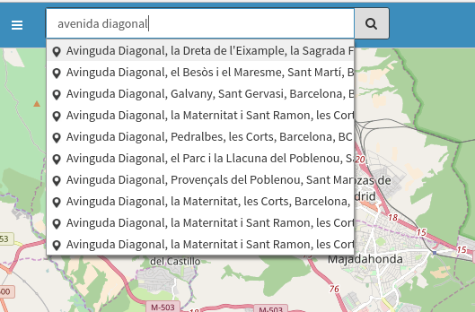
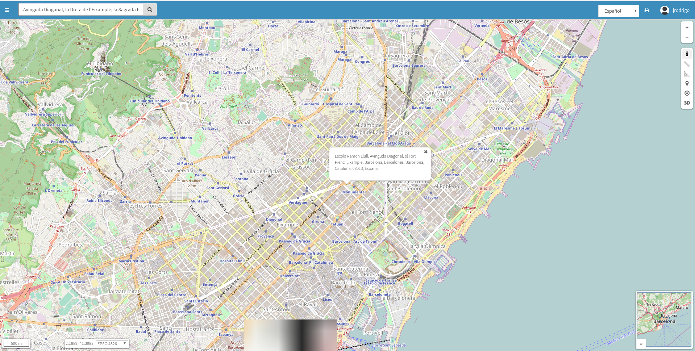

Geocodificador
==============

El geocodificador nos permite buscar lugares y ubicarlos en el mapa.

En función de la configuración la búsqueda se realiza sobre el servicio de nominatim o cartociudad.

Una vez introducida la cadena de búsqueda, nos aparece un listado con los posibles candidatos. 

Tendremos que seleccionar uno de estos candidatos y a continuación el mapa se centrará sobre su localización.

