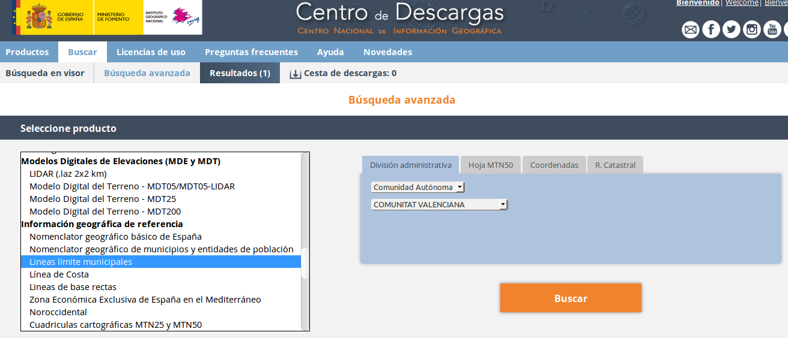
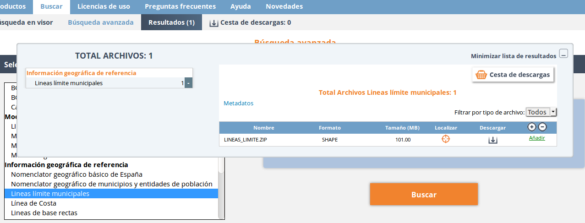

Geocodificador
==============

Introducción
------------

El geocodificador nos permite buscar lugares y ubicarlos en el mapa.

Una vez introducida la cadena de búsqueda, nos aparece un listado con los posibles candidatos. 

   

Tendremos que seleccionar uno de estos candidatos y a continuación el mapa se centrará sobre su localización.

.. image:: ../_static/images/geocoding_find.png
   :align: center
   
   
También existe la posibilidad de hacer una geocodificación inversa (averiguar la dirección marcando una posición en el mapa). Para ello, bastará hacer click con el botón derecho del ratón sobre el punto del mapa del que se quiera obtener la dirección. 

Dependiendo los proveedores que tengamos disponibles, saldrán más o menos opciones:

Conociendo el geocodificador
----------------------------
   
El plugin de geocoding permite definir hasta 4 tipos de servicios diferentes, además de configurarlos y establecer el orden de priorida en el que se mostrarán los resultados entre ellos.

.. image:: ../_static/images/geocoding_move.png
   :align: center

En todos ellos se les puede indicar una categoría (para englobar los resultados de ese proveedor bajo un separador) y se les puede asignar un icono que marcará cada una de las sugerencias propuestas. Luego, según las características de cada uno, se requerirán unos parámetros u otros para que puedan funcionar:

.. image:: ../_static/images/search_2.png
   :align: center

Servicios de Nominatim 
----------------------

Nominatim es el motor de búsqueda para datos de OpenStreetMap. 

Aunque se accede al servicio web a través de la url que aparace en 'Parámetros avanzado', se permite configurarla por si cambiara.
 
Otro de los aspectos editables es la posibilidad de acotar los resultados a una zona indicando su country_code en los 'Parámetros avanzados' ('es' para España, por ejemplo)

.. image:: ../_static/images/nominatim.png
   :align: center
 
Servicios de Google Maps
------------------------

También se puede añadir como proveedor de búsquedas el motor de Google Maps.

Entre sus parámetros específicos se definen por defecto las rutas a los servicios (por si cambiaran poder editarlas). 

También requiere indicar una key de Google que dé entrada a los servicios de Google (más información en API/Key de Google: https://developers.google.com/maps/documentation/javascript/get-api-key)

.. image:: ../_static/images/google.png
   :align: center 

Servicios de CartoCiudad
------------------------

CartoCiudad ofrece la posibilidad de descargar la cartografía por regiones y poder añadirla como proveedor de datos:
- Para ello, se tiene que ir a su 'Centro de descargas':http://centrodedescargas.cnig.es/CentroDescargas/buscadorCatalogo.do?codFamilia=02122

- Marcar el producto 'CartoCiudad' y la división administrativa 'Provincias'. Marcar la que se requiera y descargar el ZIP.

.. image:: ../_static/images/centro_descargas_1.png
   :align: center

- Una vez descagado y descomprimido, se cargará en la gvsigOnline a través del 'Administrador de archivos' los recursos:
  
  - tramo_vial.shp
  - portal_pk.shp
  - municipio_vial.dbf
  - toponimo.shp
  - codigo_postal.shp
  
  
- Luego se exportarán a una base de datos a través del menú 'Exportar', en el que se marcará como nombre el mismo del fichero (sin la extensión) EN MINÚSCULAS. El encodding será 'autodetectar' y el sistema de coordenadas será 'ETRS89 / UTM zone 30N'

.. image:: ../_static/images/centro_descargas_4.png
   :align: center

.. image:: ../_static/images/centro_descargas_5.png
   :align: center

Una vez realizada esta tarea, será necesario cargar la cartografía de regiones de España y los límites provinciales, por lo que habrá que repetir el proceso con los siguientes pasos:

- En el centro de descarga, buscar la pestaña 'Equipamiento Geografico de Referencia Nacional'

- Descargar el ZIP de la sección 'Líneas límite municipales'

- Cargar en el 'Administrador de archivos' y exportar las capas:
  
  - Dentro de 'recintos_municipales_inspire_peninbal_etr89' la capa que existe, a la que exportaremos con el nombre 'municipio', encoding 'autodetectar' y sistema de coordenadas será 'ETRS89 / UTM zone 30N'
  - Dentro de 'recintos_provinciales_inspire_peninbal_etr89', exportar con el nombre 'provincia', encoding 'autodetectar' y sistema de coordenadas será 'ETRS89 / UTM zone 30N'
  
Por último, para dar de alta el proveedor, será necesario indicar el almacén de datos en el que se han exportado todas las capas indicadas. (NOTA: en esta opción no se ofrece la posibilidad de seleccionar icono, ya que disponen de los suyos propios para identificar las calles, toponimos, municipios y demás entidades que se indexan a través de este servicio.)

Una vez se ha dado de alta correctamente el proveedor, se redirige a la página que permite cargar los datos en el sistema. Existen dos opciones:

- Carga total: borra los datos anteriores de ese proveedor (si los hubiera), y los sube de nuevo
- Carga parcial: Sube sólo las entidades actualizadas desde la última vez que se cargaron datos (las entidades borradas no se eliminarán, sólo las actualizadas).
 

  
Otros servicios del usuario
---------------------------

Por otro lado, se pueden incluir en el geocodificador otros resultados procedentes de capas propias (se requiere que la capa haya sido publicada en el geoportal)
Se precisará:

  - El espacio de trabajo
  - El almacén de datos
  - La capa a incorporar al geocodificador
  - Un campo que identifique de forma unívoca (es decir, que no hayan dos iguales) a cada elemento a buscar
  - El campo que contiene el texto que se buscará por el geocodificador
  - El nombre del campo que contiene la geometría
    
Igual que ocurría con los servicios de Cartociudad, una vez definido el proveedor, habrá que hacer una carga total de los datos para que el geocodificador empiece a incluirlos en los resultados de las búsquedas
  
