Libra
=====

1. Introducción
---------------

Libra es la interfaz gráfica que se conecta directamente con AGRORED para poder asignar mediante la captura gráfica los croquis o geometrías que corresponden a cada una de las Líneas de declaración gráfica que refieren a una petición del pago único solicitado por un agricultor o ganadero.

1.1 Objetivo
____________

Este manual tiene como objetivo describir el manejo y funcionamiento de las herramientas para la captura gráfica de solicitudes definidas en AGRORED

1.2. Glosario de términos y acrónimos
_____________________________________

**Acrónimos:**

* SIGPAC: Sistema de Información Geográfico de Parcelas Agrícolas

* LIBRA: Líneas Básicas de Recintos Agrícolas

* PAC: Parcelas Agricolas

* PU: Pago Único

* LDG: Línea de Declaración Gráfica, también se le conoce como 'cultivo'

**Términos:**

*  **AGRORED:** Aplicación de captura de solicitudes del pago único (PU) de la PAC.

*  **Recinto SIGPAC**:  superficie contínua de terreno, dentro de una parcela, con un mismo uso agrícola estable (tierra arable, pastos, viñedos, olivar, etc.)

*  **Cultivo:**   superficie continua de terreno, dentro de un recinto, por la que se solicita el pago único. Es sinónimo de LDG.

*  **Solicitud de AGRORED:** cada una de las solicitudes que realiza una persona física o jurídica a través de AGRORED. En una solicitud se definen varios recintos SIGPAC que a su vez contienen uno o varios cultivos.

*  **Línea de Declaración Gráfica:** Cada una de las superficies continuas de terreno que se declaran con el mismo cultivo principal (y secundario si procede) sobre un recinto SIGPAC.

*  **Geometría:** Representación gráfica de la superficie declarada. Es un atributo de las líneas de declaración gráficas.

*  **Editor gráfico:** Conjunto de herramientas para la definición de las geometrías asociadas a las LDGs.

*  **Tabla de registros (Tabla de atributos o grid alfanumérico):** tabla que muestra la información alfanumérica de cada LDG y que se corresponde con cada uno de los cultivos definidos en una solicitud de AGRORED.

2. Descripción del editor gráfico
---------------------------------

El editor gráfico permite editar, actualizar y añadir nueva geometría asociada a una LDG.

2.1 Vista General del editor gráfico
____________________________________

La vista general es el área de trabajo desde donde se realizará la edición gráfica de las geometrías para cada solicitud única.

.. image:: ../_static/images/libra_online_1.png
   :align: center

.. list-table:: Vista general del editor gráfico 
   :widths: 2 10 
   :header-rows: 1
   :align: left

   * - Opción
     - Descripción
   * - 1
     - Barra de menú principal
   * - 2
     - Panel de contenido
   * - 3
     - Área del mapa
     
     
2.2 Barra de menú principal
___________________________

.. image:: ../_static/images/libra_online_2.png
   :align: center

.. list-table:: Descripción de la barra del menú principal
   :widths: 2 10 
   :header-rows: 1
   :align: left

   * - Opción
     - Descripción
   * - 1
     - Botón para mostrar/ocultar el panel de contenidos
   * - 2
     - Logo del sistema (se puede personalizar según lo solicite el cliente)
   * - 3
     - Menú del usuario (únicamente para administradores del sistema)
      
       **3.1**: Nombre y correo del usuario conectado
       
       **3.2**: Idioma
       
       **3.3**: Opción para ir a la vista principal de administrador
       
   * - 4
     - Cerrar sesión para el usuario conectado.      

  
2.3 Detalles del panel de contenido
___________________________________
 
El panel de contenido se compone de distintas pestañas que contienen el árbol de capas (TOC), la leyenda/simbología de capas, detalles de la información de los elementos seleccionados y las herramientas del editor gráfico.
 
2.3.1  Pestaña: 'árbol de capas'
~~~~~~~~~~~~~~~~~~~~~~~~~~~~~~~~

.. image:: ../_static/images/libra_online_3.png
   :align: center

.. list-table:: Panel de contenido - Árbol de capas
   :widths: 2 10 
   :header-rows: 1
   :align: left

   * - Opción
     - Descripción
   * - 1
     - Pestaña: árbol de capas
   * - 1.1
     - Capas bases que son configuradas desde el panel de administrador.
     
       En este caso se encuentra una única capa activa y por defecto. 
       La capa activa es del Plan Nacional de Ortofotografía Aérea (PNOA) 
       obtenida del Centro Nacional de Información Geográfica (CNIG).
   * - 1.2
     - Grupo de capas que puede contener muchas capas, en este caso el grupo 
       solo tiene una única capa. También se configura desde el Panel de administrador del sistema
   * - **1.2.a**
     - Capa publicada desde el panel de administrador, en este caso para el editor gráfico basta 
       disponer de la capa vectorial que contiene todas las geometrías de los recintos.
   * - **1.2.b**
     - Propiedades propias para cada capa:
     
       - **Metadatos:** Resumen de la información de la capa (se configura cuando se publica la capa desde el panel de administrador)
       
       - **Zoom a la capa:** realiza y muestra el zoom general de todas las geometrías que contiene la  capa sobre el mapa.
       
       - **Cambiar el estilo de la simbología**: esto si se han definido previamente mas de un estilo  desde el panel de administrador.
      
       - **Opacidad**: se puede ir configurando el porcentaje de opacidad como desee y necesite el usuario para el análisis entre varias capas.

2.3.2  Pestaña: 'Leyenda'
~~~~~~~~~~~~~~~~~~~~~~~~~

.. image:: ../_static/images/libra_online_4.png
   :align: center

.. list-table:: Panel de contenido - Leyenda
   :widths: 2 10 
   :header-rows: 1
   :align: left

   * - Opción
     - Descripción
   * - 2 
     - Pestaña: Leyenda, muestra todas las simbologías de las capas activas y visibles del árbol de capas.
   * - 2.1
     - En este caso, muestra la leyenda de tipo poligonal, color de borde amarillo y relleno: sin color que representa las geometrías de la capa de 'Recintos SIGPAC'

2.3.3  Pestaña: 'Detalles'
~~~~~~~~~~~~~~~~~~~~~~~~~~

.. image:: ../_static/images/libra_online_5.png
   :align: center

.. list-table:: Panel de contenido - Detalles
   :widths: 2 10 
   :header-rows: 1
   :align: left

   * - Opción
     - Descripción
   * - 3 
     - Pestaña de 'Detalles'
   * - 3.1
     - Muestra la información detallada vinculada a una geometría seleccionada en el mapa. Se puede realizar a través de la consulta de la herramienta 'Información' (i) del área del mapa. 

2.3.4  Pestaña: 'Captura gráfica'
~~~~~~~~~~~~~~~~~~~~~~~~~~~~~~~~~

será la entrada mas usada durante el uso el editor gráfico, es aquí donde se ubican las herramientas para tratar las LDGs e información de las mismas.

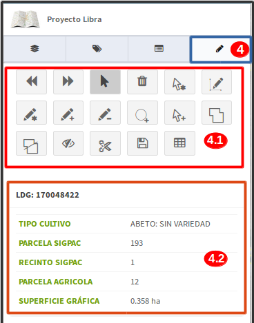

.. list-table:: Panel de contenido - Captura gráfica
   :widths: 2 10 
   :header-rows: 1
   :align: left

   * - Opción
     - Descripción
   * - 4 
     - Pestaña 'Captura gráfica'
   * - 4.1
     - Herramientas para la creación, edición, actualización y eliminación de las geometrías correspondientes a las LDGs  
   * - 4.2
     - Panel de información rápida para las LDGs seleccionadas en el mapa
   * - 4.3
     - Panel de log: ofrece información a usuario como la generación automática de LDGs en la precarga de la solicitud.  
     
2.4 Detalles del área de trabajo - (vista en mapa)
__________________________________________________

La vista del mapa será el área de trabajo por defecto que se abrirá al usuario de AGRORED para poder editar/añadir geometrías a las LDGs.

.. image:: ../_static/images/libra_online_7.png
   :align: center

.. list-table:: Detalles del área de trabajo (vista mapa) 
   :widths: 2 10 
   :header-rows: 1
   :align: left

   * - Opción
     - Descripción
   * - 1 
     - Sobre el área del mapa se mostrará las capas bases y capas vectoriales activas. Así como también se mostrarán las LDGs y recintos disponibles que están asociadas a la solicitud abierta en ese instante.
   * - 1.1
     - Herramientas básicas propias del editor gráfico, como son:
       
       * herramientas de zoom (mas, menos y general del proyecto).
            
       En el recuadro siguiente están:

       * (la herramienta "i" para consultar la información rápida de una geometría asociada a una capa del editor, en este caso se podrán consultar los atributos de las geometrías de los recintos.

       * Medir distancia

       * Medir área 

       * Ubicación de un punto en el mapa a través de las coordenadas geográficas o planas.

       * Posición actual del usuario a través de la ubicación GPS del dispositivo (tablet, ordenador) 
     
   * - 1.2
     - visualizador de referencia de un área más grande sobre el que se está trabajando en la visual del mapa.
   * - 1.3
     - Muestra las coordenadas donde se ubica el cursor en el mapa y se puede seleccionar sistema de referencia geográfico mundial WGS-84 (4326) o el ETRS-89 geográfico para Europa (4258)
   * - 1.4
     - Indica la referencia de la escala gráfica.

3. Estilos gráficos
-------------------

Existen dos tipos de estilos gráficos, uno para recintos y otro para las LDGs

3.1 Estilos para LDGs:
______________________

Se tienen distintos estilos cuando están seleccionadas, en edición, con solapes, propias y de otras solicitudes.

3.1.1 LDGs Propias
~~~~~~~~~~~~~~~~~~

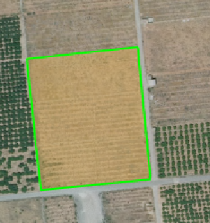

- Bordes: verde claro (sin relleno de borde)
- Relleno: marrón claro

* **Ver información sobre el cultivo seleccionado**

Se activa la herramienta: **'seleccionar'** y luego se pincha sobre el cultivo, se mostrará un panel de información rápida en el lateral izquierdo.

.. image:: ../_static/images/libra_select_ldg_info_rapida.png
   :align: center

También se puede consultar con la herramienta **'información'** o abriendo la tabla de registros alfanuméricos con la herramienta **'mostrar tabla'**.

3.1.2 LDGs - de otras solicitudes ya registradas
~~~~~~~~~~~~~~~~~~~~~~~~~~~~~~~~~~~~~~~~~~~~~~~~

.. image:: ../_static/images/estilo_ldg_otra_solic_registrada.png
   :align: center

- Borde: azul rey
- Relleno: azul rey con transparencia

* **Ver información  sobre las LDG de otras solicitudes ya registradas**

Se activa la herramienta: **'seleccionar'** y luego se pincha sobre el cultivo ya registrado de otra solicitud (color azul) y se mostrará un panel de información rápida en el lateral izquierdo.

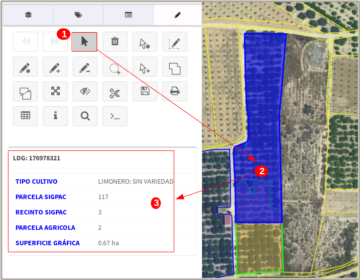

También se puede consultar con la herramienta **'información'**

3.1.3 LDGs - Seleccionadas
~~~~~~~~~~~~~~~~~~~~~~~~~~

.. image:: ../_static/images/estilo_ldg_seleccionada.png
   :align: center

- Borde: rosado claro
- Relleno: rosado claro con transparencia

3.1.4 LDGs - Solapes
~~~~~~~~~~~~~~~~~~~~

.. image:: ../_static/images/estilo_ldg_solape.png
   :align: center
   
- Borde: rojo
- Relleno: rojo transparente 

* **Consultar información del área que solapa**

En el caso de los solapes también se puede consultar de forma rápida información sobre el nombre, CIF/NIF y área solapada con otra solicitud. Se debe activar la opción 'Seleccionar',  pinchar sobre el área del solape y luego se mostrará el panel de información en el lateral izquierdo.

.. image:: ../_static/images/libra_select_solape_info_rapida.png
   :align: center

3.2 Estilos para Recintos
_________________________

Los recintos pueden tener dos estilos, cuando pertenecen o no a la declaración gráfica activa.

3.2.1 Recintos - Todos los visibles al abrir una solicitud
~~~~~~~~~~~~~~~~~~~~~~~~~~~~~~~~~~~~~~~~~~~~~~~~~~~~~~~~~~

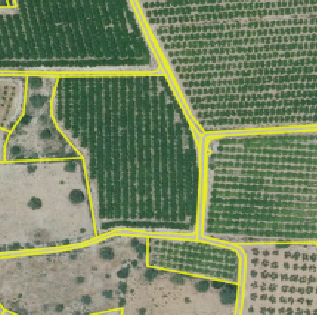

-  Borde: Amarillo
-  Relleno: sin  relleno

3.2.2 Recintos - Los que pertenecen a una solicitud activa
~~~~~~~~~~~~~~~~~~~~~~~~~~~~~~~~~~~~~~~~~~~~~~~~~~~~~~~~~~

.. image:: ../_static/images/estilo_recinto_activas.png
   :align: center

- Borde: Amarillo
- Relleno: Amarillo claro con transparencia (al pasar el puntero encima de éste)  
   
   
4. Precarga automática desde LIBRA
----------------------------------

4.1 Casos en la carga inicial de libra
______________________________________

Cada vez que se carga una solicitud, LIBRA solicita a AGRORED el xml con las líneas de declaración de la solicitud. Este xml se procesa y comprueba para cada línea de declaración los siguientes casos:

4.1.1 Existe Croquis:
~~~~~~~~~~~~~~~~~~~~~
 
Si la línea de declaración posee CROQUIS_WEB, el sistema la utilizará directamente para crear y asignarle la misma geometría al cultivo. 

Es posible que el CROQUIS_WEB contenga un WKT en mal estado, en este caso se deja la geometría vacía y se le obliga al usuario a pintar la linea de declaración.

4.1.2 No existe croquis:
~~~~~~~~~~~~~~~~~~~~~~~~

Si el CROQUIS_WEB llega vacío se calcula la diferencia entre la superficie declarada y la superficie SIGPAC, aquí pueden darse dos casos:

*  **Sup. Declarada = Sup recinto SIGPAC:**

Si la diferencia en valor absoluto es **inferior** al límite de TOLERANCIA predefinido (actualmente 100m2), se supone el caso de que la superficie declarada =  superficie SIGPAC, y por tanto se crea la linea de declaración desde el recinto SIGPAC, es decir, se asigna una geometría igual a la del recinto SIGPAC.

*  **Sup declarada <> Sup recinto SIGPAC:**

Si la diferencia en valor absoluto es **superior** al límite de TOLERANCIA predefinido (actualmente 100m2), se supone el caso de que la superficie declarada <>  superficie SIGPAC, y por tanto se deja la geometría vacía y se le obliga al usuario a pintar la línea de declaración.

.. note::
   En todos los casos se comprueba en la caché SIGPAC que existe el recinto asociado a la línea de declaración, si este no existe (por reparcelamiento, …), la linea de declaración no se crea directamente mostrando un aviso al usuario en la consola de mensajes. 

4.2 Casos con la selección de recintos
______________________________________

Desde AGRORED se pueden seleccionar uno o más recintos de la solicitud para poder mostrar las líneas de declaración que estos contienen en LIBRA. En función de los recintos seleccionados se dan los siguientes casos:

* Si no se selecciona ningún recinto de la solicitud, o los recintos seleccionados no se encuentran disponibles en la caché SIGPAC, aparecerá un mensaje en LIBRA indicando al usuario que no hay ningún recinto seleccionado.

* Si se selecciona recintos puntuales de la solicitud, en LIBRA las líneas de declaración contenidas en esos recintos se mostrarán en la tabla de declaraciones, y el resto de recintos no seleccionados se mostrarán en el mapa aunque no se pueda interactuar con ellos. Por tanto únicamente se podrá trabajar con los recintos seleccionados.

* Si se seleccionan todos los recintos de la solicitud se cargarán todos ellos tanto en el mapa como en la tabla y se podrá trabajar con todos.

5. Modificar LDGs existentes
----------------------------
Cuando la declaración gráfica que se activa tiene asociada una geometría, se pueden realizar distintas acciones como añadir/quitar superficie, unir a otra LDG, dividirlas, entre otras.

5.1 Añadir superficie
_____________________
Para añadir superficie se puede hacer uso de varias herramientas:

5.1.1 Con herramienta 'Añade trozo digitalizado a LDG seleccionada'  |herramienta4|
~~~~~~~~~~~~~~~~~~~~~~~~~~~~~~~~~~~~~~~~~~~~~~~~~~~~~~~~~~~~~~~~~~~~~~~~~~~~~~~~~~~
.. |herramienta4| image:: ../_static/images/6_anyad_troz_dig.png

.. |herramienta1| image:: ../_static/images/1_select.png

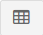

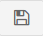

.. list-table::  Añade trozo digitalizado a LDG seleccionada
   :widths: 2 10 
   :header-rows: 1
   :align: left

   * - Selección
     - Acción
   * - 1-'Seleccionar'|herramienta1|
     - Al activar el botón, se pincha sobre la LDG que se quiere editar. Ésta cambiará a color rosado.
   * - 2-Otra opción:
   
       'ver tabla'|herramienta2|  
     - Se abre la tabla de registros, se ubica el que quiere editarse y se pincha sobre el mismo.
     
       Éste registro se cambiará a un fondo color rosa, igual que la LDG sobre el mapa
   * - 3-'Añade trozo digitalizado
    
       a LDG seleccionada'
        
       |herramienta4|
     - Se digitaliza el área del recinto que se quiere añadir a la LDG seleccionada.
   * - 4-Cerrar/terminar
     
       área digitalizada
     - Al finalizar el área digitalizada, resulta una nueva LDG, que es la suma de la LDG seleccionada más zona digitalizada. 
     
       Estará limitada por los lados digitalizados, los del recinto SIGPAC y las otras LDGs propias.
   * - 5-Guardar cambios
   
       |herramienta3|
     - Saldrá un mensaje indicando: 'se han guardado los cambios con éxito'. Cuando se guarden los cambios, 
     
       en la tabla de registros, el campo 'Superficie gráfica' se debe actualizar con el nuevo valor del área de la LDG resultante.
       
       La 'superficie declarada' se deberá actualizar en el grid alfanumérico de Agrored  una vez se hayan guardado los cambios 
       
       realizados en el editor gráfico.

* Añadiendo trozo digitalizado (azul) sobre LDG seleccionada (rosado).

.. image:: ../_static/images/libra_anyad_troz_dig_select1.png
   :align: center

* LDG resultante:

.. image:: ../_static/images/libra_anyad_troz_dig_select2.png
   :align: center

   
   
5.1.2 Con herramienta 'modificar cultivo' - Edición de vértices |herramienta5|
~~~~~~~~~~~~~~~~~~~~~~~~~~~~~~~~~~~~~~~~~~~~~~~~~~~~~~~~~~~~~~~~~~~~~~~~~~~~~~
Esta herramienta es usada para realizar pequeños ajustes en la superficie.
 
.. |herramienta5| image:: ../_static/images/4_modificar_cultivo.png

.. list-table::  Modificar Cultivo (edición de vértices)
   :widths: 2 10 
   :header-rows: 1
   :align: left

   * - Selección
     - Acción
   * - 1-'Seleccionar'|herramienta1| 
     - Al activar el botón, se pincha sobre la LDG que se quiere editar. Ésta cambiará a color rosado.
   * - 2-Otra opción:
   
       'ver tabla'|herramienta2| 
     - Se abre la tabla de registros, se ubica el que quiere editarse y se pincha sobre el mismo.
     
       Éste registro se cambiará a un fondo color rosa, igual que la LDG sobre el mapa.
   * - 3-'Modificar cultivo' 
   
       |herramienta5|
     - Cuando el botón esté activo se vuelve hacer clic sobre el cultivo que se seleccionó previamente. 
     
       Se deben activar todos los vértices y al pasar el cursor sobre los vértices, éstos cambiarán 
       
       a color azul. Se puede realizar:
       
       * **Mover los vértices**, haciendo clic sobre él (sin soltarlo) se mueve a la posición deseada.
       * **Añadir vértices**: Ubicarse sobre el borde de la geometría donde se quiera añadir y hacer un clic.
       * **Eliminar vértice**: Se ubica al vértice que se quiera quitar y se hace un solo clic y soltar.
   * - 4-Guardar cambios
   
       |herramienta3|
     - Saldrá un mensaje indicando: 'se han guardado los cambios con éxito'. Cuando se guarden los cambios, 
     
       en la tabla de registros, el campo 'Superficie gráfica' del cultivo modificado, tomará el valor de la
     
       nueva superficie resultante. El campo 'superficie declarada' se deberá actualizar en la tabla 
     
       alfanumérica de Agrored  una vez se hayan guardado los cambios realizados en el editor gráfico.    

* Activando la edición de vértices - Modificar cultivo.

.. image:: ../_static/images/libra_modificar_cultivo1.png
   :align: center
           
* Vértices editados (Superficie modificada)

.. image:: ../_static/images/libra_modificar_cultivo2.png
   :align: center
 
5.1.3 Con herramienta 'añadir espacio libre a LDG seleccionada' |herramienta6|
~~~~~~~~~~~~~~~~~~~~~~~~~~~~~~~~~~~~~~~~~~~~~~~~~~~~~~~~~~~~~~~~~~~~~~~~~~~~~~
        
.. |herramienta6| image:: ../_static/images/9_anyad_spcio_libr.png    

Esta herramienta es usada para añadir todo el espacio libre que dispone el recinto a uno de sus cultivos que haya sido seleccionado.

.. list-table::  Añdir espacio libre a LDG seleccionada
   :widths: 2 10 
   :header-rows: 1
   :align: left

   * - Selección
     - Acción
   * - 1-'Seleccionar'|herramienta1|
     - Al activar el botón, se pincha sobre la LDG que se quiere editar. Ésta cambiará a color rosado.
   * - 2-Otra opción:
   
       'ver tabla'|herramienta2|
     - Se abre la tabla de registros, se ubica el que quiere editarse y se pincha sobre el mismo.
     
       Éste registro se cambiará a un fondo color rosa, igual que la LDG sobre el mapa.
   * - 3-'Añadir espacio
       
       libre a LDG seleccionada'
       
       |herramienta6|
     - Tocar el área vacía que está disponible en el recinto
   * - 4-Selección de
       
       área vacía
     - Como resultado se genera un nuevo recinto, que será la suma de la LDG seleccionada más el 
     
       espacio libre disponible que se ha tocado del recinto SIGPAC.
     
   * - 5-Guardar cambios
   
       |herramienta3|     
     - Saldrá un mensaje indicando: 'se han guardado los cambios con éxito'. En la tabla de registros, 
     
       el campo 'Superficie gráfica' de la LDG modificada, tomará el valor de la nueva superficie resultante.

           
* Añadiendo espacio libre de recinto a uno cultivo selecconado   

.. image:: ../_static/images/libra_anyad_spacio_libre1.png
   :align: center   
   
* Espacio libre añaido a LDG

.. image:: ../_static/images/libra_anyad_spacio_libre2.png
   :align: center  

5.2 Quitar superficie
_____________________

Existen dos formas de quitar o disminuir el área de un cultivo:

     
5.2.1 Con herramienta 'modificar cultivo' - Edición de vértices |herramienta5|
~~~~~~~~~~~~~~~~~~~~~~~~~~~~~~~~~~~~~~~~~~~~~~~~~~~~~~~~~~~~~~~~~~~~~~~~~~~~~~
 
Ya ha sido detallado anteriormente , ésta herramienta igualmente es usada para realizar pequeños ajustes sobre la superficie.

5.2.2 Con herramienta 'Quitar trozo digitalizado a cultivo'  |herramienta7|
~~~~~~~~~~~~~~~~~~~~~~~~~~~~~~~~~~~~~~~~~~~~~~~~~~~~~~~~~~~~~~~~~~~~~~~~~~~

.. |herramienta7| image:: ../_static/images/7_quitar_trozo_dig.png

.. list-table::  Quitar trozo digitalizado a cultivo
   :widths: 2 10 
   :header-rows: 1
   :align: left

   * - Selección
     - Acción
   * - 1-'Seleccionar'|herramienta1|
     - Al activar el botón, se pincha sobre la LDG que se quiere editar. Ésta cambiará a color rosado.
   * - 2-Otra opción:
   
       'ver tabla'|herramienta2|  
     - Se abre la tabla de registros, se ubica el que quiere editarse y se pincha sobre el mismo.
      
       Éste registro se cambiará a un fondo color rosa, igual que la LDG sobre el mapa.
   * - 3-'Quitar trozo
       
       dig. a cultivo'|herramienta7|
     - Se dibuja el área que se quiere quitar sobre la LDG seleccionada. 
   * - 4-Cerrar/terminar
       
       área digitalizada
     - Al terminar de digitalizar el área a quitar se genera un cultivo de superficie más pequeña, 

       como resultado de la diferencia entre LDG seleccionada menos área quitada.
   * - 5-Guardar cambios 
   
       |herramienta3|
     - Saldrá un mensaje indicando: 'se han guardado los cambios con éxito'. En la tabla de registros, 
     
       el campo 'Superficie gráfica' de la LDG modificada, tomará el valor de la nueva superficie resultante.  

        
* Quitando trozo digitalizado sobre cultivo seleccionado
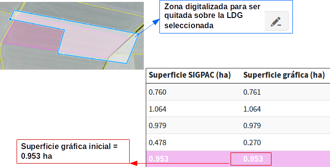

* Nuevo cultivo generado al restarle/quitarle el área digitalizada
.. image:: ../_static/images/libra_quitar_trozo_ldg_seleccionada_2.png
   :align: center    
 
   
5.3 Unir dos cultivos  |herramienta8|
_____________________________________

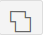
 
Con esta herramienta se permite juntar dos LDGs que pertenecen a un mismo recinto en un solo registro del grid alfanumérico.

.. list-table::  Unir dos cultivos
   :widths: 2 10 
   :header-rows: 1
   :align: left

   * - Selección
     - Acción
   * - 1-'Seleccionar'|herramienta1|
     - Seleccionar un primer cultivo (pinchando la geometría sobre el mapa) y manteniendo pulsada la tecla 'mayúscula' 
     
       se selecciona el segundo cultivo (pinchando la geometría sobre el mapa). Ambas LDGs deben pertenecer a un mismo recinto.     
   * - 2-Otra opción:
   
       'ver tabla'|herramienta2|  
     - Se abre la tabla de registros, se ubica la primera LDG y manteniendo pulsada la tecla 'mayúscula' se selecciona
     
       el segundo cultivo. Ambas LDGs seleccionadas cambiaran de color rosado en el grid alfanumérico como en el mapa.
   * - 3-'unir cultivos'|herramienta8|
     - Teniendo seleccionados ambos cultivos, se pincha sobre el botón 'unir cultivos' automáticamente éstas se unirán 
       
       en una sola geometría y tomará los atributos alfanuméricos de la primera LDG seleccionada y el campo superficie gráfica
       
       se actualizará con el nuevo valor del área generada. El registro del segundo cultivo quedará sin geometría asociada y sup. gráfica =0
   * - 4-Guardar cambios 
   
       |herramienta3|
     - Saldrá un mensaje indicando: 'se han guardado los cambios con éxito'. En la tabla de registros, el campo 'Superficie gráfica' 
     
       de la nueva LDG resultante, tomará el valor de la suma de las dos superficies unidas.
 
 
* Seleccionar dos LDGs para aplicar la herramienta 'Unir cultivos' 
.. image:: ../_static/images/libra_unir_cultivos_1.png
   :align: center       

* Cultivo resultante de la unión de dos LDGs
.. image:: ../_static/images/libra_unir_cultivos_2.png
   :align: center

 
5.4 Segregar LDG  |herramienta9|
________________________________

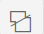

Con esta opción se permite separar/dividir un cultivo en dos y por tanto generar un registro más en el grid alfanumérico con la nueva LDG segregada.

.. list-table::  Segregar cultivo
   :widths: 2 10 
   :header-rows: 1
   :align: left

   * - Selección
     - Acción
   * - 1-'Seleccionar'|herramienta1|
     - Al activar el botón, se pincha sobre el mapa la LDG que se quiere editar. Ésta cambiará a color rosado.
   * - 2-Otra opción:
   
       'ver tabla'|herramienta2|  
     - Se abre la tabla de registros, se ubica el que quiere editarse y se pincha sobre el mismo.
     
       Éste registro se cambiará a un fondo color rosa, igual que la LDG sobre el mapa.
   * - 3-'Segregar LDG'
   
       |herramienta9| 
     - Teniendo elegido el cultivo, se pincha sobre el botón 'segregar LDG' y se procede a digitalizar sobre 
     
       la geometría seleccionada el área que se quiera segregar.      
   * - 4-Cerrar/terminar
       
       área digitalizada
     - Al terminar de digitalizar el área que se quiere desprender, la geometría del cultivo seleccionado se divide 
     
       en dos y su campo sup. Gráfica = al área completa menos el área digitalizada desprendida. 
       
       Al segregar la LDG seleccionada se genera en la tabla de registros otra fila con el nuevo cultivo asociado 
       
       a la geometría digitalizada, donde el campo 'Superficie SIGPAC' debe ser el mismo que la 'Sup. SIPAC' del 
       
       cultivo segregado, la 'Sup. gráfica' = a la superficie del área digitalizada. Los demás atributos estarán 
       
       vacíos para ser completados a través de la tabla alfanumérica de Agrored.
   * - 5-Guardar cambios 
   
       |herramienta3|
     - Saldrá un mensaje indicando: 'se han guardado los cambios con éxito'. Cuando se guarden los cambios, en la
     
       tabla de registros, el campo 'Superficie gráfica' de la nueva LDG tomará la superficie de la geometría generada. 
     
* Seleccionar cultivo y con la opción 'segregar cultivo' digitalizar el área a separar:   
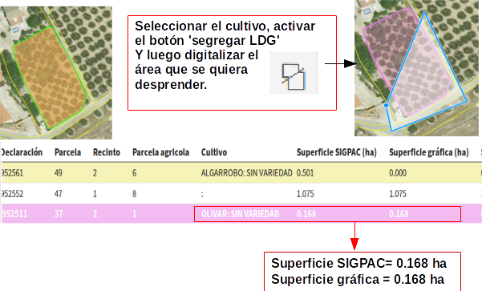

* Cultivo dividido en dos, se origina una nuevo registro en la tabla alfanumérica.    
.. image:: ../_static/images/libra_segregar_cultivo_2.png
   :align: center

6. Altas de nuevas geometrías en LDGs
-------------------------------------
Las herramientas de edición (añadir, quitar, juntar y dividir) se aplican para cultivos que ya tienen asociado una geometría. Las herramientas que se describen a continuación aplican para las LDGs que aún no tienen una geometría vinculada, es decir, se detallará cómo desde el editor gráfico se podrá crear y asignar una geometría a un cultivo que esté disponible dentro de la tabla de registros.

6.1 Con herramienta 'Crear nuevo cultivo en el recinto'  |herramienta10|
________________________________________________________________________

Esta herramienta se usa exclusivamente para los recintos que tienen disponibles un único cultivo.

.. |herramienta10| image:: ../_static/images/3_crear_nvo_cultivo_recint.png

.. list-table:: Crear nuevo cultivo en el recinto
   :widths: 2 10 
   :header-rows: 1
   :align: left

   * - Selección
     - Acción
   * - 1-'ver tabla'|herramienta2|
     - Al abrirse la tabla de atributos (grid alfanumérico) se mostraran las LDGs disponibles para añadirles la geometría. 
     
       Estos registros aparecerán en la tabla de un color diferente a los que ya tienen gráfico asociado, serán de color
       
       marrón claro. Se debe hacer clic sobre uno de ellos y ya estará seleccionado para añadirle una nueva geometría.
   * - 2-Seleccionado
   
       LDG en tabla
     - Al activar el registro cambiará el fondo a color rosa, aunque el recinto donde pertenece y se digitalizará la 
     
       geometría del cultivo, en el mapa continúa estando con borde amarillo y relleno amarillo claro transparente.    
        
   * - 3-'crear nueva
       
       LDG en recinto'|herramienta10|
     - Teniendo seleccionado el recinto desde la tabla de registros, se activa el botón de 'crear nuevo cultivo en el
       
       recinto' y en el mapa se pincha sobre el área del recinto vacío. Automáticamente el sistema  genera una geometría
       
       al cultivo igual al recinto, es decir, Superficie del recinto = a la Superficie gráfica de la nueva LDG creada.
   * - 4-Guardar cambios 
   
       |herramienta3|
     - Saldrá un mensaje indicando: 'se han guardado los cambios con éxito'. En la tabla de registros, el campo 
      
       'Superficie gráfica'  de la nueva LDG, tomará la superficie de la geometría generada que en este caso será 
       
       igual a la superficie SIGPAC.
       
* Seleccionar recinto vacío en tabla de registros para añadir gemoetría a la LDG

.. image:: ../_static/images/libra_crear_nvo_cultivo_en_recinto_1.png
   :align: center    

* Geometría asignada a un cultivo vacío de un recinto

.. image:: ../_static/images/libra_crear_nvo_cultivo_en_recinto_2.png
   :align: center 

6.2  Con herramienta 'Dibujar nueva LDG'  |herramienta11|
_________________________________________________________

Esta herramienta 'dibujar nueva LDG' a diferencia de la anterior 'crear nuevo cultivo' no está limitada a que el recinto contenga un único cultivo, es decir, esta herramienta aplica cuando se quieren generar nuevas geometrías dentro de un recinto que contiene varias LDGs.

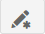

.. list-table:: Dibujar nueva LDG
   :widths: 2 10 
   :header-rows: 1
   :align: left

   * - Selección
     - Acción
   * - 1-'ver tabla'|herramienta2|
     - Al abrirse la tabla de atributos (grid alfanumérico) se mostraran las LDGs disponibles para añadirles la geometría. 
     
       Estos registros aparecerán en la tabla de un color diferente a los que ya tienen gráfico asociado, serán de color
       
       marrón claro. Se debe hacer clic sobre uno de ellos y ya estará seleccionado para añadirle una nueva geometría.
   * - 2-Seleccionado
   
       LDG en tabla
     - Al activar el registro cambiará el fondo a color rosa, aunque el recinto donde pertenece y se digitalizará la 
     
       geometría del cultivo, en el mapa continúa estando con borde amarillo y relleno amarillo claro transparente.    
        
   * - 3-'dibujar
       
       nueva LDG'|herramienta11|
     - Teniendo seleccionado uno de los cultivos del recinto en la tabla de registros, se activa el botón de 'Dibujar
     
       nueva LDG', como su nombre lo indica se podrá dibujar/digitalizar la nueva geometría. 
   * - 4-Área digitalizada
     - Se puede digitalizar sobre el área total o parcial que dispone el área del cultivo. Los límites de la nueva
     
       geometría dibujada serán los propios límites del recinto y de las otras LDGs que éste contenga. A medida que
       
       se va digitalizando, el sistema irá mostrando el valor del área en hectáreas (ha) en un recuadro de información 
       
       que se ubica a la izquierda de la pantalla.
   * - 5-Guardar cambios 
   
       |herramienta3|
     - Saldrá un mensaje indicando: 'se han guardado los cambios con éxito'. En la tabla de registros, el campo 
     
       'Superficie gráfica' del cultivo seleccionado, tomará la superficie de la geometría dibujada.

* Área de cultivo disponible dentro del recinto y geometría dibujada (azul)
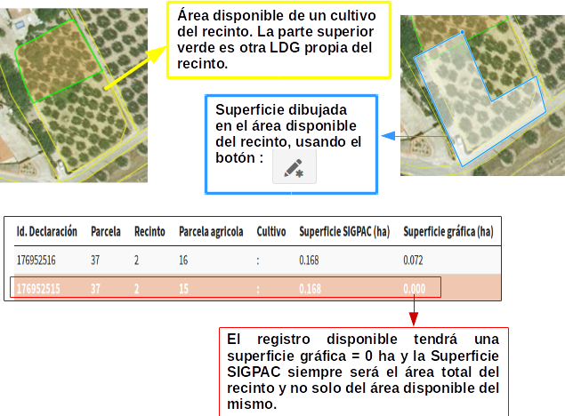
       
* Geometría asignada al cultivo, con herramienta 'Dibujar nueva LDG'       
.. image:: ../_static/images/libra_dibujar_nueva_ldg_2.png
   :align: center      

6.3 Con herramienta 'Dibujar nuevo cultivo circular' |herramienta12|
____________________________________________________________________

.. |herramienta12| image:: ../_static/images/8_cultivo_circular.png

.. list-table:: Dibujar nuevo cultivo circular
   :widths: 2 10 
   :header-rows: 1
   :align: left

   * - Selección
     - Acción
   * - 1-'ver tabla'|herramienta2|
     - Al abrirse la tabla de atributos (grid alfanumérico) se mostraran las LDGs disponibles para añadirles la geometría. 
     
       Estos registros aparecerán en la tabla de un color diferente a los que ya tienen gráfico asociado, serán de color
       
       marrón claro. Se debe hacer clic sobre uno de ellos y ya estará seleccionado para añadirle una nueva geometría.
   * - 2-Seleccionado
   
       LDG en tabla
     - Al activar el registro cambiará el fondo a color rosa, aunque el recinto donde pertenece y se digitalizará la 
     
       geometría del cultivo, en el mapa continúa estando con borde amarillo y relleno amarillo claro transparente.    
   * - 3-'Dibujar nueva
     
       LDG circular |herramienta12| 
     - Seleccionada la Línea de declaración disponible en la tabla, se activa el botón 'Crear LDG circular',  se ubica
     
       el centro del circulo sobre el área disponible del recinto y con el cursor hacemos mas grande o mas pequeña la 
       
       LDG circular. En la parte izquierda saldrá un recuadro de información con el área de la superficie gráfica que se
       
       va dibujando, por lo tanto, se podrá ajustar visualmente el área de la superficie gráfica que se está dibujando.            
   * - 4-Área digitalizada
     - Definida la geometría de la LDG circular, se hace clic para poder fijar el circulo dibujado. Cuando éste es más 
     
       grande o sobresale del área disponible, el área dibujada será limitada por los propios límites del recinto y de 
       
       otros cultivos que pertenezcan al mismo cultivo.
   * - 5-Guardar cambios 
   
       |herramienta3|
     - Saldrá un mensaje indicando: 'se han guardado los cambios con éxito'. En la tabla de registros, el campo 
     
       'Superficie gráfica'  de la nueva LDG tomará la superficie de la geometría dibujada.     

* Dibujando nuevo cultivo circular
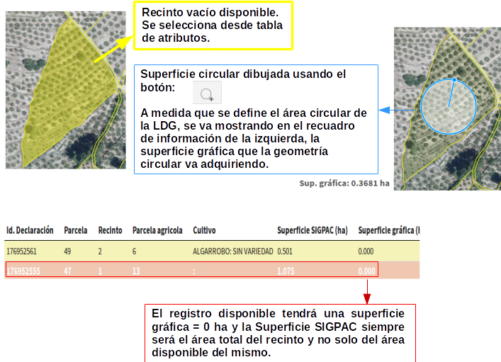
       
* Geometría del cultivo circular definido
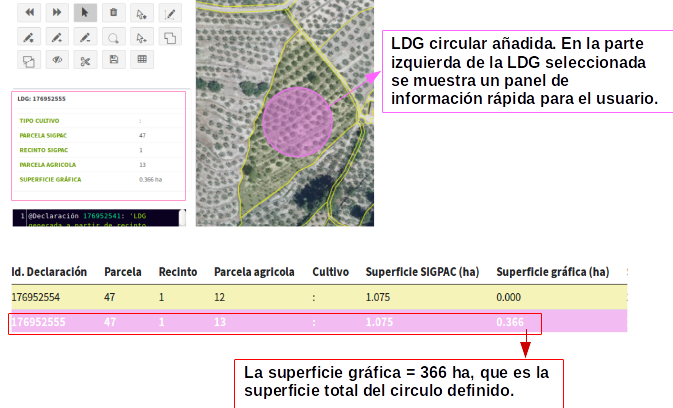

7. Borrar geometría de un cultivo |herramienta13|
-------------------------------------------------

.. |herramienta13| image:: ../_static/images/2_eliminar.png

.. list-table::  Borrar geometría 
   :widths: 2 10 
   :header-rows: 1
   :align: left

   * - Selección
     - Acción
   * - 1-'Seleccionar' |herramienta1|
     - Al activar el botón, se pincha sobre el mapa la LDG que se quiere editar. Ésta cambiará a color rosado.
   * - 2-Otra opción:
   
       'ver tabla' |herramienta2|  
     - Se abre la tabla de registros, se ubica el que quiere editarse y se pincha sobre el mismo.
     
       Éste registro se cambiará a un fondo color rosa, igual que la LDG sobre el mapa.
   * - 3-'Eliminar la 
       
       geometría del 
       
       cultivo' |herramienta13|
     - Activado este botón, se pincha en el mapa sobre el cultivo seleccionado anteriormente, ésta se 
     
       borrará y el campo de superficie gráfica se pondrá =0 ha.
   * - 5-Guardar cambios 
   
       |herramienta3|
     - Saldrá un mensaje indicando: 'se han guardado los cambios con éxito' y en la tabla de registros, 
     
       el campo 'Superficie gráfica' cambiará = 0
       
8. Solapes
----------

Se puede presentar dos casos, solapes que no se permiten entre cultivos de un mismo recinto y solapes que sí son válidos para el sistema entre recintos de distintas solicitudes.  

8.1 Solapes entre LDGs de un mismo recinto y misma solicitud
____________________________________________________________
  
El sistema no permitirá solapes gráficos entre cultivos de una misma solicitud, en el caso de que se estén modificando los vértices con la herramienta ' Modificar LDG', cuando un vértice se intente mover a una posición de otro cultivo, el sistema enviará un mensaje al usuario advirtiendo que 'hay un error de topología', es decir, que dos LDGs de un mismo recinto y de una misma solicitud no se pueden solapar.         

* No se permite solapes entre cultivos de una misam solicitud y recinto.
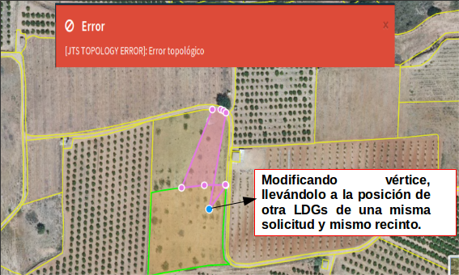
   
8.2 Solapes entre LDGs de otras solicitudes ya registradas
__________________________________________________________

El sistema si permite realizar solapes entre geometrías con LDGs de otras solicitudes gráficas registradas previamente por otros solicitantes. Esto suele presentarse cuando un recinto se encuentra en distintas solicitudes.   

8.2.1 Mostrar |herramienta14| y eliminar solapes |herramienta15|
~~~~~~~~~~~~~~~~~~~~~~~~~~~~~~~~~~~~~~~~~~~~~~~~~~~~~~~~~~~~~~~~

Para eliminar los solapes se hace uso de dos herramientas: 'mostrar/ocultar solapes con cultivos de otras solicitudes' y ' Eliminar solapes seleccionados'.

.. |herramienta14| image:: ../_static/images/12_ver_solapes.png
.. |herramienta15| image:: ../_static/images/13_eliminar_solapes.png

.. list-table::  Mostrar y eliminar solapes 
   :widths: 2 10 
   :header-rows: 1
   :align: left

   * - Selección
     - Acción
   * - 1-'mostrar/ocultar solapes
   
       con cultivos de otras 
       
       solicitudes' |herramienta14|
     - Solo basta activar este botón y el sistema detectará los solapes existentes, resaltando 
     
       dichos solapes de color rojo. Si se pincha de nuevo el botón los solapes se ocultan.
   * - 2-'Eliminar solape 
      
       seleccionado' |herramienta15|
     - Al activar este botón, se pincha sobre algún solape que quiera borrarse, y esta superficie 
     
       solapada será restada (eliminada) al área del cultivo de la solicitud que se encuentra activa. 
   * - 3- Guardar cambios 
   
       |herramienta3|
     - Al guardar cambios en la solicitud activa, el campo 'superficie gráfica' del cultivo que 
     
       solapaba, será la diferencia entre la superficie que tenía previamente menos la superficie de 
       
       solape eliminada.       
         
* Solapes con cultivos de otras solicitudes ya registradas
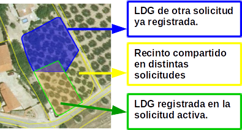

* Mostrar/ocultar solapes
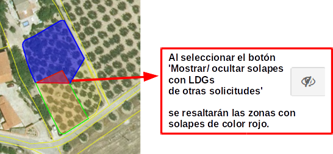

* Eliminar solape seleccionado
.. image:: ../_static/images/libra_solape_eliminar_4.png
   :align: center

9. Otras herramientas de uso común
----------------------------------
.. |herramienta16| image:: ../_static/images/15_imprimir.png
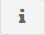

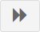
.. |herramienta21| image:: ../_static/images/21_incrementar_superficie.png

.. list-table::  Herramientas 
   :widths: 3 2 10 
   :header-rows: 1
  

   * - Herramienta
     - Botón
     - Acción
   * - Deshacer
     - |herramienta19|
     - Como su nombre lo indica sirve para eliminar una acción realizada gráficamente. 
     
       Eliminará la última acción o tantas atrás como veces sea indicado.
   * - Rehacer
     - |herramienta20|
     - Permite volver a las acciones posteriores que se han deshecho gráficamente, 
     
       es decir, lo contrario de la herramienta deshacer.
   * - Seleccionar
     - |Herramienta1|
     - Permite seleccionar las geometrías asociadas a una Línea de declaración. 
     
       Es la herramienta más común que se usa previamente para poder ejecutar las demás herramietas. 
       
       Con esta herramienta también se puede seleccionar cualquier solape y LDG (propia de la solicitud 
       
       activa o de otra solictud ya resgistrada) y al pinchar sobre los mismos, saldrá un recuadro con
       
       la información rápida de los elementos seleccionados.
   * - Ver tabla
     - |Herramienta2|
     - Esta herramienta permite visualizar todas las Líneas de Declaración que han sido 
     
       seleccionadas desde Agrored y que se pueden editar desde LIBRA, igualmente en 
       
       cada cultivo se detallan sus atributos alfanuméricos correspondientes.  
   * - Guardar cambios
     - |Herramienta3|
     - Esta es otra herramienta de bastante uso común, pues se ejecuta después de 
      
       realizar cualquier cambio en los cultivos. De esta manera quedan registrados 
       
       en Libra y automáticamente en Agrored.
   * - Imprimir
     - |herramienta16|
     - Esta herramienta permite exportar en formato PDF un mapa con la zona del cultivo
       
       seleccionado y sus atributos alfanuméricos 
   * - Informacion de
   
       elementos en mapa
     - |herramienta17|
     - Esta herramienta permite mostrar la información alfanumérica de forma rápida de 
       
       un elemento seleccionado en el mapa: recintos, solapes, cultivos de la solicitud 
       
       activa (títulos color verde) y de otras solicitudes ya registradas (títulos color azul)
   * - Buscar Recinto
     - |herramienta18|
     - Esta herramienta permite buscar sobre el mapa un recinto a partir de los datos de 
       
       la provincia, município, polígono, parcela y recinto.  
   * - Incrementar superficie
     - |herramienta21|
     - Con esta herramienta se permite al usuario aumentar el área de 'superficie gráfica' de 
     
       cualquier cultivo seleccionado, siempre y cuando el área que se indique no sea mayor a 
       
       la 'Superficie Sigpac'        
     
     
     