Libra
=====

1. Introducción
---------------

Libra es la interfaz gráfica que se conecta directamente con AGRORED para poder asignar mediante la captura gráfica los croquis o geometrías que corresponden a cada una de las Líneas de declaración gráfica que refieren a una petición del pago único solicitado por un agricultor o ganadero.

1.1 Objetivo
____________

Este manual tiene como objetivo describir el manejo y funcionamiento de las herramientas para la captura gráfica de solicitudes definidas en AGRORED

1.2. Glosario de términos y acrónimos
_____________________________________

**Acrónimos:**

* SIGPAC: Sistema de Información Geográfico de Parcelas Agrícolas

* AGRORED: 

* LIBRA:

* PAC: Parcelas Agricolas

* PU: Pago Único

* LDG: Línea de Declaración Gráfica, también se le conoce como 'cultivo'

**Términos:**

*  **AGRORED:** Aplicación de captura de solicitudes del pago único (PU) de la PAC.

*  **Recinto SIGPAC**:  superficie contínua de terreno, dentro de una parcela, con un mismo uso agrícola estable (tierra arable, pastos, viñedos, olivar, etc.)

*  **Cultivo:**   superficie continua de terreno, dentro de un recinto, por la que se solicita el pago único. Es sinónimo de LDG.

*  **Solicitud de AGRORED:** cada una de las solicitudes que realiza una persona física o jurídica a través de AGRORED. En una solicitud se definen varios recintos SIGPAC que a su vez contienen uno o varios cultivos.

*  **Línea de Declaración Gráfica:** Cada una de las superficies continuas de terreno que se declaran con el mismo cultivo principal (y secundario si procede) sobre un recinto SIGPAC.

*  **Geometría:** Representación gráfica de la superficie declarada. Es un atributo de las líneas de declaración gráficas.

*  **Editor gráfico:** Conjunto de herramientas para la definición de las geometrías asociadas a las LDGs.

*  **Tabla de registros (Tabla de atributos o grid alfanumérico):** tabla que muestra la información alfanumérica de cada LDG y que se corresponde con cada uno de los cultivos definidos en una solicitud de AGRORED.

2. Descripción del editor gráfico
---------------------------------

El editor gráfico permite editar, actualizar y añadir nueva geometría asociada a una LDG.

2.1 Vista General del editor gráfico
____________________________________

La vista general es el área de trabajo desde donde se realizará la edición gráfica de las geometrías para cada solicitud única.

.. image:: ../_static/images/libra_online_1.png
   :align: center

.. list-table:: Vista general del editor gráfico 
   :widths: 2 10 
   :header-rows: 1
   :align: left

   * - Opción
     - Descripción
   * - 1
     - Barra de menú principal
   * - 2
     - Panel de contenido
   * - 3
     - Área del mapa
     
     
2.2 Barra de menú principal
___________________________

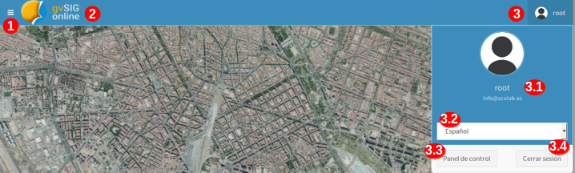

.. list-table:: Descripción de la barra del menú principal
   :widths: 2 10 
   :header-rows: 1
   :align: left

   * - Opción
     - Descripción
   * - 1
     - Botón para mostrar/ocultar el panel de contenidos
   * - 2
     - Logo del sistema (se puede personalizar según lo solicite el cliente)
   * - 3
     - Menú del usuario (únicamente para administradores del sistema)
      
       **3.1**: Nombre y correo del usuario conectado
       
       **3.2**: Idioma
       
       **3.3**: Opción para ir a la vista principal de administrador
       
   * - 4
     - Cerrar sesión para el usuario conectado.      

  
2.3 Detalles del panel de contenido
___________________________________
 
El panel de contenido se compone de distintas pestañas que contienen el árbol de capas (TOC), la leyenda/simbología de capas, detalles de la información de los elementos seleccionados y las herramientas del editor gráfico.
 
2.3.1  Pestaña: 'árbol de capas'
~~~~~~~~~~~~~~~~~~~~~~~~~~~~~~~~

.. image:: ../_static/images/libra_online_3.png
   :align: center

.. list-table:: Panel de contenido - Árbol de capas
   :widths: 2 10 
   :header-rows: 1
   :align: left

   * - Opción
     - Descripción
   * - 1
     - Pestaña: árbol de capas
   * - 1.1
     - Capas bases que son configuradas desde el panel de administrador.
     
       En este caso se encuentra una única capa activa y por defecto. 
       La capa activa es del Plan Nacional de Ortofotografía Aérea (PNOA) 
       obtenida del Centro Nacional de Información Geográfica (CNIG).
   * - 1.2
     - Grupo de capas que puede contener muchas capas, en este caso el grupo 
       solo tiene una única capa. También se configura desde el Panel de administrador del sistema
   * - **1.2.a**
     - Capa publicada desde el panel de administrador, en este caso para el editor gráfico basta 
       disponer de la capa vectorial que contiene todas las geometrías de los recintos.
   * - **1.2.b**
     - Propiedades propias para cada capa:
     
       - **Metadatos:** Resumen de la información de la capa (se configura cuando se publica la capa desde el panel de administrador)
       
       - **Zoom a la capa:** realiza y muestra el zoom general de todas las geometrías que contiene la  capa sobre el mapa.
       
       - **Cambiar el estilo de la simbología**: esto si se han definido previamente mas de un estilo  desde el panel de administrador.
      
       - **Opacidad**: se puede ir configurando el porcentaje de opacidad como desee y necesite el usuario para el análisis entre varias capas.

2.3.2  Pestaña: 'Leyenda'
~~~~~~~~~~~~~~~~~~~~~~~~~

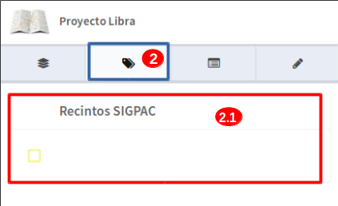

.. list-table:: Panel de contenido - Leyenda
   :widths: 2 10 
   :header-rows: 1
   :align: left

   * - Opción
     - Descripción
   * - 2 
     - Pestaña: Leyenda, muestra todas las simbologías de las capas activas y visibles del árbol de capas.
   * - 2.1
     - En este caso, muestra la leyenda de tipo poligonal, color de borde amarillo y relleno: sin color que representa las geometrías de la capa de 'Recintos SIGPAC'

2.3.3  Pestaña: 'Detalles'
~~~~~~~~~~~~~~~~~~~~~~~~~~

.. image:: ../_static/images/libra_online_5.png
   :align: center

.. list-table:: Panel de contenido - Detalles
   :widths: 2 10 
   :header-rows: 1
   :align: left

   * - Opción
     - Descripción
   * - 3 
     - Pestaña de 'Detalles'
   * - 3.1
     - Muestra la información detallada vinculada a una geometría seleccionada en el mapa. Se puede realizar a través de la consulta de la herramienta 'Información' (i) del área del mapa. 

2.3.4  Pestaña: 'Captura gráfica'
~~~~~~~~~~~~~~~~~~~~~~~~~~~~~~~~~

será la entrada mas usada durante el uso el editor gráfico, es aquí donde se ubican las herramientas para tratar las LDGs e información de las mismas.

.. image:: ../_static/images/libra_online_6.png
   :align: center

.. list-table:: Panel de contenido - Captura gráfica
   :widths: 2 10 
   :header-rows: 1
   :align: left

   * - Opción
     - Descripción
   * - 4 
     - Pestaña 'Captura gráfica'
   * - 4.1
     - Herramientas para la creación, edición, actualización y eliminación de las geometrías correspondientes a las LDGs  
   * - 4.2
     - Panel de información rápida para las LDGs seleccionadas en el mapa
   * - 4.3
     - Panel de log: ofrece información a usuario como la generación automática de LDGs en la precarga de la solicitud.  
     
2.4 Detalles del área de trabajo - (vista en mapa)
__________________________________________________

La vista del mapa será el área de trabajo por defecto que se abrirá al usuario de AGRORED para poder editar/añadir geometrías a las LDGs.

.. image:: ../_static/images/libra_online_7.png
   :align: center

.. list-table:: Detalles del área de trabajo (vista mapa) 
   :widths: 2 10 
   :header-rows: 1
   :align: left

   * - Opción
     - Descripción
   * - 1 
     - Sobre el área del mapa se mostrará las capas bases y capas vectoriales activas. Así como también se mostrarán las LDGs y recintos disponibles que están asociadas a la solicitud abierta en ese instante.
   * - 1.1
     - Herramientas básicas propias del editor gráfico, como son:
       
       * herramientas de zoom (mas, menos y general del proyecto).
            
       En el recuadro siguiente están:

       * (la herramienta "i" para consultar la información rápida de una geometría asociada a una capa del editor, en este caso se podrán consultar los atributos de las geometrías de los recintos.

       * Medir distancia

       * Medir área 

       * Ubicación de un punto en el mapa a través de las coordenadas geográficas o planas.

       * Posición actual del usuario a través de la ubicación GPS del dispositivo (tablet, ordenador) 
     
   * - 1.2
     - visualizador de referencia de un área más grande sobre el que se está trabajando en la visual del mapa.
   * - 1.3
     - Muestra las coordenadas donde se ubica el cursor en el mapa y se puede seleccionar sistema de referencia geográfico mundial WGS-84 (4326) o el ETRS-89 geográfico para Europa (4258)
   * - 1.4
     - Indica la referencia de la escala gráfica.

3. Estilos gráficos
-------------------

Existen dos tipos de estilos gráficos, uno para recintos y otro para las LDGs

3.1 Estilos para LDGs:
______________________

Se tienen distintos estilos cuando están seleccionadas, en edición, con solapes, propias y de otras solicitudes.

3.1.1 LDGs Propias
~~~~~~~~~~~~~~~~~~

.. image:: ../_static/images/estilo_ldg_propia.png
   :align: center

- Bordes: verde claro (sin relleno de borde)
- Relleno: marrón claro

3.1.2 LDGs - de otras solicitudes ya registradas
~~~~~~~~~~~~~~~~~~~~~~~~~~~~~~~~~~~~~~~~~~~~~~~~

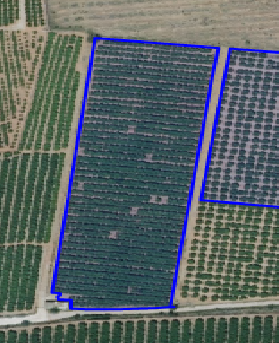

- Borde: azul rey
- Relleno: azul rey con transparencia

3.1.3 LDGs - Seleccionadas
~~~~~~~~~~~~~~~~~~~~~~~~~~

.. image:: ../_static/images/estilo_ldg_seleccionada.png
   :align: center

- Borde: rosado claro
- Relleno: rosado claro con transparencia

3.1.4 LDGs - Solapes
~~~~~~~~~~~~~~~~~~~~

.. image:: ../_static/images/estilo_ldg_solape.png
   :align: center
   
- Borde: rojo
- Relleno: rojo transparente 

3.2 Estilos para Recintos
_________________________

Los recintos pueden tener dos estilos, cuando pertenecen o no a la declaración gráfica activa.

3.2.1 Recintos - Todos los visibles al abrir una solicitud
~~~~~~~~~~~~~~~~~~~~~~~~~~~~~~~~~~~~~~~~~~~~~~~~~~~~~~~~~~

.. image:: ../_static/images/estilos_recintos_todos.png
   :align: center

-  Borde: Amarillo
-  Relleno: sin  relleno

3.2.2 Recintos - Los que pertenecen a una solicitud activa
~~~~~~~~~~~~~~~~~~~~~~~~~~~~~~~~~~~~~~~~~~~~~~~~~~~~~~~~~~

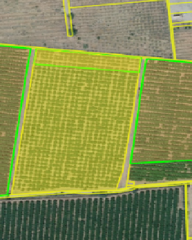

- Borde: Amarillo
- Relleno: Amarillo claro con transparencia (al pasar el puntero encima de éste)  
   
   
4. Precarga automática de la LDG
--------------------------------

En el momento que se se invoque la herramienta de captura gráfica (LIBRA) desde AGRORED, el sistema realizará las siguientes comprobaciones para generar de forma automática las LDGs asociadas a la solicitud:

4.1 Existe Croquis:
___________________
 
En el caso de que exista un croquis asociado al cultivo, utilizará esta geometría en la LDG.

4.2 No existe croquis:
______________________

Se puede presentar dos casos:

*  **Sup. Declarada = Sup recinto SIGPAC:**

Si no existe croquis y la superficie declarada del cultivo es igual a la del recinto SIGPAC, se creará una geometría igual a la del recinto SIGPAC

*  **Sup declarada <> Sup recinto SIGPAC:**

 
Se creará una LDG sin geometría. Aparecerá la entrada de color amarillo en la tabla de registros.

5. Modificar LDGs existentes
----------------------------
Cuando la declaración gráfica que se activa tiene asociada una geometría, se pueden realizar distintas acciones como añadir/quitar superficie, unir a otra LDG, dividirlas, entre otras.

5.1 Añadir superficie
_____________________
Para añadir superficie se puede hacer uso de varias herramientas:

5.1.1 Con herramienta 'Añade trozo digitalizado a LDG seleccionada'  |herramienta4|
~~~~~~~~~~~~~~~~~~~~~~~~~~~~~~~~~~~~~~~~~~~~~~~~~~~~~~~~~~~~~~~~~~~~~~~~~~~~~~~~~~~
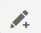

.. |herramienta2| image:: ../_static/images/16_tabla_atributos.png

.. |herramienta3| image:: ../_static/images/14_guardar.png

.. list-table::  Añade trozo digitalizado a LDG seleccionada
   :widths: 2 10 
   :header-rows: 1
   :align: left

   * - Selección
     - Acción
   * - 1-'Seleccionar'|herramienta1|
     - Al activar el botón, se pincha sobre la LDG que se quiere editar. Ésta cambiará a color rosado.
   * - 2-Otra opción:
   
       'ver tabla'|herramienta2|  
     - Se abre la tabla de registros, se ubica el que quiere editarse y se pincha sobre el mismo.
     
       Éste registro se cambiará a un fondo color rosa, igual que la LDG sobre el mapa
   * - 3-'Añade trozo digitalizado
    
       a LDG seleccionada'
        
       |herramienta4|
     - Se digitaliza el área del recinto que se quiere añadir a la LDG seleccionada.
   * - 4-Cerrar/terminar
     
       área digitalizada
     - Al finalizar el área digitalizada, resulta una nueva LDG, que es la suma de la LDG seleccionada más zona digitalizada. 
     
       Estará limitada por los lados digitalizados, los del recinto SIGPAC y las otras LDGs propias.
   * - 5-Guardar cambios|herramienta3|
     - Saldrá un mensaje indicando: 'se han guardado los cambios con éxito'. Cuando se guarden los cambios, 
     
       en la tabla de registros, el campo 'Superficie gráfica' se debe actualizar con el nuevo valor del área de la LDG resultante.
       
       El campo 'superficie declarada' deberá ser actualizada por el usuario desde AGRORED.

* Añadiendo trozo digitalizado (azul) sobre LDG seleccionada (rosado).

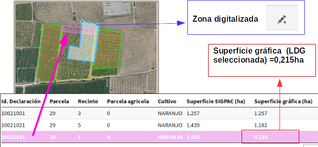

* LDG resultante:

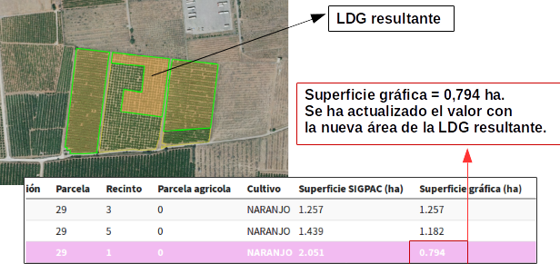
   
   
5.1.2 Con herramienta 'modificar cultivo' - Edición de vértices |herramienta5|
~~~~~~~~~~~~~~~~~~~~~~~~~~~~~~~~~~~~~~~~~~~~~~~~~~~~~~~~~~~~~~~~~~~~~~~~~~~~~~
Esta herramienta es usada para realizar pequeños ajustes en la superficie.
 
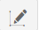

.. list-table::  Modificar Cultivo (edición de vértices)
   :widths: 2 10 
   :header-rows: 1
   :align: left

   * - Selección
     - Acción
   * - 1-'Seleccionar'|herramienta1| 
     - Al activar el botón, se pincha sobre la LDG que se quiere editar. Ésta cambiará a color rosado.
   * - 2-Otra opción:
   
       'ver tabla'|herramienta2| 
     - Se abre la tabla de registros, se ubica el que quiere editarse y se pincha sobre el mismo.
     
       Éste registro se cambiará a un fondo color rosa, igual que la LDG sobre el mapa.
   * - 3-'Modificar cultivo' 
   
       |herramienta5|
     - Cuando el botón esté activo se vuelve hacer clic sobre el cultivo que se seleccionó previamente. 
     
       Se deben activar todos los vértices y al pasar el cursor sobre los vértices, éstos cambiarán 
       
       a color azul. Se puede realizar:
       
       * **Mover los vértices**, haciendo clic sobre él (sin soltarlo) se mueve a la posición deseada.
       * **Añadir vértices**: Ubicarse sobre el borde de la geometría donde se quiera añadir y hacer un clic.
       * **Eliminar vértice**: Se ubica al vértice que se quiera quitar y se hace un solo clic y soltar.
   * - 4-Guardar cambios|herramienta3|
     - Saldrá un mensaje indicando: 'se han guardado los cambios con éxito'. Cuando se guarden los cambios, 
     
       en la tabla de registros, el campo 'Superficie gráfica' del cultivo modificado, tomará el valor de la
     
       nueva superficie resultante. El campo 'superficie declarada' se deberá actualizar en la tabla 
     
       alfanumérica de Agrored  una vez se hayan guardado los cambios realizados en el editor gráfico.    

* Activando la edición de vértices - Modificar cultivo.

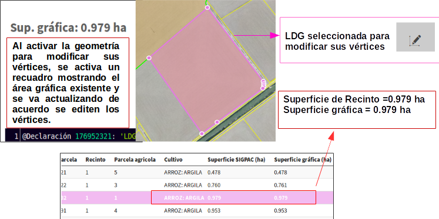
           
* Vértices editados (Superficie modificada)

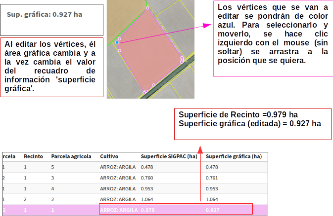
 
5.1.3 Con herramienta 'añadir espacio libre a LDG seleccionada' |herramienta6|
~~~~~~~~~~~~~~~~~~~~~~~~~~~~~~~~~~~~~~~~~~~~~~~~~~~~~~~~~~~~~~~~~~~~~~~~~~~~~~
        

Esta herramienta es usada para añadir todo el espacio libre que dispone el recinto a uno de sus cultivos que haya sido seleccionado.

.. list-table::  Añdir espacio libre a LDG seleccionada
   :widths: 2 10 
   :header-rows: 1
   :align: left

   * - Selección
     - Acción
   * - 1-'Selecionar'|herramienta1|
     - Al activar el botón, se pincha sobre la LDG que se quiere editar. Ésta cambiará a color rosado.
   * - 2-Otra opción:
   
       'ver tabla'|herramienta2|
     - Se abre la tabla de registros, se ubica el que quiere editarse y se pincha sobre el mismo.
     
       Éste registro se cambiará a un fondo color rosa, igual que la LDG sobre el mapa.
   * - 3-'Añadir espacio
       
       libre a LDG seleccionada'
       
       |herramienta6|
     - Tocar el área vacía que está disponible en el recinto
   * - 4-Selección de
       
       área vacía
     - Como resultado se genera un nuevo recinto, que será la suma de la LDG seleccionada más el 
     
       espacio libre disponible que se ha tocado del recinto SIGPAC.
     
   * - 5-Guardar cambios|herramienta3|     
     - Saldrá un mensaje indicando: 'se han guardado los cambios con éxito'. En la tabla de registros, 
     
       el campo 'Superficie gráfica' de la LDG modificada, tomará el valor de la nueva superficie resultante.

           
* Añadiendo espacio libre de recinto a uno cultivo selecconado   

.. image:: ../_static/images/libra_anyad_spacio_libre1.png
   :align: center   
   
* Espacio libre añaido a LDG

.. image:: ../_static/images/libra_anyad_spacio_libre2.png
   :align: center  

5.2 Quitar superficie
_____________________

Existen dos formas de quitar o disminuir el área de un cultivo:

     
5.2.1 Con herramienta 'modificar cultivo' - Edición de vértices |herramienta5|
~~~~~~~~~~~~~~~~~~~~~~~~~~~~~~~~~~~~~~~~~~~~~~~~~~~~~~~~~~~~~~~~~~~~~~~~~~~~~~
 
Ya ha sido detallado anteriormente , ésta herramienta igualmente es usada para realizar pequeños ajustes sobre la superficie.

5.2.2 Con herramienta 'Quitar trozo digitalizado a cultivo'  |herramienta7|
~~~~~~~~~~~~~~~~~~~~~~~~~~~~~~~~~~~~~~~~~~~~~~~~~~~~~~~~~~~~~~~~~~~~~~~~~~~

.. |herramienta7| image:: ../_static/images/7_quitar_trozo_dig.png

.. list-table::  Quitar trozo digitalizado a cultivo
   :widths: 2 10 
   :header-rows: 1
   :align: left

   * - Selección
     - Acción
   * - 1-'Selecionar'|herramienta1|
     - Al activar el botón, se pincha sobre la LDG que se quiere editar. Ésta cambiará a color rosado.
   * - 2-Otra opción:
   
       'ver tabla'|herramienta2|  
     - Se abre la tabla de registros, se ubica el que quiere editarse y se pincha sobre el mismo.
      
       Éste registro se cambiará a un fondo color rosa, igual que la LDG sobre el mapa.
   * - 3-'Quitar trozo
       
       dig. a cultivo'|herramienta7|
     - Se dibuja el área que se quiere quitar sobre la LDG seleccionada. 
   * - 4-Cerrar/terminar
       
       área digitalizada
     - Al terminar de digitalizar el área a quitar se genera un cultivo de superficie más pequeña, 

       como resultado de la diferencia entre LDG seleccionada menos área quitada.
   * - 5-Guardar cambios|herramienta3|
     - Saldrá un mensaje indicando: 'se han guardado los cambios con éxito'. En la tabla de registros, 
     
       el campo 'Superficie gráfica' de la LDG modificada, tomará el valor de la nueva superficie resultante.  

        
* Quitando trozo digitalizado sobre cultivo seleccionado
.. image:: ../_static/images/libra_quitar_trozo_ldg_seleccionada_1.png
   :align: center

* Nuevo cultivo generado al restarle/quitarle el área digitalizada
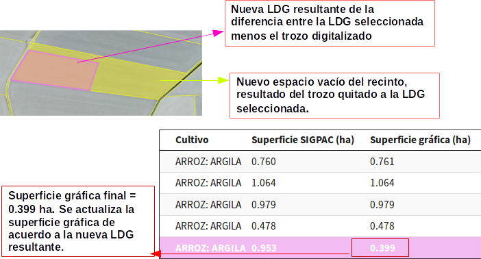
 
   
5.3 Unir dos cultivos  |herramienta8|
_____________________________________

.. |herramienta8| image:: ../_static/images/10_juntar_cultivos.png   
 
Con esta herramienta se permite juntar dos LDGs que pertenecen a un mismo recinto en un solo registro del grid alfanumérico.

.. list-table::  Unir dos cultivos
   :widths: 2 10 
   :header-rows: 1
   :align: left

   * - Selección
     - Acción
   * - 1-'Selecionar'|herramienta1|
     - Seleccionar un primer cultivo (pinchando la geometría sobre el mapa) y manteniendo pulsada la tecla 'mayúscula' 
     
       se selecciona el segundo cultivo (pinchando la geometría sobre el mapa). Ambas LDGs deben pertenecer a un mismo recinto.     
   * - 2-Otra opción:
   
       'ver tabla'|herramienta2|  
     - Se abre la tabla de registros, se ubica la primera LDG y manteniendo pulsada la tecla 'mayúscula' se selecciona
     
       el segundo cultivo. Ambas LDGs seleccionadas cambiaran de color rosado en el grid alfanumérico como en el mapa.
   * - 3-'unir cultivos'|herramienta8|
     - Teniendo seleccionados ambos cultivos, se pincha sobre el botón 'unir cultivos' automáticamente éstas se unirán 
       
       en una sola geometría y tomará los atributos alfanuméricos de la primera LDG seleccionada y el campo superficie gráfica
       
       se actualizará con el nuevo valor del área generada. El registro del segundo cultivo quedará sin geometría asociada y sup. gráfica =0
   * - 4-Guardar cambios|herramienta3|
     - Saldrá un mensaje indicando: 'se han guardado los cambios con éxito'. En la tabla de registros, el campo 'Superficie gráfica' 
     
       de la nueva LDG resultante, tomará el valor de la suma de las dos superficies unidas.
 
 
* Seleccionar dos LDGs para aplicar la herramienta 'Unir cultivos' 
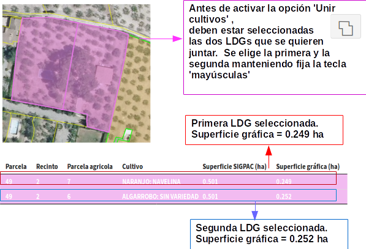

* Cultivo resultante de la unión de dos LDGs
.. image:: ../_static/images/libra_unir_cultivos_2.png
   :align: center
 
5.4 Segregar LDG  |herramienta9|
________________________________

.. |herramienta9| image:: ../_static/images/11_segregar_ldg.png

Con esta opción se permite separar/dividir un cultivo en dos y por tanto generar un registro más en el grid alfanumérico con la nueva LDG segregada.

.. list-table::  Segregar cultivo
   :widths: 2 10 
   :header-rows: 1
   :align: left

   * - Selección
     - Acción
   * - 1-'Selecionar'|herramienta1|
     - Al activar el botón, se pincha sobre el mapa la LDG que se quiere editar. Ésta cambiará a color rosado.
   * - 2-Otra opción:
   
       'ver tabla'|herramienta2|  
     - Se abre la tabla de registros, se ubica el que quiere editarse y se pincha sobre el mismo.
     
       Éste registro se cambiará a un fondo color rosa, igual que la LDG sobre el mapa.
   * - 3-'Segregar LDG'
     - Teniendo elegido el cultivo, se pincha sobre el botón 'segregar LDG' y se procede a digitalizar sobre 
     
       la geometría seleccionada el área que se quiera segregar.      
   * - 4-Cerrar/terminar
       
       área digitalizada
     - Al terminar de digitalizar el área que se quiere desprender, la geometría del cultivo seleccionado se divide 
     
       en dos y su campo sup. Gráfica = al área completa menos el área digitalizada desprendida. 
       
       Al segregar la LDG seleccionada se genera en la tabla de registros otra fila con el nuevo cultivo asociado 
       
       a la geometría digitalizada, donde el campo 'Superficie SIGPAC' debe ser el mismo que la 'Sup. SIPAC' del 
       
       cultivo segregado, la 'Sup. gráfica' = a la superficie del área digitalizada. Los demás atributos estarán 
       
       vacíos para ser completados a través de la tabla alfanumérica de Agrored.
   * - 5-Guardar cambios|herramienta3|
     - Saldrá un mensaje indicando: 'se han guardado los cambios con éxito'. Cuando se guarden los cambios, en la
     
       tabla de registros, el campo 'Superficie gráfica' de la nueva LDG tomará la superficie de la geometría generada. 
     
   
     
