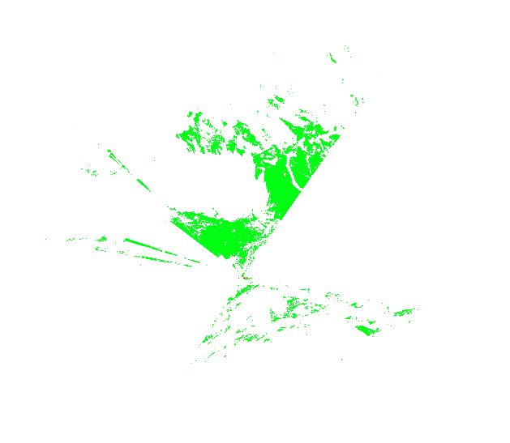
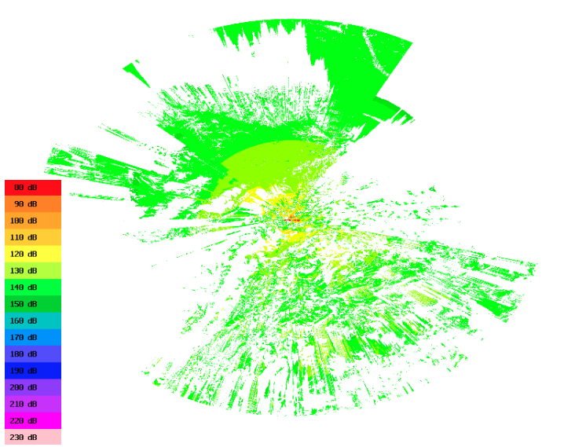
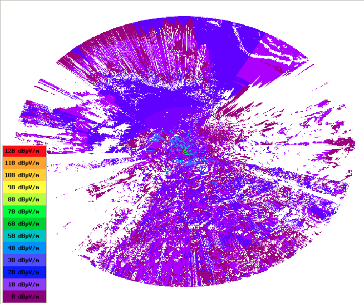
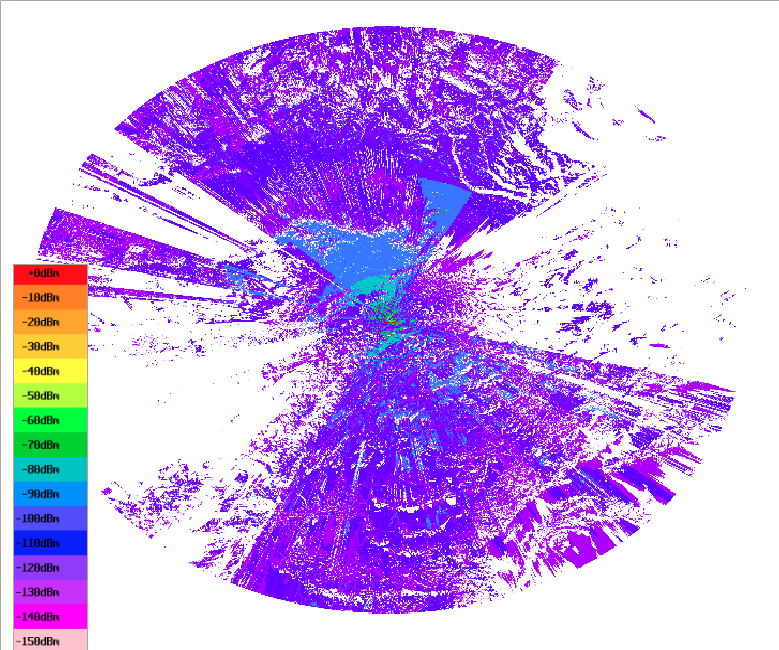

Plugin - Splat
==============

1. Introducción
---------------

SPLAT (por sus siglas en inglés: Signal Propagation, Loss, And Terrain analysis tool), es una herramienta para el Análisis de Propagación de Señales, Pérdidas, y Características del Terreno.

"El SPLAT produce gráficos y mapas topográficos altamente detallados y cuidadosamente descritos que presentan las trayectorias de línea de vista, contornos regionales de pérdidas por trayectoria para determinar la predicción del área de cobertura de sistemas de transmisores y repetidoras. Al realizar análisis de línea de vista cuando se emplean múltiples sitios de transmisores o repetidores, SPLAT determina las áreas individuales y mutuas de cobertura dentro de la red especificada", KD2BD Software SPLAT, Dic 2006. 

2. Tipos de mapas que pueden generarse
--------------------------------------

2.1 Mapa de cobertura regional o línea de vista (Regional Coverage Analysis)
____________________________________________________________________________

Genera un mapa topográfico que ilustra la predicción de cobertura regional de línea de vista del transmisor a las estaciones receptoras que tienen una antena de 10 metros de altura sobre el nivel del terreno (AGL).  

Hay que tener en cuenta que no es necesaria una leyenda porque únicamente muestra la línea visual de la antena (hasta donde podríamos ver si nos ubicamos en la posición de la antena)

2.2 Mapa de análisis de pérdida por trayectoria (Path loss analysis)
____________________________________________________________________

Genera un mapa multicolor que ilustra los niveles de señal esperados (pérdidas por trayectoria) en las áreas alrededor del transmisor (de 10m de altura). Una leyenda relaciona cada color con sus respectivas pérdidas por trayectoria específicas en decibeles.

Es importante destacar que la pérdida por trayectoria (atenuación en la atmósfera) únicamente dependen de la frecuencia y la distancia al emisor, no de la potencia.

  
2.3 Mapa de análisis de intensidad de campo (Field strength analysis)
_____________________________________________________________________
 
Si se especifica la potencia efectiva radiada (ERP) del transmisor en el archivo del transmisor .lrp, o se expresa en la línea de comandos usando la opción -erp, en lugar de las pérdidas por trayectoria, se graficarán los contornos de intensidad de campo referenciados a decibeles sobre un microvoltio por metro (dBuV/m).

Se puede indicar un umbral (-db) para no mostrar todas las intensidades, en este caso la unidad es dBuV/m   
  

 
.. note:: 
   La unidad de potencia ERP son vatios. ERP es equivalente a PIRE (Potencia Isotrópica Radiada Equivalente)

2.4 Mapa de análisis de potencia recibido (Received power level analysis)
_________________________________________________________________________

Mapa de contornos de nivel de potencia recibida, muestra decibeles sobre un milivatio (dBm).

También podemos filtrar con -db (poniendo valor negativo y en la misma unidad dBm)

 
.. note::   
   El mapa de potencia recibido se indica con el parámetro -dbm    

   
