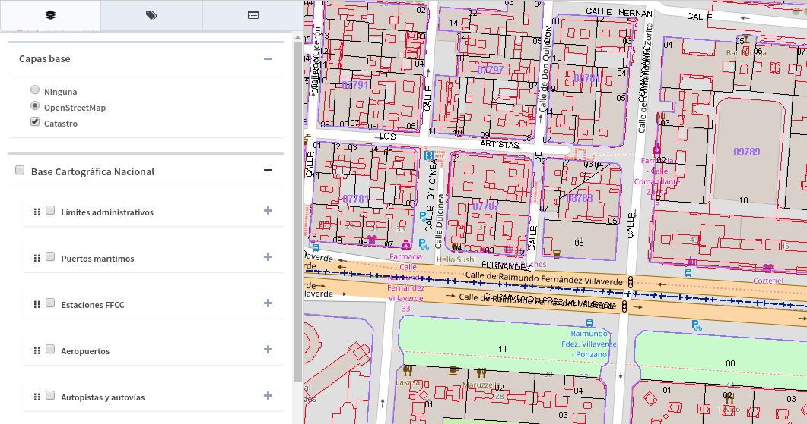
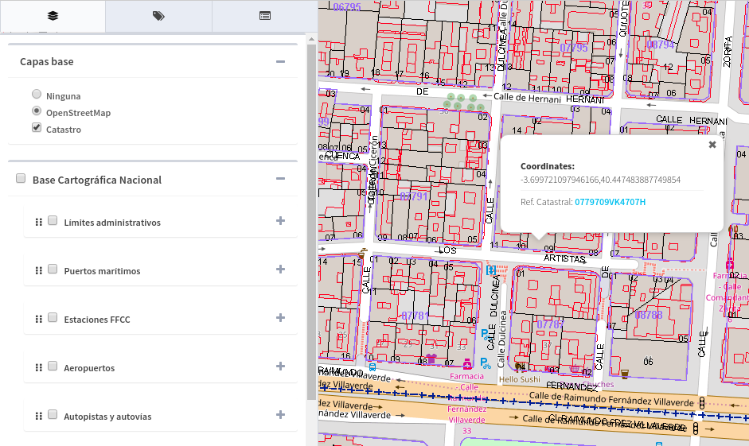

Catastro
========

O *"Cadastre Plugin"*, adiciona a camada de Cadastro ao grupo de camadas base, embora permita sobrepor-se ao resto.

   
Se a camada cadastral estiver ativa, ao fazer uma consulta com a ferramenta *"Informação do ponto"*, se selecionarmos uma parcela cadastral, aparecerá um link com o número de *referencia catastral*.

   
Se nós selecionamos o link nos leva à página cadastral oficial de onde nós poderemos ver a informação cadastral do lote.

.. image:: ../_static/images/catastro3.png
   :align: center

