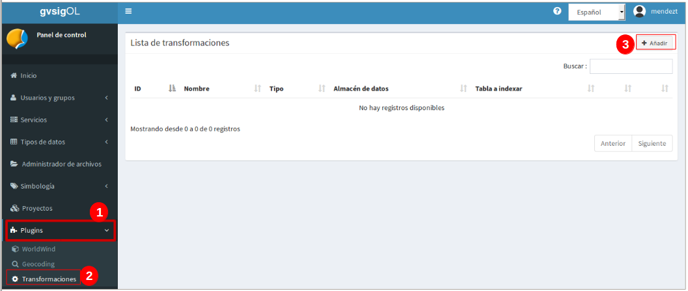
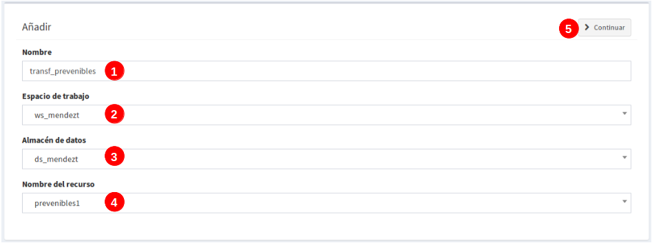
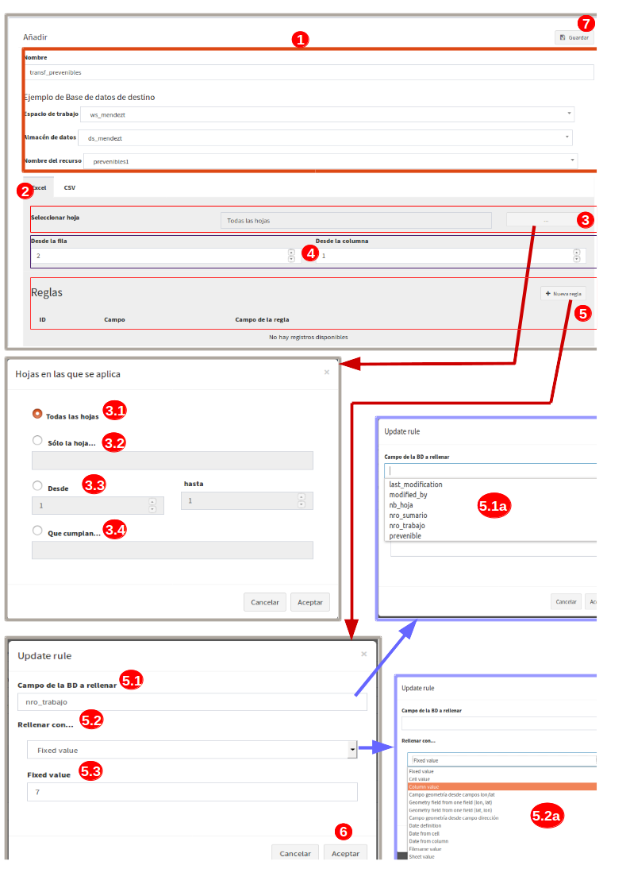
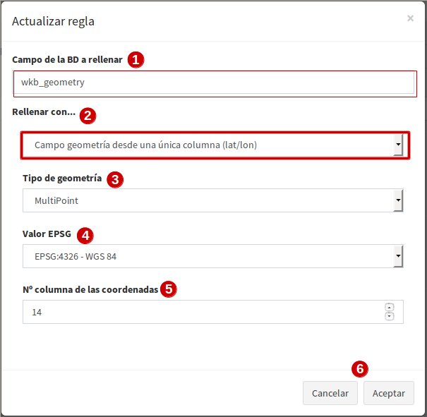
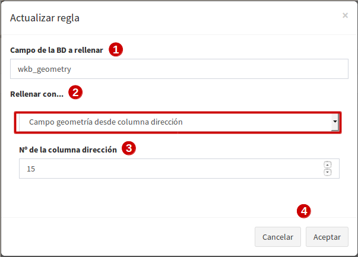
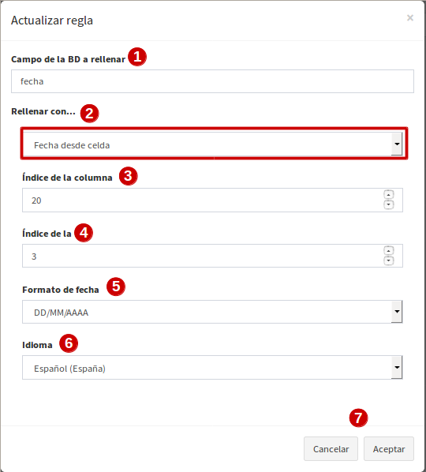
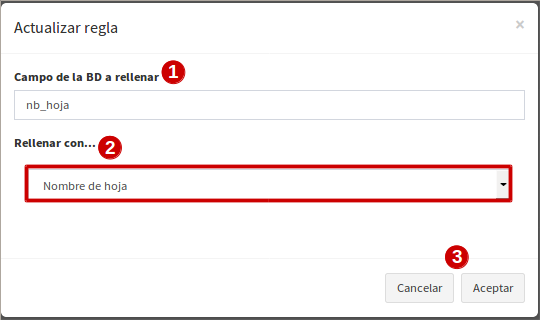
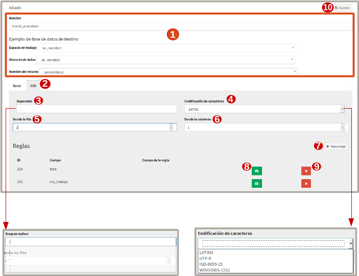
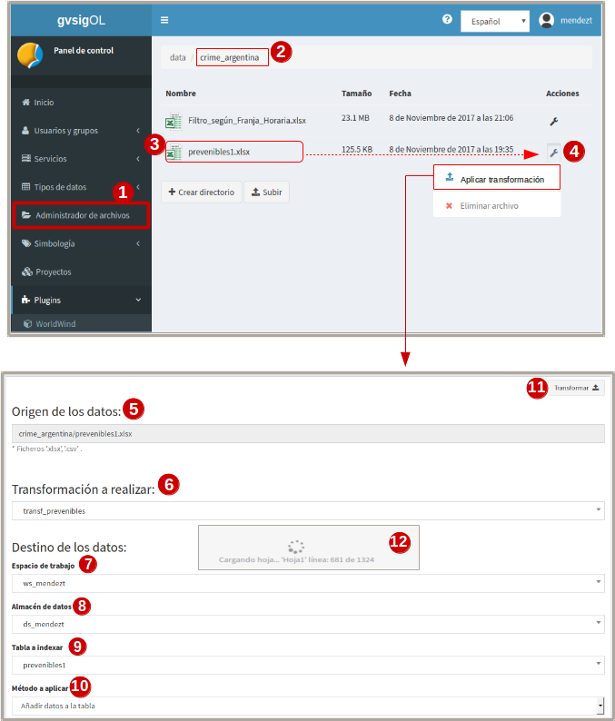

ETL - Plugin de transformação de dados
=======================================

1. Introdução
---------------

*ETL* (acrônimo em inglés *Extract, Transform and Load*) é uma ferramenta que permite exportar a informação contida num ficheiro de dados plano (Excel ou CSV) para uma tabela na base de dados para poder trabalhar com ela.

A vantagem desta ferramenta é que permite georreferenciar os registros de cada tabela, desde que exista um campo com o valor das coordenadas ou do endereço para posicionar por meio do geocoder inverso, ou seja, por meio do localizador de endereços, que neste caso utilizará a fonte de dados do servidor OpenStreetMap (OSM).

Outra vantagem oferecida por este plugin é que a mesma transformação pode ser aplicada a diferentes arquivos planos para que seus dados vão para uma única camada no DB.

2. Requisitos básicos para a estrutura de ficheiros planos
-------------------------------------------------------------

Alguns requisitos mínimos devem ser cumpridos para que o processo de transformação seja executado corretamente. Os formatos devem ser (Excel ou CSV) e, por outro lado, certificar-se de que as coordenadas contidas nos arquivos são padronizadas e uniformes, garantindo assim que a transformação seja bem sucedida no momento de posicionar cada elemento.

* **Transformação com direcção**: O campo contendo a direção do elemento, preferencialmente o mais semelhante possível à direção oferecida pela cartografia de base do OSM.

* **Transformação com coordenadas para formato (.xlxs)**: as coordenadas estão comumente em células separadas, devem ser expressas em graus decimais, onde a parte inteira é separada dos minutos e segundos por (,), por exemplo: (-31,4459068688) (-64,233981896).  

.. nota::
   - O sistema não suporta aspas simples ou aspas duplas no final das coordenadas, por exemplo: (-31,4354382939’) (-64,2393822877’).
   
   - As coordenadas que não estão bem definidas, como os exemplos seguintes, também não serão válidas: (-313.937.747) (-6.417.356.619.999.990).
   
* **Transformação com coordenadas para formato (.csv)**: as coordenadas estarão normalmente na mesma célula, portanto, iguais serão expressas em graus decimais, mas desta vez a parte inteira é separada dos minutos e segundos por um (.) uma vez que o (,) é usado para separar entre latitude e longitude ou vice-versa. Também se aceita que estejam ou não entre parênteses. Exemplos (-31.4315574, -64.18822169999998)

3. Requisitos para realizar as transformações
------------------------------------------------

* 3.1 Crie uma **camada vazia** no sistema com os campos onde a informação dos ficheiros planos será despejada, isto é necessário para aplicar a transformação pela primeira vez. Criar uma camada vazia seria descartado se você só quiser adicionar novos dados em uma camada que já foi definida anteriormente, ou seja, apenas definir a camada apenas uma vez para aplicar várias transformações em diferentes arquivos planos que serão despejados para a mesma camada.

* 3.2 Criar o modelo de transformação.

* 3.3 Organizar o arquivo simples no 'gerenciador de arquivos', em formato de planilha (**.xlsx**) ou texto (**.csv**).

* 3.4  Aplicar a transformação ao arquivo plano.

3.1. Criar camada vazia
_____________________
Criar a camada vazia no sistema e adicionar tantos campos quantos o file plano tiver ou aqueles que se deseja eliminar informações.

.. nota::
   - Quando você cria uma camada vazia no sistema você adiciona por padrão os campos: 'gid' e 'wkb_geometry',  o primeiro é interno para fazer um identificador único na tabela Database (DB), este não será usado na transformação, o segundo é o campo onde a geometria de cada elemento será registrada e será o usado para reverter as coordenadas.
   
   - Também são adicionados os campos 'last_modification' e 'by_modified', eles também não serão utilizados na transformação. São campos utilizados como controle na edição da camada on-line do portal.

Uma vez que a camada vazia foi publicada sem registros, o modelo de transformação é criado para definir a configuração entre a camada vazia e o file plano.

3.2. Criar modelo de transformação
______________________________________
O modelo de transformação é utilizado para ajustar e relacionar os campos da camada DB com as colunas do ficheiro plano, ou seja, para fazer as correspondências entre cada um deles.

Para aceder a esta funcionalidade deve entrar no painel de controle:

.. list-table:: Criar modelo de transformação
   :widths: 2 20 50
   :header-rows: 1

   * - Passos
     - Seleção
     - Ação
   * - 1
     - No painel de controle, entrada: Geocoding 
     - Exibe todos os plugins disponíveis
   * - 2
     - Selecionar o plugin 'transformações'
     - Mostrará a janela da lista de transformações
   * - 3
     - Clicar em 'adicionar'
     - Aparecerá uma nova vista para configurar o modelo de transformação
   * - 4
     - Botão verde 'atualizar transformação'
     - Permite editar e atualizar novas alterações à transformação previamente definida.
   * - 5
     - Botão vermelho 'excluir transformação'
     - Remove a transformação da lista, así como todas suas regras.
     

3.2.1 Configuração do modelo de transformação:
~~~~~~~~~~~~~~~~~~~~~~~~~~~~~~~~~~~~~~~~~~~~~~~~~~~
O primeiro passo é adicionar um nome à transformação e selecionar qual será a camada no DB onde se encontram os dados. A especificação da camada permite que o sistema detecte por default os campos que estão disponíveis ao definir as regras. 

.. list-table:: Nome de transformação e selecionar camada 
   :widths: 2 20 50
   :header-rows: 1

   * - Passos
     - Seleção
     - Ação
   * - 1
     - Adicionar um nome ao modelo de transformação (sem caracteres especiais, sem espaços em branco)
     - Será o nome que identifica o modelo.
   * - 2
     - Seleção do espaço de trabalho
     - Este é o espaço onde se encontra a base de dados a utilizar.
   * - 3
     - Seleção de armazém de dados
     - É a base de dados onde a camada está localizada. 
   * - 4
     - Localizar a camada e selecioná-la.
     - É a camada vazia que foi criada antecipadamente (ou outra camada que é fixa) onde os dados do arquivo plano serão despejados.
   * - 5
     - Clique em continuar
     - O resultado é uma visão a seguir para configurar e corresponder cada uma das folhas, campos e células da transformação a um registro de camada no BD.

3.2.2 Configuração de arquivos planos no formato .xlxs:
~~~~~~~~~~~~~~~~~~~~~~~~~~~~~~~~~~~~~~~~~~~~~~~~~~~~~~~~
Continuando com a configuração, descreva os detalhes para o **formato xlxs** 

.. list-table:: Configuração para arquivos planos (formato xlxs)
   :widths: 2 5 10
   :header-rows: 1
   :align: left

   * - Passos
     - Seleção
     - Ação
   * - 1
     - Etapas anteriores
     - A camada e o nome do modelo de transformação já devem estar selecionados
   * - 2
     - Escolha a opção 'excel'
     - As suas própias opções de folha são exibidas
   * - 3
     - Caixa 'selecionar folha' 
     - Clicar nos três pontos abrirá uma nova janela de configuração da folha.
   * - 3.1
     - todas as folhas
     - Derrubará na camada BD todos os dados que existem em todas as folhas do arquivo excel.
   * - 3.2
     - Apenas a folha
     - Escrever o nome da folha que pretende utilizar permite apenas uma folha.
   * - 3.3
     - Opção de e para
     - Se houver muitas folhas no arquivo plano, você pode indicar um intervalo de folhas, considerar a primeira folha como o número (1) e assim por diante. Por exemplo, se houver dez folhas e você quiser usar do segundo ao quinto, você deve indicar: 'de: 2', 'até: 5'.
   * - 3.4
     - opção 'compatível'
     - Adicione expressões regulares que atendam a determinadas condições. Exemplo, se houver várias folhas chamadas de sheet_1 a sheet_8, e outras com nomes diferentes mas você quiser apenas as chamadas folhas, a expressão será: sheet_*.
   * - 4
     - Marcar na linha e na coluna
     - Defina o número da linha e da coluna a partir da qual pretende começar a obter os dados (caso existam cabeçalhos ou linhas a ignorar).
   * - 5
     - Área para definição de regras
     - A partir do botão 'adicionar nova regra', aparecerá uma nova caixa para configurar os campos da camada em relação às colunas do arquivo flat. 
   * - 5.1
     - Campo do banco de dados a ser preenchido
     - todos os campos disponíveis da camada para a qual os dados do ficheiro plano serão despejados aparecerão.
   * - 5.1.a
     - Campos da camada no DB
     - Clicar na caixa deve mostrar todos os campos incluindo "gid" e "wkb_geometry". Selecione aquele ao qual a regra será aplicada.
   * - 5.2 
     - Preencha com
     - Esta opção mostra as diferentes formas em que os dados de uma coluna do ficheiro plano podem ser descarregados para um campo da camada seleccionada em BD.
   * - 5.2.a
     - opções de enchimento
     - entre as diferentes formas existentes, as mais utilizadas são o "valor da coluna" e os "campos geométricos do campo lat/lon". Será explicado em pormenor no ponto seguinte.
   * - 5.3
     - diferentes opções para escolher
     - Dependendo da opção selecionada em 5.2.a, diferentes opções são mostradas. Por exemplo, se selecionar 'valor padrão', aparecerá outro campo 'valor padrão' e será adicionado um valor escrito pelo usuário. Esta opção irá preencher o campo seleccionado com este valor para todos os seus registos, uma vez que o seu nome indica que se trata de um 'Valor fixo'.
   * - 6
     - aceitar
     - A regra é gravada e podem ser definidas tantas regras quantas os campos disponíveis na camada DB. Para continuar adicionando regras, repita todo o processo da etapa (5). Eles também podem ser editados e apagados (botões verde e vermelho à direita de cada regra).
   * - 7
     - Salvar
     - As alterações são salvas quando você terminar de adicionar todas as regras. 

3.2.3 configurar 'opciones para rellenar' en ambos formatos :
~~~~~~~~~~~~~~~~~~~~~~~~~~~~~~~~~~~~~~~~~~~~~~~~~~~~~~~~~~~~~
Estas são as diferentes maneiras que você pode escolher para aplicar o despejo de dados. Abaixo está uma lista de cada uma das opções disponíveis para gerar as regras.

* **Opção 1: valor por defeito:**

.. image:: ../_static/images/etl_opção1.png
   :align: center

.. list-table:: Opção 1: Valor por defeito 
   :widths: 2 10 
   :header-rows: 1
   :align: left

   * - seleção
     - Ação
   * - 1
    - Este é o campo selecionado da camada a ser preenchida.
   * - 2
     - Opção: 'valor padrão'.
   * - 3
     - Escrever manualmente o valor que será definido em todos os registos do campo seleccionado (1)
   * - 4
     - cancelar' para voltar atrás ou 'aceitar' para salvar a regra        
  
 
    
* **Opção 2: Valor da célula:**

.. image:: ../_static/images/etl_opção2.png
   :align: center

.. list-table:: Opção 2: Valor da célula 
   :widths: 2 10 
   :header-rows: 1
   :align: left

   - seleção
     - Ação
   * - 1
     - Este é o campo da camada a ser preenchida.
   * - 2
     - Opção: 'Valor da célula', preenche todos os registros de campo com o valor de uma célula do arquivo simples (a célula é identificada pelo número da linha e da coluna). 
   * - 3
     - Indica o número da coluna do ficheiro plano onde se encontra o valor.
   * - 4
     - Indica o número da linha do ficheiro plano onde se encontra o valor. 
   * - 5 
     - cancelar' para voltar ou 'aceitar' para salvar a regra.

* **Opção 3: Valor da coluna**

.. image:: ../_static/images/etl_opção3.png
   :align: center

.. list-table:: Opção 3: Valor da coluna 
   :widths: 2 10 
   :header-rows: 1
   :align: left

   Seleção
     - Ação
   * - 1
     - Este é o campo da camada a ser preenchida.
   * - 2
     - Opção: 'Valor da coluna', todos os valores existentes na coluna indicada do arquivo plano serão despejados no campo selecionado (esta é a opção mais comum).
   * - 3
     - Indicar o número da coluna do ficheiro plano
   * - 4 
     - cancelar' para voltar ou 'aceitar' para salvar a regra.     
  
        
* **Opção 4: **Campo de geometria das colunas (lon/lat)**

.. image:: ../_static/images/etl_opção4.png
   :align: center

.. list-table:: Opção 4: Geometria a partir de duas colunas
   :widths: 2 10 
   :header-rows: 1
   :align: left

   - Seleção
     - Ação
   * - 1
     - O campo "wkb_geometry" será sempre utilizado para as opções "geometry", onde a geometria do elemento é criada e armazenada na base de dados geo-espacial.
   * - 2
     - Opção: 'Campo de geometria a partir de colunas (lon/lat)', esta opção irá gerar a geometria dos pontos a partir das coordenadas latitude e longitude ou Leste e Norte que estão localizados em diferentes colunas do ficheiro plano.
   * - 3
     - Selecionar o tipo de geometria a criar. O mais utilizado é o MultiPoint.
   * - 4
     - Seleccione o sistema de referência, são ordenados pelo número EPSG. O mais utilizado é o 4326, que corresponde às coordenadas geográficas WGS 84.
   * - 5
     - Indicar o número da coluna onde se encontra a cota correspondente ao Comprimento.
   * - 6
     - Indica o número da coluna onde se encontra a coordenada Latitude.
   * - 7 
     - cancelar' para voltar ou 'aceitar' para salvar a regra.

* **Opção 5: Campo de geometria de uma única coluna (lon/lat)**

.. image:: ../_static/images/etl_opção5.png
   :align: center

.. list-table:: Opção 5: Campo geometria de uma única coluna (lon/lat) 
   :widths: 2 10 
   :header-rows: 1
   :align: left

   - Seleção
     - Ação
   * - 1
     - O campo "wkb_geometry" será sempre utilizado para as opções "geometry", onde a geometria do elemento é criada e armazenada na base de dados geo-espacial.
   * - 2
     - Opção: a opção "Campo de geometria a partir de uma única coluna (lon/lat)" permite gerar a geometria a partir de *um único campo* onde as coordenadas são separadas por vírgula (,) e pela ordem (lon/lat) ou (x/y).
   * - 3
     - Selecionar o tipo de geometria a criar. O mais utilizado é o MultiPoint.
   * - 4
     - Seleccione o sistema de referência, são ordenados pelo número EPSG.
   * - 5
     - Indicar o número da coluna do arquivo plano onde se encontram as cotas.
   * - 6
     - cancelar' para voltar ou 'aceitar' para salvar a regra.

* **Opção 6: Campo geometria de uma única coluna (lat/lon)**

.. list-table:: Opção 6: Campo geometría de uma única coluna (lat/lon) 
   :widths: 2 10 
   :header-rows: 1
   :align: left

   - Seleção
     - Ação
   * - 1
     - O campo "wkb_geometry" será sempre utilizado para as opções "geometry", onde a geometria do elemento é criada e armazenada na base de dados geo-espacial.
   * - 2
     - Opção: 'Campo de geometria a partir de uma única coluna (lat/lon)', permite gerar a geometria a partir de *um único campo* onde as coordenadas são separadas por vírgula (,) e na ordem (lat,lon) ou (y,x).
   * - 3
     - Selecionar o tipo de geometria a criar. O mais utilizado é o MultiPoint.
   * - 4
     - Seleccione o sistema de referência, são ordenados pelo número EPSG.
   * - 5
     - Indicar o número da coluna do arquivo plano onde se encontram as cotas.
   * - 6
     - cancelar' para voltar ou 'aceitar' para salvar a regra.

* **Opção 7: Campo de geometria da coluna de direcção***

.. list-table:: Opção 7: Campo geometria da coluna de direcção
   :widths: 2 10 
   :header-rows: 1
   :align: left

    - Seleção
     - Ação
   * - 1
     - O campo "wkb_geometry" será sempre utilizado para as opções "geometry", onde a geometria do elemento é criada e armazenada na base de dados geo-espacial.
   * - 2
     - Opção: 'Campo de geometria da coluna de direção', permite gerar geometrias de pontos a partir de uma coluna de texto contendo a direção. A geração e localização da geometria dependerá da descrição com a qual se detalha o endereço, já que este deve ser detectado no OpenStreetMap DB (OSM), portanto é necessário ter o geocoder ativo com o provedor OSM. Para uma maior discriminação de dados por área, será possível filtrar por *'código de país ou domínio geográfico de primeiro nível'*, exemplo: 'is' para Espanha, 'ar' para Argentina (este deve ser configurado no plugin de geocodificação, adicionar o provedor 'nominatim' e parâmetros avançados).
   * - 3
     - Em " valor do endereço ": indicar o número da coluna do ficheiro plano onde se encontra o endereço.
   * - 4
     - cancelar' para voltar ou 'aceitar' para salvar a regra.

* **Opção 8: Definição de data**

.. image:: ../_static/images/etl_opção8.png
   :align: center
   
.. list-table:: Opção 8: Definição de data
   :widths: 2 10 
   :header-rows: 1
   :align: left

  - Seleção
     - Ação
   * - 1
     - Este é o campo da camada a ser preenchida. Este campo deve ser do tipo "data", "carimbo da hora" ou qualquer outro formato de data no DB.
   * - 2  
     - Opção: "Definição de data", esta opção é utilizada quando no ficheiro plano os valores do dia, mês e ano de uma data estão em diferentes colunas e/ou células fixas.    
   * - 3
     - Existem três casas "ano, mês e dia". Em cada caixa há três maneiras de entrar o valor conforme o caso, a saber: valor proposto, valor da coluna ou valor da célula. 
   * - 3.1
     - Caixa "Ano" com a opção "Ano predefinido
   * - 3.1.a
     - Introduza o número do ano manualmente, introduza os quatro dígitos.
   * - 3.1.b
     - para "ano", apenas pode ser seleccionado o formato de quatro dígitos. Por exemplo, o ano de 2017 será sempre: "2017" e não "17". 
   * - 3.2
     - Casa "mês" com a opção "Mês a partir da coluna".
   * - 3.2.a
     - indicar o número da coluna do ficheiro plano onde se encontram os meses
   * - 3.2.b
     - Para o 'mês' pode escolher entre o formato do número (1 a 12) ou pelo nome (Janeiro,....Dezembro).     
   * - 3.3 
     - Caixa de 'Dia' com opção 'Dia de célula' 
   * - 3.3.a
     - indica o número da coluna do ficheiro plano onde a célula está localizada com o valor do dia. 
   * - 3.3.b
     - indica o número da linha do ficheiro plano onde a célula está localizada com o valor do dia.
   * - 3.3.c
     - Para o "dia", terá apenas o formato numérico de um a dois dígitos (1 a 31).
   * - 4
     - Selecionar o tipo de linguagem utilizado na transformação. Exemplo: 'Espanhol'.
   * - 5
     - aceitar gravar a regra ou cancelar e voltar atrás.
     
     
.. nota::
   Na 'Definição de data' podem ser utilizadas diferentes combinações entre as opções de cada caixa, dependendo do caso.

* **Opção 9: Data da célula**

.. list-table:: Opção 9: Data de célula
   :widths: 2 10 
   :header-rows: 1
   :align: left

   * - Seleção
     - Ação
   * - 1
     - Este é o campo da camada a ser preenchida. Este campo deve ser do tipo de dados: "data" no DB.
   * - 2  
     - Opção: 'date from cell', será usada quando no arquivo simples houver uma única data comum para todos os registros e ela for definida em uma célula.
   * - 3
     - indicam o número da coluna do ficheiro plano onde a célula está localizada com o valor da data.
   * - 4
     - indica o número da linha do ficheiro plano onde a célula está localizada com o valor da data.
   * - 5
     - Formato como a data será representada. Um pode ser selecionado a partir do combo drop-down.
   * - 6
     - Selecionar o tipo de linguagem utilizado na transformação. Exemplo: 'Espanhol'.  
   * - 7
     - cancelar' para voltar ou 'aceitar' para salvar a regra. 
* **Opção 10: Data da coluna**

.. image:: ../_static/images/etl_opção10.png
   :align: center

.. list-table:: Opção 10: Data da coluna
   :widths: 2 10 
   :header-rows: 1
   :align: left

   - Seleção
     - Ação
   * - 1
     - Este é o campo da camada a ser preenchida. Este campo deve ser do tipo de dados: "data" no DB.
   * - 2  
     - Opção: "Data da coluna", utilizada para descarregar as datas numa coluna do ficheiro plano para um campo de camada, combinando uma para uma e indicando o formato.
   * - 3 
     - indicar o número da coluna do ficheiro plano onde se encontram as datas.
   * - 4
     - Formato como a data será representada. Um pode ser selecionado a partir do combo suspenso.
   * - 5
     - Selecionar o tipo de linguagem utilizado na transformação. Exemplo: 'Espanhol'.
   * - 6
     - cancelar' para voltar ou 'aceitar' para salvar a regra.
 
  
* **Opção 11: Nome do arquivo**

.. image:: ../_static/images/etl_opção11.png
   :align: center
 
.. list-table:: Opção 11: Nome do arquivo
   :widths: 2 10 
   :header-rows: 1
   :align: left
  
   - Seleção
     - Ação
   * - 1
     - Este é o campo da camada a ser preenchida.
   * - 2  
     - Opção: 'nome do ficheiro', é utilizado para preencher os registos do campo seleccionado com o nome do ficheiro plano. Não é necessário indicar nenhum parâmetro, o sistema detectará o diretório onde se encontra e o nome do arquivo.
   * - 3
     - cancelar' para voltar ou 'aceitar' para salvar a regra.

.. note::
   Esta opção é vantajosa quando você quer despejar dados de diversas pastas para a mesma camada, desta forma você identificaria qual arquivo corresponde a cada registro que seja levado para a camada.

 
* **Opção 12: Nome da folha**

.. list-table:: Opção 12: Nome da folha
   :widths: 2 10 
   :header-rows: 1
   :align: left
  
    - Seleção
     - Ação
   * - 1
     - Este é o campo da camada a ser preenchida.
   * - 2  
     - Opção: "nome da folha" é utilizado para preencher os registos do campo seleccionado com o nome de cada folha do ficheiro plano. É útil quando há muitos registros em folhas diferentes e você quer identificar a qual delas cada uma pertence. Não é necessário indicar nenhum parâmetro.
   * - 3
     - cancelar' para voltar ou 'aceitar' para salvar a regra.

     
3.2.4 Configuração com ficheiros planos formatados .csv:
~~~~~~~~~~~~~~~~~~~~~~~~~~~~~~~~~~~~~~~~~~~~~~~~~~~~~~~~
Semelhante ao outro formato xlxs, mas de outra aba e você não poderá escolher entre folhas, já que este arquivo é único.

.. list-table:: Configuração para ficheiros planos (formato csv)
   :widths: 2 5 10
   :header-rows: 1
   :align: left

    * Passos
     - Seleção
     - Ação
   * - 1
     - Passos Anteriores
     - A camada e o nome do modelo já devem estar selecionados
   * - 2
     - Escolha a opção 'csv'.
     - As caixas de separação e codificação de caracteres são ativadas
   * - 3
     - Caixa "Separador
     - clicando na caixa exibe um combo para escolher a carcaça que atua como um separador em csv arquivo plano, exemplo: (,), (;), (:).
   * - 4
     - Codificação de caracteres
     - Você pode especificar o tipo de codificação do arquivo simples entre um combo drop-down onde os mais comuns são encontrados.
   * - 5 y 6
     - De linha e coluna
     - Defina o número da linha e da coluna a partir da qual pretende começar a obter os dados (caso existam cabeçalhos ou linhas a ignorar).    
   * - 7
     - domínio da definição de novas regras
     - A partir do botão 'adicionar nova regra', aparecerá um novo quadro para configurar os campos da tabela em relação às colunas do arquivo flat. Proceda da mesma forma que o formato xlxs.
   * - 8
     - Botão verde: 'regra de atualização'.
     - Permite alterar a definição da regra, por exemplo, alterar o campo da tabela BD, alterar a opção de preenchimento, etc. 
   * - 9
     - Botão vermelho 'apagar regra' 
     - Excluir a regra.
   * - 10
     - Botão: 'Salvar'.
     - Grava todas as modificações feitas na configuração do modelo.

3.3 Carregar o ficheiro plano para o sistema
_____________________________________

O arquivo plano (xlsx e/ou csv) deve ser armazenado em um diretório do gerenciador de arquivos.

Vá até o painel de controle - gerenciador de arquivos - selecione ou crie um diretório - e carregue os arquivos simples.

3.4 Aplicar a transformação 
__________________________

Quando uma camada vazia ou qualquer outra camada tiver sido criada, o modelo de transformação tiver sido definido e o ficheiro tiver sido carregado para a gestão de ficheiros, a respectiva transformação é finalmente aplicada.

As transformações serão executadas diretamente no arquivo plano que contém os dados a serem adicionados a uma camada vazia (se for a primeira vez) ou a outra camada existente onde os novos registros querem ser adicionados.

Pode existir o caso, no qual existem muitos arquivos planos com a mesma estrutura de colunas, cujos dados querem ser adicionados a uma única camada(A), neste caso, um único modelo(x) é criado onde a camada(A) é selecionada. Este template(x) pode ser utilizado na transformação de cada um desses arquivos. Portanto, um modelo definido pode ser aplicado na transformação de vários arquivos simples, desde que a estrutura de dados do arquivo seja ordenada conforme configurado nas regras do modelo.

Para uma melhor compreensão do passo final, veja abaixo:

.. list-table:: Aplicar a transformação 
   :widths: 1 2 5
   :header-rows: 1
   :align: center

   * Passos
     - Seleção
     - Ação
   * - 1
     - introduzir a entrada "gestor de arquivos" no painel de controle.  
     - todos os diretórios disponíveis são exibidos
   * - 2
     - Estar localizado no diretório onde o arquivo plano foi carregado
     - Todos os arquivos carregados são exibidos 
   * - 3
     - Identificar o arquivo plano
     - É o arquivo que contém os dados que serão despejados a uma tabela no DB.
   * - 4
     - Clique no botão 'ferramenta' do arquivo plano selecionado
     - selecionar a opção 'Aplicar transformação' e se abrirá uma nova janela para configurar outras opções.
   * - 5
     - Origem dos dados
     - Valor por defeito que mostra o diretório e o arquivo no qual se aplica a transformação.      
   * - 6 
     - Casa "Transformação a realizar".
     - Os diferentes modelos que foram criados anteriormente são exibidos e o que se aplica à camada a ser selecionada é escolhido.
   * - 7 
     - Espaço de trabalho
     - Indicar o espaço de trabalho onde o depósito da DB está localizado
   * - 8
     - Armazém de dados
     - Selecione o armazém de dados onde se encontra a camada a ser preenchida
   * - 9
     - tabela a ser indexada
     - seleccionar a camada onde os dados do ficheiro plano serão descarregados
   * - 10
     - Método a aplicar
     - existem duas opções, 'adicionar' ou 'substituir'. Para substituir os dados da camada selecionada, selecionar 
     
       substituir', e se você quiser adicionar ou adicionar novos dados à tabela, selecione 'adicionar'.
   * - 11
     - Clique para executar a transformação
     - No centro da tela aparecerá uma mensagem onde se mostra ao usuário o progresso da descarga de dados.
   * - 12
     - Mensagem de informação para o usuário
     - quando os dados fornecidos estão sendo carregados mostram o progresso da quantidade de registros adicionados e suas respectivas folhas.     

.. nota::
   A possibilidade de seleccionar as opções 7, 8 e 9 permite-nos adicionar ou substituir dados do ficheiro a diferentes camadas, desde que o modelo cumpra a correspondência das suas regras entre os campos da camada seleccionada e as colunas deste ficheiro.

4.  Verificação do processamento
------------------------------------

O projeto onde a camada foi publicada deve ser aberto, sua tabela de atributos é exibida e é controlado que os registros existentes no arquivo foram carregados e que correspondem aos seus campos de acordo com a configuração do modelo.

    
   