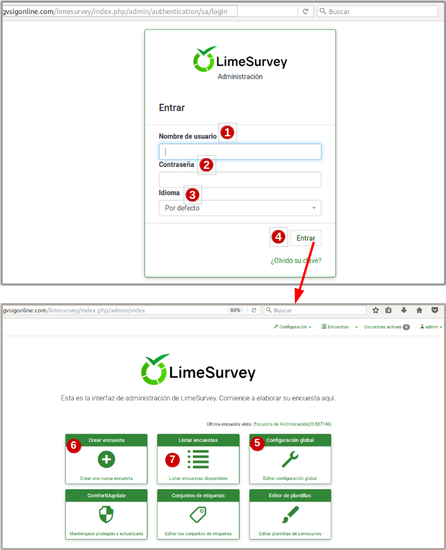
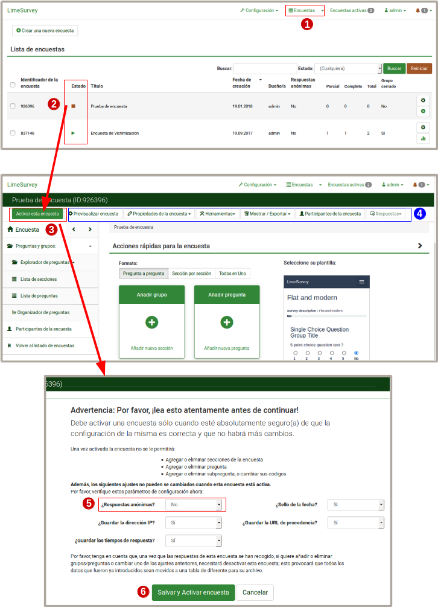
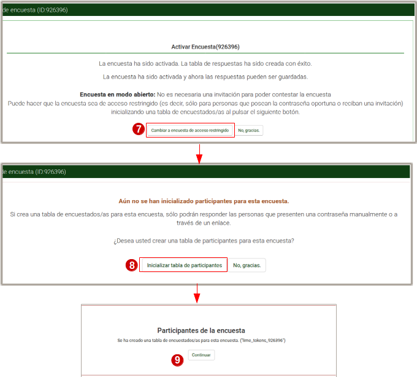
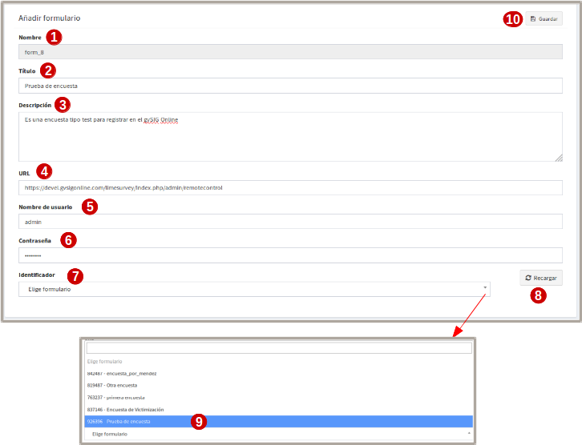
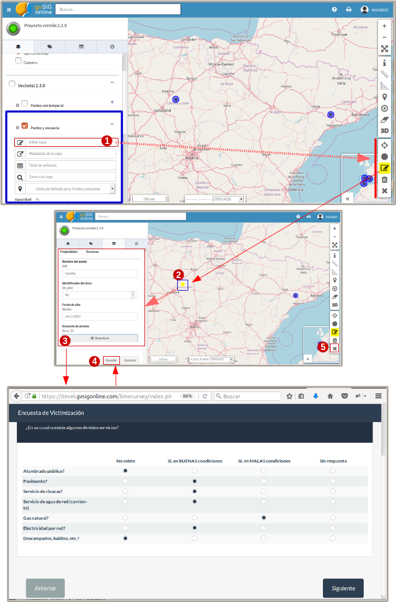

Plugin de pesquisa
===================

1. Introdução 
---------------

Este plugin visa vincular Recursos (alguma geometria) de nossas camadas vetoriais com levantamentos conduzidos através da plataforma LimeSurvey. 
Desta forma, o questionário pode ser associado a uma característica do mapa para estudos adicionais que possam ser necessários.

A plataforma LimeSurvey é independente da gvsigonline e a conexão entre ambas as plataformas é feita pelo administrador do sistema.

Segundo a wikipedia: "LimeSurvey (anteriormente PHPSurveyor) é uma aplicação open source para a aplicação de pesquisa online, escrita em PHP e usando bancos de dados MySQL, PostgreSQL ou MSSQL. Este utilitário oferece a possibilidade aos utilizadores sem conhecimentos de programação o desenvolvimento, publicação e recolha de respostas dos seus inquéritos.

As pesquisas incluem ramificações de condições, modelos e design personalizado usando um sistema de modelo web, e fornece utilitários de análise estatística básica para o tratamento dos resultados obtidos. Os questionários podem ter acesso público e acesso estritamente controlado aos tokens atribuídos a cada pessoa que participa no questionário. Além disso, os resultados podem ser anônimos, separando os dados dos participantes dos dados que eles fornecem, mesmo em pesquisas controladas".

2. Requisitos para vincular pesquisas a recursos de camada única
----------------------------------------------------------------
* 2.1 Criar um questionário mínimo na plataforma Limesurvey

* 2.2 Levantamento do registo em gvsigonline

* 2.3 vincular o questionário a uma camada gvsigonline

2.1 Criar um questionário na plataforma Limesurvey
__________________________________________________

Você precisa criar um questionário:

* 2.1.1 Acessar a plataforma Limesurvey com nome de usuário e senha
* 2.1.2 Registar um questionário (definições básicas)
* 2.1.3 Ativar questionário

2.1.1 Acesse a plataforma Limesurvey com um nome de usuário e senha
~~~~~~~~~~~~~~~~~~~~~~~~~~~~~~~~~~~~~~~~~~~~~~~~~~~~~~~~~~~~~~~

O acesso à plataforma limesurvey é feito através da url da gvsigonline com a extensão para esta plataforma. As urls dependem da configuração de cada cliente.

.. list-table:: Autenticação em Limesurvey 
   :widths: 2 10 
   :header-rows: 1
   :align: left

    - seleção
     - Ação
   * - 1
     - Usuário que terá privilégios para criar/editar questionários
   * - 2
     - Digite a senha
   * - 3 
     - A plataforma permite selecionar diferentes idiomas
   * - 4
     - Leva-nos ao ambiente principal da plataforma. As seções relevantes são descritas
   * - 5 
     - Se for a primeira vez, são configuradas as opções gerais que se aplicam a todo o ambiente e a todos os questionários.
   * - 6
     - Faça login para registrar um novo questionário. Também é possível na barra de menu superior
   * - 7 
     - Entrada que mostra a lista de questionários que estão ativos ou não devem ser usados.         

.. nota::
   Neste manual não serão fornecidos detalhes sobre o manuseio específico da plataforma (limesurvey). Indicará os itens mais relevantes e necessários para interagir com a gvsigonline. 

Nesta interface você pode adicionar questionários (por blocos, questões, condições entre eles, etc.), exportá-los, salvá-los, editá-los, gerenciar a segurança, entre outros. Recomenda-se que o usuário revise o Manual_ da interface do Limesurvey.
 .. _Manual: http://manual.limesurvey.org/

2.1.2 Registrar um questionário (configurações básicas)
~~~~~~~~~~~~~~~~~~~~~~~~~~~~~~~~~~~~~~~~~~~~~~~~~~~~~~~~

É importante ter em mente que certas configurações são personalizadas de acordo com os requisitos ou necessidades de cada cliente.  A configuração de alguns parâmetros principais é descrita abaixo.

 
.. image:: ../_static/images/form2.png
   :align: center  

.. list-table:: Configuração básica para registro de questionário
   :widths: 2 15 
   :header-rows: 1
   :align: left

    * - Visualizar
     - Opções ativadas
   * - 1
     - Entrada principal que descreve a informação relacionada com o questionário:
     
       * Seleccionar idioma
       * O título (nome do estudo)
       * A descrição 
       * Alguma mensagem de boas-vindas (opcional)
       * Alguma mensagem de despedida (opcional) 
   * - 2
     - Entradas secundárias desdobráveis onde as configurações são ajustadas por seção.
   * - 2.1
     - Secção: "Opções gerais", ATIVAR:
     
       * pergunta por pergunta
       * As outras opções são por padrão, dependendo da configuração do administrador.
   * - 2.2
     - Secção: "Apresentação e navegação", ATIVADO:
     
       * Mostrar tela de boas-vindas
       * Mostrar tela de boas-vindas
       * Mostrar barra de progresso (opcional)
       * Carregar URL automaticamente quando o questionário terminar (opcional)
       * Carregar URL automaticamente quando o questionário terminar (opcional)
       * Mostrar nome e/ou descrição da secção: "Mostrar apenas o nome da secção (opcional)* Mostrar nome e/ou descrição da secção: 'Mostrar apenas o nome da secção (opcional)'
       * Mostrar o número e/ou código da pergunta: 'Ocultar ambos'
       * Outras opções desativadas ou ativadas conforme necessário.
   * - 2.3
     - Secção: " Controle de publicação e acesso ", ATIVADO: 
     
       * Mostrar o questionário ao público
       * Data e hora de início e tempo de expiração (quando a data de expiração do questionário será desativada para uso)
       * Outras opções desativadas (podem ser ativadas conforme necessário pelo administrador)
   * - 2.4
     - Secção: "Administração da notificação e dos dados", ATIVAR:
     
       * Carimbo da hora
       * Salvar endereço IP
       * Salvar a URL de origem (URL de referência)
       * Salvar medições de tempo
       * Habilitar modo de avaliação
       * Os participantes podem salvar e continuar mais tarde
       * Outras opções desativadas (podem ser ativadas conforme necessário pelo administrador)    
   * - 2.5
     - Secção: "Requeridos", ATIVAR:
     
       * Ativar a persistência da resposta para a mesma senha
       * Permitir várias respostas ou atualizar a existente para a mesma senha
       * Use o formato HTML para e-mails para usuários restritos
       * Enviar e-mails de confirmação
       * Respostas anónimas (OFF)
       * Permitir registro público (OFF)

Uma vez terminadas as configurações gerais, as seções dos grupos de perguntas são adicionadas e dentro delas cada uma das perguntas.

.. image:: ../_static/images/survey_grupo_secciones.png
   :align: center

Para cada grupo você pode definir a ordem das questões e a última pode ser apresentada em diferentes formatos, adicionar condições entre as diferentes questões, configurações gerais e avançadas independentemente.

.. image:: ../_static/images/survey_conf_gr_preguntas.png
   :align: center

2.1.3 Como ativar o questionário
~~~~~~~~~~~~~~~~~~~~~~

Depois de configurar as questões do questionário, é preciso ativar o questionário para poder usá-lo. 

Dependendo das necessidades do cliente, a pesquisa pode ser ativada anonimamente ou não. Neste caso, a opção de gerar uma lista de participantes é descrita, ou seja, não é anónima. 

É importante prestar atenção às especificações de como as diferentes opções para escolher vai funcionar, Limesurvey irá mostrá-lo de uma forma simples e clara. Por exemplo, quando o questionário é ativado, ele mostra as seguintes mensagens:

.. nota::
   Você deve ativar um questionário somente quando tiver certeza absoluta de que as configurações do questionário estão corretas e de que não haverá mais alterações. 
 
   Uma vez ativado, o questionário não será permitido:

    * Adicionar ou remover seções de questionário
    
    * Adicionar ou remover pergunta
    
    * Adicionar ou remover subquestões, ou alterar os seus códigos

   Observe que, depois que as respostas a este questionário tiverem sido coletadas, se quiser adicionar ou remover grupos/questões ou alterar uma das configurações anteriores, será necessário desativar este questionário; isso fará com que todos os dados que já foram inseridos sejam movidos para uma tabela diferente para seu arquivo.

.. list-table:: Ativar o questionário  
   :widths: 2 10 
   :header-rows: 1
   :align: left

     * Opção
     - Ação
   * - 1
     - Entrada 'Pesquisas': mostra a lista completa de pesquisas existentes.
   * - 2
     - Estado dos questionários, indicando quais estão ativos ou não. Clique aqui 
       
       no qual não está ativo e nos leva a outra janela
   * - 3
     - Clicar em 'ativar questionário' nos leva a outras opções para selecionar    
   * - 4
     - São as diferentes opções do inquérito em geral:
     
       * Pré-visualize o questionário, veja como os usuários o visualizam
       * Propriedades do questionário (configurações)
       * Ferramentas
       * Mostrar/exportar 
       * Participantes no questionário
   * - 5
     - Selecione, **Respostas anônimas : NÃO*** as outras opções podem ser 'SIM' ou opcional.     
   * - 6
     - Salvar e ativar questionários. Como as respostas não são anônimas, as seguintes configurações continuam a ser feitas
   * - 7
     - Mudar para pesquisa de acesso restrito (ler as condições que estão ativadas)
   * - 8
     - inicializar a tabela de participantes
   * - 9
     - Ao dar "continuar", o questionário estará ativo para poder realizá-lo* 
              

2.2 Cadastre-se no gvSIG Online
______________________________________

Uma vez concluída a definição da pesquisa no sistema LimeSurvey, ela será registrada no gvSIGOnline.   

.. image:: ../_static/images/form3.png
   :align: center

.. list-table:: Entrada de questionário no menu online do gvSIG
   :widths: 2 10 
   :header-rows: 1
   :align: left
   
 * Opção
     - Ação
   * - 1
     - A partir do painel de controlo, na entrada do menu **Tipo de dados**, encontramos a opção **" formulários "**". 
     
       onde as pesquisas registradas na plataforma são mostradas.
   * - 2
     - a partir dessa opção, abre-se uma exibição para preencher os parâmetros de registro e, assim, adicionar o questionário.
   * - 3
     - Como sempre, podemos adicionar, editar e apagar.
   

Os seguintes parâmetros são necessários para inserir ou registrar um novo questionário:

   

.. list-table:: Cadastre-se no gvSIG Online
   :widths: 2 10 
   :header-rows: 1
   :align: left

   * Opção
     - Ação
   * - 1
     - Nome***, gerado automaticamente pelo sistema para evitar duplicidade
   * - 2
     - Título***, Nome pelo qual o inquérito é registado e depois referenciado.
   * - 3
     - Descrição***, Comentários ou breve resumo do inquérito
   * - 4
     - URL***, endereço web para o API-rest do serviço LimeSurvey (geralmente o 
     
       ao serviço ao qual é adicionado "/admin/remotecontrol"). 
       
       Por exemplo: https://<url_limesurvey>/limesurvey/index.php/admin/remotecontrol 
   * - 5
     - Nome de usuário***, usuário administrador acessando LimeSurvey
   * - 6
     - Senha***, senha associada à conta de usuário
   * - 7
     - Identificador***, Caixa onde é apresentada a lista de inquéritos disponíveis.
   * - 8
     - Recarregar***, para visualizar as pesquisas *identificadoras* devem ser clicadas
     
       neste botão *reload* e exibirá automaticamente os questionários existentes 
       
       relacionado à URL especificada. Se a recarga não estiver correcta, por favor rectifique a
       
       passos **4***, **5*** e **6***.
   * - 9
     - selecionar pesquisa
   * - 10
     - Gravar modificações. muito
       
       

2.3 Vincular o questionário a uma camada gvsigonline
__________________________________________________

2.3.1 Vincular o levantamento a uma camada criada a partir do sistema
~~~~~~~~~~~~~~~~~~~~~~~~~~~~~~~~~~~~~~~~~~~~~~~~~~~~~~~~~~

Quando você cria uma camada vazia, um novo tipo de campo aparecerá (junto com inteiros, texto, booleano, enumerações, ...) que será o campo formulários/pesquisas (Form).

Ao seleccioná-lo, deve indicar o inquérito registado no passo anterior ao qual nos estamos a referir.

.. image:: ../_static/images/form5.png
   :align: center

.. list-table:: Adicionar campo de questionário/formulário a uma camada vazia
   :widths: 2 10 
   :header-rows: 1
   :align: left

   * Opção
     - Ação
   * - 1
     - Ao criar uma camada vazia, ao adicionar um 'campo', é necessário selecionar o tipo de dados 'formulário'.
   * - 2
     - Ao selecionar o tipo de dados 'formulário', outra caixa drop-down é ativada para que o usuário selecione
     
       um dos inquéritos disponíveis; neste caso, é indicado o "título" do inquérito 
       
       registrado no gvSIG Online, finalmente, as mudanças são salvas.
   * - 3
     - Salva o novo campo 'formulário', na lista de todos os campos, ele é mostrado com o nome:
     
       form_5****, que é o nome que criou o sistema por padrão e não o título. Finalmente termina
       
       para publicar a camada, e desta forma a pesquisa será ligada a uma camada Online.
       

2.3.2 Vincule o questionário a um shapefile (antes do upload) ou a uma camada que já esteja armazenada no banco de dados
~~~~~~~~~~~~~~~~~~~~~~~~~~~~~~~~~~~~~~~~~~~~~~~~~~~~~~~~~~~~~~~~~~~~~~~~~~~~~~~~~~~~~~~~~~~~~~~~~~~~

   Se quiser vincular um questionário a uma camada que não é criada vazia no sistema gvsig Online, proceda de maneira diferente antes que a camada seja publicada no sistema, ou seja, você pode configurar o shapefile antes de exportá-lo para o DB ou editar diretamente a tabela uma vez exportada para o DB store.
   
     * Uma vez que o questionário é registrado no sistema, a partir do Shapefile é possível adicionar um campo com tipo de dados: 'chararter varying', e o nome seria exatamente igual ao nome padrão que é gerado para o questionário, Exemplo: 'form_6'. **Finalmente, o shapefile é carregado para o 'gerenciador de arquivos', exportado para o DB e publicado no sistema.
   
     * uma vez que o levantamento é registrado no sistema e o shp é exportado para o DB, a partir daí a tabela é editada (diretamente no banco de dados), o campo: 'chararter varying' e o nome padrão do levantamento são adicionados. **Finalmente a camada é publicada no sistema.
   
   Em ambos os casos, quando a camada é publicada, o sistema reconhece o campo para se referir ao questionário. 
  

.. nota::
   Para poder editar uma tabela do armazém de DB é necessário ter privilégios sobre la DB, que devem ser solicitados ao administrador do sistema. 
   
    A maneira mais fácil de evitar tocar no DB é preparar o Shapefile antes de exportá-lo para o DB. 

2.3.3.3 Comece a responder à consulta
~~~~~~~~~~~~~~~~~~~~~~~~~~~~~~~~~~~~~~

Quando a camada for publicada, você poderá inserir recursos, modificar/editar e excluir como qualquer outra camada vetorial, apenas com a diferença de que o campo definido como o tipo 'formulário' será um botão que abrirá uma aba no navegador com uma nova instância do questionário e o associará a essa característica da camada.

.. nota::
   Para ativar o questionário e começar a responder, é necessário editar a camada, selecionar o recurso associado ao questionário e clicar no campo 'formulário' que é exibido no painel de conteúdo. Consulte os passos abaixo:
   

.. list-table:: Adicionar campo de questionário/formulário a uma camada vazia
   :widths: 2 10 
   :header-rows: 1
   :align: left

  * Opção
     - Ação
   * - 1
     - A partir do projeto onde a camada com o levantamento associado é publicada, ative a camada, abra a janela
     
       e ativar **'Editar camada'**, isto abrirá uma caixa com as ferramentas de edição e o botão
       
       as características mudarão para uma tonalidade azul.
   * - 2
     - Se você ativou a ferramenta de edição **'Editar Elemento' **, clique na característica de interesse e
     
       será selecionado automaticamente em amarelo e o painel de detalhes se abrirá à esquerda. 
       
       com os campos a serem editados do elemento
   * - 3 
     - Clique na caixa **'show form'** (*Ver formulário*), que é o campo *tipo de formulário* que 
     
       links para a pesquisa. Outra guia abrirá automaticamente no navegador onde o questionário é exibido.
       
       questionário a ser respondido. Será possível terminar ou guardar e continuar com as respostas mais tarde.
   * - 4
     - Quando terminar ou pausar o questionário a ser concluído mais tarde, você voltará ao projeto e fará 
     
       **Clique em save changes***, desta forma as respostas associadas ao elemento do mapa serão 
       
       registrado corretamente.
   * - 5
     - Ao terminar os questionários relacionados à camada, você estará pronto, **terminando a edição da camada***.      
  

3. Pausar ou cancelar a subscrição de uma pesquisa do LimeSurvey
-----------------------------------------------------

* Se o questionário for interrompido, escolha SEMPRE a opção 'desativar' se deseja utilizar mais tarde (se não, mesmo que esteja ativado, não será válido e não será possível recuperar as respostas).

* Quando um inquérito é activado:

  * No primeiro painel, coloque respostas anônimas para 'NÃO', o resto opcional.
  * Clique no botão 'Alterar questionário para modo restrito'.
  * Clique no botão 'Iniciar tabela de participantes'.
