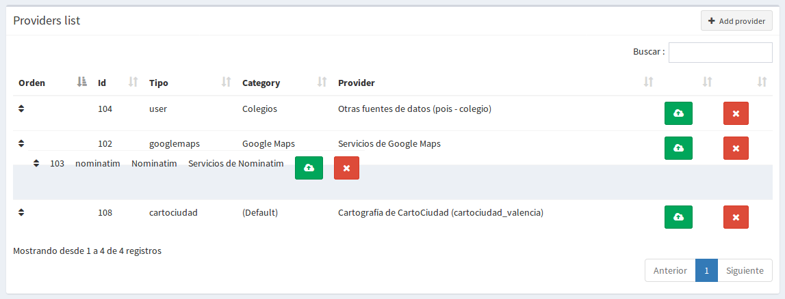
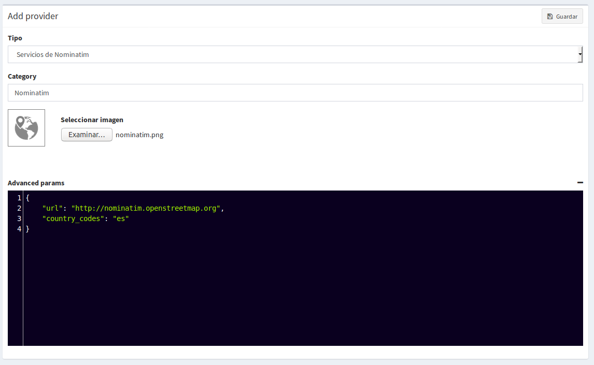
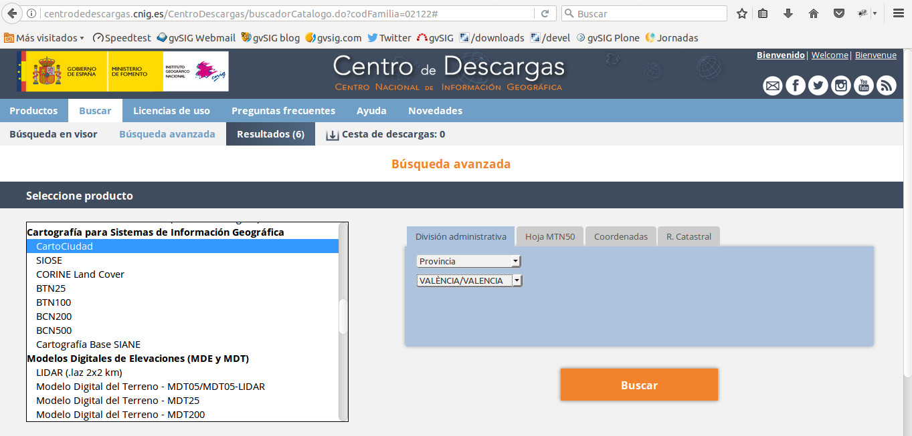

Geocodificação
==============

Introdução
------------

O geocoder permite procurar lugares e os localizam no mapa.

Após a entrada da cadeia de pesquisa, é exibida uma lista de possíveis candidatos. 

.. image:: ../_static/images/search_1.png
   :align: center
   

Teremos que selecionar um desses candidatos e, em seguida, o mapa se focalizará em sua localização.

.. image:: ../_static/images/geocoding_find.png
   :align: center
   
   
Há também a possibilidade de geocodificação reversa (descubra a direção marcando uma posição no mapa). Para fazer isso, basta clicar com o botão direito do mouse no ponto do mapa do qual você deseja obter o endereço. 

Dependendo dos fornecedores disponíveis, haverá mais ou menos opções:

.. image:: ../_static/images/geocoding_reverse.png
   :align: center

Conhecendo o geocoder
----------------------------
   
O plugin de geocodificação permite definir até 4 tipos diferentes de serviços, bem como configurá-los e estabelecer a ordem de prioridade na qual os resultados serão mostrados entre eles.

Em todas elas pode indicar uma categoria (para incluir os resultados desse fornecedor num separador) e pode atribuir-lhes um ícone que marcará cada uma das sugestões propostas. Em seguida, dependendo das características de cada um deles, alguns parâmetros serão necessários para o funcionamento:

.. image:: ../_static/images/search_2.png
   :align: center

Serviços Nominatim
----------------------

Nominatim  é o mecanismo de busca de dados do OpenStreetMap. 

Embora o serviço web seja acessado através da url que aparece em 'Advanced Settings', é permitido configurá-lo caso ele mude.
 
Outro dos aspectos editáveis é a possibilidade de limitar os resultados a uma zona indicando o seu country_code nos 'Parâmetros avançados' ('is' para Espanha, por exemplo).

 
Serviços do Google Maps
------------------------

Você também pode adicionar o mecanismo do Google Maps como um provedor de pesquisa.

Entre seus parâmetros específicos, as rotas para os serviços são definidas por padrão (caso mudem, podem ser editadas). 

Também requer uma chave Google que dê acesso aos serviços do Google (mais informações na API/Key do Google: https://developers.google.com/maps/documentation/javascript/get-api-key)

.. image:: ../_static/images/google.png
   :align: center 

Serviços de CartoCidade
------------------------

O CartoCidade oferece a possibilidade de descarregar a cartografia por regiões e poder adicioná-la como fornecedor de dados. Para isso, acesse o site oficial do Centro Nacional de Informações Geográficas (CNIG) e entre no seu Download Center_. 

 .. _Downloads: http://centrodedescargas.cnig.es/CentroDescargas/buscadorCatalogo.do?codFamilia=02122

- Marcar no *selecionar produto* 'CartoCidade' e em *Divisão administrativa*, 'Províncias'. Marcar a opção desejada e faça o download do ZIP.

- Uma vez baixados e descomprimidos, os recursos com suas extensões (.shp; .dbf y .shx) serão carregados no gvsigOnline através do *Administrador de archivos*:
  
  - road_strech; 
  - portal_pk
  - municipio_vial.dbf (Não tem .shp)
  - toponimo (**esta camada é opcional para usar, depende das pastas baixadas por província pode conter ou NÃO este arquivo**)

  
  
-  Depois eles serão levados a um DB *gerenciador de arquivos* através da opção 'Exportar para o banco de dados' de cada arquivo com extensão (.shp), no qual o mesmo nome de arquivo será marcado (sem a extensão) **em minúsculas**. A *codificação de caracteres* será: 'autodetecção' e o *sistema de coordenadas*: 'ETRS89 LatLon'

.. image:: ../_static/images/centro_descargas_4.png
   :align: center

.. image:: ../_static/images/centro_descargas_5.png
   :align: center

.. nota:: 
   O sistema de referência selecionado será aquele que traz por padrão as camadas baixadas do CNIG em seu arquivo com extensão *.prj*.

Uma vez realizada esta tarefa, será necessário carregar a cartografia das regiões da Espanha e os limites provinciais, pelo que terá de repetir o processo com os seguintes passos:

- No Download Centre_., selecione em produtos *Informação geográfica de referência*: 'Linhas de demarcação municipal' e procure em *divisão administrativa*  a província, município o comunidade que deseja..

.. image:: ../_static/images/centro_descargas_2.png
   :align: center

- Descarregue o ZIP da secção 'Línhas de demarcação municipal'

.. image:: ../_static/images/centro_descargas_3.png
   :align: center

- O arquivo compactado baixado contém várias pastas, das quais usaremos somente as duas seguintes:

  - **recintos_municipales_inspire_peninbal_etr89**
  - **recintos_provinciales_inspire_peninbal_etr89**

- Carregue no 'File Manager' a camada que contém cada pasta com suas respectivas extensões (.shp; .dbf e .shx).
  
- Da pasta **recintos_municipales_inspire_peninbal_etr89** iremos exportar para o DB el ficheiro (.shp) com o nome '**municipio**', *Codificação de caracteres*: 'autodetectar' e *sistema de coordenadas*: 'ETRS89 LatLon'
- e da pasta **recintos_provinciales_inspire_peninbal_etr89**, vamos exportar a DB o outro arquivo (.shp) com o nome '**provincia**', *Codificação de caracteres*: 'autodetectar' e *sistema de coordenadas*: 'ETRS89 LatLon'
  
.. nota::
   Tanto as camadas anteriores como as das "linhas de fronteira municipais" devem ser exportadas no mesmo armazém da base de dados e não é necessário torná-las públicas no visualizador de mapas.  
  
- Finalmente, para registrar o provedor, entrar com a entrada do menu **Geocoding** do menu e escolher o *tipo de provedor*: 'Cartografía de CartoCidade', será necessário indicar o armazém de dados no queal todas as camadas indicadas foram exportadas.

.. note::
   Quando este provedor Cartocidade é adicionado, *não* há possibilidade de selecionar um ícone, pois eles têm o seu próprio para identificar as ruas, nomes de lugares, municípios e outras entidades que são indexados através deste serviço.

- Uma vez que o provedor tenha sido registrado corretamente, ele é redirecionado para a página que permite que os dados sejam carregados no sistema. Há duas opções:

  - **Carga completa**: apaga os dados anteriores desse provedor (se houver) e os carrega novamente.
  - **Carga parcial**: Carrega somente as entidades atualizadas desde a última vez que foram carregados dados (as entidades excluídas não serão excluídas, somente as atualizadas).
 

  
Outros serviços ao usuário
---------------------------

Por outro lado, outros resultados de nossas próprias camadas podem ser incluídos no geocoder.

.. nota::
   É necessário que a camada tenha sido publicada em algum projeto - geoportal.

   
A especificar:   

  - O espaço de trabalho
  - O depósito de dados
  - A camada a ser incorporada no geocoder
  - Um campo que identifica de maneira unívoca (ou seja, que não existem dois iguais) cada elemento a ser pesquisado.
  - Um campo que identifica univocamente (ou seja, que não existem dois iguais) cada elemento a ser pesquisado.
  - O nome do campo que contém a geometria
    
Como foi o caso dos serviços Cartocidade, uma vez definido o provedor, será necessário fazer uma carga total dos dados para que o geocoder comece a incluí-los nos resultados da busca.
  
