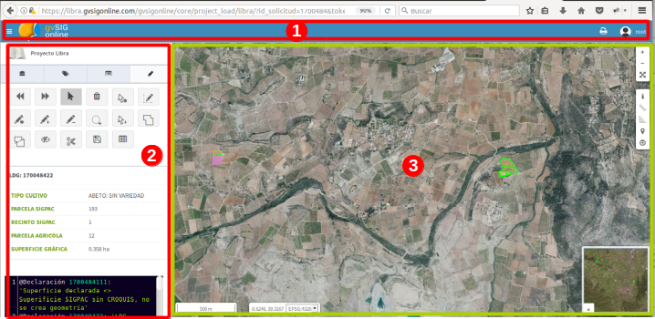
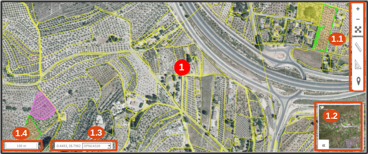
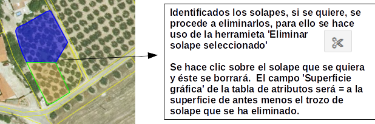

Libra
=====

Libra
=====

1. Introdução
---------------

Libra é a interface gráfica que se conecta diretamente com AGRORED para poder atribuir por meio da captura gráfica os esboços ou geometrias que correspondem a cada uma das Linhas de declaração gráfica que se referem a um pedido de pagamento único solicitado por um agricultor ou criador de gado.

1.1 Objetivo
____________

Este manual tem como objetivo descrever o manuseio e operação das ferramentas para a captura gráfica de pedidos definidos em AGRORED.

Glossário de termos e acrônimos
_____________________________________

**Tradução: Equipa PT-Subs Sincronização: ßÇÈââÈÈââ

* SIGPAC: Sistema de Informação Geográfica das parcelas agrícolas

* LIBRA: Linhas Básicas de Recintos Agrícolas

* PAC: parcelas agrícolas

* PU: Pagamento Único

* LDG: Linha de Declaração Gráfica, também conhecida como "cultivo".

**Tradução: Equipa PT-Subs Sincronização: ßÇÈââÈÈââ

* AGRORED:** Aplicativo de Captura de Aplicativo de Pagamento Único (PU) CAP.

Recinto SIGPAC***: superfície contínua de terra, dentro de uma parcela, com a mesma utilização agrícola estável (terras aráveis, pastagens, vinhas, olivais, etc.).

* Cultivo:** superfície contínua de terra, dentro de um recinto, para a qual é pedido o pagamento único. É sinónimo de LDG.

* Aplicação para o AGRORED:** cada uma das aplicações feitas por uma pessoa física ou jurídica através do AGRORED. Em uma aplicação, são definidos vários recintos SIGPAC que, por sua vez, contêm uma ou mais culturas.

* Cada uma das áreas contínuas de terra que são declaradas com a mesma cultura principal (e secundária se aplicável) num recinto SIGPAC.

* Geometria:** Representação gráfica da superfície declarada. É um atributo das linhas de declaração gráfica.

* Editor gráfico:** Conjunto de ferramentas para a definição de geometrias associadas a LDGs.

* Quadro de registos (quadro de atributos ou grelha alfanumérica): ** quadro que mostra a informação alfanumérica de cada LDG e correspondente a cada uma das culturas definidas numa aplicação AGRORADA.

2. Descrição do editor gráfico
---------------------------------

O editor gráfico permite editar, atualizar e adicionar nova geometria associada a um LDG.

2.1 Vista geral do editor gráfico
____________________________________

A vista geral é a área de trabalho a partir da qual será feita a edição gráfica das geometrias para cada aplicação única.

.. list-table:: Visão geral do editor gráfico 
   :widths: 2 10 
   :header-rows: 1
   :align: left

   * - Opção
     - Descrição do produto
   * - 1
     - Barra de menu principal
   * - 2
     - Painel de conteúdo
   * - 3
     - Área do mapa
     
     
2.2 Barra de menu principal
___________________________

.. image:: ../_static/images/libra_online_2.png
   :align: center

.. list-table:: Descrição da barra de menu principal
   :widths: 2 10 
   :header-rows: 1
   :align: left

   * - Opção
     - Descrição
  * - 1
     - Botão para mostrar/ocultar o painel de conteúdos
   * - 2
     - Logotipo do sistema (pode ser personalizado conforme solicitado pelo cliente)
   * - 3
     - Menu do usuário (somente para administradores de sistema)
      
       **3.1***: Nome e e-mail do usuário conectado
       
       3.2****: Idioma
       
       3.3****: Opção para ir à vista principal do administrador
       
   * - 4
     - Sair para o usuário conectado.        

  
2.3 Detalhes do painel de conteúdo
___________________________________
 
O painel de conteúdo consiste em várias abas contendo a árvore de camadas (TOC), a legenda/simbologia da camada, detalhes das informações do elemento selecionado e as ferramentas do editor gráfico.
 
2.3.1  Aba: 'arvore de camadas'
~~~~~~~~~~~~~~~~~~~~~~~~~~~~~~~~

.. list-table:: Painel de conteúdo - Arvore de camadas
   :widths: 2 10 
   :header-rows: 1
   :align: left

   * Opção
     - Descrição do produto
   * - 1
     - Ficha: Árvore de camadas
   * - 1.1
     - Camadas base que são configuradas a partir do painel do administrador.
     
       Neste caso há apenas uma camada ativa e padrão. 
       A camada ativa é do Plano Nacional de Ortofotografia Aérea (PNOA). 
       obtidos junto do Centro Nacional de Informação Geográfica (CNIG).
   * - 1.2
     - Grupo de camadas que pode conter muitas camadas, neste caso o grupo 
       tem apenas uma camada. Também é configurado a partir do Painel do Administrador do Sistema
   * - **1.2.a**
     - Camada publicada a partir do painel de administração, neste caso para o editor gráfico basta 
       têm a camada vectorial que contém todas as geometrias dos recintos.
   * - **1.2.b**
     - Propriedades específicas para cada camada:
     
       - Metadados:** Resumo das informações da camada (configurado quando a camada é publicada a partir do painel de administração)
       
       - Zoom para camada:** executa e mostra o zoom geral de todas as geometrias contidas na camada no mapa.
       
       - Altere o estilo da simbologia***: isto se você tiver definido anteriormente mais de um estilo no painel de administração.
      
       - Opacidade***: a porcentagem de opacidade pode ser configurada como desejado e o usuário precisa da análise entre várias camadas.

2.3.2  Aba: 'Legenda'
~~~~~~~~~~~~~~~~~~~~~~~~~

.. image:: ../_static/images/libra_online_4.png
   :align: center

.. list-table:: Painel de conteúdo - Legenda
   :widths: 2 10 
   :header-rows: 1
   :align: left

   * Opção
     - Descrição do produto
   * - 2 
     - Aba: Legenda, mostra todas as simbologias das camadas ativas e visíveis da árvore de camadas.   
     * - 2.1
     - Neste caso, mostra a legenda do tipo poligonal, a cor da borda amarela e o preenchimento: nenhuma cor que represente as geometrias da camada de 'Recintos SIGPAC'.

2.3.3  : 'Detalhes'
~~~~~~~~~~~~~~~~~~~~~~~~~~

.. image:: ../_static/images/libra_online_5.png
   :align: center

.. list-table:: Painel de conteúdo - Detalhes
   :widths: 2 10 
   :header-rows: 1
   :align: left

   * Opção
     - Descrição do produto
   * - 3 
     - Aba 'Detalhes' 
   * - 3.1
     - Exibe informações detalhadas ligadas a uma geometria selecionada no mapa. Isto pode ser feito consultando a ferramenta 'Informação' (i) na área do mapa. 
     
2.3.4  Aba: 'Captura gráfica'
~~~~~~~~~~~~~~~~~~~~~~~~~~~~~~~~~

será o input mais utilizado durante a utilização do editor gráfico, onde estão localizadas as ferramentas para tratar os LDGs e suas informações.

.. image:: ../_static/images/libra_online_6.png
   :align: center

.. list-table:: Painel de conteúdo - Captura gráfica
   :widths: 2 10 
   :header-rows: 1
   :align: left

    * Opção
     - Descrição do produto
   * - 4 
     - Aba 'Captura Gráfica' 
   * - 4.1
     - Ferramentas para criação, edição, atualização e exclusão de geometrias correspondentes a LDGs  
   * - 4.2
     - Painel de informação rápida para LDGs selecionados no mapa
   * - 4.3
     - Painel de Log: oferece ao usuário informações como a geração automática de LDGs na pré-carga da solicitação.  

     
2.4 Detalhes da área de trabalho - (visualizador no mapa)
__________________________________________________

A visualização do mapa será a área de trabalho padrão que será aberta para o usuário AGRORED a fim de editar/adicionar geometrias aos LDGs.

.. list-table:: Detalhes da área de trabalho (vista do mapa) 
   :widths: 2 10 
   :header-rows: 1
   :align: left

   * Opção
     - Descrição do produto
   * - 1 
     - Acima da área do mapa, os níveis de base ativos e os níveis vetoriais serão exibidos. Também mostrará os LDGs e anexos disponíveis que estão associados à aplicação aberta naquele momento.
   * - 1.1
     - Ferramentas básicas do editor gráfico, tais como:
       
       * Ferramentas de zoom (mais, menos e projeto geral).
            
       Na caixa seguinte estão:

       * (a ferramenta "i" para consultar a informação rápida de uma geometria associada a uma camada do editor, neste caso será possível consultar os atributos das geometrias dos recintos.

       * Medir distância

       * Área de medida 

       * Localização de um ponto no mapa através de coordenadas geográficas ou planas.

       * Posição actual do utilizador através da localização GPS do dispositivo (tablet, computador) 
     
   * - 1.2
     - exibição de referência de uma área maior na qual o mapa visual está sendo trabalhado.
   * - 1.3
     - Mostra as coordenadas onde o cursor está colocado no mapa e pode seleccionar o sistema de referência geográfica mundial WGS-84 (4326) ou o ETRS-89 geográfico para a Europa (4258).
   * - 1.4
     - Indica a referência da escala gráfica.

3. Estilos gráficos
-------------------

Existem dois tipos de estilos gráficos, um para caixa e outro para LDGs

3.1 Estilos para LDGs:
______________________

O usuário possui estilos diferentes quando eles são selecionados, editados, com suas próprias sobreposições e outras solicitações.

3.1.1 LDGs próprios
~~~~~~~~~~~~~~~~~~

.. image:: ../_static/images/estilo_ldg_propia.png
   :align: center

- Bordas: verde claro (sem preenchimento de bordas)
- Preenchimento: castanho claro

* **Visualizar informações sobre a colheita selecionada**

A ferramenta está ativada: **'seleccione'** e, em seguida, clique no recorte, será apresentado um painel de informação rápida no lado esquerdo.

.. image:: ../_static/images/libra_select_ldg_info_rapida.png
   :align: center

Também é possível consultar com a ferramenta **'informação' ** ou abrindo a tabela de registros alfanuméricos com a ferramenta **'mostrar tabela'**.

3.1.2 LDGs - de outras aplicações já registadas
~~~~~~~~~~~~~~~~~~~~~~~~~~~~~~~~~~~~~~~~~~~~~~~~

.. image:: ../_static/images/estilo_ldg_otra_solic_registrada.png
   :align: center

- Borda: azul rei
- Preenchimento: azul rei con transparência

* **Veja informações sobre o MLG de outros aplicativos já registrados**

A ferramenta está ativada: **'seleccione'** e depois clique na colheita já registada de outra aplicação (cor azul) e será apresentado um painel de informação rápida no lado esquerdo.

.. image:: ../_static/images/libra_select_ldg_otra_soli_regis_info_rapida.png
   :align: center

Também pode consultar a ferramenta **'informação'**

3.1.3 LDGs - Selecionados
~~~~~~~~~~~~~~~~~~~~~~~~~~

.. image:: ../_static/images/estilo_ldg_seleccionada.png
   :align: center

- Borde: rosa claro
- Recheio: rosa claro con transparência

3.1.4 LDGs - Sobreposições 
~~~~~~~~~~~~~~~~~~~~

   
- Borda: vermelho
- Preenchimento: vermelho transparente 

* **Consultar informação sobre a área de sobreposição**

No caso de sobreposições, as informações sobre o nome, CIF/NIF e área sobreposta com outra aplicação também podem ser consultadas rapidamente. Você deve ativar a opção 'Selecionar', clicar na área de sobreposição e então o painel de informações será exibido no lado esquerdo.

3.2 Estilos de caixa
_________________________

Os anexos podem ter dois estilos, quando pertencem ou não à declaração gráfica ativa. 

3.2.1 Caixas - Todas visíveis ao abrir uma aplicação
~~~~~~~~~~~~~~~~~~~~~~~~~~~~~~~~~~~~~~~~~~~~~~~~~~~~~~~~~~

.. image:: ../_static/images/estilos_recintos_todos.png
   :align: center

-  Borda: Amarelo
-  Preenchimento: sem preenchimento

3.2.2 Caixas - Aqueles que pertencem a um aplicativo ativo
~~~~~~~~~~~~~~~~~~~~~~~~~~~~~~~~~~~~~~~~~~~~~~~~~~~~~~~~~~

.. image:: ../_static/images/estilo_recinto_activas.png
   :align: center

- Borda: Amarelo
- Preenchimento: Amarelo claro com transparência (quando o ponteiro é passado sobre ele) 
   
   
4. Pré-carga automática da LIBRA
----------------------------------

4.1 Casos na carga inicial de libra
______________________________________

Cada vez que uma aplicação é carregada, LIBRA solicita ao AGRORED o xml com as linhas de declaração da aplicação. Este xml é processado e verificado para cada linha de declaração nos seguintes casos:

4.1.1.1 O esboço existe:
~~~~~~~~~~~~~~~~~~~~~
 
Se a linha de declaração possui CROQUIS_WEB, o sistema a utiliza diretamente para criar e atribuir a mesma geometria à cultura. 

É possível que o CROQUIS_WEB contenha um WKT em estado ruim, neste caso a geometria é deixada vazia e o usuário é forçado a pintar a linha de declaração.

4.1.2 Não há nenhum esboço:
~~~~~~~~~~~~~~~~~~~~~~~~

Se a CROQUIS_WEB chegar vazia, a diferença entre a superfície declarada e a superfície SIGPAC é calculada, aqui podem existir dois casos:

*  **Sup. Declarada = Sup recinto SIGPAC:**

Se a diferença em valor absoluto for **inferior** ao limite de TOLERÂNCIA predefinido (actualmente 100 m2 ), presume-se que a superfície declarada = superfície SIGPAC e, por conseguinte, a linha de declaração é criada a partir do recinto SIGPAC, ou seja, que é atribuída uma geometria igual à do recinto SIGPAC.

*  **Sup declarada <> Sup recinto SIGPAC:**

Se a diferença no valor absoluto for **mais elevada*** do que o limite de TOLERÂNCIA predefinido ( atualmente 100m2 ), presume-se que a superfície declarada <> superfície SIGPAC e, portanto, a geometria é deixada vazia e o usuário é forçado a pintar a linha de declaração.

.. nota::
   Em todos os casos é verificado na cache do SIGPAC que existe o recinto associado à linha de declaração, se esta não existir (por reparcelamiento, ...), a linha de declaração não é criada directamente mostrando um aviso ao utilizador na consola de mensagens. 

4.2 Caixas com selecção de caixas
______________________________________

De AGRORED você pode selecionar uma ou mais salas do aplicativo para poder mostrar as linhas de declaração que elas contêm no LIBRA. Dependendo das divisões seleccionadas, ocorrem os seguintes casos:

* Se não forem selecionadas instalações na aplicação ou se as instalações selecionadas não estiverem disponíveis na cache SIGPAC, aparecerá uma mensagem no LIBRA indicando ao usuário que não há nemhum recinto selecionado. 

* Se forem selecionados anexos específicos do pedido, no LIBRA as linhas de declaração contidas nesses anexos serão mostradas no quadro de declarações e o resto dos anexos não selecionados será mostrado no mapa, embora não seja possível interagir com eles. Portanto, só será possível trabalhar com os locais selecionados.

* Se você selecionar todos os anexos da aplicação, todos eles serão carregados tanto no mapa como na tabela e você poderá trabalhar com todos eles.

5. Modificar LDGs existentes
----------------------------
Quando a declaração gráfica ativa tem associada uma geometria, é possível realizar diferentes ações como adicionar/remover superfície, unir-se a outro LDG, dividi-los, entre outras.

5.1 ADICIONAR superfície
_____________________
Várias ferramentas podem ser usadas para adicionar superfície:

5.1.1 Com a ferramenta 'Adicionar peça digitalizada ao LDG selecionado' |tool4|de ferramentas
~~~~~~~~~~~~~~~~~~~~~~~~~~~~~~~~~~~~~~~~~~~~~~~~~~~~~~~~~~~~~~~~~~~~~~~~~~~~~~~~~~~
.. |ferramenta4| image:: ../_static/images/6_anyad_troz_dig.png

.. |ferramenta1| image:: ../_static/images/1_select.png

.. |ferramenta2| image:: ../_static/images/16_tabla_atributos.png

.. |ferramenta3| image:: ../_static/images/14_guardar.png

.. list-table::  Adicionar peça digitalizada ao LDG selecionado
   :widths: 2 10 
   :header-rows: 1
   :align: left

   * - Selección
     - Acción
   * - 1-'Seleccionar'|herramienta1|
     - Al activar el botón, se pincha sobre la LDG que se quiere editar. Ésta cambiará a color rosado.
   * - 2-Otra opción:
   
       'ver tabla'|herramienta2|  
     - Se abre la tabla de registros, se ubica el que quiere editarse y se pincha sobre el mismo.
     
       Éste registro se cambiará a un fondo color rosa, igual que la LDG sobre el mapa
   * - 3-'Añade trozo digitalizado
    
       a LDG seleccionada'
        
       |herramienta4|
     - Se digitaliza el área del recinto que se quiere añadir a la LDG seleccionada.
   * - 4-Cerrar/terminar
     
       área digitalizada
     - Al finalizar el área digitalizada, resulta una nueva LDG, que es la suma de la LDG seleccionada más zona digitalizada. 
     
       Estará limitada por los lados digitalizados, los del recinto SIGPAC y las otras LDGs propias.
   * - 5-Guardar cambios
   
       |herramienta3|
     - Saldrá un mensaje indicando: 'se han guardado los cambios con éxito'. Cuando se guarden los cambios, 
     
       en la tabla de registros, el campo 'Superficie gráfica' se debe actualizar con el nuevo valor del área de la LDG resultante.
       
       La 'superficie declarada' se deberá actualizar en el grid alfanumérico de Agrored  una vez se hayan guardado los cambios 
       
       realizados en el editor gráfico.

* Añadiendo trozo digitalizado (azul) sobre LDG seleccionada (rosado).

.. image:: ../_static/images/libra_anyad_troz_dig_select1.png
   :align: center

* LDG resultante:

.. image:: ../_static/images/libra_anyad_troz_dig_select2.png
   :align: center

   
   
5.1.2 Con herramienta 'modificar cultivo' - Edición de vértices |herramienta5|
~~~~~~~~~~~~~~~~~~~~~~~~~~~~~~~~~~~~~~~~~~~~~~~~~~~~~~~~~~~~~~~~~~~~~~~~~~~~~~
Esta herramienta es usada para realizar pequeños ajustes en la superficie.
 
.. |herramienta5| image:: ../_static/images/4_modificar_cultivo.png

.. list-table::  Modificar Cultivo (edición de vértices)
   :widths: 2 10 
   :header-rows: 1
   :align: left

     - Seleção
     - Ação
   * 1-'Selecionar'|ferramenta1|
     - Quando você ativar o botão, clique no LDG que deseja editar. Isto vai mudar para rosa.
   * - 2-Outra opção:
   
       'ver tabela'|ferramenta2| 
     - Abrir a tabela de registros, localizar o que se deseja editar e clicar sobre ele.
     
       Este registo será alterado para um fundo rosa, o mesmo que o LDG no mapa.
   * - 3-'Adicionar peça digitalizada
    
       um LDG selecionado'
        
       |ferramenta4|
     - A área do compartimento a ser adicionada ao LDG selecionado é digitalizada.
   * 4-fechamento/acabamento
     
       área digitalizada
     - No final da área digitalizada, um novo LDG resulta, que é a soma do LDG selecionado mais a área digitalizada. 
     
       Ele será limitado pelos lados digitalizados, os do gabinete SIGPAC e os outros próprios LDGs.
   * - 5-Salvar alterações
   
       |Ferramenta3
     - Aparecerá uma mensagem indicando: "as alterações foram guardadas com êxito". Quando as modificações são gravadas, 
     
       na tabela de registos, o campo "Superfície gráfica" deve ser actualizado com o novo valor da área LDG resultante.
       
       A "superfície declarada" deve ser actualizada na grelha alfanumérica Agrored uma vez guardadas as alterações. 
       
       feito no editor gráfico.

* Adicionar uma peça digitalizada (azul) sobre o LDG selecionado (rosa).
  
* Ativar a edição de vértices - Modificar recorte

.. image:: ../_static/images/libra_modificar_cultivo1.png
   :align: center
           
* Vértices editados (Superfície modificada)

.. image:: ../_static/images/libra_modificar_cultivo2.png
   :align: center
 
5.1.3 Com a ferramenta 'adicionar espaço livre ao LDG selecionado'|ferramenta6|
~~~~~~~~~~~~~~~~~~~~~~~~~~~~~~~~~~~~~~~~~~~~~~~~~~~~~~~~~~~~~~~~~~~~~~~~~~~~~~
        
.. |herramienta6| image:: ../_static/images/9_anyad_spcio_libr.png    

Esta ferramenta é utilizada para adicionar todo o espaço livre disponível no recinto a uma das suas culturas seleccionadas.

.. list-table::  Adicionar espaço livre ao LDG selecionado
   :widths: 2 10 
   :header-rows: 1
   :align: left

   * - Seleção
    - Ação
   * 1-'Selecionar'|ferramenta1|
     - Quando você ativar o botão, clique no LDG que deseja editar. Isto vai mudar para rosa.
   * - 2-Outra opção:
   
       ver tabela'|ferramenta2|
     - Abrir a tabela de registros, localizar o que se deseja editar e clicar sobre ele.
     
       Este registo será alterado para um fundo rosa, tal como o LDG no mapa.
   * - 3-'Adicionar espaço
       
       livre para LDG selecionado'.
       
       |ferramenta6|
     - Tocar na área vazia que está disponível na caixa
   * 4-Seleção de
       
       área vazia
     - Como resultado, um novo recinto é gerado, que será a soma do LDG selecionado mais o LDG 
     
       espaço livre disponível que foi tocado da caixa SIGPAC.
     
   * - 5-Salvar alterações
   
       |Ferramenta3|     
     - Aparecerá uma mensagem indicando: 'as alterações foram guardadas com êxito'. Na tabela de protocolo, 
     
       o campo 'Superfície gráfica' do LDG modificado tomará o valor da nova superfície resultante.
   
           
* Adicionando espaço livre no gabinete a uma cultura selecionada    

   
* Espaço livre adicionado ao LDG

5.2 Remoção da superfície
_____________________

Existem duas formas de remover ou diminuir a área de uma cultu

     
5.2.1 Com ferramenta 'modificar recorte' - Editar vértices |ferramenta5|
~~~~~~~~~~~~~~~~~~~~~~~~~~~~~~~~~~~~~~~~~~~~~~~~~~~~~~~~~~~~~~~~~~~~~~~~~~~~~~
 
Conforme detalhado acima, esta ferramenta também é usada para fazer pequenos ajustes na superfície.

5.2.2 Com ferramenta 'Remover peça digitalizada para cultura'  |ferramenta7|
~~~~~~~~~~~~~~~~~~~~~~~~~~~~~~~~~~~~~~~~~~~~~~~~~~~~~~~~~~~~~~~~~~~~~~~~~~~

.. list-table::  Remover peça digitalizada para cultura
   :widths: 2 10 
   :header-rows: 1
   :align: left

   * - Seleção
     - Ação
   * 1-'Selecionar'|ferramenta1|
     - Quando você ativar o botão, clique no LDG que deseja editar. Isto vai mudar para rosa.
   * - 2-Outra opção:
   
       'ver tabela'|ferramenta2|  
     - Abrir a tabela de registros, localizar o que se deseja editar e clicar sobre ele.
      
       Este registo será alterado para um fundo rosa, tal como o LDG no mapa.
   - 3-'Remover peça
       
       Dig. a cultivo'|ferramenta7|
     - Desenhe a área que deseja remover sobre o LDG selecionado. 
   * 4-Fechar/Fim
       
       área digitalizada
     - Quando você terminar de digitalizar a área a ser removida, uma cultura de área menor será gerada, 

       como resultado da diferença entre o LDG selecionado menos a área removida.
   * - 5-Salvar alterações 
   
       |Ferramenta3|
     - Aparecerá uma mensagem indicando: "as alterações foram guardadas com êxito". Na tabela de protocolo, 
     
       o campo 'Superfície gráfica' do LDG modificado tomará o valor da nova superfície resultante.  
  
        
* Remover peça digitalizada para cultura selecionada
.. image:: ../_static/images/libra_quitar_trozo_ldg_seleccionada_1.png
   :align: center

* Nova cultura gerada pela subtração/remoção da área digitalizada
.. image:: ../_static/images/libra_quitar_trozo_ldg_seleccionada_2.png
   :align: center    
 
   
5.3 Agrupar das culturas  |ferramenta8|
_____________________________________

.. |herramienta8| image:: ../_static/images/10_juntar_cultivos.png   
 
Com esta ferramenta é possível juntar dois LDGs que pertencem ao mesmo recinto num único registo da grid alfanumérica.

.. list-table::  Agrupar culturas
   :widths: 2 10 
   :header-rows: 1
   :align: left

   * - Seleção
     - Ação
   * 1-'Selecionar'|ferramenta1|
     - Seleccione uma nova cultura (clicando na geometria no mapa) e mantenha premida a tecla 'shift'. 
     
       a segunda colheita é seleccionada (clicando na geometria no mapa). Ambos os LDGs devem pertencer ao mesmo gabinete.     
   * 2-Outra opção:
   
      'ver tabela'|ferramenta2|  
     - A tabela de registros é aberta, o primeiro LDG é localizado e, mantendo pressionada a tecla 'maiúscula', o seguinte é selecionado
     
       a segunda colheita. Ambos os LDGs selecionados mudarão de rosa na grade alfanumérica como no mapa.
   * 3-'Agrupar culturas'|ferramenta8|
     - Se seleccionou ambas as culturas, clique no botão 'Juntar culturas' e elas irão juntar-se automaticamente. 
       
       em uma única geometria e tomará os atributos alfanuméricos do primeiro LDG selecionado e o campo de superfície gráfica
       
       será atualizado com o novo valor da área gerada. O registro do segundo corte será sem geometria associada e sup. gráfico =0
   * 4-Salvar alterações 
   
       |Ferramenta3|
     - Aparecerá uma mensagem indicando: "as alterações foram guardadas com êxito". Na tabela de registros, o campo 'Superfície gráfica'. 
     
       do novo LDG resultante, tomará o valor da soma das duas superfícies unidas.

 
 
*  Selecione dois LDGs para aplicar a ferramenta 'Agrupar culturas'  
.. image:: ../_static/images/libra_unir_cultivos_1.png
   :align: center       

*  Cultura resultante da união de dois LDGs
.. image:: ../_static/images/libra_unir_cultivos_2.png
   :align: center

 
5.4 Segregar LDG  |ferramenta9|
________________________________

.. |ferramenta9| image:: ../_static/images/11_segregar_ldg.png

Com esta opção é possível separar/dividir uma cultura em duas e assim gerar mais um registro na grade alfanumérica com o novo LDG segregado.

.. list-table::  Segregar cultura 
   :widths: 2 10 
   :header-rows: 1
   :align: left

   * - Seleção
     - Ação
   * 1-'Selecionar'|ferramenta1|
     - Quando o botão é ativado, o LDG a ser editado é clicado no mapa. Isto vai mudar para rosa.
   * - 2-Outra opção:
   
       ver tabela'|ferramenta2| 
     - Abrir a tabela de registros, localizar o que se deseja editar e clicar sobre ele.
     
       Este registo será alterado para um fundo rosa, tal como o LDG no mapa.
   * 3-'Segregar LDG' 
   
       |Ferramenta9|
     - Tendo escolhido a colheita, clique no botão 'segregar LDG' e continue a digitalizar em 
     
       a geometria selecionou a área a ser segregada.      
   * 4-fechamento/acabamento
       
       área digitalizada
     - No final da digitalização da área a ser destacada, a geometria da cultura selecionada é dividida da seguinte forma 
     
       em dois e seu campo superior. Gráfico = a área inteira menos a área digitalizada destacada. 
       
       Quando o LDG selecionado é segregado, outra linha com a nova cultura associada é gerada na tabela de registros. 
       
       à geometria digitalizada, em que o campo "SIGPAC Surface" deve ser igual ao campo "SIPAC Sup. 
       
       Cultura segregada, a "superfície gráfica" = a superfície da área digitalizada. Os outros atributos serão 
       
       vazio para ser preenchido através da tabela alfanumérica Agrupada.
   * - 5-Salvar alterações 
   
       |Ferramenta3|
     - Aparecerá uma mensagem indicando: "as alterações foram guardadas com êxito". Quando as modificações são gravadas, no
     
       o campo 'Superfície gráfica' do novo LDG tomará a superfície da geometria gerada. 

     
* Seleccione a cultura e, com a opção "segregar cultura", digitalize a área a separar:   
.. image:: ../_static/images/libra_segregar_cultivo_1.png
   :align: center

*  Cultivo dividido em dois, um novo registro é originado na tabela alfanumérica.     
.. image:: ../_static/images/libra_segregar_cultivo_2.png
   :align: center

6. Adição de novas geometrias em LDGs
-------------------------------------
As ferramentas de edição (adicionar, remover, juntar e dividir) são aplicadas a culturas que já têm uma geometria associada a elas. As ferramentas descritas abaixo aplicam-se a LDGs que ainda não têm uma geometria ligada, ou seja, irá detalhar como a partir do editor de gráficos uma geometria pode ser criada e atribuída a um recorte que está disponível dentro da tabela de registos.

6.1 Com a ferramenta 'Create new crop in the enclosure'  |ferramenta10|
________________________________________________________________________

Esta ferramenta é usada exclusivamente para invólucros que possuem uma única cultura disponível.

.. list-table:: Criar uma nova colheita no recinto
   :widths: 2 10 
   :header-rows: 1
   :align: left
   
   * - Seleção
     - Ação
   * 1-'visualizar tabela'|ferramenta2|
     - Quando a tabela de atributos (grid alfanumérica) é aberta, os LDGs disponíveis serão mostrados para adicionar a geometria. 
     
       Estes registros aparecerão na tabela de uma cor diferente daquelas que já possuem gráfico associado, serão de cor
       
       castanho claro. Clique em um deles e já estará selecionado para adicionar uma nova geometria.
   * 2-Selecionados
   
       LDG na tabela
     - Quando o registro é ativado, o fundo mudará para rosa, embora a sala onde ele pertence seja digitalizada. 
     
       a geometria da cultura, no mapa continua a ser com borda amarela e preenchimento amarelo claro.    
        
   * - 3-'criar novo
       
       LDG no recinto 'ferramenta10
     - Tendo seleccionado o recinto a partir da tabela de registos, pode activar o botão 'Criar nova colheita na tabela de registos'.
       
       e no mapa você clica na área do recinto vazio. Automaticamente o sistema gera uma geometria
       
       à cultura igual ao recinto, ou seja, área do recinto = à área gráfica do novo LDG criado.
   * - 4-Salvar alterações 
   
       |Ferramenta3|
     - Aparecerá uma mensagem indicando: "as alterações foram guardadas com êxito". Na tabela de registros, o campo 
      
       'Superfície gráfica' do novo LDG, tomará a superfície da geometria gerada que neste caso será 
       
       igual à superfície SIGPAC.

       
* Selecione caixa vazia na tabela de registros para adicionar geometria ao LDG

* Geometria atribuída a uma cultura vazia de um compartimento

.. image:: ../_static/images/libra_crear_nvo_cultivo_en_recinto_2.png
   :align: center 

6.2  Com a ferramenta 'Desenha um novo LDG'  |ferramenta11|
_________________________________________________________

Esta ferramenta 'desenhar novo LDG', ao contrário da anterior 'criar nova cultura', não está limitada ao compartimento contém uma única cultura, ou seja, esta ferramenta se aplica quando você quer gerar novas geometrias dentro de um compartimento que contém vários LDGs.

.. |ferramenta11| image:: ../_static/images/5_dib_nvo_cultiv.png

.. list-table:: Desenhar nova LDG
   :widths: 2 10 
   :header-rows: 1
   :align: left

   * - Seleção 
     - Ação 
   * - 1-'visualizar tabela'|ferramenta2|
     - Quando a tabela de atributos (grelha alfanumérica) é aberta, os LDGs disponíveis serão mostrados para adicionar a geometria. 
     
       Estes registros aparecerão na tabela de uma cor diferente daquelas que já possuem gráfico associado, serão de cor
       
       castanho claro. Clique em um deles e já estará selecionado para adicionar uma nova geometria.
   * - 2-Selecionado
   
       LDG en tabela
     - Quando o registro é ativado, o fundo mudará para rosa, embora a sala onde ele pertence seja digitalizada. 
     
       a geometria da cultura, no mapa continua a ser com borda amarela e preenchimento amarelo claro.    
        
   * - 3-'desenhar
       
       nova LDG'|ferramenta11|
     - Tendo seleccionado uma das culturas do recinto no quadro de registos, o botão "Desenho" é activado.
     
       novo LDG', como o seu nome indica, pode desenhar/digitalizar a nova geometria. 
     
   * - 4-Área digitalizada
     - Pode ser digitalizado sobre a área total ou parcial da área de cultivo. Os limites do novo
     
       geometria desenhada serão os próprios limites do recinto e dos outros LDGs que este contém. Como
       
       for digitalizado, o sistema exibirá o valor da área em hectares (ha) em uma caixa de informações 
       
       localizado no lado esquerdo da tela.
   * - 5-Salvar alterações 
   
       |ferramenta3|
     - Aparecerá uma mensagem indicando: "as alterações foram guardadas com êxito". Na tabela de registros, o campo 
     
       Superfície gráfica' da cultura selecionada, tomará a superfície da geometria desenhada.

* Área de cultura disponível dentro do recinto e geometria desenhada (azul)
.. image:: ../_static/images/libra_dibujar_nueva_ldg_1.png
   :align: center         
       
* Geometria atribuída ao recorte, com a ferramenta 'Desenhar novo LDG'.     

6.3 Com a ferramenta 'Desenhar nova cultura circular' |ferramenta12|
____________________________________________________________________

.. list-table:: Desenhar nova cultura circular 
   :widths: 2 10 
   :header-rows: 1
   :align: left

   * - Seleção
     - Ação 
   * - 1-'visualizar tabela'|ferramenta2|
     - Quando a tabela de atributos (grelha alfanumérica) é aberta, os LDGs disponíveis serão mostrados para adicionar a geometria. 
     
       Estes registros aparecerão na tabela de uma cor diferente daquelas que já possuem gráfico associado, serão de cor
       
       castanho claro. Clique em um deles e já estará selecionado para adicionar uma nova geometria.
   * - 2-Selecionado
   
       LDG em tabela
     - Quando o registro é ativado, o fundo mudará para rosa, embora a sala onde ele pertence seja digitalizada. 
     
       a geometria da cultura, no mapa continua a ser com borda amarela e preenchimento amarelo claro.     
   * - 3-'Desenhar nova
     
       LDG circular |ferramenta12|
     - Uma vez que a Linha de Declaração disponível na tabela tenha sido selecionada, o botão 'Criar LDG Circular' é ativado, o seguinte está localizado
     
       o centro do círculo na área disponível do cerco e com o cursor nós fazemos maior ou menor o 
       
       Circular LDG. No lado esquerdo haverá uma caixa de informação com a área da superfície gráfica que é
       
       está desenhando, assim você pode ajustar visualmente a área da superfície gráfica que está sendo desenhada.             
               
   * - 4-Área digitalizada
     - Uma vez definida a geometria do LDG circular, clique para fixar a circunferência desenhada. Quando isto é mais 
     
       grande ou saliente da área disponível, a área traçada será limitada pelos limites próprios do recinto e por 
       
       outras culturas pertencentes à mesma cultura.
   * - 5-Salvar alterações 
   
       |ferramenta3|
     - Aparecerá uma mensagem indicando: "as alterações foram guardadas com êxito". Na tabela de registros, o campo 
     
       A 'superfície gráfica' do novo LDG tomará a superfície da geometria desenhada.  
     
* Desenho de uma nova cultura circular
.. image:: ../_static/images/libra_ldg_circular_1.png
   :align: center   
       
* Geometria da cultura circular definida
.. image:: ../_static/images/libra_ldg_circular_2.png
   :align: center

7. Apagar geometria de uma cultura |ferramenta13|
-------------------------------------------------

.. list-table::  Apagar geometría 
   :widths: 2 10 
   :header-rows: 1
   :align: left

   * - Seleção
     - Ação 
   * - 1-'Selecionar' |ferramenta1|
     - Quando o botão é ativado, o LDG a ser editado é clicado no mapa. Isto vai mudar para rosa. 
   * - 2-Outra opção:
   
       'visualizar tabela' |ferramenta2|  
     - Abrir a tabela de registros, localizar o que se deseja editar e clicar sobre ele.
     
       Este registo será alterado para um fundo rosa, tal como o LDG no mapa.
   * - 3-'Apagar a
       
       geometria da 
       
       cultura' |ferramenta13|
     - Quando este botão estiver activado, clique no mapa da cultura previamente seleccionada
     
       será limpa e o campo de superfície gráfico será definido para =0 ha.
   * - 5- Salvar alterações 
   
       |ferramenta3|
     - Aparecerá uma mensagem indicando: "as alterações foram guardadas com êxito" e na tabela de registo, 
     
       o campo 'Superfície gráfica' mudará = 0
       
8. Sobreposições
----------

Podem surgir dois casos: sobreposições não permitidas entre culturas no mesmo recinto e sobreposições válidas para o sistema entre recintos de diferentes aplicações. 

8.1 Solapes entre LDGs de un mismo recinto y misma solicitud
____________________________________________________________
  
El sistema no permitirá solapes gráficos entre cultivos de una misma solicitud, en el caso de que se estén modificando los vértices con la herramienta ' Modificar LDG', cuando un vértice se intente mover a una posición de otro cultivo, el sistema enviará un mensaje al usuario advirtiendo que 'hay un error de topología', es decir, que dos LDGs de un mismo recinto y de una misma solicitud no se pueden solapar.         

* No se permite solapes entre cultivos de una misam solicitud y recinto.
.. image:: ../_static/images/libre_solape_1.png
   :align: center
   
8.2 Sobreposições entre LDGs do mesmo recinto e da mesma aplicação
__________________________________________________________

O sistema não permitirá sobreposições gráficas entre culturas da mesma aplicação, caso os vértices estejam sendo modificados com a ferramenta 'Modificar LDG', quando se tenta mover um vértice para uma posição de outra cultura, o sistema enviará uma mensagem ao usuário avisando que 'existe um erro de topologia', ou seja, que dois LDGs da mesma recinto e da mesma aplicação não podem se sobrepor.         

8.2.1 Exibir |ferramenta14| e remover sobreposições |ferramenta15|
~~~~~~~~~~~~~~~~~~~~~~~~~~~~~~~~~~~~~~~~~~~~~~~~~~~~~~~~~~~~~~~~

Duas ferramentas são usadas para remover sobreposições: 'mostrar/ocultar sobreposições com culturas de outras aplicações' e 'Remover sobreposições selecionadas'.

.. list-table::  Exibir e remover sobreposições
   :widths: 2 10 
   :header-rows: 1
   :align: left

   * - Seleção
     - Ação
   * - 1-'mostrar/ocultar sobreposições
   
       com outras culturas 
       
       solicitadas' |ferramenta14|
     - Basta ativar este botão e o sistema detectará as sobreposições existentes, destacando 
     
       estas sobreposições são vermelhas. Se você clicar no botão novamente, as sobreposições ficam ocultas.
   * - 2-'Apagar sobreposição  
      
       selecionado' |ferramenta15|
     - Quando você ativa este botão, você clica em uma sobreposição que deseja apagar, e esta superfície  
     
       será subtraído (removido) da área de cultura activa do pedido. 
   * - 3- Salvar alterações
   
       |ferramenta3|
     - Ao salvar alterações na aplicação ativa, o campo 'área gráfica' da cultura que 
     
       sobreposta, será a diferença entre a superfície que anteriormente tinha menos que a superfície de 
       
       sobreposição eliminada.       
     
         
* Sobreposições com culturas de outros pedidos já registados
.. image:: ../_static/images/libra_solape_2.png
   :align: center

* Exibir/ocultar sobreposições 
.. image:: ../_static/images/libra_solape_3.png
   :align: center

* Excluir sobreposição selecionada

9. Outras ferramentas de uso comúm 
----------------------------------

.. |ferramenta17| image:: ../_static/images/17_informacion.png
.. |ferramenta18| image:: ../_static/images/18_buscar_recinto.png
.. |ferramenta19| image:: ../_static/images/19_deshacer.png
.. |ferramenta20| image:: ../_static/images/20_rehacer.png

.. list-table::  Ferramentas 
   :widths: 3 2 10 
   :header-rows: 1
  

   * Ferramenta
     - Botão
     - Ação
   * - Desfazer
     - |Ferramenta19|
     - Como seu nome indica, serve para eliminar uma ação executada graficamente. 
     
       Apagará a última ação ou tantas inversões quanto as indicadas.
   * - Refazer
     - |Ferramenta20|
     - Permite que você retorne às ações subseqüentes que foram desfeitas graficamente, 
     
       ou seja, o oposto da ferramenta de desfazer.
   * - Selecione
     - |Ferramenta1|
     - Permite selecionar as geometrias associadas a uma Linha de Declaração. 
     
       É a ferramenta mais comum utilizada anteriormente para executar as outras ferramentas. 
       
       Com esta ferramenta também é possível selecionar qualquer sobreposição e LDG (específico para a solicitação). 
       
       ativo ou de outro pedido já registrado) e quando você clicar neles, uma caixa aparecerá com
       
       as informações rápidas dos itens marcados.
   * - Ver tabela
     - |Ferramenta2|
     - Esta ferramenta permite que você visualize todas as Linhas de Declaração que foram 
     
       selecionado de Agrored e que pode ser editado de LIBRA, também em 
       
       cada cultura tem os seus atributos alfanuméricos correspondentes.  
   * Salvar alterações
     - |Ferramenta3|
     - Esta é outra ferramenta de uso bastante comum, já que roda depois de 
      
       fazer quaisquer alterações nas culturas. Dessa forma, são registrados os seguintes dados 
       
       em Libra e automaticamente em Agrored.
   * - Imprimir
     - |Ferramenta16|
     - Esta ferramenta permite exportar em formato PDF um mapa com a área da cultura
       
       e os seus atributos alfanuméricos 
   * - Informação de
   
       elementos do mapa
     - |Ferramenta17|
     - Esta ferramenta permite que você exiba informações alfanuméricas de uma forma rápida e fácil. 
       
       um item selecionado no mapa: anexos, sobreposições, culturas de aplicação 
       
       ativa (títulos verdes) e outras candidaturas já registadas (títulos azuis)
   * - Pesquisar Local
     - |Ferramenta18|
     - Esta ferramenta permite-lhe procurar no mapa um recinto com base nos seguintes dados 
       
       a província, município, polígono, parcela e recinto.  
   * - Aumentar a área de superfície
     - |Ferramenta21|
     - Com esta ferramenta se permite ao usuário aumentar a área 'superfície gráfica' da ferramenta 
     
       qualquer cultura seleccionada, desde que a superfície indicada não seja superior a 
       
       a 'Superfície Sigpac'.        
     
     
       