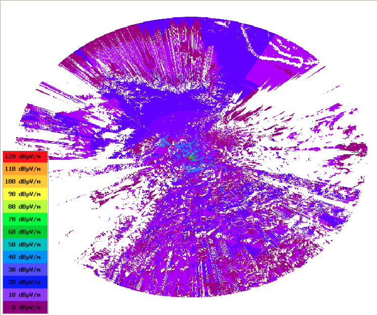

Plugin - Splat
==============

1. Introdução
---------------

SPLAT (ferramenta de análise de propagação de sinais, perdas e terreno), é uma ferramenta para a análise da propagação de sinais, perdas e características do terreno.

"O SPLAT produz gráficos e mapas topográficos altamente detalhados e cuidadosamente descritos que apresentam a linha de trajetórias de visão, contornos regionais de perdas por trajetória para determinar a previsão da área de cobertura dos sistemas transmissor e repetidor. Ao realizar a análise da linha de visão ao usar múltiplos locais de transmissores ou repetidores, a SPLAT determina as áreas de cobertura individuais e mútuas dentro da rede especificada", KD2BD Software SPLAT, Dez 2006. 

2. Tipos de mapas que podem ser gerados
--------------------------------------

2.1 Análise da Cobertura Regional (Análise da Cobertura Regional)
____________________________________________________________________________

Gera um mapa topográfico que ilustra a previsão da cobertura regional da linha de visão do transmissor para as estações receptoras que possuem uma antena a 10 metros acima do nível do solo (AGL).  

Tenha em mente que uma legenda não é necessária porque apenas mostra a linha de visão da antena (até onde podemos ver se estamos na posição da antena).

.. image:: ../_static/images/splat1_map_linea_vista.png
   :align: center

2.2 Mapa de análise de perda de caminho (Path loss analysis)
____________________________________________________________________

Gera um mapa multicolorido que ilustra os níveis de sinal esperados (perdas no caminho) nas áreas ao redor do transmissor (10m de altura). Uma legenda relaciona cada cor com suas respectivas perdas específicas em decibéis.

É importante notar que a perda por caminho (atenuação na atmosfera) depende apenas da frequência e distância ao emissor, não da potência.

.. image:: ../_static/images/splat2_map_perdida_trayectoria.png
   :align: center

  
2.3 Mapa de análise da intensidade do campo (Field strength analysis)
_____________________________________________________________________
 
Se a potência radiada efetiva (ERP) do transmissor for especificada no arquivo do transmissor .lrp, ou expressa na linha de comando usando a opção -erp, em vez das perdas de caminho, os contornos de força de campo referenciados a decibéis sobre um microvolt por metro (dBuV/m) serão plotados.

Você pode indicar um limite (-db) para não mostrar todas as intensidades, neste caso a unidade é dBuV/m   
  
  

 
.. nota:: 
  A unidade de energia ERP são watts. O ERP é equivalente ao PIRE (Equivalent Radiated Isotropic Power).

2.4 Mapa da análise de potência recebida (Received power level analysis)
_________________________________________________________________________

Mapa dos contornos do nível de potência recebido, mostra decibéis sobre um miliwatt (dBm).

Podemos também filtrar com -db (colocando valor negativo e na mesma unidade dBm)

.. image:: ../_static/images/splat4_map_potencia_recibida.png
   :align: center
 
.. nota::   
    O mapa de potência recebido é indicado pelo parâmetro -dbm    

   
