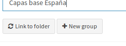
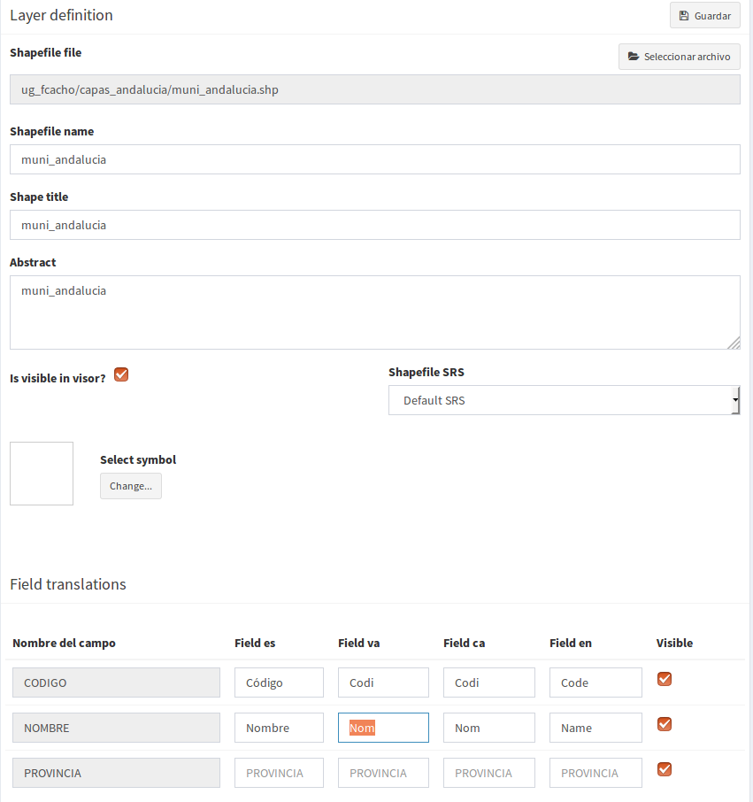
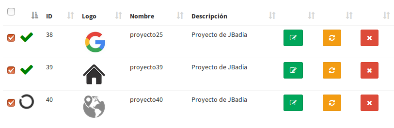

Carregador de pastas Shape
==========================

Introdução
------------

Ocasionalmente, pode haver a necessidade de gerar numerosos projetos que tenham uma cartografia de base comum com certas características de simbologia, ordem de camadas e grupos idênticos em todos os casos. 

O objetivo deste plugin é fornecer suporte para definir templates que estabeleçam a configuração das camadas que irão compor futuros projetos, permitindo que você salve esses passos repetitivos em cada um deles.
Através desta funcionalidade, é possível definir os grupos de camadas que existirão, bem como as formas que conterão. Você também pode indicar o nome, título, simbologia ou tradução dos nomes de seus campos, entre outras opções.

Para acessar essa funcionalidade, há uma entrada no menu lateral *Pastas SHPS*. A partir dele, a seção de *Projetos* ou *Modelos*

.. image:: ../_static/images/shps_folder_index.png
   :align: center
   

Os modelos de configuração
-------------------------------

Uma lista de modelos criados pode ser encontrada na seção *Modelos* do menu lateral.

Se nada foi definido neles, a informação que contém é muito básica, já que só requer um nome para identificá-lo e o sistema de coordenadas padrão que será atribuído às formas (salvo indicação em contrário).

.. image:: ../_static/images/shps_folder_template_add.png
   :align: center

As operações a serem realizadas nos modelos são as básicas: criar um novo, modificar ou excluir.

.. image:: ../_static/images/shps_folder_template_list.png
   :align: center
   
Uma vez gerada, será definida a estrutura das futuras camadas dos projetos a serem criados. Existem dois métodos para fazer isso: criação manual ou vinculação a um diretório.

* *Link para um diretório*: ste caso irá gerar a definição dos grupos de camadas e camadas com base em uma estrutura de diretório, onde as pastas irão definir os grupos, e os arquivos SHP que eles contêm serão atribuídos como modelos de camadas. 

* *Criação de mão*: você também pode estabelecer definições de grupo e camada manualmente, através dos botões criar em cada caso.

É possível criar, processar e eliminar a definição de grupos de camadas e as camadas que elas contêm. Além disso, você pode definir a ordem em que eles aparecerão no TOC do mapa do projeto, classificando-os.

.. image:: ../_static/images/shps_folder_template_order.png
   :align: center

As operações mais comuns são descritas abaixo:

.. image:: ../_static/images/shps_folder_template_group_list.png
   :align: center

* *Criar um grupo*

  É um formulário simples, requer o nome interno que o grupo terá e o título que será mostrado no TOC do mapa. 

* *Editar um grupo* 

  Além dos valores indicados na criação, é possível adicionar, modificar, ordenar ou excluir as definições de camada contidas nesse grupo.

* *Excluir um grupo*

  Excluir um grupo e as definições de camada que ele contém

  
.. image:: ../_static/images/shps_folder_template_group_new.png
   :align: center

* *Criar uma definação de camada*

  Requerido:
  
  * Formato do arquivo shape: o nome do arquivo e os nomes dos campos para as traduções serão extraídos dele.
  * Nome da camada: nome interno
  * Título da camada: nome a ser exibido no TOC do mapa do projeto
  * Descrição: Informações sobre o conteúdo da camada
  * ¿É visível?: indica se será carregado primeiro no projeto ou se aparecerá desativado no TOC
  * Sistema de coordenadas: se não estiver indicado, tomará o do grupo.
  * Símbolo: é permitido atribuir uma simbologia de alguma biblioteca carregada no sistema.
  * Tradução de campos: Permite definir rótulos de campos para os diferentes idiomas suportados pela aplicação.
    
    
* *Editar uma camada*

  
    Permite modificar qualquer um dos valores previamente definidos.

* *Apagar uma camada* 

  Apagar a definição da camada

  

Projetos baseados em modelos
-----------------------------------

Uma vez definidos os modelos, você pode criar tantos projetos quantos forem necessários, utilizando essa definição como base e carregando esse conteúdo da maneira que você especificou.

Para tal, será adicionado um novo *Projetos* na secção Projectos, indicando os parâmetros necessários.

.. image:: ../_static/images/shps_folder_project_add.png
   :align: center

Ao contrário do formulário de criação do projecto original, o projecto original será definido (com o seu nome, descrição, ícone, quadro original do mapa, ...) assim como a indicação do modelo a utilizar, e se quiser programar quando será feita uma actualização dessa definição base e até indicar que será repetida de vez em quando (esta funcionalidade é útil, caso a definição dos modelos seja modificada e queira que seja reflectida nos projectos que os utilizam sem ter de os editar um a um à mão ou ter de os refazer).

Uma vez criado o novo projeto, você pode atualizar as informações através do botão *Actualizar* (amarelo) do projeto, ou esperar que ele seja feito automaticamente (se especificado).

.. image:: ../_static/images/shps_folder_project_list.png
   :align: center

Também é possível atualizar vários projetos ao mesmo tempo e eliminar a seleção usando os botões *Atualizar seleção* ou *Excluir seleção*

Uma vez atualizada a informação, as camadas e grupos de camadas serão gerados automaticamente da forma que foi estabelecida no modelo, e serão criados os links necessários para aparecer no projeto.

*NOTA:* Os projetos gerados aqui, bem como as camadas, grupos, simbologia, etc. também são visíveis a partir dos acessos convencionais da aplicação e se comportam como tal se acessados a partir de suas entradas correspondentes.

