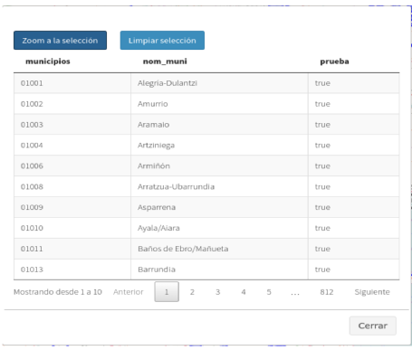

Mostrar tabla de atributos
==========================

Si la capa dispone de un origen de datos vectorial aparecerá disponible la acción *"Tabla de atributos"*. Al seleccionar la acción se abrirá una ventana que contendrá la tabla de atributos de la capa.

La tabla de atributos ofrece una serie de funcionalidades:

*   **Seleccionar elementos sobre el mapa:** Para seleccionar una elemento sobre el mapa seleccionaremos la fila de la tabla que deseemos, y a continuación presionaremos el botón *"Zoom a la selección"*, que se encuentra en la parte superior izquierda de la tabla. Para limpiar la selección de un elemento presionaremos el botón *"Limpiar selección"*.

*   **Filtro de búsqueda rápida:** La tabla de atributos nos ofrece también la funcionalidad de búsqueda rápida. Para ello introduciremos en el cuadro de búsqueda que se encuentra en la parte superior derecha el patrón que deseamos buscar. Automáticamente la tabla se irá actualizando con los campos que cumplan con el patrón de búsqueda introducido.

La tabla de atributos muestra los resultados paginados de 10 en 10. Para navegar entre los resultados en la parte inferior de la tabla se muestra un navegador de páginas.