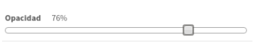
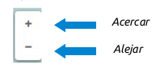
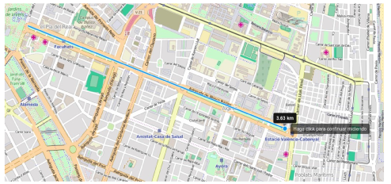
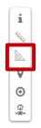
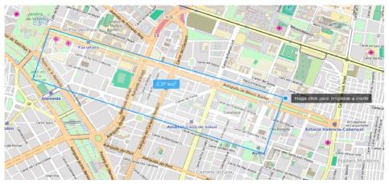
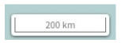
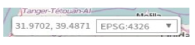
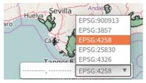

Controles del mapa
==================

Opacidad
--------
Para modificar la opacidad de la capa seleccionaremos el valor de opacidad deseado en el slider del menú de acciones de la capa.

Zoom
----
Los controles de zoom que se encuentran en la barra de herramientas, permiten alejar o acercar la visualización del mapa.

Medir distancia
---------------
Esta herramienta permite medir la longitud entre dos o más puntos.

.. image:: ../images/measure1.png
   :align: center

Para comenzar a medir hacemos click en el punto de origen y a continuación nos desplazamos al punto destino (o punto intermedio). Para terminar hacemos doble click sobre el punto destino.

Medir área
----------
Esta herramienta permite medir el área contenida en un polígono.

Para comenzar a medir hacemos click en el punto de origen y a continuación dibujaremos el resto de puntos que definen el área a medir. Para terminar realizaremos doble click sobre el punto que cierra el polígono.

Posición actual
---------------
Permite ubicar nuestra posición actual y centrar el mapa sobre ella. Requiere que aceptemos los permisos que nos solicitará el navegador.

.. image:: ../images/location.png
   :align: center

Escala numérica
---------------
Se encuentra situada en la parte inferior izquierda del mapa.

Posición del ratón
------------------
Muestra la posición del ratón en el sistema de coordenadas seleccionado.

Podremos cambiar entre cualquiera de los sistemas de coordenadas configurados para la aplicación, seleccionando desde el desplegable.

Mapa de referencia
------------------
El mapa de referencia se encuentra situado en la parte inferior derecha del mapa, y nos permite mantener una referencia de nuestra posición cuando nos encontramos a niveles de zoom bajos.

.. image:: ../images/overview.png
   :align: center