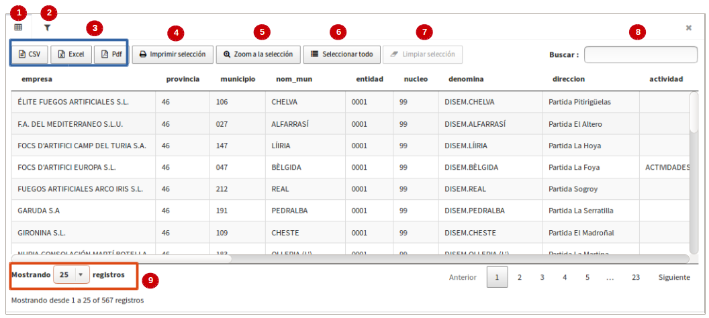
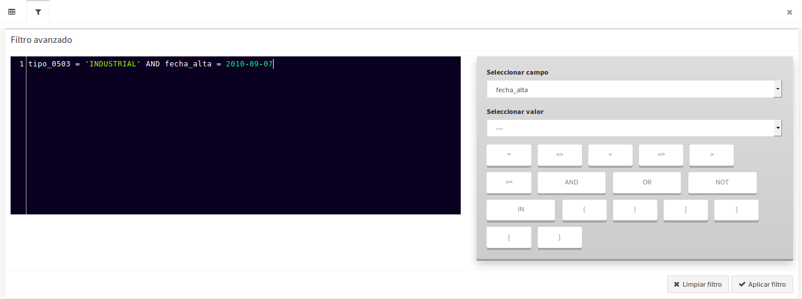

Mostrar tabla de atributos
==========================

Si la capa dispone de un origen de datos vectorial aparecerá disponible la acción *"Tabla de atributos"*. Al seleccionar la acción se abrirá una ventana que contendrá la tabla de atributos de la capa.

Tabla de atributos
~~~~~~~~~~~~~~~~~~

La tabla de atributos ofrece una serie de funcionalidades:

*   **Vista principal de la tabla de atributos:** Al seleccionar la opción de 'tabla de atributos' se despliega por defecto la pestaña principal de ésta (**1**) desde donde se podrán usar las diversas opciones que ofrece la misma, así como ver los registros que corresponden a cada una de las geometrías.

*   **Opciones para exportar tabla alfanumérica:** Se dan tres opciones para poder exportar la tabla alfanumérica o bien los registros seleccionados. Las opciones permitidas son los siguientes formatos: '*CSV*', '*Excel*' y '*pdf*' (**3**).  Cuando se proceda a exportar se descargaran solo los registros que se estaban mostrando en la página actual, es decir, si en la primera página hay 50 registros mostrados de 25000 que existan en total, los 50 serán los exportados. En el combo para seleccionar los registros mostrados (**9**) se puede indicar cada 10, 25, 50, 100, 500 y 1000, por lo tanto, se permitirá exportar hasta un máximo de 1000 registros por página de la tabla. En el caso que se aplique un filtro y el resultado sea por ejemplo, un total de 350 registros, se podrá escoger la opción de 'mostrar hasta 500 regitros' y cuando se exporte se descargarán en una misma vista los 350 registros.    

*   **Zoom a la selección:** (**5**), permite resaltar en el mapa los elementos asociados a los atributos seleccionados en la tabla. Para usar esta opción primero se debe seleccionar la(s) fila(s) una a una o bien usar la opción "**Seleccionar todo**" (**6**) y hacer click en el botón '*Zoom a la selección*'. En el mapa del visor se resaltarán los elementos en color amarillo y para poder limpiar la selección sobre el mapa, se dará click sobre el botón *'Limpiar mapa'* que se ubica en las herramientas lateral derecho del visor.

*   **Limpiar selección:** (**7**), esta opción se activará cuando hayan resgistros seleccionados en la tabla, por tanto, como su nombre lo índica servirá para poder limpiar o quitar la selección de las filas activadas. Es importante tener claro que solo desactivará la selección sobre la tabla y NO sobre el mapa, para este último se usará la herramienta del visor de mapas 'limpiar mapa'.

*   **Imprimir Selección:** (**4**), Esta opción permite imprimir un mapa junto con los registros alfanúmericos de la tabla. Para esta opción será necesario: primero, seleccionar filas de la tabla, segundo, 'zoom a la selección' y por último '*imprimir selección*'. Automáticamente se descargará un pdf que contendrá en la primera página el mapa y en la siguiente los registros de los elementos seleccionado en el mapa. En este caso, el mapa solo mostrará la leyenda que corresponda a la capa de los registros seleccionados.

*   **Filtro de búsqueda rápida:** La tabla de atributos nos ofrece también la funcionalidad de búsqueda rápida. Para ello introduciremos en el cuadro de búsqueda (**8**) el patrón que deseamos buscar. Automáticamente la tabla se irá actualizando con los campos que cumplan con el patrón de búsqueda introducido.

Filtro avanzado
~~~~~~~~~~~~~~~

*   **Filtro avanzado:** Para ir a la vista de filtro avanzado, se deberá activar la segunda pestaña de la vista principal de la tabla de atributos (**2**). Desde esta vista se podrán componer las distintas sentencias para aplicar un filtro sobre la tabla. Para realizar la expresión se puede usar el autocompletado del campo y al finalizar se pinchará sobre el botón '*aplicar filtro*' y mostrará la tabla de atributos con los registros encontrados. Para borrar el filtro se irá de nuevo a la pestaña de '*filtro*' y click sobre '*Limpiar filtro*'.

