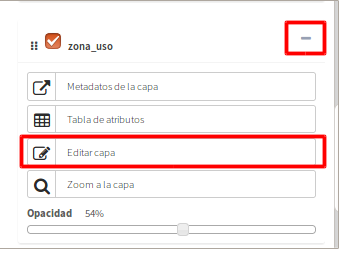
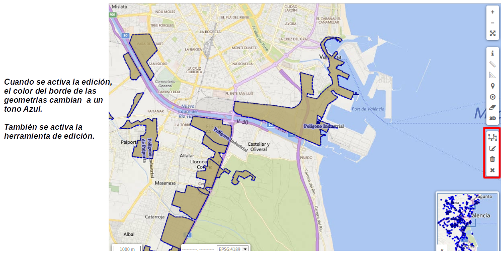
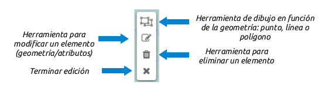
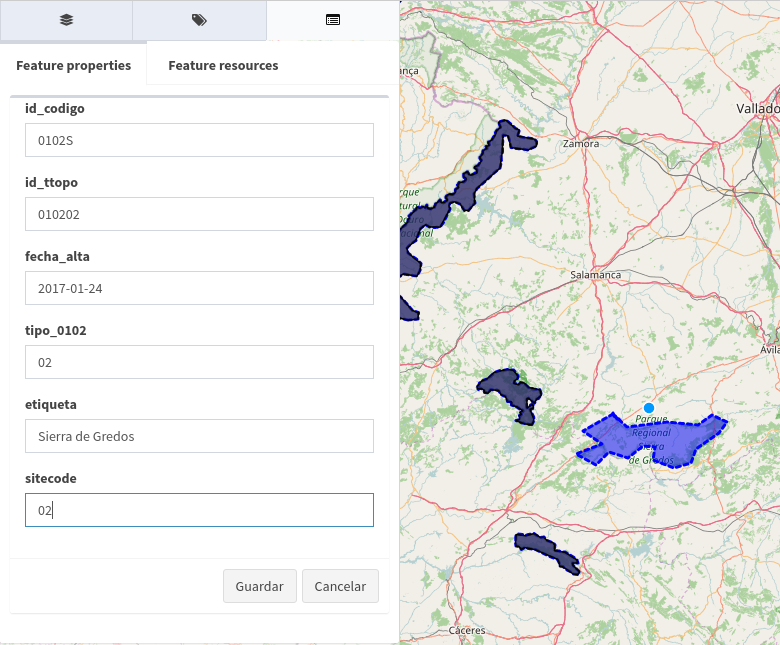
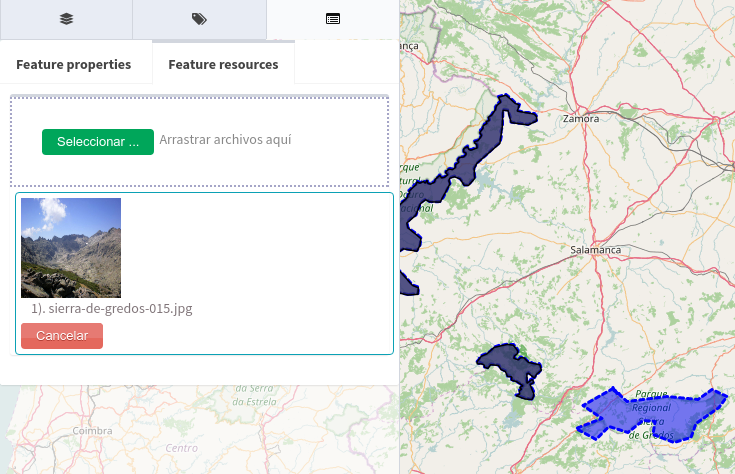

Editar capa
===========

.. note::
   Esta acción requiere que el usuario pertenezca a un grupo con permisos de escritura.

* Para poner una capa en modo de edición seleccionamos en el menú de acciones, la entrada *"Editar capa"*. 
* Solo se podrá colocar en edición una capa por proyecto.  
* Mientras la capa se esté editando, ésta se bloqueará para no ser editada por otro usuario.
* Para ver las capas que están siendo editadas y por tanto bloqueadas, se podrá ver la entrada de '*bloqueos*' en la opción de 'servicios' del panel de control. 

Al comenzar la edición se añade al mapa una nueva barra de herramientas de edición, en función del tipo de geometría de la capa ya sea punto, linea o polígono.

La barra de herramientas de edición dispone de cuatro opciones para las capas de líneas y polígonos. La capa de puntos tendrá cinco opciones:

Añadir un nuevo elemento a la capa
----------------------------------
Para añadir un nuevo elemento seleccionamos la herramienta de dibujo '*añadir geometría*' (**1**) y a continuación procedemos a dibujar el elemento sobre el mapa (punto, linea o polígono). 

Una vez dibujado elemento aparecerá en la barra de navegación un formulario para que introduzcamos los valores de los atributos del elemento.

   
Si deseamos adjuntar cualquier archivo multimedia podemos realizarlo desde la pestaña *"Recursos del elemento"*.

Una vez hemos rellenado el formulario seleccionaremos el botón *"Guardar"*. En ese momento el nuevo elemento y los recursos asociados serán persistidos en la base de datos.
Si presionamos el botón *"Cancelar"* la geometría será eliminada del mapa y se cerrará el formulario.

Añadir nuevo elemento (punto) en el centro del mapa
---------------------------------------------------
**Esta opción solo estará activa para la edición de capas con geometrías tipo 'punto'.**

Para hacer uso de esta herramienta se debe seleccionar el botón '*añadir punto en el centro*' (**5**):

* Automáticamente saldrá una cruz (+) en el centro de la vista actual del mapa.
* Luego independientemente donde se haga 'click' en cualquier parte del mapa, el punto siempre se va añadir en el centro de la cruz.
* Se puede navegar o mover el mapa para situar la cruz sobre el área que se quiera y así añadir el punto.
* La otra opción es añadir un punto en nuestra ubicación actual. Para esto es necesario usar el botón '*conseguir posición actual*' (otra barra de herramientas). El sistema haciendo uso del gps del ordenador o dispositivo, centrará el mapa con la ubicacción detectada,
* Una vez centrado el mapa con la ubicación del gps, se selecciona el botón '*añadir punto en el centro*' (**5**) y seguidamente 'click' para añadir el nuevo elemento tipo punto en la ubicación actual.
* Añadido el punto saldrá en la *info* del panel de contenidos el formulario para añadir los atributos y recursos multimedia. 
* Finalmente sobre la pestaña 'Detalles del elemento' (pestaña donde se editan los atributos del nuevo elemento) click sobre *guadar*.

Modificar un elemento existente
-------------------------------
Seleccionaremos la herramienta de '*editar elementos*' (**2**) en la barra de edición. A continuación seleccionaremos el elemento sobre el mapa. Una vez hayamos seleccionado el elemento podremos editar su geometría seleccionando y moviendo
los vértices en caso de ser linea o polígono, o desplazando el elemento en caso de ser un punto.

También se desplegará en la barra de navegación un formulario con el valor de los atributos del elemento.

Una vez hayamos terminado de modificar la geometría y/o datos alfanuméricos del elemento procederemos como en el apartado anterior seleccionando el botón *"Guardar"* o *"Cancelar"*.

Eliminar un elemento existente
------------------------------
Seleccionaremos la herramienta de '*eliminar elementos*' (**3**) en la barra de edición. A continuación seleccionaremos el elemento que deseamos eliminar sobre el mapa. 

Una vez hayamos seleccionado el elemento se desplegará en la barra de navegación un formulario con el valor de los atributos del elemento. Al final de este formulario se encuntra el botón 'eliminar' que servirá para servirá para borrar el elemento del mapa y de la base de datos.

Cerrar edición
--------------
Por último, una vez guardado los cambios de cada elemento, se hace click sobre el botón '*Terminar edición*' (**4**) y la capa queda desbloqueada para seguir siendo editada por otros usuarios.

Terminada la edición se puede continuar con la edición de otras capas, ya que mientras esté abierta la herramienta de edición de una capa, el sistema no permitirá poner editar una segunda capa.

